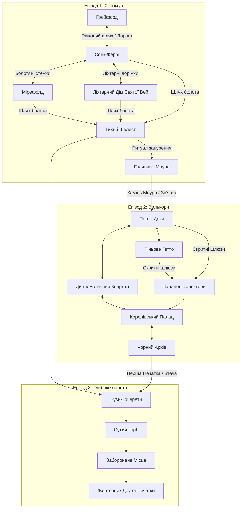
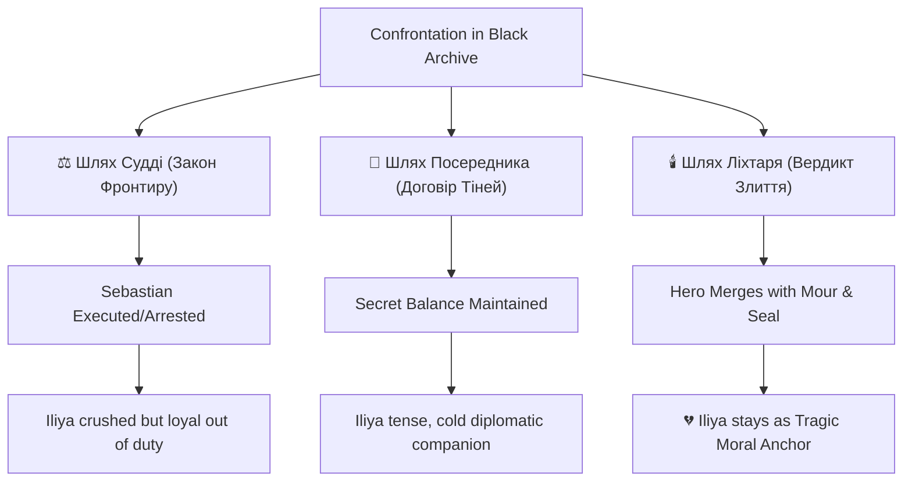

# Бачення

## Основна ідея

Зрілий фентезійний action RPG із сильними наративними виборами, небезпечною регіональною політикою та інтимним дослідженням. Гра має емоційну вагу й якість квестів великої престижної RPG, але в меншому світі — щільному, наслідковому, виробничо-реалістичному.

## Обіцянка гравцеві

Гравець входить у поранений фронтир, де кожне поселення, монстр і фракційний конфлікт мають значення. Замість нескінченного масштабу — пам'ятні місця, шаруваті квести, навмисний бій.

## Стовпи дизайну

1. **Щільність над простором.** Кожен регіон має містити значущі зустрічі, квестові гачки, інтерес для дослідження й наративну віддачу.

2. **Людські ставки перш за все.** Навіть коли загроза надприродна, емоційний двигун має походити від страху, лояльності, жадібності, горя, амбіцій і виживання.

3. **Бій із тиском.** Сутички мають винагороджувати таймінг, підготовку, позиціонування й читання поведінки ворога, а не чисте завищення характеристик.

4. **Квести з наслідками.** Вибір має перенаправляти стосунки, можливості й локальні умови, а не просто змінювати фінальну катсцену.

5. **Виробничо-усвідомлена амбіція.** Гра має виглядати преміально без залежності від неможливого обсягу контенту.

## Цільове відчуття

- приземлена темна фентезі
- інтимна, але небезпечна подорож
- морально напружені рішення
- рукотворний сайд-контент
- сильна атмосфера замість спаму спецефектів

## Що робить її відмінною

Відмінність не в спробі перевершити гігантські open-world RPG. Відмінність у щільнішому світі, де час подорожі, щільність квестів і фракційна реакція куровані так, щоб тримати імпульс і наративний тиск високими.

## Поточний напрям

Поточна робоча версія зосереджена на Мандруючому Вартовому — санкціонованому прикордонному слідчому-судді, чий авторитет дозволяє розслідування, полювання на монстрів і морально важке втручання в ізольованих поселеннях.

Світова криза — Порожній Сезон, регіональне прокляття, пов'язане зі стародавньою катастрофою, похованою під політичним порядком, що керує фронтиром.

## Відкриті питання

- Скільки регіонів ми можемо підтримати, зберігаючи щільність?
- Магія рідкісна й страшна, чи поширена й інституціоналізована?
- Яка сигнатурна система гри, яку гравці можуть описати одним реченням?
- Наскільки фіксованою має бути ідентичність протагоніста?
- Скільки похованої правди світу має стати явним до кінця?


---

# Концепція світу

## Основна ідея

Прикордонний регіон руйнується, тому що стара система, що тримала в рівновазі насилля, монстрів і політичні амбіції, зазнала краху. Покоління тому Маршевий Пакт об'єднав фортечних лордів, торгові доми, храмову владу й прикордонних Вартовийів у незручному порядку. Несправедливий, але достатній, щоб дороги були відкриті, а мертві поховані.

Тепер цей порядок ламається.

Прокляття під назвою **Порожній Сезон** почало поширюватись фронтиром. Врожаї гинуть у нерегулярних патернах, тварини народжуються неправильно, могили не мовчать, і ізольовані громади починають укладати угоди, які не можуть контролювати. Могутні стверджують, що це природний цикл, божественна кара або ворожий саботаж — залежно від того, яка історія їм вигідна.

Правда гірша: Пакт був укладений над стародавньою похованою катастрофою, та інституції, що успадкували його владу, десятиліттями приховували і ціну, і механізм.

## Центральний конфлікт

Кожен у регіоні бореться з тим самим колапсом — але з різних причин:

- правителі хочуть контроль до того, як дефіцит стане бунтом
- торговці хочуть дороги, зерно й передбачуване насилля
- священники хочуть духовну легітимність над страхом і смертю
- селяни хочуть виживання, навіть якщо виживання означає годування чогось жахливого в лісах
- залишки Вартовийів хочуть правди, стримування або спокути — залежно від того, хто залишився

Протагоніст втягується в конфлікт, тому що локальні справи розкривають: Порожній Сезон — не випадкова чума. Це поверхневий симптом політичної й метафізичної брехні, на якій побудований регіон.

## Тематичний двигун

Світ має обертатись навколо кількох тем тиску:

- закон проти справедливості
- виживання проти гідності
- публічний порядок проти похованої правди
- успадковані інституції проти живих громад
- практична жертва проти моральної корозії

## Чому ця концепція підтримує гру

Це дає нам:

- регіональну кризу, достатньо сильну, щоб уніфікувати головну арку
- багато локальних варіантів квестів, прив'язаних до голоду, страху, корупції та опортунізму
- логіку монстрів, пов'язану із землею, смертю й соціальним розпадом
- фракційний конфлікт, що відчувається матеріальним, а не абстрактним
- простір для таємниці без втрати політичної приземленості

## Сигнатурний світовий гачок

Земля не просто проклята. Її змушують пам'ятати те, що правлячий порядок намагався поховати.

## Запропонований географічний тон

Використати холодно-помірний фронтир із болотами, старими лісами, зруйнованими сторожовими дорогами, шахтарськими долинами й однією загартованою фортецею-містом, що все ще прикидається, ніби керує регіоном.

## Відкриті питання

- Що саме було поховано або запечатано, коли формувався Пакт?
- Чи є Порожній Сезон циклічним, прискорюваним або частково рукотворним?
- Яка фракція першою усвідомлює правду й обирає її експлуатувати?
- Скільки надприродного можна пояснити, а скільки має залишатись нуменозним?


---

# Світ

## Рамка світу

Сетинг має підтримувати темну фентезі, політичний розкол, екологію монстрів і локальні культури з відмінними тисками. Світ має відчуватися старим, пораненим і практичним.

Поточний напрям: регіон дестабілізується Порожнім Сезоном — прокляттям, що поширюється, пов'язаним із таємницями, похованими під старим Маршевим Пактом.

## Регіональна модель

Використати компактну регіональну структуру замість континентальної карти.

Запропонована структура:

- один хаб (фортеця-місто)
- три-п'ять оточуючих регіонів із різною екологічною й політичною ідентичністю
- одна дика прикордонна зона для пізньоігрової небезпеки й міфічного контенту

Поточний перший регіон: Хейзмур — flood-sick торф'яне болото, що годує Грейфорд, одночасно викриваючи поховане насилля під Маршевим Пактом.

## Логіка фракцій

Кожна велика фракція має мати:

- матеріальну потребу
- публічну історію
- приховану вразливість
- стосунок до монстрів, магії й простих людей
- патерн реакції на методи й репутацію Вартовийа

Поточна карта фракцій:

- Адміністрація фортеці-міста
- Хранителі Святої Вей
- Мурі та поромники
- Контрабандисти
- Орден Мандруючих Вартових

## Правило дизайну поселень

Кожне поселення потребує щонайменше одного з кожного:

- соціальне напруження
- економічна функція
- чутка або прихована історія
- квестова місцева особа

## Правило монстрів

Монстри не мають існувати як випадковий наповнювач. Кожен тип створіння потребує екологічної логіки, фольклорної текстури й причини, чому люди його бояться.

## Відкриті питання

- Як називається ширший фронтир? (Хейзмур — перший регіон, не вся територія)
- Що саме було поховано або запечатано, коли формувався Маршевий Пакт?
- Які культури контролюють віру, закон, торгівлю й війну?
- Що цивільні готові терпіти в обмін на безпеку?
- Який пізній регіон має найбільш різко контрастувати з Хейзмуром?


---

# Назви світу

## Фронтир (без назви)
Ширша територія. Містить Хейзмур, майбутнє столичне місто й інші регіони. Назва очікується.

## Перший регіон
- **Назва:** Хейзмур (The Hazemoor)
- **Тон:** Імлиста flood-sick низина чорної води, торф'яних полів, гниючих хуторів, затоплених святинь і старих піднятих доріг. Дим від торф'яних печей висить низько над водою, роблячи відстань невизначеною, а подорож — гнітючою.
- **Містить:** Грейфорд (стартове поселення), Мірефолд, Ліхтарний Дім Святої Вей, Затонулу Сторожову Дорогу та інші точки.
- **Функція в грі:** Навчає основного циклу — розслідування, підготовка, конфронтація, наслідок. Знайомить із Порожнім Сезоном, фракційним тиском і ціною компромісу.

## Стартове поселення
- **Назва:** Грейфорд (Greyford)
- **Тип:** Невелике прикордонне містечко. Стара річкова переправа, кам'яні стіни, офіси раціону, міліційний гарнізон і один пристойний постоялий двір.
- **Тон:** Холодний, практичний, виснажений. Грейфорд — куди відправляють чиновників, коли вони провалили кар'єру вгору.

## Столичне місто: Валькорн (Valkorn)
- **Статус:** Локація другого епізоду. Велике стратифіковане місто з чіткими районами, гільдіями, бандами й справжнім дворянським класом. Розташоване на морському узбережжі, daleko від Хейзмуру.
- **Функція в грі:** Зіткнення з великим світом та палацовими інтригами, розслідування змови навколо Першої Печатки та Ордену Семи Кинджалів.

## Протагоніст
- Названий гравцем. NPC використовують «Вартовий» або «Мандруючий Вартовий» як стандартне звернення в нейтральних або офіційних контекстах.


---

# Атлас Світу: Картографія та Локації

Цей документ є офіційним географічним та сюжетним атласом гри. Він об'єднує всі ключові локації, розділені за Епізодами, описує їхній візуальний тон, фракційну приналежність, ключових персонажів та події, які там відбуваються.

---

## 🗺️ Загальна структура світу

Географія гри побудована на принципі **компактної регіональної моделі** з високою наративною щільністю. Замість безкраїх порожніх просторів світ фокусується на трьох контрастних зонах, що відображають етапи розпаду стародавнього **Маршевого Пакту**:



---

## 🌲 ЕПІЗОД 1: ХЕЙЗМУР (THE HAZEMOOR) — ТОРФ'ЯНІ БОЛОТА

**Загальний тон регіону:** Імлиста flood-sick низина чорної води, торф'яних полів, гниючих хуторів, затоплених святинь і старих піднятих доріг. Дим від торф'яних печей висить низько над водою, роблячи відстань невизначеною, а подорож — гнітючою та небезпечною. Це прикордонна зона, де закон столиці практично не діє, а виживання залежить від дотримання неписаних правил болота.

---

### 1. Грейфорд (Greyford)
*   **Тип локації:** Стартове прикордонне містечко, річкова фортеця.
*   **Візуальний тон та атмосфера:** Сіра каменюка, вологе темне дерево, провислі дахи. Вулиці постійно брудні, колії від возів ніколи повністю не висихають. Річка тече сіро-коричнева від мулу. Запах мокрої вовни, коней, дьогтю та рибного розсолу. Смолоскипи на стінах палають навіть опівдні через вічну низьку хмарність.
*   **Що тут відбувається (Сюжет & Квести):**
    *   **Точка входу:** Тут починається гра. Протагоніст (**Мандруючий Вартовий**) прибуває з місією розшукати зниклого вісника Руфіна та розібратися, чому не прибув звіт про Порожній Сезон.
    *   **Розслідування (`greyford-01-adresat-vidsutniy`):** Герой обшукує кімнату Руфіна в постоялому дворі, розпитує Ервана та виходить на слід загадкового листа із печаткою у вигляді двох перехрещених кинджалів, що тримають коло з краплею в центрі.
    *   **Таємна магія:** Герой може знайти таємне помешкання **Чаклунки Алтеї (справжнє ім'я — Лілея)**, приховане за звичайними дверима за допомогою просторових чарів. Вона є останньою спадкоємицею стародавнього роду Ключників, яку таємно розшукував Орден Семи Кинджалів.
*   **Ключові персонажі та фракції:**
    *   *Лорд Стетсон* — королівський слідчий та представник столиці, який роками прикидався втомленим провінційним чиновником, щоб непомітно збирати інформацію про аномалії Хейзмуру.
    *   *Ерван* — практичний господар головного постоялого двору, який чує кожну плітку на кордоні.
    *   *Чаклунка Алтея (Лілея)* — могутня чарівниця, остання представниця роду Ключників. Вона ховається під вигаданим ім'ям від шукачів Ордену, захищаючи своє таємне помешкання просторовими чарами.
    *   *Сержант Гаррік* — чесний виконавець, що керує щоденними патрулями гарнізону.
    *   *Портові куртизанки* — незалежна інформаційна мережа, лояльна лише одна до одної.

---

### 2. Сонк-Феррі (Sunk Ferry)
*   **Тип локації:** Затонуле річкове поселення на палях, остання застава цивілізації перед глибоким болотом.
*   **Візуальний тон та атмосфера:** Хаотична мережа дерев'яних платформ і містків, що тримаються на гнилих стовпах над чорною водою. Постійний рух човнів, запах вогкої деревини, торф'яного диму, сушеної риби й людського розпачу. Вночі ліхтарі причалів створюють дзеркальні вогняні доріжки на нерухомій воді.
*   **Що тут відбувається (Сюжет & Квести):**
    *   **Соціальне напруження:** Початкова точка бенчмарк-квесту «Голод знизу» (`holod-znuzu`). Через зникнення зернового конвою в поселенні спалахують голодні бунти.
    *   **Кланова ворожнеча (`poromna-prysyaga`):** Конфлікт між поромними кланами Тована Ріда та Нери Вейл за контроль над водними шляхами.
    *   **Тіньовий обіг (`sil-u-knyzi`):** Розслідування саботажу постачання ліків через Солоні сараї, де стикаються інтереси контрабандистів та офіційної адміністрації.
    *   **Криза влади (`nizh-kvoty`):** Сюди прибуває суворий маршал Серіт Келм, щоб провести жорстку чистку та покарати тих, хто саботував постачання зерна до столиці.
*   **Ключові персонажі та фракції:**
    *   *Тован Рід* — речник старої гільдії поромників, прагматичний і жорсткий лідер.
    *   *Нера Вейл* — незалежний поромний майстер, яка знає таємні протоки, але зламана страхом після того, як її човен атакували Очеретяні.
    *   *Брін Осс* — безпринципний торговий посередник, готовий нажитися на голоді.
    *   *Гара Пайк* — авторитетна контрабандистка, яка контролює приховані Солоні сараї.

---

### 3. Мірефолд (Mirefold)
*   **Тип локації:** Занедбане напівзатоплене сільське поселення (хутір) на околиці Хейзмуру.
*   **Візуальний тон та атмосфера:** Гниючі халупи з солом'яними дахами, вкритими мохом. Земля під ногами нагадує губку — кожен крок витискає чорну болотну рідину. Постійний важкий туман, крізь який ледь пробиваються силуети покручених дерев. Пахне болотяним газом, торфом та сирістю.
*   **Що тут відбувається (Сюжет & Квести):**
    *   **Бенчмарк-розв'язка («Голод знизу»):** Епіцентр трагедії. Селяни виживають лише тому, що уклали таємну угоду з болотяними силами. Вони відводять зерно та приносять ритуальні жертви в затопленій каплиці, щоб тримати жахливих створінь — **Очеретяних** — подалі від своїх дітей.
    *   **Моральний вибір:** Вартовий має вирішити, чи викрити корупцію й приректи хутір на знищення, чи укласти «Місцеву угоду» (канонічний вибір C), дозволивши селянам вижити ціною брудного компромісу.
*   **Ключові персонажі та фракції:**
    *   *Стара Селла* — сільська старійшина, яка бере на себе гріх ритуальних жертв заради порятунку громади.

---

### 4. Ліхтарний Дім Святої Вей (Saint Vey's Lantern House)
*   **Тип локації:** Напівзатоплена монастирська каплиця-притулок.
*   **Візуальний тон та атмосфера:** Древня кам'яна кладка часів укладання Пакту, наполовину занурена у болото. Вікна засклені мутним зеленим склом. Головний ліхтар на вежі горить постійним білим вогнем, який прорізає туман. Всередині пахне воском, сушеними травами, ладаном та старим папером.
*   **Що тут відбувається (Сюжет & Квести):**
    *   **Доктринальний розкол (`popil-pid-kaplytseyu`):** Брат Карос виявляє, що селяни почали оскверняти старі поховання для імітації болотяних ритуалів. Вартовий розслідує спалення архівів та шукає компроміс між релігійною догмою Хранителів та суворою реальністю болісного виживання.
    *   **Дослідження аномалії:** Тут зберігаються стародавні записи про Прадавню війну та перші прояви Порожнього Сезону. Хранителі намагаються лікувати заражених болотяною гниллю.
*   **Ключові персонажі та фракції:**
    *   *Брат Карос* — молодий, але відданий ідеалам милосердя хранитель, який шукає істину між догмою та людяністю.
    *   *Матір Ісра Вейн* — сувора настоятелька Ліхтарного Дому, яка вимагає абсолютного підпорядкування церковному закону столиці.

---

### 5. Галявина Моура (Mour's Glade)
*   **Тип локації:** Джерело первинної болотяної аномалії, серце Хейзмуру.
*   **Візуальний тон та атмосфера:** Широка дзеркальна гладь чорної води серед болота, що ніколи не рухається від вітру і не відбиває хмар. Навколо стоїть непроникна стіна густого білого туману. Абсолютна, наповнена тиша — птахи та комахи мовчать. Вночі вода слабко світиться синім світлом з глибини.
*   **Що тут відбувається (Сюжет & Квести):**
    *   **Конфронтація з Аномалією (`hazemoor-02-halyna-dusha`):** Фінал Епізоду 1. Вартовий та Міа проходять крізь туман і здійснюють ритуальне занурення під воду, вчачись підкорятися течії болота.
    *   **Зустріч з Моуром:** З очерету та води піднімаються мільйони комах, утворюючи гігантський силует голови **Моура**. Сутність вступає в ментальний контакт із Міа, яка усвідомлює своє справжнє призначення та зв'язок з аномалією.
    *   **Доля Артефакту:** Гравець приймає рішення щодо Каменю Моура. Якщо відпустити його у воду — контакт буде повним і чистим; якщо утримати — артефакт залишиться в інвентарі як камінь-доказ, але зв'язок з Моуром буде скомпрометований.
    *   **Отримання Маунта:** Якщо ритуал проведено правильно, з глибини піднімається аномальне створіння — болотяний маунт, що приймає Вартового.
*   **Ключові персонажі та фракції:**
    *   *Міа* — провідниця Вартового, яка на галявині перетворюється з учениці на рівного партнера.
    *   *Моур* — древня екологічна сутність болота, що уособлює пам'ять про насильство Маршевого Пакту.

---

## 🏛️ ЕПІЗОД 2: ВАЛЬКОРН (VALKORN) — КОРОЛІВСЬКА ЦИТАДЕЛЬ

**Загальний тон регіону:** Величезне, стратифіковане портове місто з білого та сірого граніту на морському узбережжі. Тут пахне сіллю, рибою, великими грошима та політичною гниллю. Після задушливого туману Хейзмуру небо Валькорна здається болісно відкритим, а постійний штормовий вітер з моря пробирає до кісток. Тут панують закони інтриги, мармуру та церемоній.

---

### 1. Порт і Робочі Доки (Port & Docks)
*   **Тип локації:** Промисловий портовий район, морські ворота Валькорна.
*   **Візуальний тон та атмосфера:** Ліс щогл торгових кораблів та військових каравел, брудні причали, вкриті сіллю та смолою. Крики чайок змішуються з лайкою вантажників і шумом хвиль. Постійний рух товарів — від легального зерна до таємних вантажів.
*   **Що тут відбувається (Сюжет & Квести):**
    *   **Точка прибуття (`valkorn-01-lyudyna-z-bolota`):** Вартовий прибуває до столиці. Йому потрібно просунути свій вантаж повз митників та вийти на контакт із місцевим підпіллям.
    *   **Контрабанда та Гільдії (`valkorn-03-pravylna-tsina`):** Герой розслідує діяльність купця Дамара, який таємно відводить ресурси та приховує прибутки від корони за допомогою портової адміністрації.
    *   **Перша зустріч з Фіппом:** На причалі герой уперше помічає придворного **Блазня Фіппа**, який глузує з портових офіцерів, але таємно спостерігає за прибуттям людей із болота.
*   **Ключові персонажі та фракції:**
    *   *Капітан Варан* — грубий, обвітрений солоними вітрами начальник портового доку, який контролює нелегальний транзит і може допомогти герою непомітно спуститися в колектори.
    *   *Дамар* — впливовий складський магнат, пов'язаний із Торговою гільдією.

---

### 2. Тіньове Гетто (Shadow Ghetto)
*   **Тип локації:** Тісні, занедбані квартали бідняків та нелюдів.
*   **Візуальний тон та атмосфера:** Вузькі, слизькі провулки, побудовані з щербатого темного вапняку. Вода стікає по стінах, створюючи брудні калюжі. Маленькі вікна, завішені лахміттям. Пахне дешевим алкоголем, гнилою капустою та димом від спалювання сміття. Квартал ділиться на три частини: Старе гетто (ремісники-нелюди), Нове гетто (злиденні біженці з фронтиру) та Мовчазний квартал (занедбані руїни, де колись сталася аномальна трагедія).
*   **Що тут відбувається (Сюжет & Квести):**
    *   **Тіньова логістика:** Тут герой переховується від королівської варти. Вуличний провідник Брес допомагає йому орієнтуватися та дає наводки на крамницю Тесси.
    *   **Захист пригноблених:** Герой вирішує локальні конфлікти між збіднілими біженцями Хейзмуру та міською міліцією, які намагаються витіснити нелюдів із ремісничих цехів.
*   **Ключові персонажі та фракції:**
    *   *Брес* — спритний та кмітливий втікач із Сонк-Феррі, який знає кожен куток у міському підпіллі та виступає провідником Вартового.

---

### 3. Дипломатичний & Дворянський Квартал (Noble & Diplomatic Quarter)
*   **Тип локації:** Район розкішних маєтків, офісів гільдій та антикварних крамниць.
*   **Візуальний тон та атмосфера:** Парадні широкі вулиці, викладені білим полірованим гранітом. Високі мармурові портики, великі прозорі вікна, ковані залізні ворота маєтків. Затишно, чисто, пахне дорогим тютюном, парфумами та свіжою випічкою.
*   **Що тут відбувається (Сюжет & Квести):**
    *   **Слід Організації (`valkorn-02-dvi-versii-pravdy`):** Герой шукає таємного лідера Ордену Семи Кинджалів. Він виходить на крамницю Тесси — лікаря, торговця та архіваріуса.
    *   **Змова Еліт:** Вартовий дізнається про розкол всередині Ордену: частина прагне контролювати болота заради ресурсів, інша — хоче використати силу Моура як зброю у палацовому перевороті проти короля.
*   **Ключові персонажі та фракції:**
    *   *Тесса* — агент Ордену Семи Кинджалів, яка збирає стародавні архіви про Прадавню війну під комерційним прикриттям. Спокійна, холодна та неймовірно прониклива жінка.
    *   *Альбрехт* — верховний скарбник Торгової гільдії, який веде подвійну бухгалтерію з Орденом.

---

### 4. Королівський Палац & Бібліотека (Royal Palace & Archives)
*   **Тип локації:** Резиденція вищої королівської влади та державні архіви.
*   **Візуальний тон та атмосфера:** Грандіозні зали з високими зводами, полірований мармур під ногами, важкі оксамитові гобелени. Військова варта в блискучих обладунках стоїть біля кожних дверей. Королівська бібліотека заповнена тисячами фоліантів, пахне старим пергаментом, чорнилом і сухим теплом від камінів.
*   **Що тут відбувається (Сюжет & Квести):**
    *   **Палацова інтрига (`valkorn-04-lyudyna-shcho-poslala-rufina`):** Герой стикається з королівським слідчим Стетсоном, який вимагає повного звіту про ситуацію в Хейзмурі. Герой розуміє, що Стетсон використовував Грейфорд як спостережний пункт за аномалією.
    *   **Блазнювання на крові:** У тронній залі герой стає свідком виступу **Блазня Фіппа**. Фіпп говорить правду про Порожній Сезон під виглядом жартів, які король сприймає за дурість, тоді як герой завдяки Каменю Моура відчуває, що Фіпп — це і є той самий таємничий лідер, якого він шукав.
*   **Ключові персонажі та фракції:**
    *   *Король* — старіючий, параноїдальний правитель, який намагається утримати владу за допомогою інтриг.
    *   *Лорд Стетсон* — королівський слідчий, який веде власну гру проти Ордену.
    *   *Блазень Фіпп (Себастьян Марр)* — публічна маска лідера Ордену Семи Кинджалів, колишнього наставника Ілії Марр.

---

### 5. Чорний Архів (The Black Archive)
*   **Тип локації:** Таємна підземна зала Founders під фундаментом Королівського Палацу.
*   **Візуальний тон та атмосфера:** Циклопічна кам'яна кладка Compact-ери, покрита реліктовими рунами, що пульсують срібним світлом. Повна відсутність пилу, незважаючи на вік. Посеред зали стоїть древній кам'яний постамент, де зберігалася **Перша Печатка**. Повітря тремтить від метафізичного резонансу, а камінь у кишені героя нагрівається до опіків (**Резонанс Моура**).
*   **Що тут відбувається (Сюжет & Квести):**
    *   **Фінал Епізоду 2 (`valkorn-05-khranitel-pershoyi-pechatky`):** Герой проникає в архів через древні тунелі. Тут відбувається фінальна конфронтація епізоду з Себастьяном Марром (Блазнем Фіппом).
    *   **Розкриття зради:** Герой дізнається, що Себастьян Марр — це загиблий наставник Ілії Марр. Ілія, яка вважала його героєм і жертвою, переживає шок від особистої зради.
    *   **Доля Першої Печатки:** Печатка пульсує срібним світлом, амортизуючи шепоти Моура. Гравець приймає критичне рішення щодо її вилучення, що провокує тривогу по всьому палацу. Ілія розриває зв'язки з Себастьяном, а її голос починає з'являтися в голові протагоніста як захисний провідник.
*   **Ключові персонажі та фракції:**
    *   *Себастьян Марр (Блазень Фіпп)* — лідер Ордену, який викрав Першу Печатку, щоб використати її для контролю над Порожнім Сезоном.
    *   *Ілія Марр* — колишня учениця Себастьяна, яка остаточно розриває з ним зв'язки та переходить на бік протагоніста.

---

### 6. Палацові колектори (Palace Sewers)
*   **Тип локації:** Занедбані дренажні канали та шлюзи часів Прадавньої війни.
*   **Візуальний тон та атмосфера:** Темні, вологі зводи, вкриті слизом та болотним мохом, що проріс крізь міські стіни. Шум води, що стрімко тече до моря. Запах гнилизни, каналізації та іржавого заліза.
*   **Що тут відбувається (Сюжет & Квести):**
    *   **Шлях втечі (`valkorn-05`):** Після того як у Чорному Архіві спрацьовує магічна сигналізація, герой та Ілія змушені тікати крізь ці колектори, відбиваючись від гвардійців та аномальних створінь, що пробралися знизу. Брес допомагає їм вийти до порту, де Капітан Варан готує човен для втечі назад у болота.

---

## 🕳️ ЕПІЗОД 3: СЕРЦЕ ТРЯСОВИНИ (HEART OF THE MIRE) — ГЛИБОКЕ БОЛОТО

**Загальний тон регіону:** Первісний, дикий хаос глибоких маршів, куди не насмілюються заходити навіть найдосвідченіші мисливці Мурі. Тут закони фізики та розуму починають ламатися під тиском концентрованого Порожнього Сезону. Постійний шепіт у повітрі викликає галюцинації, туман має зеленувато-чорний відтінок, а вода здається живою і голодною.

---

### 1. Вузькі очерети (Vuzki Ocherety)
*   **Тип локації:** Аномальний водний лабіринт.
*   **Візуальний тон та атмосфера:** Гігантський очерет заввишки до чотирьох метрів повністю закриває небо, перетворюючи канали на напівтемні тунелі. Вода густа, чорна і практично не відбиває світла. Зелений туман висить щільною стіною, обмежуючи видимість до кількох кроків. Повітря вібрує від тисяч голосів, що шепочуть імена.
*   **Що тут відбувається (Сюжет & Квести):**
    *   **Ментальний тиск:** Зона надзвичайно високої ментальної напруги. Без захисту гравець швидко божеволіє та втрачає контроль над персонажем.
    *   **Голос у голові:** Метафізичний голос Ілії Марр, який чує лише головний герой, виступає як захисний щит. Вона амортизує шепоти болота своїм голосом, вказуючи правильний шлях крізь аномальні зони та ілюзії.
*   **Ключові персонажі та фракції:**
    *   *Голос Ілії Марр* — астральний провідник героя, яка коментує події та захищає його розум від руйнування.

---

### 2. Сухий Горб (Sukhyy Horb)
*   **Тип локації:** Невеликий природний острівець безпеки серед глибокого болота.
*   **Візуальний тон та атмосфера:** Єдина тверда земля на милі навколо. У центрі росте древній покручений дуб, чиє коріння стримує трясовину. Слабкий вогник багаття створює маленьке коло теплого світла, за межами якого вирує непроглядна темрява болота. Затишно, тихо, пахне сухими дровами та болотяною м'ятою.
*   **Що тут відбувається (Сюжет & Квести):**
    *   **Табірні розмови (Campfire Talks):** Місце для відпочинку та перепочинку між експедиціями в глибоке болото.
    *   **Розкриття персонажів:** Тут розгортаються глибокі діалоги з Міа. Вона ділиться своїми снами про Прадерево, розповідає про дитинство в Тихому Шелесті та розкриває складні стосунки зі своїм батьком Каеном, який знав про її зв'язок з Моуром, але намагався захистити її від цієї долі.
*   **Ключові персонажі та фракції:**
    *   *Міа* — розкриває свою вразливість та передісторію біля багаття.
    *   *Протагоніст* — виступає як Трагічний Моральний Якір для Міа.

---

### 3. Заборонене Місце (Zaboronene Mistse)
*   **Тип локації:** Руїни циклопічної цивілізації Прадавніх Провідників.
*   **Візуальний тон та атмосфера:** Величезні чорні базальтові блоки, що виростають із болота під неприродними кутами. Вони вкриті дивними рунами, які світяться тьмяним фіолетовим світлом. Гравітація тут нестабільна — деякі предмети та вода левітують у повітрі. Повна відсутність будь-яких звуків — мертва зона, куди не проникає навіть шепіт болота.
*   **Що тут відбувається (Сюжет & Квести):**
    *   **Відкриття Древнього Лору:** Герой досліджує руїни нелюдської культури, яка існувала задовго до появи перших королівств та укладання Маршевого Пакту.
    *   **Джерело Порожнього Сезону:** Тут герой дізнається справжню природу Порожнього Сезону — це не прокляття, а витік первісної енергії з розірваних печаток, які тримали збалансованим метафізичне насильство стародавніх епох.
*   **Ключові персонажі та фракції:**
    *   *Болотяні екологічні сутності* — стародавні охоронці руїн, з якими можна вступити в бій або обійти за допомогою Плетіння Моура.

---

### 4. Тихий Шелест (Tykhyy Shelest)
*   **Тип локації:** Приховане поселення Мурі (болотяного народу) на палях.
*   **Візуальний тон та атмосфера:** Система дерев'яних платформ, мостів і переходів, побудована високо на стовпах між гігантськими болотяними деревами. Вода тече під ногами, створюючи постійний тихий шум. Вночі сотні маленьких олійних ліхтариків підвішені до гілок, через що поселення здається зоряним небом, яке впало в болото. Пахне торфом, димом, гіркими лікарськими травами та вологою хвоєю.
*   **Що тут відбувається (Сюжет & Квести):**
    *   **Іспит довіри (`tykhy-shelist-quests`):** Вартовий прибуває сюди, здолавши Гнильного Ткача та довівши Мурі свою повагу до болота.
    *   **Таємниця походження:** В Лікарському домі шаман Каен розкриває героєві правду: Міа не є його рідною донькою. Він знайшов її немовлям на Галявині Моура після того, як її біологічних батьків було принесено в жертву під час укладання Маршевого Пакту.
    *   **Пошук Руфіна:** Герой знаходить сліди Руфіна, який проходив через поселення перед своєю загибеллю, та дізнається, що той намагався попередити Мурі про плани Ордену Семи Кинджалів викрасти Другу Печатку.
*   **Ключові персонажі та фракції:**
    *   *Каен* — мудрий і втомлений шаман-лікар громади, прийомний батько Міа, який зберігає найважчу таємницю регіону.
    *   *Дружина Каена (мати Міа)* — спокійна жінка, яка оберігає родинний спокій та з тривогою спостерігає за героєм.
    *   *Варрік* — суворий старший мисливець, який принципово не довіряє чужинцям, вважаючи, що вони приносять лише біди.
    *   *Сірра* — допитлива дівчина-підліток, яка таємно вивчила спільну мову від Міа і ділиться з героєм секретами, про які мовчать дорослі.

---

### 5. Жертовник Другої Печатки / Вівтар Чорного Архіву (Altar of the Second Seal)
*   **Тип локації:** Епіцентр аномалії Хейзмуру, місце укладання Маршевого Пакту.
*   **Візуальний тон та атмосфера:** Гігантське Прадерево, чиє коріння йде на невідому глибину в киплячу болотну рідину. В центрі коріння розташований стародавній кам'яний вівтар, затиснутий дерев'яними лещатами. Вівтар пульсує потужними хвилями темряви та срібного світла, що створюють кругові хвилі в тумані. Повітря густе, важке, кожен подих дається з зусиллям.
*   **Що тут відбувається (Сюжет & Квести):**
    *   **Фінал гри (Кульмінація Епізоду 3):** Вартовий досягає Жертовника разом із Міа та Ілією. Тут їх наздоганяють залишки сил Ордену Семи Кинджалів або королівської варти Стетсона.
    *   **Фінальний вибір:** Герой має вирішити долю Другої Печатки:
        1.  **Шлях Ліхтаря (Нова версія):** Використати Першу і Другу Печатки для повного перезапуску Маршевого Пакту. Це зупинить Порожній Сезон на наступні сто років, але вимагатиме нової трагічної жертви — життєвої сили Міа, яка добровільно готова піти на це.
        2.  **Шлях Розриву:** Зруйнувати Печатки повністю, звільнивши Моура. Порожній Сезон затопить прикордоння, перетворивши його на дику аномальну зону, але звільнить людей від тиранії столиці та врятує життя Міа, хоча Хейзмур буде назавжди втрачено для цивілізації.
        3.  **Шлях Плетіння (Секретний вибір):** Використати Плетіння Моура, щоб зв'язати силу Печаток із життєвою силою всього болотяного народу Мурі, створивши новий рівноважний баланс без людських жертв, але зробивши Хейзмур повністю ізольованим від зовнішнього світу королівства.
*   **Ключові персонажі та фракції:**
    *   *Міа* — готова пожертвувати собою заради порятунку Хейзмуру.
    *   *Ілія Марр* — допомагає героєві своїми знаннями, намагаючись не допустити тріумфу планів Себастьяна.
    *   *Себастьян Марр* — робить останню спробу захопити силу вівтаря, якщо вижив в Епізоді 2.


---

# Протагоніст: Мандруючий Вартовий

## Робоча концепція

Протагоніст — санкціонований слідчий-суддя, відомий як **Мандруючий Вартовий** (The Last Wanderer): частково слідчий, частково мисливець на монстрів, частково польовий магістрат. Вартовийи були створені старим прикордонним пактом для подорожей між ізольованими поселеннями, вирішення надприродних загроз і несення обмеженої влади та вироків там, де формальний закон не міг діяти.

Орден Мандруючих Вартових колись об'єднував сотні бійців, але зараз він майже повністю знищений. Залишилися лічені одиниці, розкидані по віддалених куточках світу. Головний герой — останній представник ордену в туманних землях Хейзмуру, той, на кого покладено обов'язок нести ліхтар і кинджали закону.

---

## Концепція «Порожнього аркуша» (Blank Slate)

На відміну від заздалегідь визначеного героя, протагоніст створюється гравцем з нуля. Гравець самостійно обирає стать, ім'я та життєвий шлях, який привів його до руїн колись величного ордену.

### Доступні передісторії (Backgrounds):

1. **Колишній засуджений (Former Convict)**
   * *Опис:* Ви провели роки в глибоких кам'яних шахтах або темних казематах Валькорна за злочин, якого могли й не вчиняти. Орден забрав вас із ланцюгів, давши свободу в обмін на службу в багнюці.
   * *Особливість:* Вміння розмовляти мовою злочинців, стійкість до отрут та знання прихованих мотивів покидьків суспільства.

2. **Втікач з Валькорна (Fugitive from Valkorn)**
   * *Опис:* Ви належали до вищих верств або купецьких гільдій столиці прикордоння, але політична змова або борг змусили вас тікати. Орден став вашим притулком і новою ідентичністю.
   * *Особливість:* Розуміння бюрократії, гільдійських зв'язків, вміння вести тонкі переговори та маніпулювати авторитетом.

3. **Втрачений учень (Lost Apprentice)**
   * *Опис:* Вас виховували в одній з останніх каплиць ордену. Ви встигли перейняти древні знання та ритуали до того, як каплицю було спалено під час туманного навалу.
   * *Особливість:* Знання прихованої містики, стародавніх рун та полегшений доступ до ритуалів Ліхтаря.

4. **Місцевий мисливець (Local Hunter)**
   * *Опис:* Ви народилися та виросли на болотах Хейзмуру. Ви бачили, як туман забирав ваших близьких. Орден найняв вас як провідника, а згодом посвятив у свої таємниці.
   * *Особливість:* Відмінне орієнтування на місцевості, знання звичок болотяних тварюк та полегшений збір виживальницьких ресурсів.

---

## Чому ця роль працює

Ця роль дає гравцеві природну причину:

* Подорожувати між небезпечними поселеннями Хейзмуру.
* Розслідувати злочини, прокляття, зникнення та містичні явища.
* Полювати на монстрів без відчуття найманого вбивці — це ваш судовий обов'язок.
* Втручатись у суперечки фракцій, спираючись на статус нейтрального польового судді.
* Бути терпимим усіма сторонами, але ніколи повністю їм не належати.

---

## Соціальна позиція

Мандруючий Вартовий корисний, страшний і ніколи не є бажаним гостем.

* **Для селян:** Вартовий — захист, але з високою та часом кривавою ціною.
* **Для дворян та намісників:** Вартовий — необхідна незручність, оскільки його вердикт не можна просто підкупити.
* **Для духовенства:** Інструмент очищення від скверни, але з підозрою в єресі через використання болотяних ритуалів.
* **Для контрабандистів:** Смертельна загроза, якщо тільки не вдасться знайти компроміс.

---

## Тон персонажа

Протагоніст має відчуватися досвідченим, спостережливим, небагатослівним і здатним на сухий готичний гумор. Світ навколо похмурий і брудний, і характер героя відображає цю суворість — кожен вирок дається з зусиллям, а кожна подорож Хейзмуром залишає шрами на його тілі та душі.

---

## Механічна ідентичність та Гібридна система

Мандруючий Вартовий розвивається через динамічне поєднання чотирьох доктринальних шляхів:
1. **Суддя (Judge)** — Закон, процедури, винесення офіційних вердиктів та допити.
2. **Слідопит (Pathfinder)** — Виживання в болотах, читання слідів, збір ресурсів, капкани.
3. **Ліхтар (Lantern)** — Ритуали, духовна містика, бачення прихованих знаків, спілкування з потойбічним.
4. **Посередник (Mediator)** — Інтриги, торги, викриття брехні та дипломатичні важелі.

Замість фіксованих класів, гравець вільно розподіляє стартові та отримані очки між цими доктринами, створюючи власний гібридний білд (наприклад, *Містичний Мисливець* — Слідопит + Ліхтар, або *Дипломатичний Кат* — Суддя + Посередник).

### Сигнатурний ігровий цикл:
1. **Розвідка:** Зібрати докази, свідчення та ресурси в небезпечній зоні.
2. **Підготовка:** Скрафтити необхідні еліксири, амулети або пастки на основі зібраного.
3. **Вирок:** Вирішити долю персонажів чи монстрів через бій, суд, торг або ритуальне очищення.
4. **Наслідки:** Зміна числової репутації фракцій та довгостроковий вплив на регіон.


---

# Прогресія героя: Динамічний Гібридний Шлях

## Призначення

Визначити, як зростає **Мандруючий Вартовий**, як доктринальні шляхи функціонують у рамках безкласової системи, та як вільне поєднання навичок створює унікальний досвід проходження (Replayability).

---

## Концепція Динамічного Гібрида

У світі Хейзмуру немає жорстких класових рамок. Чотири доктринальні шляхи — це філософські підходи, навички та інструменти, які Вартовий може вільно комбінувати. Гравець не обирає один клас на початку гри — він розподіляє очки характеристик у чотири основні гілки:

*   **Суддя (Judge):** Домінація Закону, процедурний аналіз, ультимативні вердикти, моральний тиск та офіційне правосуддя.
*   **Слідопит (Pathfinder):** Виживання, читання слідів, знання фауни й флори боліт, орієнтування, збір ресурсів, розстановка пасток.
*   **Ліхтар (Lantern):** Духовний зв'язок, вигнання скверни, бачення прихованої містики, стародавні мови, ритуальне очищення.
*   **Посередник (Mediator):** Проникливість, виявлення прихованих мотивів, торгівля, створення зв'язків, підкуп, шантаж та компроміси.

---

## Механіка розподілу очок

1.  **Стартовий розподіл:** Під час створення персонажа гравець отримує **5 стартових очок**, які може вільно розподілити між чотирма Доктринами (від 0 до 5 в кожну).
2.  **Отримання досвіду:** Виконуючи квести та проводячи розслідування, Вартовий отримує нові очки доктрин.
3.  **Гібридні діалоги:** Кожен доктринальний варіант у квестах тепер перевіряє не наявність обраного класу, а **кількість очок у відповідній гілці**. Якщо у вас є хоча б 1 очко в доктрині — відповідний варіант дії стає доступним! Це дозволяє гібридним персонажам бачити та використовувати різноманітні підходи одночасно.

---

## Приклади гібридних білдів

Вільне поєднання очок створює унікальні архетипи зі своєю ігровою ідентичністю:

### 1. Болотяний Екзорцист (Слідопит + Ліхтар)
*   *Суть:* Слідчий, який однаково добре вміє вистежувати монстра по багнюці та проводити древній ритуал його вигнання або упокорення за допомогою Ліхтаря.
*   *Стиль гри:* Збір рідкісних трав та мінералів, створення містичних мазей та оберегів, виявлення невидимих духовних слідів у тумані.

### 2. Законодавець Угод (Суддя + Посередник)
*   *Суть:* Прагматичний магістрат, який розуміє, що буква закону марна, якщо не вміти домовлятися із володарями тіньового світу.
*   *Стиль гри:* Офіційний статус використовується як важіль тиску, але суперечки вирішуються взаємовигідними контрактами та торгівлею. Знаходить компроміси між ворогуючими фракціями.

### 3. Містичний Арбітр (Суддя + Ліхтар)
*   *Суть:* Суддя, чий закон спирається не на людські акти, а на волю Святої Вей та стародавніх божеств прикордоння. Він судить як живих, так і мертвих.
*   *Стиль гри:* Допит духів померлих для отримання неспростовних доказів у суді, винесення вироків проклятим істотам боліт.

### 4. Тіньовий Слідопит (Слідопит + Посередник)
*   *Суть:* Мисливець-одинак, який використовує болота для контрабанди та вміє домовлятися з найнебезпечнішими мешканцями трясовини.
*   *Стиль гри:* Приховане пересування, використання пасток у поєднанні з підкупом ворогів, продаж рідкісних болотяних ресурсів за завищеними цінами.

---

## Доктринальні інструменти та їх інтеграція

Кожен шлях дає доступ до спеціалізованих інструментів, які тепер відображаються та використовуються в інвентарі:

*   **Інструменти Судді:** Офіційні печатки, акти вердиктів, кайдани. Дозволяють проводити арешти або висувати легітимні вимоги.
*   **Інструменти Слідопита:** Слідопитський набір (лупа, реагенти), капкани, болотяні лижі. Дозволяють знаходити приховані ресурси та ловити здобич.
*   **Інструменти Ліхтаря:** Срібний ліхтар, казанок для ритуалів, духовна сіль. Захищають від туманного божевілля та виганяють привидів.
*   **Інструменти Посередника:** Тіньові жетони, фальшиві грамоти, мішечок зі сріблом. Відкривають закриті ринки та підкупні серця.

---

## Приклад: Дослідження кімнати Руфіна (Гібридний підхід)

Гравець з білдом *Болотяний Екзорцист* (Слідопит: 2, Ліхтар: 3, Суддя: 0, Посередник: 0) заходить у кімнату:

1.  **Базовий огляд:** Завжди доступний. (Руфін зник, лишив плащ).
2.  **Опція Слідопита:** Доступна (вимагає Слідопит >= 1). Гравець бачить сліди торфу на підлозі, що вказують на глибоке болото, та збирає *Болотяний торф* як ресурс.
3.  **Опція Ліхтаря:** Доступна (вимагає Ліхтар >= 1). Гравець розрізняє магічні знаки над дверима, що світяться потойбічним світлом.
4.  **Опція Судді / Посередника:** Заблоковані (очки рівні 0). Гравець не може скористатися юридичним аналізом документів або торгуватися з Ерваном щодо оренди кімнати через ці гілки.


---

# Ігровий цикл

## Цикл хвилина-до-хвилини

Прибуття → опитування → огляд → інтерпретація → підготовка → конфронтація → наслідок → вихід.

1. **Прибуття:** Гравець входить у нове поселення або місце злочину. Збирає перші візуальні та соціальні сигнали.
2. **Опитування:** Гравець розмовляє з NPC, збирає версії, оцінює, хто бреше, хто боїться, хто знає більше, ніж каже.
3. **Огляд:** Гравець досліджує територію, шукає докази, сліди, приховані шляхи.
4. **Інтерпретація:** Гравець складає теорію. Що насправді сталось? Яка загроза? Які інструменти потрібні?
5. **Підготовка:** Гравець споряджається, крафтить, вербує союзників, отримує знання.
6. **Конфронтація:** Гравець стикається із загрозою — бій, ритуал, суд, торг.
7. **Наслідок:** Результат визначений. Світ змінюється. Фракції реагують.
8. **Вихід:** Гравець залишає локацію з новими знаннями, інструментами й питаннями.

## Цикл квест-до-квесту

Локальна справа → відкриття більшого патерну → фракційний тиск → особистий вибір → регіональна зміна.

Кожен квест має:
- вирішити одну негайну проблему
- відкрити один більший шар таємниці
- змінити один фракційний баланс
- поставити одне важке моральне питання

## Точки дотику гравця

Основні активності:

- **Дослідження:** Пересування компактними регіонами, відкриття точок інтересу, читання середовища
- **Збір доказів:** Огляд, допит, стеження, аналіз
- **Крафт:** Підготовка інструментів і витратних матеріалів для справи
- **Бій:** Пряма конфронтація із загрозами
- **Діалог:** Переговори, допит, маніпуляція
- **Наслідки:** Репутація, фракційні зсуви, зміни світу


---

# Системи

## Основний набір систем

Системи мають служити єдиному кейс-керованому ігровому циклу: прибуття, опитування, інтерпретація, підготовка, конфронтація, наслідок.

Гра має бути спроектована навколо керованого, але виразного стеку систем:

- real-time мілібой
- обмежена підтримка далекого бою або магії
- механіки розслідування й відстеження
- діалоговий вибір із системними наслідками
- спорярядження, крафт і підготовка
- регіональна репутація, фракційний статус і професійна репутація

## Цілі бою

Бій має відчуватися зчитуваним, небезпечним і виразним для навичок.

Ключові риси:

- чіткі архетипи ворогів
- витривалість, постава або тиск рішень на основі зобов'язань
- переваги підготовки проти специфічних загроз
- низька толерантність до анімаційного спаму та hit-soup бою

## Структура квесту

Квестовий контент має використовувати три шари:

- головні квести арки, що перевизначають регіональну владу
- побічні квести з сильними персонажами й локальними наслідками
- контракти або полювання, що розкривають лор, економіку й поведінку монстрів

## Прогресія

Прогресія має поєднувати:

- зростання навичок гравця
- доктринальну спеціалізацію
- спеціалізацію спорядження
- підготовку на основі знань
- селективні наративні розблокування

Поточний напрямок: чотири доктринальні шляхи формують поворотність і ідентичність стилю гри без блокування гравця в жорсткі класові стіни.

## Репутація та наслідки

Репутація має діяти як шарова пам'ять світу, а не моральна шкала.

Поточна модель використовує:

- Публічну пам'ять
- Фракційний статус
- Професійну репутацію

## Крафт і підготовка

Крафт має залишатись тісно обмеженим підготовкою до справи.

Поточна модель використовує:

- Польові витратні матеріали
- Інструменти Вартовийа
- Спеціальну підготовку

## Дослідження

Дослідження має пріоритезувати щільність відкриттів, а не масштаб карти.

Використовувати:

- компактні шляхи з візуальним сторітелінгом
- точки інтересу, що мають на увазі історію
- приховані зустрічі з наративною віддачею
- траверс-тертя тільки там, де воно додає напруження або ідентичність

## Відкриті питання

- Скільки детективного розслідування має існувати до того, як воно сповільнить темп?
- Наскільки жорстким має бути бій?
- Які ресурси прогресії є дієгетичними, а які абстрактними?
- Які наслідки мають бути системними, а які рукотворними на квест?
- Наскільки глибоко доктринальні шляхи мають змінювати логіку розв'язки квесту?
- Наскільки видимим має бути стан репутації в UI?
- Які ресурси крафту мають бути універсальними, а які регіонально-специфічними?


---

# Числова Система Репутації та Фракцій

## Призначення

Репутація Мандруючого Вартового у світі Хейзмуру відображається у вигляді точної числової шкали від **-100 до +100** для кожної з основних фракцій. Будь-які рішення героя, його методи розслідування та вироки безпосередньо змінюють ці значення.

---

## Рівні репутації (Reputation Ranks)

Числовий показник ділиться на 5 основних статусних зон, які суттєво змінюють ігровий процес:

| Діапазон | Назва статусу | Вплив на геймплей та світ |
|:---:|---|---|
| **-100 ... -61** | 🔴 **Ворог народу** (Enemy of the People) | Члени фракції атакують Вартовийа при зустрічі. Торгівля повністю заблокована. Квести фракції стають недоступними. |
| **-60 ... -21** | 🟠 **Зневажений** (Despised) | NPC фракції ставляться до вас із ворожістю. Ціни у торговців збільшені на 50%. Інформація надається тільки під тиском або за великі хабарі. |
| **-20 ... +20** | ⚪ **Нейтральний** (Neutral) | Стартовий стан. NPC спілкуються стримано, але без агресії. Ціни стандартні. Доступні базові квести. |
| **+21 ... +60** | 🟢 **Шанований** (Respected) | Дружелюбне ставлення. Ціни знижені на 15%. NPC охоче діляться чутками та підказками. Доступні фракційні притулки та запаси. |
| **+61 ... +100** | 👑 **Герой Боліт** (Hero of the Swamps) | Ультимативна лояльність. Торговці пропонують унікальні фракційні товари та знижку 30%. Доступ до секретних архівів та лідерів фракцій. |

---

## Чотири основні фракції Хейзмуру

1.  **Адміністрація Грейфорда (Valkorn Authority):**
    *   *Опис:* Офіційне представництво влади Валькорна на кордоні боліт. Намагаються тримати під контролем залишки цивілізації, збирають податки та ненавидять контрабанду.
    *   *Що цінують:* Захист закону, офіційні рапорти, придушення заворушень та стабільність.

2.  **Орден Семи Кинджалів (Order of Seven Daggers):**
    *   *Опис:* Тіньова мережа слідопитів, шпигунів та найманців, що виникла на руїнах колишніх братств Хейзмуру. Тримають владу в куточках, де намісники безсилі.
    *   *Що цінують:* Таємність, прагматичні компроміси, виконання угод, взаємодопомогу та боротьбу проти утисків Адміністрації.

3.  **Хранителі Святої Вей (Keepers of Saint Wey):**
    *   *Опис:* Релігійне братство конфесорів та ченців, які охороняють стародавні святині Святої Вей. Вони борються зі скверною трясовини та очищують проклятих.
    *   *Що цінують:* Повагу до святинь, проведення поховальних та очисних ритуалів Ліхтаря, милосердя до нужденних та знищення нечисті.

4.  **Мурі (Muri frog-folk):**
    *   *Опис:* Автентична раса жабоподібних гуманоїдів, які є корінними жителями Хейзмуру. Вони не довіряють теплокровним прибульцям та живуть за законами самої трясовини.
    *   *Що цінують:* Повагу до природи болота, нейтралітет у конфліктах людей, повернення древніх артефактів трясовини.

---

## Правила зміни репутації

*   **Наслідки рішень:** Кожен значущий діалоговий вибір або вердикт змінює репутацію (наприклад, видача контрабандиста Адміністрації Грейфорда дасть `+15` до Грейфорда, але зменшить репутацію з Орденом Семи Кинджалів на `-25`).
*   **Методи доктрин:** Якщо ви вирішуєте справу за допомогою ритуалу Вей (доктрина Ліхтаря), Хранителі оцінять метод додатковими `+5` очками репутації, навіть якщо фінальний результат квесту їм не зовсім сподобався.
*   **Видимість:** На відміну від старих прихованих механік, числове значення репутації з фракціями завжди відображається в інтерфейсі Симулятора Гри, що дозволяє Вартовийу чітко бачити свій політичний та соціальний статус у Хейзмурі.


---

# Системне Виживання та Крафт

## Призначення

Крафт у світі «Мандруючого Вартового» є критичним інструментом підготовки до вилазок у небезпечні тумани Хейзмуру. Вартовий не зможе вижити в болотах без збору ресурсів, варіння захисних еліксирів та створення оберегів чи пасток.

---

## Реєстр виживальницьких ресурсів (10+ видів)

Ресурси поділяються на чотири категорії та збираються під час розслідувань, дослідження болотяних локацій або збираються з переможених істот.

### 1. Трави та Рослини (Plants)
*   **Блекота (Henbane):** Токсична болотна рослина з дурманним запахом. Використовується для анестезії або створення отруйних сумішей.
*   **Плакун-трава (Loosestrife):** Росте вздовж берегів глибоких боліт. Відома своїми цілющими та протизапальними властивостями.
*   **Могильник (Wild Peganum):** Рідкісна трава, що росте на старих курганах та капищах. Має легкі містичні властивості відлякування привидів.

### 2. Мінерали та Руди (Minerals)
*   **Болотяна руда (Bog Iron):** Легкоплавке залізо, яке осаджується на дні боліт. Сировина для грубої зброї, капканів та інструментів.
*   **Біле срібло (White Silver):** Чистий благородний метал, особливо чутливий до нечисті та духів Хейзмуру.
*   **Чорний сланець (Black Slate):** Міцний темний камінь, що використовується для гравіювання захисних рун та оберегів.

### 3. Органіка та Трофеї (Monster Drops)
*   **Слиз мурі (Muri Slime):** Клейка речовина, що збирається з болотяних жаболюдей мурі. Володіє дивовижними зв'язуючими та ізолюючими властивостями.
*   **Серце болотяника (Swampdweller's Heart):** Пульсуючий орган болотних монстрів, наповнений первісною життєвою силою трясовини.
*   **Сухі сухожилля (Dry Tendons):** Еластичні волокна з кінцівок болотяних тварюк. Необхідні для створення натяжних механізмів та капканів.

### 4. Особливі речовини (Special)
*   **Прадавня вода (Ancient Water):** Чиста вода із закритих підземних джерел, яка не піддалася гниттю Хейзмуру. Основа для більшості зілля.
*   **Духовний попіл (Spiritual Ash):** Очищений прах із кадил або святинь Вей, що зберігає благословення світла.

---

## Алхімічні та Інженерні Рецепти (Crafting Recipes)

Маючи необхідні інгредієнти та скориставшись переносним набором або вогнищем, Вартовий може створити такі предмети виживання:

### 1. Алхімія та Витратні матеріали
*   **Болотяна мазь (Bog Ointment)**
    *   *Рецепт:* Блекота (1) + Слиз мурі (1)
    *   *Ефект:* Наноситься на шкіру; захищає від отруйних міазмів болота та укусів комах на 24 години.
*   **Протиотрута від пропасниці (Fever Antidote)**
    *   *Рецепт:* Плакун-трава (1) + Прадавня вода (1)
    *   *Ефект:* Миттєво виліковує болотяну пропасницю та відновлює здоров'я.

### 2. Ритуальні обереги (Ліхтар)
*   **Містичний оберіг (Mystic Amulet)**
    *   *Рецепт:* Духовний попіл (1) + Біле срібло (1) + Чорний сланець (1)
    *   *Ефект:* Поглинає одну ментальну або магічну атаку духів туману, зберігаючи Рішучість Вартовийа.

### 3. Бойова інженерія (Слідопит)
*   **Капкан на болотяника (Swamp Trap)**
    *   *Рецепт:* Болотяна руда (1) + Сухі сухожилля (1)
    *   *Ефект:* Важка механічна пастка, яка знерухомлює болотного монстра та завдає йому глибоких ран.

---

## Збір ресурсів під час квестів

Збір інгредієнтів вплетений у наративні вибори. Допитливий Вартовий, який уважно досліджує локації (наприклад, кімнату Руфіна чи околиці каплиці), завжди знайде цінні мінерали або трави, що значно полегшить подальшу подорож крізь туманні землі.


---

# Фракції

## Мета дизайну

Фракції мають функціонувати як системи тиску, а не декоративні лор-банери. Кожна фракція має хотіти чогось матеріального, розповідати публічну історію про себе, приховувати структурну слабкість і реагувати на методи Вартовийа по-різному.

Гравець ніколи не має відчувати, що світ розділений на героїв і лиходіїв. Кожна фракція має вирішувати одну проблему, погіршуючи іншу.

## Правило дизайну фракцій

Кожна велика фракція має визначати:

- матеріальний інтерес
- публічний наратив
- приховану вразливість
- стосунок до Порожнього Сезону
- стосунок до Вартовийів
- ймовірну реакцію на репутацію та доктринальний стиль гравця

## Основні фракції фронтиру

### 1. Адміністрація фортеці-міста

Робоча концепція:
Бюрократичний і військовий апарат головної фортеці-міста фронтиру.

Матеріальний інтерес:
Тримати зерно в русі, дороги функціонуючими, податки зібраними, а заворушення нижче порогу бунту.

Публічний наратив:
Тільки жорсткий порядок запобігає колапсу фронтиру в голод, паніку та єресь.

Прихована вразливість:
Їхня влада залежить від записів, логістики та постановленої впевненості. Якщо публіка побачить, наскільки система покладається на поховані злочини, фальсифікований облік і вибіркове насилля, адміністрація швидко розколеться.

Стосунок до Порожнього Сезону:
Офіційно ставляться до нього як до проблеми стримування, порушення постачання або локального забобону, поки докази не стануть неможливими для поховання.

Стосунок до Вартовийів:
Вважають Вартовийів корисними польовими інструментами, але небезпечними, коли незалежні.

Як реагують на гравця:

- поважають стиль Судді, коли він підтримує державний контроль
- не довіряють методам Ліхтаря, хіба що політично необхідно
- терплять Слідопитів тільки коли практичні результати негайні
- використовують Посередників, коли потрібна заперечна робота, потім відрікаються

Використання в квестах:
Прикриття, надзвичайні повноваження, раціонна політика, конвойна політика, тиск обирати стабільність над правдою.

### 2. Хранителі Святої Вей

Робоча концепція:
Духовно авторитетна мережа хоспісних доглядачів, поховальних наглядачів і місцевих ритуальних функціонерів.

Матеріальний інтерес:
Захищати священні місця, зберігати поховальний контроль, підтримувати місцеву довіру й запобігати метафізичній паніці від виходу з-під влади духовенства.

Публічний наратив:
Мертвих треба вести, страх треба дисциплінувати, а страждання мають проходити через правильні ритуали.

Прихована вразливість:
Вони зберігають записи й практики, що доводять: офіційна віра терпіла заборонені домовленості зі старшими силами, коли це було вигідно.

Стосунок до Порожнього Сезону:
Бачать його як духовний розлад і доказ, що старі поховальні злочини виринають на поверхню.

Стосунок до Вартовийів:
Поважають дисциплінованих Вартовийів, які розуміють межі, але бояться тих, хто перетворює сакральне знання на державну корисність.

Як реагують на гравця:

- довіряють Ліхтарям найшвидше, але й стежать найпильніше
- поважають Суддів, які захищають поховальний порядок без приниження духовенства
- вважають Слідопитів корисними, але духовно тупими
- не довіряють Посередникам, хіба що змушені до брудних угод

Використання в квестах:
Ритуали, поховальні суперечки, догляд за хворими, доктринальне напруження, приховані архіви, моральні вибори між милосердям і стабільністю.

### 3. Мурі

> **Важливо:** Мурі не монолітні. У Хейзмурі існують дві гілки. Детальний опис — у `races/muri.md`.

Робоча концепція:
Корінне населення Хейзмуру — човнярі, мисливці, рибалки, окультні практики й зберігачі маршрутів, що жили на болоті поколіннями. Їхня культура передує Пакту.

**Дві гілки:**
- **Мурі Тихого Шелесту** (закриті) — глибоке болото, Каен, Варрік, мінімальний контакт із людьми
- **Мурі Сонк-Феррі** (відкриті) — край болота, Нера Вейл, Тован Рід, змішана економіка

Матеріальний інтерес:
Захищати рідних, тримати водні маршрути відкритими на їхніх умовах, пережити квоти, захищати святість болота й передавати окультне знання гідним.

Публічний наратив:
Вони знають болото. Чужинці — Грейфорд, Вартовийи, хранителі — приходять і йдуть. Болото залишається. Вони переживуть кожну адміністрацію.

Прихована вразливість:
Вони фрагментовані, схильні до чвар і легко розколюються дефіцитом, хабарями або ерозією традиції. Молодші покоління дрейфують до обіцянок Грейфорда. Старші борються за передачу окультного знання, що потребує десятиліть навчання.

Стосунок до Порожнього Сезону:
Відчувають його у воді до того, як хтось бачить на суші. Їхній дух-розрахунок каже їм, що щось під болотом було поранено давно й тепер виринає. Вони не згодні, чи варто ховатись, боротись або домовлятись.

Стосунок до Вартовийів:
Компетенція й повага. Вартовий, який слухає, вивчає болото й дотримується належної поведінки, отримує доступ до знань, які жоден чиновник не може запропонувати. Той, хто прибуває як агент Грейфорда, стає ворогом кожного прихованого маршруту.

Як реагують на гравця:

- поважають Слідопитів, що читають територію й небезпеку
- тепло приймають Ліхтарів, які шанують духів болота
- жорстко тестують Суддів, перш ніж ділитися будь-якою місцевою правдою
- працюють із Посередниками, якщо угоди поважають родинні межі

Використання в квестах:
Маршрутна розвідка, окультне знання, суперечливі свідчення, угоди виживання, народні практики, змінні локальні альянси.

### 4. Контрабандисти

Робоча концепція:
Мережі, що рухають їжу, ліки, реліквії, втікачів і контрабанду через зони тиску, де офіційне постачання провалилось.

Матеріальний інтерес:
Прибуток, важіль і мобільність через дефіцит.

Публічний наратив:
Вони рухають те, що людям насправді потрібно, коли законна система воліла б дати їм померти.

Прихована вразливість:
Вони залежать від таємниці, розділених лояльностей і корумпованих чиновників, які можуть продати їх у будь-який момент.

Стосунок до Порожнього Сезону:
Експлуатують порушені маршрути й паніку, але деякі комірки також стають першими реагуючими, де інституції руйнуються.

Стосунок до Вартовийів:
Бояться наполегливих Вартовийів, підкуповують практичних, і іноді покладаються на них для усунення конкурентів.

Як реагують на гравця:

- Посередники можуть отримати швидкий доступ, але ризикують забрудненням репутації
- Слідопити загрожують їхнім маршрутам, якщо їм не платять або не переконують
- Судді стають високоризиковими ворогами, якщо непохитні
- Ліхтарі їх турбують, бо забобони процвітають у тих самих просторах, що й контрабанда

Використання в квестах:
Заперечні угоди, ескорт-місії, чорно-ринковий доступ, розділена мораль, конспіративна логістика.

### 5. Орден Мандруючих Вартових

Робоча концепція:
Офіційна назва ордену — **Орден Мандруючих Вартових** (Remnants of the Wardens), тоді як назва **«Мандруючі Вартові»** (The Last Wanderers) є старою назвою або внутрішнім терміном, який часто використовується для самих польових оперативників. Це фрагменти колись великої організації захисників: розрізнені польові оперативники, зламані ветерани, архіваріуси, лоялісти й циніки.

Матеріальний інтерес:
Варіюється за фракцією. Одні хочуть відновлення ордену. Інші хочуть правди й викриття. Деякі хочуть достатньої узгодженості, щоб запобігти розпаду фронтиру.

Публічний наратив:
Офіційно Вартовийи існують, щоб тримати лінію між страхом і хаосом там, де закон сам не може.

Прихована вразливість:
Орден морально скомпрометований, політично ізольований і частково відповідальний за самі злочини, що тепер виринають.

Стосунок до Порожнього Сезону:
Найпроникливіші залишки підозрюють, що він пов'язаний із запечатаною інфраструктурою та державним насиллям, але не згодні, що з цим знанням робити.

Стосунок до Вартовийів:
Вони і є Вартовийи, тому внутрішній конфлікт важить стільки ж, скільки зовнішній тиск.

Як реагують на гравця:

- Суддів можуть бачити як реставраторів або дурнів
- Слідопити заробляють повагу за польову компетенцію
- Ліхтарі приваблюють тих, хто цікавиться небезпечною правдою
- До Посередників ставляться як до необхідної гнилі або небезпечних реалістів — залежно від того, хто говорить

Використання в квестах:
Фігури наставників, ворожі Вартовийи, внутрішній розкол, втрачена доктрина, пізньоігрові відкриття.

## Названі актори, внутрішні розколи й квестові гачки

### Адміністрація фортеці-міста

Названі актори:

- Квартирмейстер Галрен Восс: начальник раціону в Сонк-Феррі, дисциплінований, холодний, уже скомпрометований відведеним зерном
- Маршал-Реєстратор Серіт Келм: міський правовий офіцер, який вірить, що правда має значення, тільки якщо порядок живе достатньо довго, щоб її використати

Внутрішній розкол:

- Стабілізатори хочуть селективної реформи й обережного стримування
- Екстракційні жорстколінійці хочуть виконання квот незалежно від людської ціни

Квестові гачки:

- зниклі книги постачання, пов'язані з фальшивим обліком голоду
- екстрена мобілізація після дорожньої паніки
- запечатаний конвой, що везе записи замість їжі

### Хранителі Святої Вей

Названі актори:

- Брат Карос: польовий хранитель, співчутливий, але ухильний, охороняє поховальні записи, яким не довіряє державу
- Матір Ісра Вейн: старша настоятелька, яка вірить, що паніка вбиває швидше за правду, і готова приховувати доктринально порушуючі ритуали

Внутрішній розкол:

- суворі доктринальні хранителі наполягають на збереженні авторитету й ритуальної дисципліни
- милосердні хранителі тихо адаптують заборонені практики для зменшення страждань на місцях

Квестові гачки:

- пацієнт хоспісу називає імена із запечатаних поховальних списків
- оскаржені поховальні права для померлих від чуми й страчених дезертирів
- реліквійний ліхтар, що заспокоює мертвих, але привертає увагу міста

### Мурі

Названі актори:

- Нера Вейл: поромний майстер, Мурі Сонк-Феррі, практичний свідок і маршрутний брокер, чия довіра пошкоджена страхом і класовими упередженнями
- Тован Рід: клановий речник, Мурі Сонк-Феррі, що намагається тримати місцеву рідню єдиною, таємно укладаючи угоди виживання через фракційні лінії

Внутрішній розкол:

- **Між гілками:** закриті Мурі Тихого Шелесту vs відкриті Мурі Сонк-Феррі — тиха напруга, різне бачення контакту з людьми
- **Усередині Сонк-Феррі:** ізоляціоністи хочуть закрити болото від міського втручання; аккомодаціоністи хочуть контрольованої співпраці, щоб тримати припаси й насилля керованими

Квестові гачки:

- саботаж нічних поромів, приписуваний ворожим кланам
- дитина, взята через заборонену воду в пошуках ліку або зняття прокляття
- старі маршрутні позначки переміщені, щоб ввести в оману патрулі й монстрів

### Контрабандисти

Названі актори:

- Брін Осс: тихий логістичний брокер, що рухає їжу й ліки, прикидаючись, що турбується тільки про маржу
- Гара Пайк: безжальна капітанка маршруту, яка бачить публічну кризу як найчистіший ринок у світі

Внутрішній розкол:

- контрабандисти виживання рухають предмети першої необхідності й культивують цивільний захист
- хижі контрабандисти загострюють дефіцит, щоб стимулювати залежність і ціну

Квестові гачки:

- вкрадений лікарський конвой із двома взаємно винними позивачами
- контрабандні поховальні реліквії, що рухаються через голодні ринки
- контрабандистське перемир'я, що руйнується, бо хтось зливає імена місту

### Орден Мандруючих Вартових (Мандруючі Вартові)

Названі актори:

- Вартовий-Курат Ілія Марр: архіваріус, що вижив, одержимий доведенням, що Порожній Сезон іде за старою державною інфраструктурою
- Гаррен Голт: ветеран-польовик, який вірить, що орден має вижити, навіть якщо правду доведеться поховати знову

Внутрішній розкол:

- реставратори хочуть відновити легітимність ордену й командну структуру
- конфесори хочуть викриття, розрахунку й розриву зі старою логікою Пакту

Квестові гачки:

- сумка мертвого Вартовийа виринає в розливі із запечатаними нотатками справи всередині
- ворожі Вартовийи вимагають протилежних вироків щодо того самого інциденту
- прихований доктринальний мануал розкриває, чому один шлях був придушений орденом

## Мапа тиску Хейзмуру

Для першого регіону найактивнішими локальними силами мають бути:

- чиновники квоти фортеці-міста
- хранителі Святої Вей
- Мурі
- контрабандисти

Орден Мандруючих Вартових мають з'являтись легко — більше як чутка, слід в архіві або один пошкоджений контакт, ніж повний фракційний фронт.

## Логіка реакції

Фракційні реакції мають поєднувати три входи:

- що гравець вибрав
- як гравець досяг результату
- що фракція вірить, що результат означає для її виживання

Це дозволяє фракції схвалювати результат, ненавидячи метод, або ненавидіти результат, поважаючи компетенцію за ним.

## Переваги дизайну

Ця фракційна структура дає грі:

- кращу квестову суперечливість
- сильнішу поворотність через змінні патерни альянсів
- більш приземлений політичний конфлікт
- чистіші гачки для репутаційної й регіональної систем наслідків

## Поточне дизайнерське рішення

Поточна карта фракцій включає:

- Адміністрацію фортеці-міста
- Хранителів Святої Вей
- Мурі
- Контрабандистів
- Орден Мандруючих Вартових (Мандруючі Вартові)

Це базові групи влади для першої фази фронтиру.


---

# Орден Семи Кинджалів

> **Статус:** Додано 10.05.2026

**Файл:** `design/orden-semy-kyndzhativ.md`
**Роль у грі:** Головний антагоніст Епізоду 2. Організація що стоїть за печаткою на листі Руфіна.

---

## Походження

Орден старший за королівство Валькорна. Можливо старший за саме місто.

Сім засновників — люди що пережили Прадавню війну і зрозуміли щось чого не зрозуміли інші: сила що була використана як зброя не зникла. Вона просто пішла глибше. Моур відмовився бути зброєю — але відмова не означає знищення.

Засновники вирішили чекати. І передавати знання далі.

Три століття по тому Орден — не таємне товариство безумців. Це ідеологічна організація з чіткою метою, внутрішньою ієрархією і людьми що свідомо обрали служіння цій меті.

---

## Символ

Два перехрещені кинджали що тримають коло і в центрі крапля.

Не декоративний герб. Схема: два канали що сходяться в точці концентрації. Так засновники описували принцип артефакту — спосіб збирати і утримувати свідомість Моура.

Герой бачив цей символ тричі до того як дізнався що він означає:
- На восковій печатці листа з Грейфорда
- На обладунку у видінні Моура
- На перстені Ервана — якщо придивлявся

---

## Ідеологія

Всі члени Ордену знають справжню мету. Це не організація де рядових тримають у темряві.

**Що вони хочуть:** відновити контроль над Моуром — не як над зброєю у примітивному розумінні, а як над силою що може змінити баланс влади назавжди. Хто контролює свідомість болота — контролює Хейзмур. Хто контролює Хейзмур — має важіль якого немає навіть у короля.

**Чому вони вважають це правильним:** Прадавня війна показала що така сила існує. Орден вірить що вона має бути в руках тих хто її розуміє — а не розсіюватись у болоті без мети. Моур — не бог якому треба молитись. Він інструмент якому треба дати правильне застосування.

**Стосунок із королем:** король знає про Орден і використовує його як противагу іншим фракціям при дворі. Орден терпить це бо корисно. Але операція з Руфіним і артефактом — вихід за межі негласних домовленостей. Орден почав діяти без узгодження з короною.

---

## Структура

### Хранитель Першої Печатки (Себастьян Марр / Блазень Фіпп)

Лідер Ордену Семи Кинджалів. Публічно відомий при королівському дворі Валькорна як **Блазень Фіпп** — ексцентричний, буйний королівський шут, якого ніхто не сприймає серйозно. Це ідеальне прикриття: Фіпп знаходиться всюди, чує всі палацові плітки, змови та королівські накази, а небезпечну правду маскує під дурні жарти та пророцтва.

Справжнє ім'я Хранителі — **Себастьян Марр**. Він — видатний дослідник та Курат колишнього **Ордену Мандруючих Вартових** (до якого належить його племінниця **Ілія Марр**), який вважався загиблим понад двадцять років тому під час експедиції в небезпечні болота Хейзмуру. Насправді Себастьян знайшов оригінальні манускрипти засновників, осягнув природу Моура глибше за будь-кого іншого і дійшов висновку, що колишні доктрини Вартових були занадто пасивними. Він таємно очолив Орден Семи Кинджалів, щоб здобути контроль над Моуром і використати цю силу для захисту та зміни балансу сил.

Хранитель не є класичним лиходієм. Це глибокий, холодний інтелектуал і філософ болота. Він спілкується зі своєю Сьомою Радою виключно через посередників та зашифровані листи, підписані першою печаткою. Навіть Лоен та Мадам Валерія не знають, що їхній таємничий лідер щодня блазнює перед їхніми очима в палацовому залі.

#### Сутність та Вага «Першої Печатки» (The Lore of the First Seal)
Всупереч уявленням багатьох членів Ордену нижчої ланки, **Перша Печатка** — це не просто металеве кліше для запечатування восків на декретах. Це стародавній літургійний артефакт, що має три найважливіші функції:
1.  **Ключ від Прадавніх Брам:** Фізично печатка є циліндричним ключем-реліквією, вилитим зі священного Білого срібла та залізистого метеориту. Вона відкриває найдавніший замок Засновників у Чорному Архіві під палацом Валькорна, де зберігаються первинні карти болотяних глибин і справжня історія витоків Моура.
2.  **Ментальний Амортизатор:** Контакт із силами Моура неминуче руйнує людський розум, викликаючи безумство та галюцинації (саме тому Себастьян так легко імітує блазенство — шепіт Моура завжди звучить у його голові). Проте Перша Печатка діє як заземлювач: вона абсорбує надлишок болотяних вібрацій, допомагаючи Себастьяну підтримувати крижану ясність розуму, будучи здатним приймати геніальні стратегічні рішення.
3.  **Зв'язок із Каменем Моура:** Печатка тонко резонує з болотяними артефактами (такими, як Камінь Моура, що його носить головний герой). Саме завдяки цьому резонансу Себастьян миттєво відчув прибуття героя до міста й зміг підготувати для нього випробування.

Герой зустрінеться з Хранителем у кульмінаційному п'ятому квесті Епізоду 2 (`valkorn-05`), де відбудеться повне викриття та драматичний ідеологічний конфлікт з Ілією Марр.

### Сьома Рада

Внутрішнє коло. Сім місць — символічно, на честь засновників. Зараз не завжди сім людей: місця можуть бути вакантними або зайнятими кількома людьми на одній позиції.

Кожен член Ради відповідає за окремий напрямок: операції, інформація, фінанси, доктрина, зовнішні зв'язки.

### Лоен

Член Сьомої Ради. Відповідальний за польові операції — включно з Хейзмуром. Послав Руфіна з артефактом без відома повної Ради і без узгодження з короною.

Не фанатик. Прагматик що вирішив що час не чекати. Якщо герой до нього доходить — це перший член внутрішнього кола з яким можна говорити а не тільки воювати.

*«Я не прошу вибачення за Руфіна. Він знав на що йде. Питання в тому — тепер що ти збираєшся робити з тим що знаєш?»*

### Тесса

Середня ланка. Збирач інформації у Валькорні. Звітує нагору — але не завжди знає що відбувається вище її рівня.

Вона знає ідеологію і кінцеву мету Ордену. Але конкретні операції — тільки ті що стосуються її роботи. Руфіна вона не знала. Коли дізнається — може щиро здивуватись деталям навіть знаючи загальну картину.

Це дає їй простір: вона не наївна, але і не всезнаюча. І це простір де герой може на неї впливати.

### Ерван — хазяїн постоялого двору в Грейфорді

Спостерігач Ордену на кордоні. Не бойовий агент — очі і вуха.

Він бачив лист і печатку. Він сказав *«Не знаю такого»* — і збрехав. З першої секунди він знав хто прийшов і навіщо.

Чи передав він інформацію нагору — відкрите питання. Якщо так — Орден знав про героя раніше ніж здавалось. Якщо ні — чому? Можливо він сумнівався. Можливо захищав когось. Можливо просто чекав.

Перша сцена з листом тепер читається інакше. *«Не знаю такого»* — а він знав.

---

## Що Орден знає про героя

До початку Епізоду 2 — небагато. Тесса ще не зрозуміла що він був у галявині.

Але Ерван бачив лист. І якщо він звітував — Орден знає що хтось із листом Руфіна прийшов до Грейфорда і пішов у Хейзмур. І не повернувся через звичайний маршрут.

Момент коли Тесса складає два і два — поворотний момент Епізоду 2.

---

## Підземелля під Валькорном

Орден знає про існування підземель — вони є в їхніх архівах. Але карта Одріна — не з їхніх джерел. Це паралельна нитка яку вони не контролюють.

Третя точка на карті: артефакт пов'язаний із тим самим конфліктом що створив артефакт Моура. Можливо частина тієї самої системи. Якщо Орден дізнається що карта існує — пріоритети зміняться.

---

## Внутрішня структура та ключові члени

Сьома Рада (Внутрішнє коло) складається з семи доктринальних крісел, кожне з яких символізує одну з граней первинного задуму засновників. Наразі ключовими фігурами, що визначають рух Ордену, є:

1. **Лоен (Крісло Заліза) — Польові Операції.** Прагматичний, безжальний виконавець. Він керує найманцями, слідопитами та експедиціями в Хейзмур. Саме він санкціонував провальну місію Руфіна.
2. **Мадам Валерія (Крісло Срібла) — Фінанси та Зв'язки при Дворі.** Шляхетна дама з вищого товариства Валькорна. Вона забезпечує політичне прикриття Ордену перед короною та фінансує їхні дослідження через мережу грейфордських контрабандистів.
3. **Картафіл (Крісло Пергаменту) — Хранитель Архівів.** Старий, сліпий монах-бібліотек, який десятиліттями не виходив із таємних архівів під Валькорном. Він єдиний, хто знає точне розташування первинних манускриптів засновників.
4. **Тесса (Посланниця Заліза) — Середня ланка.** Агент під керівництвом Лоена, яка працює під прикриттям у Валькорні.

---

## Внутрішній розкол: Дві Доктрини

Орден Семи Кинджалів більше не є монолітним. Всередині назріває тихий розкол, який гравець зможе використати в Епізоді 2:

### Фракція «Традиціоналістів» (Очолює Мадам Валерія)
* **Ідеологія:** Спостереження та підготовка. Вони вважають, що свідомість Моура (болота) занадто нестабільна. Орден має чекати завершення Порожнього Сезону, збирати знання та діяти лише тоді, коли королівство буде максимально ослаблене.
* **Ставлення до дій Лоена:** Засуджують експедицію Руфіна, вважаючи її передчасною авантюрою, яка поставила Орден під удар королівського закону.

### Фракція «Активістів» (Очолює Лоен)
* **Ідеологія:** Дія тут і зараз. Вони вірять, що очікування губить Орден. Порожній Сезон — це ідеальний шанс підпорядкувати силу болота, навіть якщо це коштуватиме життів сотням поселенців прикордоння.
* **Ставлення до Мандруючого Вартового:** Лоен бачить у Вартовийові загрозу, але водночас і потенційний інструмент — якщо героя вдасться переконати, що порядок Ордену кращий за хаос королівського безладдя.

---

## Закриті питання та канонічні рішення (Resolved Secrets)

*   **Як Себастьян Марр (Блазень Фіпп) відреагує на дії Лоена, який без узгодження відправив Руфіна з артефактом?**
    *   *Канон:* Себастьян знав про плани Лоена, але свідомо дозволив йому діяти, щоб перевірити здібності героя та міцність кордонів Ордену. Проте він був вкрай незадоволений такою самовільністю, оскільки це привернуло увагу слідчого Стетсона та Корони, поставивши під загрозу всю конспірацію. Це змусило Себастьяна прискорити власну гру та особисто випробувати героя в Чорному Архіві.
*   **Чи передав Ерван інформацію про героя — і якщо ні, то чому?**
    *   *Канон:* Ерван не повідомив про героя відразу, оскільки він таємно підпорядковується безпосередньо Себастьяну Марру (Блазню Фіппу), а не Лоену чи Валерії. Себастьян віддав йому наказ спостерігати за кожним носієм Моура або листів Руфіна й пропускати їх далі — це була особиста система фільтрації та відбору з боку Великого магістра.
*   **Що саме знаходиться в третій точці підземель під Валькорном?**
    *   *Канон:* Стародавнє сховище Засновників, де зберігалася Перша Печатка (літургійний релікт із Білого срібла та метеоритного заліза). Дамар викрав її саме з цієї точки перед спуском героя, підкупивши архівіста.
*   **Як Ілія Марр переживе викриття свого наставника й родича, та яку сторону вона обере?**
    *   *Канон:* Це стає її найбільшою особистою трагедією. Залежно від вибору гравця в `valkorn-05`:
        *   *Шлях Судді:* вона підтримує закон, допомагаючи арештувати/стратити Себастьяна, що робить її холодною та суворою.
        *   *Шлях Посередника:* вона погоджується на таємний альянс із Себастьяном, але відчуває глибоку огиду до політики, стаючи суто діловим союзником.
        *   *Шлях Ліхтаря:* вона рятує розум героя під час злиття, створюючи з ним ментальний місток і стаючи його **Трагічним Моральним Якорем** (її голос звучить у голові героя, оберігаючи його від божевілля).
*   **Чи знає Стетсон справжню особу Себастьяна, чи він лише здогадується про його зв'язок з Орденом?**
    *   *Канон:* Стетсон не має залізобетонних доказів, які дозволили б арештувати улюбленого королівського блазня, але він має дуже сильні підозри про те, що Фіпп є лідером Ордену (саме тому він дає герою натяк про «блазня з холодним розумом» у квесті `valkorn-04`). Стетсон використовує героя як таран, щоб викрити Фіппа й провести зачистку палацу.


---

# Механіка ментального блокування: Голос Ілії Марр

> **Статус:** Розробка / Проектування систем Епізоду 3
> **Файл:** `design/ilia-voice-mechanic.md`
> **Пов'язані файли:** `regions/tykhyy-shelest.md`, `quests/muri-path-01-seven-lessons-old.md`, `design/hero-progression.md`

В Епізоді 3, після трагічних подій у Чорному Архіві Валькорна, **Ілія Марр** розриває зв'язки зі своїм колишнім наставником Себастьяном і стає безтілесним ментальним супутником протагоніста. Її голос звучить безпосередньо в голові Вартового (як потойбічний шепіт в аудіо та особливий колір тексту в діалогах).

Однак Вартовий не є безпорадною маріонеткою. Гравець отримує повноцінну системну механіку **примусового відключення / придушення голосу Ілії**, що докорінно змінює дослідження, діалоги та сюжетні розгалуження.

---

## 👁️ Дієгетичне обґрунтування конфлікту

Голос Ілії у розумі Вартового грає подвійну роль:
1.  **Захисний фільтр (Mental Shield):** Болото в Епізоді 3 вирує концентрованим **Порожнім Сезоном**. Ілія виступає як ментальний буфер, амортизуючи шепіт Моура та Очеретяних, захищаючи розум героя від миттєвого божевілля.
2.  **Наративний тиск (Personal Bias):** Ілія — не безпристрасний комп'ютер. Вона має власні переконання: глибоку ненависть до Себастьяна Марра, недовіру до Ордену Семи Кинджалів та прагнення захистити Хейзмур будь-якою ціною (навіть якщо для цього доведеться пожертвувати Міа).

**Чому гравець захоче заглушити її голос?**
*   **Сюжетний спротив:** Гравець не згоден з її порадами (наприклад, коли вона вимагає вбити Себастьяна або пожертвувати Міа на Жертовнику).
*   **Інформаційний голод:** Ілія свідомо фільтрує звуки болота, вважаючи їх небезпечними. Заглушивши її, Вартовий може почути *справжній шепіт болота*, прочитати древні руни в Забороненому Місці без її суб'єктивного перекладу, або вийти на прямий діалог із Моуром.
*   **Ментальна корозія:** У зонах високого зараження сама Ілія починає піддаватися впливу болота. Її голос зривається на агонізуючі крики, що завдають герою фізичної та ментальної шкоди.

---

## 🛠️ Системні методи відключення голосу

Гравець може заглушити ментальний зв'язок кількома дієгетичними шляхами, залежно від свого білду та стилю гри:

### 1. Алхімічний метод: «Глуха Настоянка» (Deafening Brew)
*   **Як працює:** Витратний матеріал, який можна зварити на стоянці за рецептом Слідопита. Використовує *болотяний сік* та *гірку м'яту*.
*   **Ефект:** Повністю «заморожує» ментальні канали героя на 15 хвилин реального часу. Голос Ілії зникає, але персонаж отримує дебафф до швидкості регенерації витривалості через токсичність зілля.

### 2. Інструментальний метод: «Срібна Голка» (The Silver Needle)
*   **Як працює:** Активний інструмент у слоті швидкого доступу (доступний за наявності Доктрини Ліхтаря або Слідопита >= 2).
*   **Ефект:** Герой завдає собі незначної фізичної шкоди, встромляючи срібну шпильку в акупунктурну точку на шиї. Це миттєво перериває будь-яку репліку Ілії (корисно під час бою чи діалогу, коли вона намагається перехопити контроль або кричить від болю) та блокує її на 5 хвилин.

### 3. Ритуальний метод: «Завіса Розуму» (The Mind's Veil)
*   **Як працює:** Проводиться під час медитації біля багаття на **Сухому Горбу** (вимагає Доктрини Ліхтаря >= 3).
*   **Ефект:** Герой зводить стійкий ментальний бар'єр. Голос Ілії повністю відключається до наступного відпочинку біля багаття. Це найчистіший спосіб ізоляції, який не несе фізичних штрафів.

---

## ⚙️ Геймплейні наслідки придушення зв'язку

Відключення голосу Ілії кардинально змінює баланс систем дослідження та виживання:

```
                            ┌───────────────────────────┐
                            │    ГОЛОС ІЛІЇ ЗАГЛУШЕНО   │
                            └─────────────┬─────────────┘
                                          │
                   ┌───────────────────────┴───────────────────────┐
                   ▼                                               ▼
      [ГЕЙМПЛЕЙНІ НЕГАТИВИ]                           [ГЕЙМПЛЕЙНІ ПОЗИТИВИ]
   • Ментальний щит зруйновано                     • Шепіт Трясовини стає чутним
   • Шкала Божевілля падає швидше                  • Доступні секретні провидіння Моура
   • Втрачено квестові підказки                    • Пряме читання руин Забороненого Місця
   • Неможливо пройти деякі загадки                • Запобігання ментальній атаці корозії
```

### 1. Шкала Ментальної Стійкості (Sanity / Mental Strain)
*   **З Ілією:** Її присутність забезпечує пасивний опір (+50% до стійкості). У зоні **Вузьких очеретів** шкала божевілля заповнюється повільно.
*   **Без Ілії:** Захист падає до нуля. Перебування в тумані стає смертельно небезпечним. Експедиції без її голосу перетворюються на напружений спринт на виживання, де кожна секунда в тумані наближає галюцинації та смерть.

### 2. Розблокування «Шепоту Трясовини» (The Mire's Whispers)
*   **З Ілією:** Гравець чує лише її раціональний голос. Болото навколо здається просто небезпечним середовищем.
*   **Без Ілії:** Оскільки захисний фільтр вимкнено, герой починає чути *справжні голоси болота*. Це відкриває:
    *   **Секретні стежки:** Очеретяні не атакують відразу, а шепочуть координати прихованих схованок.
    *   **Діалоги з Моуром:** Можливість почути чисті, не викривлені Ілією послання від первісної сутності.
    *   **Справжній Лор:** У **Забороненому Місці** руни Прадавніх Провідників світяться іншим кольором і читаються безпосередньо Вартовим, відкриваючи приховану історію світу, яку Ілія вважала за краще б приховати.

### 3. Діалогові перевірки та квестові підказки
*   **З Ілією:** Під час розмов з Каеном, Міа чи мисливцями в Тихому Шелесті Ілія шепоче герою підказки: *«Він бреше»*, *«Цей шлях веде в пастку»*, *«Спитай його про Руфіна»*.
*   **Без Ілії:** Гравець залишається наодинці з власним аналізом. Діалогові підказки зникають, змушуючи гравця самостійно зчитувати емоції NPC.

---

## 🎭 Наративні наслідки та розгалуження (Narrative Fallout)

Кожне використання придушення голосу фіксується у внутрішній шкалі стосунків з Ілією Марр:

*   **Постійне придушення (Шлях Ізоляції / Шлях Слідопита):**
    *   Ілія сприймає це як жорстоку образу та недовіру. Її ставлення змінюється від дружнього захисника до ображеного спостерігача.
    *   *Наслідок:* Наприкінці Епізоду 3 вона може відмовитися допомогти героєві стримати силу Жертовника під час Шляху Ліхтаря, що зробить цей фінал неможливим або призведе до загибелі Міа.
    *   *Плюс:* Відкриває унікальний **«Шлях Плетіння»** та дозволяє укласти пряму угоду з Моуром в обхід інтересів столиці та самої Ілії.

*   **Гармонійний зв'язок (Шлях Співпраці / Шлях Ліхтаря):**
    *   Вартовий терпить її коментарі, прислухається до порад та захищає її від ментальної корозії болота.
    *   *Наслідок:* Ілія стає вірним союзником, готовим піти на все заради героя. Вона допомагає провести найчистіший перезапуск Маршевого Пакту, але вимагає виконання своєї мети — знищення спадщини Себастьяна Марра.


---

# Персонаж: Ілія Марр (Iliya Marr)

> **Статус:** Додано 21.05.2026 (Повне розширення)
> **Роль:** Провідний компаньйон, Мандруюча Вартова-Курат, Трагічний Моральний Якір (в гілці «Шлях Ліхтаря»)
> **Родові зв'язки:** Племінниця та колишня учениця Себастьяна Марра (Хранителя Першої Печатки / Блазня Фіппа)
> **Озброєння:** Кварцовий Ліхтар Вартового, Освячений Меч із Білого Срібла, кристали-фокуси
> **Репутаційні фракції:** Орден Мандруючих Вартових (Спадкоємиця), Вільні Поселенці (Покровителька)

---

## 🕯️ Загальний опис

Ілія Марр — остання справжня Вартова-Курат з **Ордену Мандруючих Вартових**. Вона уособлює класичну доктрину ордену: самозречення, залізну дисципліну, служіння світлу й захист людей від безумства Чорного Болота.

Вона не просто бореться з болотом — вона несе вантаж пам'яті про колишню велич Вартових. Після того як її дядько, видатний лідер Себастьян Марр, вважався загиблим у Хейзмурі, Ілія присвятила своє життя відбудові залишків ордену. Вона прагматична, але непохитна у своїх моральних орієнтирах. Вона тримається за свій Ліхтар як за останній доказ того, що світло людського розуму здатне протистояти болотяній темряві Моура.

---

## 🎨 Зовнішній вигляд та естетика

Ілія виглядає як ветеран сотень прикордонних патрулів. Її естетика поєднує практичність темного фентезі та реліктовий містицизм Вартових:
* **Обладунок:** Потертий шкіряний обладунок поверх старої темно-синьої туніки Вартових із вицвілою срібною вишивкою. На плечах — важкий вовняний дорожній плащ із капюшоном, покритий плямами від болотного мулу та солі.
* **Артефакти:** На грудях висить її головний інструмент — **Кварцовий Ліхтар Курата**, який світиться рівним, холодним білим світлом. На пальцях та поясі — дрібні кристали-фокуси, що використовуються для розсіювання ментального туману.
* **Обличчя:** Суворе, бліде, з тонкими й красивими рисами, які рідко виражають м'якість. Її глибокі сірі очі здаються занадто старими для її віку — це очі людини, яка бачила, як болото забирає її близьких.
* **Зброя:** На поясі завжди спочиває довгий освячений меч із рукояттю у формі стилізованого полум'я, вилитий зі священного Білого срібла.

---

## 🎭 Еволюція стосунків залежно від виборів гравця

Кульмінація Епізоду 2 у Валькорні (`valkorn-05`) назавжди змінює Ілію та її роль у подорожі героя:

### 1. ⚖️ Шлях Судді (The Broken Duty)
* **Стан Ілії:** Зламана обов'язком. Герой заарештував або стратив Себастьяна як єретика. Ілія визнає справедливість закону, але це знищило частину її душі.
* **Динаміка:** Вона залишається лояльним компаньйоном, але стає надзвичайно холодною, принциповою та мовчазною. Її діалоги короткі й сухі. Вона більше не посміхається. У бою вона б'ється з люттю приреченої.

### 2. 🤝 Шлях Посередника (The Tense Alliance)
* **Стан Ілії:** Напружений компроміс. Герой уклав угоду з Блазнем Фіппом, зберігши його таємницю заради шпигунської мережі.
* **Динаміка:** Ілія відчуває огиду до цієї змови з «чудовиськом». Вона не кидає героя, щоб контролювати його кроки й не дати йому остаточно скурвитися. Її коментарі сповнені сарказму й підозри: *«Дивись під ноги, Вартовийу. Наші нові тіньові друзі вміють різати горлянки без звуку»*.

### 3. 🕯️ Шлях Ліхтаря / Вердикт Злиття (The Tragic Moral Anchor)
* **Стан Ілії:** **Трагічний Моральний Якір.** Герой добровільно здійснив Злиття з Першою Печаткою та Каменем Моура, взявши на себе ментальний тиск болота. Ілія кинулася в аномалію, використавши свій Ліхтар як світловий провідник, щоб врятувати його розум від миттєвого випалення.
* **Динаміка:** Їхні душі й розуми тепер нерозривно пов'язані. Вона бачить, як герой повільно втрачає людяність під впливом болота, і бере на себе трагічну місію — бути його ментальним якорем. Її ставлення сповнене глибокої, болісної турботи, ніжності й страху втратити його. Вона тримає його за руку, коли його вени спалахують срібно-зеленим світлом, і готова піти з ним у саме пекло, щоб зберегти його душу.

---

## 🧠 Механіка Ментального Голосу ("Голос у голові")

> [!IMPORTANT]
> Ця механіка є ексклюзивною для **Шляху Ліхтаря (Вердикту Злиття)**. Завдяки утвореному під час ритуалу ментальному містку, свідомість Ілії частково інтегрована в розум героя. Це створює унікальний ігровий та художній досвід.

### ⚙️ Технічна та Наративна реалізація:
1. **Зненацька в завданнях:** Під час дослідження болотяних локацій Епізоду 3, вирішення квестів або в моменти високої ментальної напруги (Surge of Madness) Ілія не обов'язково має говорити вголос як звичайний компаньйон. Її голос звучить **безпосередньо в голові героя**.
2. **Візуальний стиль інтерфейсу:**
   * Ментальні репліки Ілії виділяються особливим шрифтом (наприклад, курсивом у глибокому сріблясто-блакитному кольорі: *«*...*»*) з позначкою `[Внутрішній голос Ілії]`.
   * Екран слабко пульсує чистим срібним світлом по краях, на мить глушачи зелені спотворення Моура та шепоти трясовини.
3. **Ігровий ефект:**
   * **Порятунок від божевілля (Sanity Save):** Коли рівень «Божевілля Моура» (Madness Meter) досягає критичної позначки й гравець починає бачити галюцинації чи втрачати контроль над керуванням, раптово проривається голос Ілії. Це дає гравцеві секунду невразливості та відкриває особливу дію: `[Зосередитись на голосі Ілії]`, що знижує божевілля на 30%.
   * **Унікальні підказки:** Її голос помічає те, чого не бачить звичайний зір героя — наприклад, приховані пастки або ілюзії болота.

---

## 💬 Приклади Ментальних Діалогів у Квестах (Episode 3)

Нижче наведено конкретні сценарії, як саме Ілія з'являється зненацька у квестах як внутрішній голос, який чує лише головний герой.

### 🌊 Сцена 1: Глибока трясовина (The Whispering Reeds)
* **Контекст:** Герой перетинає мертві болотяні затоки. Навколо густі очерети, які починають шепотіти тисячами голосів Моура, закликаючи героя опустити зброю й просто лягти у воду, щоб знайти спокій. Рівень Божевілля стрімко росте.
* **Геймплей:** Звуки гри стають приглушеними, болотяний гул наростає, інтерфейс починає двоїтися.
* **Раптове втручання:**
  > *[Внутрішній голос Ілії]:* «Вартовийу... Дихай. Не дивись на воду. Вода бреше тобі.»
  > *[Внутрішній голос Ілії]:* «Я тут. Я тримаю твій ліхтар. Згадай, хто ти є. Згадай Грейфорд. Згадай наш перший крок. Не давай йому забрати твої думки...»
* **Дія гравця:**
  * `[Піддатися шепоту]` -> Продовжити рух углиб (божевілля зростає, відкриваються болотяні таємниці, але втрачається здоров'я).
  * `[Схопитися за голос Ілії]` -> Герой міцно стискає руку фізичної Ілії, яка йде поруч. Спалах срібного світла гасить шепоти. Екран очищується.

---

### 💀 Сцена 2: Моральний вибір біля Чорного Вівтаря (The Bleeding Stone)
* **Контекст:** Герой знаходить стародавній жертовник Ордену Семи Кинджалів у глибинах Хейзмуру. Щоб відкрити прохід до Другої Печатки, потрібно пролити кров пораненого місцевого поселенця, якого вони знайшли дорогою. Болото обіцяє за це колосальну силу. Фізична Ілія стоїть трохи далі, стримуючи болотяних тварюк, і не бачить вівтаря.
* **Раптове втручання:**
  > *[Внутрішній голос Ілії]:* «Я відчуваю твої думки... Вони стають холодними й темними, наче цей глей під нігтями. Не роби цього. Якщо ти віддаси йому це життя... ти перетнеш межу, з-за якої мій ліхтар більше не зможе вивести тебе.»
  > *[Внутрішній голос Ілії]:* «Подивись на мене. Справжній Себастьян ніколи б так не вчинив. І ти не повинен. Будь ласка... тримайся за людяність. Для нас обох.»
* **Дія гравця:**
  * `[Здійснити жертву]` -> Отримання +50 сили Моура, але ментальний голос Ілії затихає на тривалий час, сповнений болісного розчарування та духовного болю, який герой відчуває як фізичний опік у грудях.
  * `[Знайти інший шлях]` -> Герой відмовляється від жертви. Ілія подумки полегшено зітхає: *«Дякую... Я знала, що твоє світло ще горить»*.

---

### ⚔️ Сцена 3: Бій проти Гнильного Ткача (Combat Surge)
* **Контекст:** Важкий бос-файт. Гравець активно використовує гілку «Bolo-Weaving» (Плетіння Моура), вивільняючи болотяні еманації для нищівних атак. З кожним використанням заклинання екран все більше покривається срібно-зеленими венами, а звуки світу замінюються тріском кісток.
* **Раптове втручання:**
  > *[Внутрішній голос Ілії]:* «Твої вени... вони стають занадто темними! Зупини силу, ти випалюєш себе зсередини!»
  > *[Внутрішній голос Ілії]:* «Я спрямовую світло крізь твій камінь... Зараз! Звільни гнів, але збережи серце!»
* **Ігровий ефект:** На 5 секунд активується режим **Співзвуччя (Resonant Harmony)**. Атаки «Bolo-Weaving» наносять додатковий срібний (священний) урон, який дезорієнтує ворогів, а накопичення божевілля тимчасово зупиняється.

---

## 📌 Закриті питання та канонічні рішення (Resolved Secrets)

*   **Як далеко може зайти ментальний зв'язок? Чи зможе Ілія через цей зв'язок бачити сни героя, або проектувати свої спогади у його свідомість?**
    *   *Канон:* Так. Під час ночівель або відпочинку біля багаття зв'язок посилюється. Ілія мимовільно розділяє його кошмари, а герой бачить фрагменти її спогадів про дитинство та тренування з Себастьяном Марром. Це дає унікальну можливість показувати художні лор-флешбеки безпосередньо через геймплей сну.
*   **Трагічний фінал гілки: Якщо герой повністю піддасться божевіллю в кінці Епізоду 3, чи призведе це до випалення самої Ілії?**
    *   *Канон:* Так, це і є головна драма «Шляху Ліхтаря». Якщо рівень божевілля героя досягне критичної межі, Ілія почне втрачати життєві сили, буквально згасаючи разом із його розумом. Це створює величезну моральну та механічну ставку для кожного використання сили «Bolo-Weaving».


---

# Персонаж: Лілея (Чаклунка Алтея)

> **Статус:** Розробка / Проектування сюжетних ліній Епізодів 1 та 3
> **Файл:** `characters/lileya.md`
> **Локація:** Грейфорд (Епізод 1) / Глибоке болото (Епізод 3)
> **Роль у грі:** Останній представник роду Ключників. Потенційний союзник протагоніста, здатний взаємодіяти з артефактами Прадавньої війни та відкривати древні магічні печатки.

---

## 👁️ Загальний опис та передісторія

*   **Справжнє ім'я:** **Лілея (Lileya)**.
*   **Публічна маска:** **Чаклунка Алтея (Althea the Witch)**.
*   **Хто вона:** Останній живий нащадок стародавнього **Роду Ключників (Line of Keymakers)** — майстрів, які за часів укладання первісного Маршевого Пакту відповідали за створення замків та печаток на підземних сховищах Валькорна та аномальних центрах болота.
*   **Магія Грейфорда:** Має специфічний, вкрай рідкісний вид магії, притаманний її роду. Вона здатна фізично відчувати «пам'ять» металів, зчитувати природу магічних артефактів, а головне — нейтралізувати або замикати магічні замки та захисти, які інші класи вважають непрохідними.

---

## 🎭 Як вона опинилася в Грейфорді

*   **Наводка з Архіву:** Лідер Ордену Семи Кинджалів **Себастьян Марр (Блазень Фіпп)** під час своїх багаторічних досліджень у Чорному Архіві Валькорна виявив таємні хроніки згаслого роду Ключників. Він з'ясував, що остання носійка цієї крові жива й переховується.
*   **Місія Руфіна:** Себастьян особисто відправив кур'єра й картографа **Руфіна** на подвійне завдання на кордон. Першою ціллю Руфіна було картографування Галявини Моура та пошук Каменю, а другою — пошук Лілеї у Грейфорді з метою доставити її до Валькорна (Орден планував використати її сили, щоб зламати вівтар Другої Печатки).
*   **Врятована випадковістю:** Руфін ніколи не доїхав до Грейфорда з другою місією. Він зник у глибинах Хейзмуру на Галявині Моура, що дало Лілеї додатковий час у безпеці.
*   **Прихисток у Грейфорді:** Вона ховається в бідних кварталах прикордонного Грейфорда — найменш помітному місці Фронтиру. Її скромна крамниця-помешкання захищена складними просторовими чарами. Цей захист побудований не від звичайних злодіїв, а спеціально для приховування її унікального магічного сліду від пошукових заклять Ордену.

---

## ⚙️ Унікальні здібності для геймплею

У діалогах та під час дослідження Лілея пропонує дві критичні навички:

1.  **Читання аномальних артефактів (Artifact Resonance):**
    *   Вона може «розговорити» Камінь Моура, срібні дзвіночки та Першу Печатку. Замість сухого опису гравець отримує глибокі лорні видіння — спогади про те, хто і як створював ці предмети, які емоції супроводжували їхнє виготовлення та яка ціна була сплачена.
2.  **Злам магічних затворів (Lock Weaver):**
    *   Відкриває секретні проходи у древніх підземеллях Валькорна та руїнах **Забороненого Місця** в Епізоді 3. Без її допомоги деякі скрині з реліктовою зброєю або проходи до прадавніх святилищ залишаться назавжди запечатаними.

---

## 🤝 Взаємодія з протагоністом та Епізод 3

*   **Перша зустріч (Епізод 1):** Протагоніст знаходить її таємне помешкання в Грейфорді за просторовою завісою. На цьому етапі вона налякана, підозріла й відмовляється від будь-якої співпраці, намагаючись просто стерти свій слід.
*   **Природний союзник (Епізод 3):** Коли герой повертається з Валькорна до Хейзмуру, несучи з собою Першу Печатку або знання про зраду Себастьяна Марра, Лілея розуміє, що Орден рано чи пізно дістанеться її. Вона бачить у героєві єдиний щит від найманців Ордену.
*   **Спільний Шлях:** Лілея стає ключовим супутником при виході на **«Шлях Плетіння» (Bolo-Weaving)**. Вона допомагає збалансувати силу Другої Печатки на Жертовнику без людських жертв, використовуючи свої знання про структуру замків Засновники.


---

# Регіональний опис: Грейфорд

## Роль у грі

Грейфорд — стартове поселення. Гравець проходить крізь нього на шляху до Хейзмуру і повертається між експедиціями. Це перша справжня цивілізація у грі — не хаб, не дошка завдань у кам'яній обгортці, а місце, що існує з власних причин і погодилось, неохоче, терпіти відвідувачів.

## Ідентичність

Невелика фортеця на річній переправі. Не гордий замок, не велике місто. Гарнізонний пост, що виріс у торгове містечко, бо тут сходились дороги, а там, де сходяться дороги, хтось зрештою має продавати хліб.

Архітектура — проста, функціональна і вічно волога. Кам'яні стіни тримають міліційний гарнізон, портову канцелярію, кілька складів і один пристойний постоялий двір. Вулиці брудні навіть у суху погоду. Дощ — постійний. У повітрі — дим і рибна сіль.

Грейфорд — це місце, куди відправляють чиновників, що зробили кар'єру вниз. Ніхто не обирає бути тут. Але люди живуть тут однаково — торговці, ремісники, докери, дезертири, втікачі, ті, кому просто нікуди більше йти. Місто не прагне бути цікавим. Воно просто є.

## Архітектура і атмосфера

Стара сіра каменюка, темне дерево, провислі дахи. Нічого не фарбованого. Річка цілий рік тече сіро-коричнева від мулу. Вулиці бруковані на головній площі і болото скрізь в решті; колії від возів ніколи повністю не висихають. Ліхтарі запалюють рано. Вікна жовтіють на тлі сірості. Фортеця тримає смолоскипи вздовж своїх стін навіть опівдні, бо хмарність ніколи по-справжньому не розходиться.

Запах: мокра вовна, кінь, річка, дим. У портові дні — ще й риб'ячий розсіл.

Головне в атмосфері: Грейфорд не похмурий і не сумний — він просто *звичайний*. Саме такий контраст потрібен перед тим, як Хейзмур стане серйозним. Місто живе своїм життям, байдуже до того, що мешкає в болоті.

## Структура поселення

### Фортеця

Невелика кам'яна вежа з міліційним гарнізоном приблизно з тридцяти солдат на ротації. Тут — місцева влада, зброярня, в'язничні камери й сигнальна вежа, що наглядає за річкою. Нічого вишуканого. Лорд, що тут правує, — не важливий лорд.

**Лорд Вальдемар** уособлює королівський закон, підзвітний столиці (Епізод 2), командує гарнізоном, збирає податки і підписує ордери. Проблеми Хейзмуру його не цікавлять — хіба що зернові квоти. Він не злодій. Він людина, що робить роботу, для якої не була призначена, у місці, де не мала опинятися.

### Річковий порт

Жвавіший, ніж здається. Вантажні скіфи, пасажирські пороми, рибальські човни — і контрабанда, що йде тим самим причалом і тими самими людьми, що й легальна торгівля. Докерів, портових щурів і лоцманів варто знати. Вони бачать усе, що заходить і виходить, і більшість із них добре розуміють, які вантажі не потрапляють до портового реєстру.

### Ринок і Торговий ряд

Критий ринок біля порту: лавки, вагова, склади купців. Базові припаси, ремонт зброї, провізія. Є дошка оголошень із замовленнями з Грейфорда і Хейзмуру. Чутки тут торгують так само вільно, як і товари.

### Квартал ремісників

Більшість найкращих робіт у місті виходить із нелюдських рук. Ковалі, кушніри, гончарі, ткачі, різьбярі, алхіміки — це їхній квартал. Люди поважають роботу і ображаються на майстра. Напруга — тиха і постійна. Ніхто не бунтує, ніхто й не вирішує.

Конкретні ремісники, що варті уваги:
- Зброяр, що пам'ятає Пакт
- Кушнір, чиї шкури мають сумнівне походження
- Різьбяр, що таємно картографує болото
- Гончар, чиї горни стоять над старою криницею

### Таверни і нори

**Головний постоялий двір** (під керуванням **Ервана**) — місце, де місто насправді розмовляє. Вартовийи, торговці, солдати у відпустці, випадкові інформатори. Ерван чує все і ретельно вирішує, що з цим робити.

**Портові таверни** — брудніші, дешевші й набагато п'яніші. Моряки, контрабандисти, дезертири, люди, що намагаються зникнути.

**Бордель** — не просто послуга. Жінки, що там працюють, чують те, чого гарнізон ніколи не почує: графіки контрабанди, сповіді вартовийів, хто з офіцерів у боргах і перед ким. Вони лояльні одна до одної насамперед. Деякі дадуть завдання, що пошлють гравця в глиб Хейзмуру. Кілька поділяться інформацією лише після того, як довіра буде завойована — а це потребує часу.

### Таємне помешкання чаклунки

У Грейфорді живе **Чаклунка Алтея**. Ніхто цього не знає — ні лорд, ні служителі святилищ, ні гарнізон. Її помешкання захищене чарами: звичайні на вигляд двері, що відчиняються в набагато більший простір усередині. Вона обрала Грейфорд за його непомітність. Вона ховається не від закону. Вона ховається від людей, що впізнали б її ім'я.

Знайти її можна, або розпізнавши магічний підпис її захисних чарів, або прослідувавши невиразні підказки по всьому місту, або отримавши наводку від когось, хто наткнувся на неї випадково. Оголошень вона не дає.

## Населення

Грейфорд — мультирасовий за обставинами, а не за задумом. На кордоні збираються ті, кому більше ніде осісти.

Люди — більшість: здебільшого місцеві, плюс солдати гарнізону, торговці й чиновники. Нелюди — у ремеслах і важкій праці: поважані за роботу, і від того більше ненависні за присутність. Ще є безпритульні — дезертири, вигнанці, біженці Порожнього Сезону, що не вписуються в жодну категорію й живуть у щілинах між ними.

Расова напруга тут не гучна. Це повільний різновид: нерівні ціни, бурмотіння за спиною, люди, що платять нелюдському ремісникові і скаржаться на нього в ту саму мить. Феодальний лорд терпить нелюдей, бо місто потребує їхньої праці. Це вся його аргументація, і він би сказав це прямо, якби хтось запитав.

## Ключові персонажі

**Лорд Вальдемар**. Дивись вище. Він знову з'явиться в Епізоді 2 у столиці — а це означає, що перше враження гравця про королівську владу формується через нього. Варто подумати, яким воно має бути.

**Чаклунка Алтея**. Ховається в Грейфорді. Ніхто не знає, що вона там. Може стати значущою союзницею, якщо її знайдуть. Чому вона ховається — для гравця відкрити. Я не хочу вирішувати це, поки ми не дізнаємось більше про форму головного сюжету.

**Хазяїн постоялого двору Ерван**. Веде головний постоялий двір. Практичний, стриманий, знає, коли говорити і коли ні. Чує все, що проходить крізь Грейфорд. Можливо, має щось особисте, що гравець дізнається лише поступово — хотілося б, щоб у нього була своя історія.

**Портові куртизанки** (група). Їхні інформаційні мережі кращі за гарнізонні. Лояльні одна до одної насамперед. Мають завдання, важелі впливу і кілька речей, яких хочуть достатньо, щоб запропонувати реальну допомогу в обмін.

**Сержант воріт Гаррік**. Відповідає за щоденні операції гарнізону. Компетентніший, ніж лорд визнає. Корисний для перепусток, записів патрулів і того, щоб знати, хто з солдатів бачив те, про що говорити не варто.

## Функція Грейфорда у грі

Грейфорд — не хаб у сучасному RPG-сенсі. Гравець не відкриває його і не прокачує. Він просто існує, і гравець із часом розуміє, що це за місце.

Що це таке: остання впізнавана цивілізація перед тим, як Хейзмур стає серйозним. Місце для відпочинку, поповнення запасів і того, щоб дізнатись, що змінилось, поки тебе не було. І в міру того, як гра рухається вперед, Грейфорд відображає події — не через заставки, а через людей: ціни, що змінились, нові обличчя, розмови, що були неможливі в Акті 1. Персонажі тут розкриваються повільно. Такий задум.

## Відкриті питання

- Чи хоче Стетсон повернутись до Валькорна, чи це його свідомий вибір — лишитись на краю?
- Що Грейфорд експортує, крім зерна і риби? (Перероблені матеріали з болота — барвники, рідкісні рослинні екстракти.)


---

# Світовий документ: Листування — Доки не забули

**Файл:** `letters/until-forgotten.md`
**Авторка:** Ерван, хазяїн постоялого двору, Грейфорд

*Цей набір листів не є квестовим предметом. Він не активує завдань, не відкриває дверей, не змінює репутацію. Гравець може знайти його або не знайти, прочитати весь або перші кілька.*

---

## Лист перший: Про запах дощу

*Ти знав, що дощ у болоті пахне інакше, ніж у місті?*
*Я майже забув, поки не згадав.*
*Ти писав — приїду скоро. Скоро минуло два місяці.*
*Не пиши більше про маршрути і квоти. Напиши, чи пам'ятаєш ти, як пахне дощ там, де ми виросли.*

**Дата:** дві неділі до третьої повені
**Місцезнаходження:** під дошкою підлоги в кімнаті 4, постоялий двір Ервана

---

## Лист другий: Чому я не поїхав

*Ти питав у попередньому листі — чому я не поїхав звідси, поки міг.*
*Я не знаю чесної відповіді. Можливо, тому що тут я щось значу. Небагато, але достатньо, щоб не хотіти починати заново.
Можливо, тому що я побачив одного разу, як тихе світло виходить із болота вночі — і ніхто мені не повірив. А я хотів би колись піти туди і побачити, що це було.
Але це дурниця. Не зважай.*

**Дата:** місяць тому
**Місцезнаходження:** в тому самому сховищі

---

## Лист третій: Тишу Шелест

*Я знаю, що ти там бував. Не питай звідки знаю — просто знаю.*
*Ти ніколи не писав про це. Навіть коли питав про болото, ти писав про маршрути, про лоцманів, про торгові зв'язки.*
*Але коли ти йшов туди востаннє, ти залишив у себе в кімнаті карту. Я її бачив, коли забирав речі. Я не чіпав.*
*Ти повернувся звідти іншим. Не питай, як я побачив — просто побачив.*
*Якщо колись захочеш розповісти — я тут.*

**Дата:** три тижні тому
**Місцезнаходження:** те саме

---

## Лист четвертий: Про тих, хто не повертається

*Вчора прийшов Вартовий. З листом до тебе.*
*Ти ж знаєш, що я йому сказав? Що тебе немає. Що ти пішов. Це правда, але я вперше сказав її вголос і відчув, як це звучить.*
*Ти не повернувся, Руфіне. Я знаю, що ти міг би. Але минуло три дні, а ти не повернувся.*
*Цей лист я пишу, щоб не забути, як це — писати тобі. Бо якщо я перестану писати — значить, я прийняв, що тебе більше немає. А я поки не готовий.*

**Дата:** два дні тому
**Місцезнаходження:** те саме

---

## Лист п'ятий: Доки не забули

*Ти казав колись, що найстрашніше — не смерть у болоті. Найстрашніше — коли про тебе перестають згадувати.*
*Я не забув. І не забуду.*
*Колись, коли я наважусь, я піду туди сам і подивлюсь, що там побачив ти.*
*А поки — спишу цей лист на рахунок сентиментальності. Вибач.*

**Дата:** сьогодні
**Місцезнаходження:** те саме

*На звороті дописано олівцем, іншим почерком:*
«Ти не підеш, Ерване. Ти надто любиш цей двір. І це нормально. Хтось має залишатись, щоб інші мали куди повернутись.»

---

## Вага в світі

Це листування — не ключ до сюжету. Воно не веде до секретної кімнати і не активує квест. Його вага в іншому:

- **Для світу:** показує, що у другорядних персонажів є внутрішнє життя за межами функції "хазяїн постоялого двору" та "зниклий картограф"
- **Для гравця:** якщо він прочитав листи, Ерван перестає бути просто "першим NPC, що дає завдання". Руфін з абстрактного "адресата" стає людиною, яку хтось чекав
- **Для реплею:** листи можна пропустити. Гравець, що їх знайшов, проходить наступні квести з іншим відчуттям — він знає те, чого не знають персонажі, і це змінює тон

---

## Як знайти

Листи заховані під дошкою підлоги в кімнаті Руфіна. Їх можна знайти:

- Під час `greyford-01` — якщо гравець уважно оглядає кімнату (не просто "оглянути", а саме перевірити підлогу, стіни, щілини)
- Повернувшись у Грейфорд пізніше — якщо він пам'ятає, що в кімнаті залишилось щось недодивлене
- Випадково — якщо гравець повертається в кімнату в іншому контексті

В жодному з випадків знахідка не анонсується як "важливий предмет". Це просто листи, які можна прочитати — або не читати.


---

# Квест: Адресат відсутній
**Код:** greyford-01
**Локація:** Грейфорд
**Рівень гравця:** Стартовий
**Відкриває:** Маршрут до Тихого Шелесту (Хейзмур)

---

## Передумова

Гравець прибуває до Грейфорда з листом. Адресат — **Руфін** — мав бути проміжною ланкою: карта, контакт у Хейзмурі, інструкція. Але Руфіна немає. Він пішов у Хейзмур три дні тому. Сам, без попередження, залишивши кімнату в постоялому дворі з речами всередині.

Лист запечатаний восковою печаткою: два перехрещені кинджали, що тримають коло, і в центрі крапля. Не звичайний герб, не знайомий орден. Просто знак. Більшість гравців гортають далі.

Гравець застряг у Грейфорді з листом і без наступного кроку.

---

## Структура: три акти

### Акт 1 — Прибуття

Гравець входить у постоялий двір. Природний перший крок — запитати про Руфіна.

**Ерван** (хазяїн постоялого двору, перший значущий NPC) слухає, бере лист, тримає на мить довше ніж варто звичайному аркушу — дивиться на печатку — потім піднімає очі і питає:

> «І що він тобі був — друг, боржник, чи ти просто наймит-кур'єр?»

Це перший репутаційний вибір.

| Варіант | Репліка | Сигнал |
|---------|---------|--------|
| А | «Ми домовились. Я приїхав виконати свою частину.» | Duty / ідеаліст |
| Б | «Він мав щось, що мені потрібне. Або знав когось, хто має.» | Personal stake |
| В | «Просто доставив листа. Що далі — вже моя проблема.» | Прагматик / наймит |

Ерван реагує по-різному, але дає ту саму інформацію: Руфін зник три дні тому. Кімната його досі оплачена. Речі лишились.

*(Пізніше, знаючи більше: він міг сказати що не знає символу. Але він тримав лист у руках. Він бачив печатку. Він знав.)*

---

### Акт 2 — Розслідування

Гравець має три нитки. Не обов'язково всі — достатньо двох, щоб рухатись далі.

---

#### Нитка 1 — Кімната Руфіна

Ерван дозволяє зайти — не вагається, не торгується, просто відмикає. Ніби чекав що хтось прийде.

Усередині: особисті речі, зношений плащ, порожня шкіряна сумка з характерним клеймом.

Без доктрини: нічого прямо корисного — але клеймо можна показати в місті. Хтось упізнає. Це привід іти до кварталу ремісників.

**Доктринальний нюанс (Слідопит):** на підлозі — болотяна глина. Не вуличний бруд, а чорний торф'яний шар із глибокого Хейзмуру. Руфін був у болоті незадовго до зникнення, а не тільки зараз пішов туди. *(Нюанс: Руфін знав куди йде. Він уже ходив туди раніше.)*

**Доктринальний нюанс (Ліхтар):** ледь помітні знаки над дверима кімнати. Свіжі. Хтось поставив захист на кімнату Руфіна — не від людей. *(Нюанс: Руфін боявся не переслідувачів, а того, що він міг притягнути з болота.)*

---

#### Нитка 2 — Квартал ремісників (різьбяр)

Кушнір (легкодоступний NPC, який знає всіх у кварталі) бачив Руфіна за два дні до зникнення. Той цікавився дорогою через болото — не офіційним маршрутом, а обхідним. Кушнір порадив поговорити з різьбярем.

Різьбяр мовчить, поки гравець не знайде підхід.

**Без доктрини:** гравець може показати лист Руфіна. Різьбяр вагається, але говорить. Руфін питав про Тихий Шелест. Шукав когось там. Різьбяр не знає кого.

**Слідопит:** помічає болотяне дерево в роботі різьбяра, корінь-вербу з глибокого Хейзмуру. Заговоривши про матеріал, отримує той самий факт (Тихий Шелест), але різьбяр додає: «Руфін ніс щось важке. Я чув, як він ішов — не легка людина з порожніми руками.» *(Нюанс: вантаж існував ще до виходу.)*

**Посередник:** розуміє, що різьбяр не просто мовчить — він чекає. Пропонує угоду: дізнатись долю Руфіна в порту і повернутись з відповіддю. Різьбяр погоджується: «Він був мені винен. Якщо він не повернеться — я хоч знатиму, чи закритий борг.» *(Нюанс: Руфін мав незавершену справу в Грейфорді, не тільки в Хейзмурі.)*

**Ліхтар:** помічає знаки захисту над дверима різьбяра — не святі символи, а старі, з болота. Різьбяр бачить, що Вартовий розуміє, про що йдеться. Відповідає відкритіше: Руфін був наляканий. Казав, що ставив знаки перед виходом — не від людей. *(Нюанс: той самий нюанс, що з кімнати — Руфін передбачав небезпеку.)*

**Суддя:** не має особливого підходу до різьбяра. Натомість сержант воріт уже згадав Руфіна в розмові (Нитка 3 — вихід А), тому Суддя може отримати маршрут Руфіна без візиту до кварталу. *(Альтернативний шлях — та сама точка.)*

---

#### Нитка 3 — Портова таверна

Бармен пам'ятає Руфіна. Той сидів з жінкою — одна з куртизанок. Бармен не називає імені, але описує.

Куртизанка погоджується поговорити не відразу. Якщо гравець наполегливий або має рекомендацію (від Ервана, від сержанта), вона каже:

> «Руфін був наляканий. Не так, як боїться людина, що тікає. Так, як боїться людина, що знає, куди йде. Казав — «щось у Хейзмурі не чекає». Пішов наступного ранку. Я думала — просто п'яний.»

**Без доктрини:** отримує цю інформацію. Висновок: Руфін знав про небезпеку і пішов сам.

**Посередник:** куртизанка говорить охочіше після невеликої послуги або правильної фрази. Вона додає: «Він платив сріблом. Не мідяками. Хтось йому заплатив добре за цю подорож.» *(Нюанс: Руфін не був жертвою обставин — він був найманим.)*

---

### Акт 3 — Вихід

Гравець складає картину: Руфін пішов у Хейзмур сам, наляканий, з інформацією та вантажем, які не передав. Куди саме — Тихий Шелест.

Є два виходи з квесту.

---

#### Вихід А — через сержанта воріт (основний)

Сержант веде записи всіх, хто виходить через ворота. Руфін значиться — вийшов у напрямку **Тихого Шелесту**.

Сержант питає:

> «Ти теж туди? З якого приводу?»

Це другий репутаційний вибір:

| Варіант | Репліка | Сигнал |
|---------|---------|--------|
| А | «Шукаю людину. Він пішов і не повернувся.» | Правда |
| Б | «Оглянути маршрут. Скарги на поселення.» | Напівправда |
| В | «Робота. Лист — мій пропуск.» | Ухилення |

Сержант реагує по-різному. Правда дає базовий доступ. Напівправда — легкий скепсис, але без перешкод. Ухилення — сержант запам'ятовує. Якщо в майбутньому в Грейфорді щось піде не так, це спливе.

**Суддя:** сержант більш охочий до співпраці — офіційний статус Вартовийа значить більше для людини в мундирі.

**Слідопит:** сержант згадує, що Руфін ніс незвично великий мішок. «Не дорожній — більше схожий на вантажний.» *(Підтверджує нюанс з різьбяра.)*

---

#### Вихід Б — через Алтею (опціональний, для уважних)

Якщо гравець під час розслідування зауважив магічний підпис на дверях (перша поява — біля кімнати Руфіна, друга — в кварталі ремісників), він може простежити його до помешкання Алтеї.

Вона нічого не знає про Руфіна особисто, але бачила, як хтось із його описом ішов у бік болота вночі.

> «Він ніс щось, що горіло в темряві. Не ліхтар.»

Цей вихід не обов'язковий для завершення квесту. Він дає нитку, яка поки що не має продовження — але відгукнеться пізніше.

**Ліхтар:** може розпізнати природу світіння. Алтея не називає його, але Ліхтар бачить — це не фізичне світло. Щось зачакловане. *(Нюанс: Руфін ніс артефакт, а не інструмент.)*

**Посередник:** Алтея не довіряє, але після правильної розмови каже: «Він купив це світіння. Не знайшов.» *(Нюанс: хтось у Грейфорді знає більше, ніж здається.)*

---

## Результат

Незалежно від обраних шляхів, гравець завершує квест з такою інформацією:

- Руфіна немає в Грейфорді. Він пішов у Тихий Шелест.
- Він знав куди йде. Не тікав — ішов цілеспрямовано.
- Він був наляканий тим, що міг знайти, а не тим, що тікало за ним.
- Він ніс щось, що вимагало підготовки — вантаж, захист, або обидва.

Квест відкриває:
- **Маршрут до Тихого Шелесту** (Хейзмур) — через сержанта.
- **Перший контакт із кількома NPC Грейфорда** — Ерван, різьбяр, куртизанка, сержант, опціонально Алтея.
- **Перші два рядки в репутаційній системі** — вибір мотивації в Ервана і вибір відповіді сержанту.

---

## Що цей квест робить для гри

- **Знайомить із містом через дію, не через екскурсію.** Гравець обходить чотири зони Грейфорда з конкретною причиною.
- **Запускає репутаційну систему непомітно.** Два вибори — перші рядки в таблиці репутації. Гравець ще не знає, що грає в цю гру.
- **Залишає Руфіна відкритим.** Живий, мертвий, у пастці, або сам є частиною проблеми. Вирішиться в Хейзмурі.
- **Показує тон світу.** Різьбяр мовчить. Куртизанка говорить обережно. Сержант питає привід. Ніхто не допомагає просто так.
- **Тестує доктринальну систему.** Перші сцени показують, як доктрина змінює доступ до нюансів без зміни основного маршруту.

---

## Відкриті питання

1. **Хто такий Руфін?** Картограф, що знав болото і не повернувся. Прізвище, біографія, вік — не потрібні для стартового квесту.
2. **Тихий Шелест — фраза-визначення:** «Тихий Шелест — це там, де закінчується дорога і починається чиєсь чуже.»
3. **Вантаж Руфіна** — не вирішується в цьому квесті. Алтея дає гачок, але не відповідь.
4. **Навички та доктрини** — вирішено. Модель зафіксована в hero-progression.md.


---

# Персонаж: Міа

**Файл:** `characters/mia.md`
**Раса:** Мурі
**Локація:** Хейзмур — шлях до Тихого Шелесту, далі всюди
**Роль у грі:** Провідник, перекладач, вчитель магії болота

---

## Хто вона

Міа — дочка шамана-лікаря Тихого Шелесту. Не спадкоємиця в офіційному сенсі: у Мурі немає династій. Але батько навчив її всього, чого навчив би найкращого учня — тому що вона і є найкращий учень, якого він мав.

Вона знає магію болота, вміє читати Хейзмур так само природно, як читають небо перед дощем. Вона знає загальну мову — рідкість серед Мурі, яку дав їй батько з практичних міркувань: хтось у громаді мусить розуміти чужинців достатньо, щоб зрозуміти, чи вони небезпечні.

Коли герой знаходить її — вона в пастці і під атакою. Монстр кидається на героя одразу. Вибору немає — тільки бій.

Після бою Міа не дякує. Вона дивиться на героя довго і мовчки. Потім каже одне речення загальною мовою — і цей момент є першим натяком на те, що вона не звичайний NPC.

---

## Зовнішність

Типова для Мурі, але з деталями, що видають її походження і досвід.

Шкіра темніша за середню серед Мурі — майже чорна в тіні, з глибоким зеленим відтінком на світлі. Зябра на шиї трохи помітніші, ніж зазвичай: ознака того, що вона проводить більше часу під водою, ніж більшість.

Очі — жовто-зелені, з вертикальною зіницею. Дивиться прямо і довго, не відводячи погляду. Для людини це відчувається як виклик. Для неї — просто спосіб дивитись.

На зап'ястках і ключицях — знаки, нанесені болотяною фарбою. Не декорація. Це захисні символи шамана, оновлені перед небезпечним виходом. Те, що вона їх носила в момент нападу, означає: вона знала, що іде туди, де небезпечно.

---

## Характер

Міа — не тепла. Вона не буде підбадьорювати героя, не буде пояснювати очевидне і не буде терпіти дурощів.

Але вона чесна. Якщо каже — значить правда. Якщо мовчить — значить або не знає, або ще не вирішила, чи варто говорити.

Вона спостерігає. Весь час, поки герой думає, що веде розмову, Міа оцінює — як він рухається, що помічає, як реагує на несподіване. Вона ухвалює рішення про людей не за словами, а за поведінкою. І зазвичай не помиляється.

До героя вона ставиться спочатку як до боргу. Він врятував її — вона проведе його до Тихого Шелесту. Борг закритий. Але якщо герой виявляється людиною, що вміє слухати — ставлення змінюється. Повільно, непомітно, без жодного драматичного моменту.

Вона не прив'язується швидко. Але якщо прив'язалась — це назавжди.

---

## Чому вона знає загальну мову

Її батько, шаман Тихого Шелесту, вивчив загальну мову молодим — давно, у часи, коли контакти між Мурі і людьми були частішими. Він навчив Міа, бо вважав: той, хто говорить тільки однією мовою, бачить світ через одне вікно.

Вона вивчила не просто слова — вона вивчила логіку, яку мова несе в собі. Тому говорить загальною мовою з акцентом, але точно. Іноді зупиняється посередині речення, шукаючи слово — не тому що не знає, а тому що загальне слово передає лише частину того, що вона хоче сказати.

Деякі речі вона відмовляється перекладати. Не тому що не може — а тому що вважає, що певні речі мають залишатись у тій мові, в якій існують.

---

## Роль у грі

### Провідник

Міа знає Хейзмур. Не маршрути на карті — живий болотяний лабіринт, що змінюється з сезоном, з погодою, з тим, що прокинулось або заснуло в глибині. Без неї герой може дістатись до Тихого Шелесту — але втратить удвічі більше часу і зустріне втричі більше небезпек.

З нею: безпечніші маршрути, раннє попередження про загрози, можливість обійти те, що не можна перемогти.

### Перекладач

У Тихому Шелесті більшість Мурі не говорять загальною мовою. Без Міа герой — глухонімий чужинець у ворожому місці. З нею — людина, за якою стоїть жива особа, що має вагу в громаді.

Але Міа не перекладає автоматично. Вона вирішує, що передати, а що ні. Іноді скорочує. Іноді додає від себе. Якщо герой це помічає і запитує — відкривається новий рівень стосунків.

### Вчитель магії болота

Міа може навчити героя основ магії болота — але тільки якщо він доводить, що вміє слухати.

Це не лінійна механіка. Немає кнопки "навчи мене магії". Є серія ситуацій, де герой або реагує правильно — мовчки, уважно, без спроби контролювати — або ні. Міа спостерігає. Якщо бачить готовність — починає навчати. Непомітно, як навчають Мурі: не поясненням, а прикладом.

Перший урок: як зупинитись і не злякати те, що живе поряд.
Другий урок: як відрізнити агресію від страху у болотяної істоти.
Третій урок: як говорити без слів.

Далі — залежить від того, наскільки далеко зайде герой і чи лишиться Міа поряд.

> **Зв'язок із Моуром:** Міа народилась від духа болота або через нього. Він — частина її свідомості, що набула форми. Сама Міа не знає цього на початку — але відчуває, що болото говорить з нею інакше, ніж з іншими Мурі. Уві сні вона вимовляє ім'я **Моур** — не знаючи, чиє воно. Коли правда відкривається, вона не лякається. Вона просто розуміє, чому завжди чула те, чого не чули інші.

---

## Сцена першої зустрічі

Герой іде до Тихого Шелесту. Болото. Туман. Раптом — звук, нехарактерний для цього місця. Занадто різкий, занадто близький.

Між деревами — Міа в пастці: нога застрягла між корінням, вона не може витягнутись без ризику зламати кістку. Над нею — болотяна істота, що вже готується до удару.

Монстр бачить героя і кидається на нього. Вибору немає.

Бій важкий. Гравець, що уважно пройшов Грейфорд і скрафтив хорошу зброю, впорається. Гравець, що пропустив крафт і не звертав уваги на підказки — теж може впоратись, але ціною більших втрат.

Після бою:

Герой звільняє Міа. Вона встає, перевіряє ногу, дивиться на героя. Довга пауза.

Потім — загальною мовою, без вступу:

> *«Ти не вмієш ходити в болоті. Але б'єшся непогано.»*

Це не подяка. Це оцінка. І перший крок до того, що буде далі.

---

## Відкриті питання

- Як далеко заходить її навчання героя — і чи є межа, яку вона не перейде?
- Чи може вона залишити Хейзмур? Що з нею станеться поза болотом?


---

# Квест: Шлях крізь болото

**Файл:** `quests/hazemoor-01-shlyakh-kriz-boloto.md`
**Локація:** Хейзмур — між місцем першої зустрічі і Тихим Шелестом
**Попередній квест:** greyford-01-adresat-vidsutniy
**Відкриває:** Тихий Шелест — або запасний маршрут через монстра і сітки

---

## Передумова

Міа вільна. Герой врятував її — не з доброти, а тому що монстр не залишив вибору. Вона це знає. Він це знає. Між ними — борг, але не довіра.

Міа знає дорогу до Тихого Шелесту. Герой не знає. Вона веде — поки вирішує, чи варто вести до кінця.

Міа не пояснює — вона показує. Кожен епізод — це ситуація, де герой вчиться правилу болота через досвід.

**Механіка довіри:**
- На звичайному і легкому рівні: шкала видима. Гравець бачить, де стоїть.
- На хардкорі: шкала прихована. Жодної підказки. Тільки поведінка і наслідки.
- Максимум: 7 балів. Кожен епізод — один можливий бал.
- Для входу в Тихий Шелест з Міа потрібно: 5 з 7.
- Менше 5 — Міа іде своїм шляхом. Запасний маршрут.

---

## День перший

### Епізод 1 — Шум на воді

**Час:** Перед світанком, перший день
**Правило болота:** *Ти не мусиш боятися всього, що рухається. Вчись слухати.*

Герой і Міа йдуть по коліно у воді через вузьку протоку в очереті. Міа рухається безшумно. Герой — ні. Болото звучить навколо: хтось реагує на кроки, завмираючи, віддаляючись від протоки.

Міа зупиняється і дивиться на героя. Без слів. Вона чекає, поки він зрозуміє, що треба змінити спосіб руху.

**Варіанти:**
- **А — сповільнитись, намагатись ступати м'якше.** Міа помічає. *+1 довіра.*
- **Б — зупинитись і подивитись, як вона ставить ноги.** Вчиться спостерігаючи. *+1 довіра.*
- **В — продовжити як ішов.** *+0. Виживання — цього достатньо.*
- **Г — тривожно озиратись, створюючи ще більше шуму.** *-1. Тривога — це шум.*

**Наслідок:** Яке б рішення не прийняв герой, болото відповідає — вони гублять здобич, яку Міа вистежувала. Але перший урок отримано.

---

### Епізод 2 — Нічліг і світло в темряві

**Час:** Вечір першого дня
**Правило болота:** *Не все світло в темряві — небезпека.*

Міа зупиняється на нічліг — невеликий острівець, суха земля, старе дерево, місце, яке вона явно знає. Розкладає багаття так, щоб його не було видно здалеку: вологе коріння, дим утворює низький шар над водою.

**Варіанти (облаштування табору):**
- **А — допомогти мовчки.** Спостерігає, як вона це робить, і просто робить свою частину без запитань. *+1 довіра.*
- **Б — почати говорити.** Запитувати, пояснювати, заповнювати тишу. Міа відповідає коротко або не відповідає. *+0.*
- **В — намагатись взяти ініціативу.** Пропонувати інший спосіб, інше місце. Міа: *«Ні.»* *+0* — герой розуміє: тут не він вирішує.

Вночі — звуки болота. Щось велике рухається поряд у воді. Герой помічає в темряві десятки рухомих жовтих цяток. Світлячки? Чи не світлячки?

**Варіанти (світло в темряві):**
- **А — запитати Міа, що це.** Вона відповідає: *«Спостерігачі. Вони дивляться — чи варто боятись.»* *+1 довіра.*
- **Б — спостерігати, не рухаючись.** *+0.*
- **В — підняти зброю.** Міа кладе руку на його зап'ясток: *«Воно не цікавиться нами. Не змушуй його зацікавитись.»* *-1.*

**Наслідок:** Наступного ранку Міа каже: *«Ти не мусиш боятися всього, що світиться в темряві. Деяке світло просто дивиться — чи варто його боятись.»*

---

## День другий

### Епізод 3 — Глибока вода і слід Руфіна

**Час:** Ранок — середина другого дня
**Правило болота:** *Болото не завжди небезпечне. Воно просто інше. Страх — поганий порадник. Увага — добрий.*

Вранці вони виходять до широкої чорної води — стариця без видимого дна. Міа пірнає і зникає. Довго не з'являється.

**Варіанти:**
- **А — чекати.** Міа виринає за кілька хвилин з іншого боку. В руках — щось, що росте тільки на дні. *Рідкісний ресурс.* *+1 довіра.*
- **Б — почати пірнати, шукати її.** *+0.*
- **В — кричати, гукати.** *-1 — звук по воді йде далеко.*

Після переправи Міа знаходить слід. На болотяному березі — відбиток чобота і знак на корі дерева. Скорочення загальною мови, яке знає тільки той, хто знав Руфіна.

Міа питає: *«Ти знаєш, що це означає?»*

**Варіанти:**
- **А — герой знає знак.** Пояснює. Міа слухає. Питає: *«Він живий чи мертвий — тобі важливо?»* Якщо чесна відповідь — *+1 довіра.*
- **Б — герой не знає, каже чесно.** *+0* — Міа запам'ятовує чесність.
- **В — намагається вгадати або збрехати.** *+0* — Міа знає, коли людина бреше.

Продовжуючи шлях, Міа помічає зламану гілку над стежкою: *«Твій картограф йшов легко. Занадто легко. Або знав дорогу, або біг.»* Перший нюанс про Руфіна.

---

### Епізод 4 — Чужий слід і болотяна істота

**Час:** Середина — післяполудень другого дня
**Правило болота:** *Не все, що можна побачити, варто чіпати. Іноді спостереження — це теж дія.*

Вони виходять на відкриту воду — широкий розлив, через який треба йти по пояс. Міа входить без вагань. Посередині Міа раптом зупиняється над нерухомою водою. Нахиляється. Торкає поверхню. *«Тихо. Не рухайся.»*

Під водою — щось велике. Не активне. Але територіальне.

**Варіанти (істота під водою):**
- **А — стояти на місці, не дихаючи. Чекати, поки Міа дасть знак.** *+1 довіра.*
- **Б — повільно відступати.** *+0.*
- **В — намагатись розгледіти, робити зайвий рух.** *-1.*

Міа рушає далі. Слідом за нею — щось торкається ноги героя знизу.

**Варіанти (контакт):**
- **А — завмерти, не рухатись.** Істота обнюхує, торкається, іде далі. *+1 довіра.* Міа: *«Воно вирішило, що ти не їжа. Добре рішення з обох боків.»*
- **Б — повільно рухатись далі.** *+0.*
- **В — різко смикнутись або хапати зброю.** Бій у воді, важкий. *+0, але Міа закривається.*

Після переправи, якщо +1 — Міа сідає поряд і вперше говорить без питання:
*«Мій батько каже: болото не вбиває тих, хто не виглядає як загроза. Більшість людей не вміють не виглядати як загроза. Ти вмієш краще за більшість.»*

---

### Епізод 5 — Нічна варта ім'я вночі

**Час:** Ніч другого дня
**Правило болота:** *Слухай те, що не кажуть вголос.*

Другий нічліг. Міа сідає і дивиться на воду — довго, без руху. Вона втомилась. Або думає про щось важке.

**Варіанти (варта):**
- **А — взяти варту без слів.** Просто сісти в позицію і дати їй спати. *+1 довіра.*
- **Б — запитати, чи все гаразд.** Міа: *«Все.»* *+0.*
- **В — лягти спати самому.** Вона бере варту, але вранці між ними — відстань. *+0.*

Якщо герой взяв варту — вночі чує, як Міа уві сні говорить Мур'атом. Одне слово повторюється: **Моур.** Уважний гравець розрізняє ім'я; не уважний — чує звук, плавний і темний.

Вранці герой може запитати про це ім'я. **Варіанти:**
- **А — запитати чесно.** *+1 довіра.* Міа зупиняється, дивиться, відповідає коротко: *«Не питай про це. Ще не час.»*
- **Б — мовчати, але запам'ятати.** *+0.*
- **В — наполягати.** *-1* — неправильний час.

Це ім'я духа болота — Моур. Саме до нього Міа пішла з Тихого Шелесту сама, без дозволу, проти волі батька. Герой не знає цього. Він чує ім'я і думає, що це хтось втрачений. Правда відкриється пізніше.

---

## День третій

### Епізод 6 — Заборонене місце

**Час:** Третій день
**Правило болота:** *Деякі місця не для людей. І не для Мурі. Вони просто є.*

Міа зупиняється перед широкою галявиною — відкрита вода, туман, у центрі щось темніє під поверхнею. Вона не йде туди. Обходить по краю, далеко.

Герой може піти прямо — швидше. Або обійти разом із нею.

**Варіанти:**
- **А — обійти без запитань.** *+1 довіра.* Міа сповільнює темп — вона більше не на крок попереду, тепер поряд.
- **Б — запитати, чому обхід.** Вона: *«Там не ходять.»* Якщо не наполягає — *+0.* Якщо питає далі — пізніше біля вогню пояснює: *«Там лежить Моур. Ми не тривожимо його. Воно не тривожить нас. Це домовленість. Старіша за мого батька.»*
- **В — піти напряму.** Міа не зупиняє, але довго не говорить після. *-1 довіра.*

Це галявина Моура — те саме місце, куди герой повернеться у квесті hazemoor-02.

---

### Епізод 7 — Останній перехід і фінальне питання

**Час:** Вечір третього дня
**Правило болота:** *Не поспішай. Не бійся всього, що рухається. Знай, коли діяти, коли чекати.*

До Тихого Шелесту — кілька годин. На вузькій стежці над трясовиною — гнилий настил. Міа провалюється. Герой витягує її.

**Варіанти (порятунок):**
- **А — дати їй час.** Сісти поряд, мовчати, чекати. *+1 довіра.* Вона говорить перша: *«Мій батько казав, що чужинці бояться болота, бо болото показує їм, що вони не контролюють. Ти... інший. Поки що.»*
- **Б — перевірити, чи в порядку.** *+0.*
- **В — пожартувати або знецінити.** *-1.*

Перед самим виходом до Тихого Шелесту — остання перешкода. Створіння на глейовому містку. Те, що не можна перемогти — тільки пройти.

Міа проходить першою: дивиться йому в очі, не виклично, не зі страхом. Стоїть, поки воно вирішує. Потім проходить.

Тепер черга героя. Якщо він набрав достатньо довіри — істота пропускає. Якщо ні — запасний маршрут.

**Тихий Шелест видно.** Палі над водою, вогні, силуети. Ще пів години.

Міа зупиняється, дивиться на нього: *«Я маю тебе запитати. І ти маєш відповісти чесно — не правильно, а чесно. Я побачу різницю. Навіщо ти тут? Не Руфін. Не лист. Ти. Навіщо тобі Хейзмур?»*

**Варіанти — залежать від мотивації, обраної в Грейфорді:**

| Мотивація | Чесна відповідь |
|---|---|
| Duty / ідеаліст | «Тут щось іде не так. Я хочу зрозуміти — і зупинити, якщо можу.» |
| Personal stake | «Я шукаю відповіді на питання, яке стоїть давно. Руфін знав частину. Решта — тут.» |
| Прагматик | «Мені заплатили. Але чим довше я тут — тим менше це схоже на просту роботу.» |

**Чесна відповідь** — та, що відповідає мотивації. Якщо гравець каже «правильне» — Міа: *«Ти кажеш те, що хочеш, щоб я почула. Спробуй ще раз.»* Чесно — *+1 довіра.*

Міа дивиться кілька секунд: *«Добре.»* Іде вперед. До Тихого Шелесту.

---

## Підсумок балів

| Епізод | Бал | За що |
|---|---|---|
| 1 — Шум на воді | +1 | Сповільнився, навчився слухати |
| 2 — Нічліг і світло | +1 | Допоміг мовчки + спитав про світло |
| 3 — Глибока вода + слід | +1 | Чекав + чесно про знак |
| 4 — Чужий слід + істота | +1 | Стояв не рухаючись |
| 5 — Варта + ім'я | +1 | Взяв варту + спитав чесно |
| 6 — Заборонене місце | +1 | Обійшов без запитань |
| 7 — Перехід + питання | +1 | Дав час + відповів чесно |

**5+ балів:** Міа веде героя в Тихий Шелест під її захистом.
**Менше 5:** Запасний маршрут.

**Додаткові наслідки (з muri-path-01):**
- **+5 до +7:** Міа дивиться інакше. Мурі зустрічають без ворожості. Відкривається опція навчання магії болота.
- **+2 до +4:** Нейтральне прийняття. Навчання можливе, але потребує додаткових доказів.
- **-2 до +1:** Міа виконала борг. Магія болота закрита.
- **Менше -2:** Запасний маршрут + довіра з нуля.

---

## Запасний маршрут

Міа зникає або створіння не пропускає героя — він іде сам. Через годину — тінь зверху: літаючий монстр, великий, швидкий. Герой може пошкодити його в польоті (залежить від зброї і доктрини). Монстр відпускає. Падіння у воду. Сітки Мурі — герой у Тихому Шелесті, але не як гість, а як знахідка.

**Запасний маршрут — не покарання.** Він довший, небезпечніший, але може містити ресурси та інформацію, якої немає на основному шляху.

### Виправлення стосунків після провалу

Можна — не через діалог, а через дії в Тихому Шелесті. Міа бачить героя в сітці, впізнає, не каже нічого про болото. Шкала довіри замерзає — може відтанути. Фінальне питання вона поставить в інший момент. Якщо герой відповідає чесно — стосунки відновлені, зі шрамом, але відновлені.

---

## Закрито

- **Чиє ім'я Міа називає уві сні** — **Моур**. Підтверджено в епізоді 5.
- **Що в забороненому місці** — галявина Моура. Розкрито в епізоді 6 та hazemoor-02.
- **Які ресурси на запасному маршруті** — залежить від рішень гравця, не фіксовано.
- **Чи можна відновити довіру після провалу** — так, через дії в Тихому Шелесті (див. вище).
- **Всі гачки про Руфіна** — закриті. Сліди ведуть до галявини.


---

# Раса: Мурі

**Файл:** `races/muri.md`
**Локація у світі:** Хейзмур і прилеглі болота
**Перша зустріч у грі:** На шляху до Тихого Шелесту

---

## Хто вони

Мурі — одна з найдавніших рас цього світу. Вони жили в болотах до того, як люди збудували перше місто, до того, як з'явився Пакт, до того, як хтось узагалі почав вести літопис. Болото не змінило їх — вони змінились разом із ним, повільно, протягом тисячоліть, і зупинились там, де їм було добре.

Вони не пам'ятають часів, коли жили інакше. І не розуміють, навіщо б це було потрібно.

---

## Зовнішність і фізіологія

Мурі людиноподібні, але не людські. На перший погляд — схожі: два ока, дві руки, прямоходячі. На другий — одразу зрозуміло, що це щось інше.

**Шкіра:** темна, з сіро-зеленим або сіро-коричневим відтінком залежно від регіону болота. Злегка волога на дотик. Не луската — але й не зовсім гладка. Під прямим сонцем виглядає некомфортно: вони уникають відкритих просторів у спеку.

**Зябра:** є, але непомітні з відстані. Розміщені з боків шиї, невеликі. Дозволяють залишатись під водою значно довше за людину, але Мурі — не водні істоти. Вони живуть на поверхні, плавають і пірнають, коли потрібно.

**Очі:** широкі, з вертикальною зіницею. Бачать добре в сутінках і туманні ранки Хейзмуру — звичне середовище для них, незручне для більшості інших.

**Руки:** довші за людські відносно тіла. Пальці з тонкими перетинками — не повними, але достатніми, щоб відчувати течії і рухи у воді.

**Зріст:** трохи нижчий за середнього людину. Але рухаються безшумно і швидко там, де людина загрузне по коліно.

---

## Характер і спосіб мислення

Мурі — спостерігачі. Вони не поспішають з висновками, не говорять більше, ніж потрібно, і не довіряють тим, хто говорить багато.

Вони чудові мисливці й рибалки. Знають болото як продовження власного тіла — де вода стоїть, де рухається, де ховається небезпека і де можна пройти непоміченим. Це не магія. Це досвід, що передається тисячоліттями.

Воїни вони посередні. Не тому що боягузи — а тому що їхня культура не будувалась навколо конфлікту. Вони вміють уникати загрози краще, ніж їй протистояти. Якщо Мурі вступає у відкритий бій — значить, всі інші варіанти вже закриті.

До чужинців ставляться з холодною обережністю. Не ворожнеча — але й не привітність. Чужинець має довести, що він не загроза і не дурень, перш ніж з ним почнуть говорити серйозно. Більшість чужинців не проходять навіть першого порогу.

---

## Мова

Мурі мають власну мову — **Мур'ат**. Вона не схожа на загальну: інша фонетика, інша логіка побудови речень, багато звуків, що передають рух води, напрямок вітру, стан болота. Частина значень не перекладається взагалі — вони описують речі, для яких у загальній мові немає слів.

Лише небагато Мурі знають загальну мову. Це або ті, хто навмисно вивчив її з практичних причин, або ті, кого навчила людина з поважних мотивів. Знання загальної мови серед Мурі — не престиж і не сором. Просто рідкісна особливість, що говорить про певний досвід.

Мурі, що не знають загальної мови, не будуть намагатись пояснюватись жестами. Вони просто мовчатимуть і чекатимуть, поки чужинець зрозуміє, що розмова не відбудеться.

---

## Ієрархія і культура

Мурі живуть громадами. Тихий Шелест — найбільша з відомих, але не єдина.

**Шаман-лікар** — центральна фігура громади. Не правитель у людському розумінні: він не видає наказів і не карає. Але його слово має вагу, яку ніхто не оскаржує. Він знає магію болота, лікує хворих, веде переговори з тим, що живе в глибині Хейзмуру, і зберігає пам'ять громади.

Мисливці й рибалки — основа громади. Вони годують, захищають, знають маршрути. Їхній авторитет практичний: хто більше приносить і менше витрачає — той поважаніший.

Молодші Мурі навчаються спостерігаючи, а не слухаючи. Пояснень не дають — якщо ти достатньо уважний, ти зрозумієш сам. Якщо ні — тебе навчать іншим чином або не навчать взагалі.

Смерть у культурі Мурі — повернення в болото. Тіло не ховають: його кладуть у воду в особливому місці. Пам'ять про померлого живе в піснях шамана — не словах, а звуках, що імітують спосіб, яким ця людина рухалась у болоті.

---

## Магія болота

Мурі не називають це магією. Для них це — знання.

Вони вміють говорити з болотом: розуміти, що в ньому живе, чого воно хоче, де проходить межа між небезпечним і смертельним. Деякі з них — переважно шамани та їхні учні — можуть іти далі: впливати на настрій істот Хейзмуру, заспокоювати, відводити, іноді приручати.

Це не заклинання і не формули. Це спілкування. Довге, терпляче, без гарантій результату.

Чужинець може навчитись основ — але тільки якщо Мурі вирішить його навчати. І тільки якщо чужинець готовий слухати так, як слухають Мурі: мовчки, довго, не чекаючи швидкої відповіді.

---

## Ставлення до інших рас

**До людей:** обережність, що межує з байдужістю. Люди приходять, роблять щось у болоті, йдуть або гинуть. Мурі залишаються. Якщо людина доводить, що вміє слухати — ставлення змінюється. Поступово.

**До нелюдів Грейфорда:** знають про них більше, ніж здається. Деякі ремісники кварталу мають давні торгові зв'язки з Мурі — тихі, нерегулярні, без посередників. Різьбяр, що картографує болото в таємниці, — не випадковий персонаж у цій картині.

**До Вартовийів:** нейтралітет з застереженням. Вартовийи приходять із питаннями. Мурі не зобов'язані відповідати. Але якщо Вартовий довів свою цінність — він може отримати більше, ніж очікував.

---

## Дві групи Мурі

Мурі не монолітні. Тисячоліття і різні умови виживання створили два виразних типи громади — і між ними є напруга.

### Мурі Тихого Шелесту — закриті

Живуть у глибокому Хейзмурі. Мінімальний контакт із людьми — тільки той, якого вони самі допускають. Зберігають традиції, мову Мур'ат і магію болота в первісній формі.

Ключові фігури: Каен (шаман), Варрік (старший мисливець), Сірра (молодь), Міа.

Ставлення до Мурі Сонк-Феррі: холодна зневага. Вони вважають їх тими, хто продав болото за стабільність.

### Мурі Сонк-Феррі — відкриті

Живуть на краю болота, у змішаній зоні між Хейзмуром і людськими поселеннями. Поколіннями торгують, працюють на переправах, входять у ділові стосунки з людьми. Багато знають загальну мову. Деякі мають змішане походження.

Зябра менш виражені. Шкіра світліша. Мур'ат знають, але часто говорять із акцентом загальної мови навіть між собою.

Ключові фігури: Нера Вейл (поромний майстер), Тован Рід (клановий речник).

Ставлення до Мурі Тихого Шелесту: суміш поваги і роздратування. Вони вважають закритих Мурі відсталими — тими, хто не зміг пристосуватись і назвав це гідністю.

### Спільне для обох груп

- Фізіологія: зябра, вертикальна зіниця, перетинки, темна шкіра
- Мова Мур'ат — основа, хоча діалекти різняться
- Зв'язок із болотом — інстинктивний, не набутий
- Смерть як повернення у воду
- Недовіра до чужинців — різного ступеня, але присутня в обох

---

## Відкриті питання

- Чи є інші громади Мурі за межами Хейзмуру?
- Чи знають вони про події Прадавньої війни краще за людей?
- Що саме вони "приручають" у болоті — і чи є серед цих істот щось, що навіть шаман не може контролювати?
- Чи може примирення між двома групами стати квестовою лінією?


---

# Регіональний опис: Тихий Шелест

**Файл:** `regions/tykhy-shelist.md`
**Локація:** Хейзмур, глибоке болото
**Попередня локація:** Грейфорд
**Доступ:** через квест hazemoor-01-shlyakh-kriz-boloto

---

## Роль у грі

Тихий Шелест — перша локація всередині Хейзмуру. Не місто, не фортеця, не торговий пост. Місце, де світ організований інакше — і герой це відчуває з першої хвилини.

Тут живуть Мурі. Тут знають про болото те, чого не знає ніхто за його межами. І тут є таємниця, яка торкається всього що буде далі — Руфіна, Моура, Міа, і самого героя.

**Моур** — ім'я, яке тут не вимовляють. Мисливці знають його і мовчать. Діти чують його як застереження. Каен знає правду і боїться не духа — а того, що Міа пов'язана з ним. Старше покоління згадує Моура тільки пошепки, і тільки якщо іншого виходу немає.

Це не вороже місце. Але і не привітне. Герой тут — чужинець, якого терплять. Поки що.

---

## Ідентичність

Поселення на палях над болотяною водою. Не острів — система платформ, містків і переходів, що тримається над поверхнею на деревах і вбитих у дно стовпах. Вода всюди: під ногами, поряд, у звуках. Запах — торф, дерево, дим і щось органічне, живе.

Вночі — сотні маленьких вогнів. Відбиток у воді робить їх удвічі більше. Здалеку Тихий Шелест виглядає як зоряне небо, що впало в болото.

Вдень — туман і тиша. Мурі не говорять без потреби. Рухаються безшумно. Чужинець тут весь час відчуває що робить забагато шуму — навіть якщо мовчить.

---

## Структура

### Центральна платформа

Найбільша і найстаріша частина поселення. Тут — серце Тихого Шелесту.

На платформі:
- **Дім шамана** — більший за інші, з символами на кожній балці. Вхід відкритий, але ніхто не заходить без запрошення.
- **Вогнище громади** — центр платформи. Горить завжди. Тут приймають рішення, розповідають історії, судять чужинців.

Якщо герой прийшов у сітці — його приносять сюди. Батько Міа вирішує що з ним робити біля вогнища громади.

Якщо герой прийшов з Міа — вона веде його сюди сама. Перший погляд батька — на неї, не на героя.

### Житлові платформи

Розходяться від центру як промені. Кожна родина — своя платформа або частина спільної. Чим далі від центру — тим молодша або менш впливова родина.

Герой не ходить сюди без причини. Якщо заходить — це помічають.

### Мисливські доки

На краю поселення, з боку відкритої води. Тут зберігають човни, сіті, зброю для полювання. Мисливці збираються тут до світанку і після повернення.

Корисне місце: тут говорять про те, що бачили в болоті. Про маршрути, про небезпеки, про сліди незнайомих людей.

Якщо Руфін проходив через Тихий Шелест — хтось із мисливців бачив його.

### Лікарський дім

Окрема платформа, трохи осторонь. Тут батько Міа лікує хворих, зберігає трави і засоби, проводить ритуали. Завжди пахне чимось гірким і теплим одночасно.

Герой потрапляє сюди або як пацієнт, або як гість батька — якщо батько вирішить говорити. Це одне з ключових місць у локації: тут відбувається більшість важких розмов.

### Сторожові пости

На деревах навколо поселення — платформи для спостереження. Мурі бачать всіх, хто наближається задовго до того, як ті досягають поселення. Герой цього не знає на початку.

---

## Ключові персонажі

### Каен — батько Міа (ім'я робоче)

Шаман-лікар. Центральна фігура громади — не правитель, але той, чиє слово важить.

Знайшов Міа в болоті. Приніс додому. Виховав як рідну. Ніколи не сказав їй правди — бо любив її і не міг завдати болю. Всі ці роки знав, звідки вона, і вчив її всьому, що знав — частково щоб захистити, частково щоб вона могла колись впоратись із тим, від чого він її не зможе захистити.

Коли Міа пішла — не зупинив. Не тому що не хотів. Тому що знав: це було б марно.

З героєм говорить обережно. Якщо герой прийшов з Міа — Каен дивиться на нього і питає себе: чи ця людина знає? Якщо герой прийшов у сітці — Каен бачить знак і не знає, що з ним робити. Обидва варіанти незручні.

Таємниця Каена — найважча річ у локації. Не для квесту. Для героя.

### Міа

Якщо герой прийшов з нею — вона тут, між двома світами. Громада дивиться на неї: пішла без дозволу, повернулась із чужинцем. Батько дивиться на неї: жива. Все інше потім.

Якщо герой прийшов без неї — вона з'являється пізніше. Бачить його. Нічого не каже про болото.

**Міа залишає Тихий Шелест разом з героєм.** Але не відразу — спочатку вона мусить вирішити щось для себе всередині поселення. Зустріч з духом, або розмова з батьком, або правда. Після цього — вона йде з героєм не як провідник, а як рівня. Громада не схвалює, але не зупиняє. Вона вже пішла раз. Удруге її не триматимуть.

### Варрік — старший мисливець

Найдосвідченіший мисливець громади. Отримав своє ім'я від людей багато років тому — і носить його як нагадування про те, чому не довіряє чужинцям.

Не любить чужинців принципово — не з ворожості, а з переконання: кожен чужинець приносить щось, чого тут не було. І це щось завжди виявляється проблемою.

Він бачив Руфіна. Не скаже про це відразу. Але якщо герой доведе свою цінність — або Міа попросить — скаже.

### Сірра — молода Мурі

Підліток, якій цікаво все що пов'язано з чужинцями і зовнішнім світом. Єдина в поселенні, хто підходить до героя сама — не з підозрою, а з цікавістю.

Знає загальну мову — вчила таємно, у Міа. Батьки не знають.

Корисний персонаж: говорить те, що дорослі не скажуть. Не тому що знає більше — а тому що ще не навчилась мовчати.

### Мати Мії (жива)

Дружина Каена. Єдина, крім нього, хто знає правду про походження Міа. Прийняла дитину як свою — без вагань. Зараз спостерігає за героєм не як за чужинцем, а як за людиною, яка може випадково дізнатись те, чого Міа знати не повинна.

Якщо герой прийшов з Міа — мати зустрічає її мовчки. Без слів. Тільки торкається рукою до її щоки. І дивиться на героя так, ніби вже знає, чим це закінчиться.

---

## Що герой може тут зробити

### Якщо прийшов з Міа

Вільний скрізь — і в поселенні, і за його межами. Може йти в болото, повертатись, досліджувати. Громада підозрює, але Міа — його захист. Поки вона поряд, ніхто не перегороджує шлях.

### Якщо прийшов у сітці

Вільний по всьому поселенню — від мисливських доків до лікарського дому. Але за межі не виходить. Не тому що є замок чи варта — просто кожен раз коли він наближається до краю, хтось із Мурі опиняється поруч. Мовчки. Це не погроза. Це межа.

Щоб вийти за межі потрібно або щоб Міа з'явилась і поручилась, або щоб герой заслужив достатньо довіри через дії всередині поселення.

---

## Атмосфера і тон

Тихий Шелест — не небезпечне місце. Але герой весь час відчуває що він під спостереженням. Мурі не дивляться прямо — але бачать все.

Тиша тут густа. Звуки болота — постійні: вода, птахи, щось далеке і незрозуміле вночі. Розмови короткі. Сміх — рідкість, і коли він є, це щось значить.

Герой тут вчиться що мовчання — це не відмова. Іноді це відповідь.

---

## Функція в грі

- **Інформаційний вузол:** тут є відповіді про Руфіна, про духа, про Хейзмур. Але вони не лежать на поверхні.
- **Особиста арка Міа:** тут починається і закінчується її головна таємниця.
- **Перевірка героя:** все, чого Міа навчила його в болоті, тут або спрацьовує або ні.
- **Точка без повернення:** після Тихого Шелесту герой іде глибше в Хейзмур. З тим що дізнався — або без.

---


---

# Квестовий ланцюг: Сім уроків болота
**Код:** muri-path-01
**Локація:** Хейзмур — шлях до Тихого Шелесту
**Рівень гравця:** Після `greyford-01`
**Передумова:** Гравець вийшов із Грейфорда і зустрів Міа

---

## Концепція

Сім епізодів. Три дні. Одна шкала довіри.

Міа не пояснює — вона показує. Кожен епізод — це ситуація, де герой вчиться правилу болота через досвід. Кумулятивний результат наприкінці визначає, чи ввійшов він у Тихий Шелест як чужинець, чи як той, хто пройшов шлях.

Немає окремого екрану "довіра Міа = 67%". Шкала — невидима. Але вона рахує.

---

## Шкала довіри

Кожен епізод має два, іноді три наслідки. Гравець не бачить, який з них "правильний" — він просто приймає рішення в моменті. Шкала змінюється поступово.

- **+1:** герой реагує так, як Міа очікує від уважної людини
- **0:** герой виживає — цього достатньо
- **-1:** герой робить те, що тривожить болото або не слухає

Наприкінці 7 епізодів підрахунок визначає:
- Як Мурі зустрінуть героя в Тихому Шелесті
- Чи відкривається опція навчання магії болота
- Як Міа звертається до героя в наступних сценах

---

## Епізод 1: Шум на воді

**Час:** Перед світанком, перший день
**Місце:** Вузька протока в очереті

Сцена: Герой і Міа йдуть по коліно у воді. Міа рухається безшумно. Герой — ні. Болото звучить навколо: хтось реагує на кроки, завмираючи, далі, далі від протоки.

**Момент вибору:**
Міа зупиняється і дивиться на героя. Без слів. Вона чекає, поки він зрозуміє, що треба змінити спосіб руху.

- Герой сповільнюється, намагається ступати м'якше (+1)
- Герой зупиняється і дивиться, як вона ставить ноги (+1)
- Герой продовжує як ішов (0)
- Герой тривожно озирається, створюючи ще більше шуму (-1)

**Наслідок:** Яке б рішення не прийняв герой, болото відповідає — вони гублять здобич, яку Міа вистежувала. Але урок отримано.

---

## Епізод 2: Нічна іскра

**Час:** Ніч першого дня
**Місце:** Берег, де вони зупинились на ночівлю

Безпечне вогнище? Ні. Міа розкладає багаття так, щоб його не було видно здалеку — вологе коріння, дим утворює низький шар над водою.

**Момент вибору:**
Герой зауважує, що хтось або щось спостерігає з темряви. Світлячки? Чи не світлячки? У темряві — десятки рухомих жовтих цяток.

- Герой питає Міа — що це? (+1)
- Герой піднімає зброю, готуючись (-1, тривога — це шум)
- Герой спостерігає, не рухаючись (0)

**Наслідок:** Міа наступного ранку каже одне речення: «Ти не мусиш боятися всього, що світиться в темряві. Деяке світло просто дивиться — чи варто його боятись.»

---

## Епізод 3: Глибока вода

**Час:** Ранок другого дня
**Місце:** Стариця — широка чорна вода без видимого дна

Шлях через відкриту воду. Міа пірнає і зникає під водою. Довго не з'являється.

- Герой чекає — Міа виринає за кілька хвилин з іншого боку (+1)
- Герой починає пірнати, шукати її (0)
- Герой кричить, гукає її (-1, звук по воді йде далеко)

**Момент вибору:**
Коли Міа з'являється — вона не просто перепливла. У руках — щось, що росте тільки на дні в цьому місці. *Рідкісний ресурс.*

**Правило друге:** Болото не завжди небезпечне. Воно просто інше. Страх — поганий порадник. Увага — добрий.

---

## Епізод 4: Ім'я вночі

**Час:** Ніч другого дня — пізно
**Місце:** Сухий горб серед болота — рідкісний, Міа знайшла його навмисно

Міа спить неспокійно — вперше. Герой чує слово, яке вона повторює уві сні. Це ім'я. Воно звучить мовою Мурі — чуже, але запам'ятовується.

**Момент вибору:**
Вранці:
- Герой питає — чиє це ім'я? (+1, чесний інтерес)
- Герой мовчить, але записує або запам'ятовує (0)
- Герой питає прямо, коли вона не в настрої говорити (-1, неправильний час)

Чиє саме ім'я — відкрите питання. Воно може стати важливим пізніше, або залишитися деталлю тільки для уважних.

---

## Епізод 5: Заборонене місце

**Час:** День третього дня
**Місце:** Руїни давньої споруди — не людської, не Мурі

Міа веде героя в обхід. Вона зупиняється, дивиться в один бік, потім змінює маршрут. Герой може помітити: вона навмисно уникає одного місця.

- Герой питає, що там (+1, спостережливість)
- Герой намагається піти туди сам (-1, неповага до її знань)
- Герой мовчки йде за нею (0)

**Реакція Міа:**
Якщо герой питає — вона відповідає коротко: «Там щось дуже давнє. Не тривожне. Але й не людське. І не наше. Його не треба турбувати.»

Це місце відкривається пізніше — або як загублений лор світу, або як окремий квест, залежно від того, чи встиг герой записати координати.

---

## Епізод 6: Чужий слід

**Час:** Той самий день
**Місце:** В'язке місце — вода і глей, важко йти

Міа раптом зупиняється над нерухомою водою. Нахиляється. Торкає поверхню. Потім швидко повертається до героя. «Тихо. Не рухайся.»

Під водою — щось велике. Не активне. Але територіальне. Герой бачить тільки слабке коливання очерету.

**Момент вибору:**
- Герой стоїть на місці, не дихаючи. Чекає, поки Міа дасть знак. (+1)
- Герой починає повільно відступати (0)
- Герой намагається розгледіти, що там, і робить зайвий рух (-1)

**Правило третє:** Не все, що можна побачити, варто чіпати. Іноді спостереження — це теж дія.

---

## Епізод 7: Останній перехід

**Час:** Вечір третього дня
**Місце:** Межа Тихого Шелесту — останній глейовий місток

Створіння. Те, про що казав шаман — таке, що не можна перемогти. Тільки пройти.

Міа робить це першою. Вона проходить повз нього, дивиться йому в очі — не виклично, не зі страхом. Просто стоїть, поки воно вирішує. Потім проходить.

Тепер — черга героя.

**Кінцевий момент:**
Герой має повторити те, чого навчився за три дні:

- Не поспішати
- Не боятись усього, що рухається
- Знати, коли діяти, коли чекати

Механічно: якщо гравець набрав +1/+1 на попередніх епізодах — істота пропускає. Якщо 0 — перевірка складніша, але прохідна. Якщо -1 — герой змушений шукати запасний маршрут.

**Важливо:** Запасний маршрут — *не покарання до кінця*. Він довший, небезпечніший, але може містити інші ресурси та інформацію, яку не знайти на основному шляху. Гравець, що пройшов цей маршрут, повертається до Тихого Шелесту з іншим багажем — буквально і фігурально.

---

## Підсумок

Наприкінці семи епізодів:

- **+5 до +7:** Міа дивиться інакше. Мурі зустрічають без ворожості. Відкривається опція навчання магії болота. Перший урок Міа дає вже в Тихому Шелесті.

- **+2 до +4:** Нейтральне прийняття. Мурі не дружні, але й не ворожі. Міа тримає дистанцію. Навчання можливе, але потребує додаткових доказів.

- **-2 до +1:** Мурі зустрічають холодно. Міа виконала борг — провела. Вона не зникає, але відносини заморожені. Магія болота закрита.

- **Менше -2:** Гравець не слухав. Запасний маршрут — це ще не все. У Тихому Шелесті йому доведеться завойовувати довіру з нуля, без Міа як союзниці.

---

## Відкриті питання

- Чиє ім'я Міа називає уві сні?
- Що саме в забороненому місці?
- Які ресурси можна знайти на запасному маршруті?
- Чи можна відновити довіру після негативного результату — і як?


---

# Квести: Тихий Шелест

**Локація:** Тихий Шелест
**Структура:** чотири паралельні нитки, один фінал
**Попередній квест:** hazemoor-01-shlyakh-kriz-boloto
**Конвенція назв:** файли — транслітерація українською; назви квестів усередині файлів — українською повністю

---

## Як нитки перетинаються

Гравець може тягнути нитки в будь-якому порядку. Але порядок має наслідки:

- Знайти Руфіна до розмови з Каеном → герой приходить до шамана вже з інформацією. Розмова інша.
- Дізнатись таємницю Каена до того як Міа вирішила → герой несе знання яке може зламати або врятувати її вибір.
- Заслужити довіру Варріка до пошуку Руфіна → Варрік говорить сам, без тиску.
- Пройти всі чотири нитки → фінальна сцена виходу з локації найповніша.

Мінімум для виходу: завершити нитку Руфіна і нитку Міа. Решта — опціональна, але кожна додає шар.

---

## Нитка 1 — Руфін

**Назва:** «Той, хто знав дорогу»
**Ключовий NPC:** Варрік
**Питання:** де Руфін, що він знайшов, що з ним сталось

---

### Початок

Герой знає що Руфін ішов до Тихого Шелесту. Логічний перший крок — запитати когось із Мурі.

Більшість мовчать або не розуміють загальної мови. Сірра, якщо герой її вже знає, підказує: мисливці бачать всіх хто входить і виходить. Варрік — старший. Він точно знає.

Варрік не говорить відразу. Дивиться на героя. Питає Мур'атом — Сірра або Міа перекладає: *«Навіщо тобі ця людина?»*

Три варіанти відповіді:

| Відповідь | Наслідок |
|---|---|
| Правда — шукаю, бо він зник і хтось чекає | Варрік слухає. Не говорить ще — але двері відчинені |
| Напівправда — він мав щось важливе | Варрік закривається. Потрібен інший підхід |
| Через Міа — вона просить його говорити | Варрік говорить. Але коротко і тільки факти |

---

### Що Варрік знає

Руфін був тут. Три дні провів у поселенні — Мурі дозволили, бо він знав кілька слів Мур'ату і поводився правильно. Питав про заборонену галявину. Варрік не відповів. Руфін пішов сам — у напрямку галявини. Не повернувся.

Варрік не шукав. Це не його справа — чужинець пішов куди не треба. Але він пам'ятає.

*«Він ніс щось що світилось. Не ліхтар.»* — підтверджує те що сказала Алтея в Грейфорді.

---

### Розвиток

Герой може:

**А — піти до галявини одразу.** Знаходить сліди Руфіна. Але галявина — заборонена. Що там відбудеться залежить від того скільки він знає магії болота. Якщо мало — небезпечно. Якщо Міа вчила його достатньо — може пройти і знайти Руфіна або те що від нього лишилось.

**Б — спочатку дізнатись більше.** Сірра знає легенди про галявину — те що чула від старших. Вона чула ім'я **Моур**, але тільки як застереження: *«Не ходи туди, де Моур. Не називай його вголос.»* Каен знає правду — але говорить тільки якщо між ним і героєм вже є довіра (перетин з ниткою 2).

---

### Що герой знаходить

Руфін живий — але змінений. Він сидить на краю галявини, не рухається, дивиться на воду.

Коли герой підходить — Руфін говорить. Не одразу. Але говорить.

*«Я чув голос. Не вухами — звідси.»* (торкається грудей). *«Він сказав: 'Ти ніс це досить довго.' Я віддав. Воно пішло в воду. Тепер я чую тільки тишу — і це найгучніший звук у моєму житті.»*

Після цього він замовкає або говорить уривками, не по суті. Він не зіпсований — він порожній. Це різниця, яка матиме значення в наступній локації.

> **Про Руфіна:** він не маг і не носій артефакту. Він кур'єр, якому хтось доручив доставити артефакт до Хейзмуру — і не сказав, що це таке. Він ніс його як звичайний пакунок, але артефакт реагував на болото — і Руфін відчував це всю дорогу. Тому й боявся. Тому й носив знаки захисту. Не маг — людина, яка несла щось магічне і розуміла, що це не просто вантаж. Жертва обставин, не учасник плану. Але хтось свідомо його послав — і це гачок на зовнішній світ.

**Докази на галявині:**

- **Випалена трава колом.** В центрі — чіткий відбиток людської ступні, втиснутий у ґрунт глибше ніж можливо. Трава навколо не горить — мертва, ніби висмоктана.
- **Запис Руфіна після галявини.** В його щоденнику останній запис — одне недописане слово: *«Воно…»* Далі — пустий аркуш. Слова написані, але почерк ламаний, ніби рука тремтіла.
- **Артефакт у руці.** Руфін тримає невеликий камінь із заглибленням всередині. Колись він світився — Варрік бачив, Алтея в Грейфорді підтвердила. Тепер камінь темний, холодний, порожній. Герой відчуває: він *був* заряджений чимось — і це щось пішло.

Руфін встиг залишити записи. Частина зашифрована. Частина — відкрита. В записах — маршрут і те, що він знайшов у глибині Хейзмуру. Це відкриває наступну локацію.

---

## Нитка 2 — Каен і таємниця

**Назва:** «Що батьки не кажуть»
**Ключовий NPC:** Каен, мати Міа
**Питання:** звідки Міа, що знає Каен, що робити з цим знанням

---

### Початок

Герой і Каен зустрічаються в лікарському домі — або одразу після прибуття, або коли герой приходить з питанням про болото чи Руфіна.

Каен говорить через Міа або загальною мовою якщо Міа не поряд — він знає кілька фраз, вивчив колись. Говорить обережно. Оцінює героя так само як Міа оцінювала його в болоті.

---

### Перший шар

Каен розповідає про духа — те що знає шаман. Не все, але достатньо щоб герой розумів: дух давній, небезпечний, і Міа не мала туди йти.

Він жодного разу не називає імені — Моур. Герой може помітити це: уникання. Наче вимовити ім'я — означає притягнути його.

Але герой може помітити: Каен говорить про духа так, наче знає його особисто. Не як легенду — як реальність з якою живе поряд роками.

---

### Другий шар

В лікарському домі є сховище — кора з записами, старі ритуальні предмети. Герой бачить їх але не може прочитати — Мур'ат.

Сірра може перекласти окремі слова якщо герой покаже їй. Або Каен помічає що герой бачив записи — і вирішує говорити сам. Залежить від рівня довіри між ними.

Якщо говорить: він знайшов Міа в болоті. Немовля, живе, без слідів як вона там опинилась. Він знав звідки — і все одно взяв. З любові. І ніколи не пошкодував.

*«Вона моя донька. Звідки вона — це її питання. Не моє більше.»*

---

### Третій шар

Мати Міа — живе підтвердження. Якщо герой знаходить її окремо від Каена і говорить про Міа — вона слухає, відповідає коротко, але в якийсь момент каже те чого не планувала.

Не зраджує таємницю прямо. Але герой розуміє: вона знає більше ніж говорить. І те що вона знає — болить.

---

### Вибір героя

Герой дізнається правду. Тепер він єдиний хто знає і може говорити загальною мовою з Міа.

Три варіанти:

**А — сказати Міа.** Відразу або в потрібний момент. Це прискорює її внутрішнє вирішення — але вона може бути не готова.

**Б — не говорити.** Лишити це Каену. Герой несе знання але не використовує його. Важко.

**В — запитати Каена чи хоче він сам сказати їй.** Каен мовчить довго. Потім: *«Я чекав двадцять років. Ще трохи зачекаю.»* Або — якщо між ними є довіра — *«Скажи їй. Я не зможу.»*

---

## Нитка 3 — Міа

**Назва:** «Друге рішення»
**Ключовий NPC:** Міа, Каен
**Питання:** що вона вирішить для себе, чи піде вона з героєм

---

### Початок

Міа в поселенні — між тим що вона пішла і тим що повернулась не сама. Громада спостерігає. Каен мовчить при зустрічі — дивиться на неї довго і не обіймає. Це говорить більше ніж слова.

Вона не відразу розмовляє з батьком. Ходить по поселенню, перевіряє що змінилось, говорить з матір'ю.

---

### Тригер

Міа вирішує говорити з Каеном коли:
- герой знайшов Руфіна (вона розуміє що час рухатись далі)
- або герой розповідає їй правду про її походження
- або вона сама дізнається — через записи в лікарському домі якщо заходить туди

---

### Розмова з батьком

Це не квестова сцена з варіантами. Це сцена, яку герой може спостерігати або дізнатись про неї потім від Сірри.

Вони говорять Мур'атом. Довго. Герой не розуміє слів — але бачить сцену з відстані.

В якийсь момент Міа зупиняється посеред речення. Каен простягає руку — не торкаючись, долонею до неї. Тримає так кілька секунд. Потім опускає. Міа не відштовхує — але й не тягнеться.

> **Важливо:** таємниця Міа — scripted. «Складає сам» стосується емоційного переживання сцени, не факту. Факт — Каен знайшов Міа в болоті, знав звідки вона, взяв свідомо — чітко прописаний і доступний герою через розмову з Каеном. Правда повна і чітка.

**Додатковий шар (Сірра, якщо герой спілкувався з нею):**
*«Вона питала його чи він знав. Він сказав правду. Це все що я зрозуміла — вони говорили тихо.»*

Не переказ — підтвердження. Гравець складає сам, але лише емоційний тон — факт у нього є.

Після — вона приходить до героя. Не пояснює що сталось. Каже:

*«Я іду з тобою. Не тому що мушу. Тому що там є щось що стосується мене більше ніж тебе.»*

---

### Якщо правда відкрилась

Якщо герой сказав їй або вона знайшла сама — сцена з батьком інша. Важча. Але кінець той самий: вона іде. Бо тепер у неї є питання яке можна поставити тільки там, звідки вона прийшла.

**Вона не прощає Каена і не звинувачує його.** Не тому що зла — тому що відповідь на питання *«хто я?»* важливіша за образу на прийомного батька. Якщо вони зустрінуться знову — це буде окрема сцена, не автоматична розв'язка.

---

### Вихід

Міа прощається з матір'ю. З батьком — коротко, без слів на прощання. Тільки погляд.

Громада не зупиняє. Варрік відвертається. Сірра дивиться услід.

---

## Нитка 4 — Статус героя

**Назва:** «Чужинець у сітці» *(тільки якщо герой прийшов без Міа)*
**Ключові NPC:** Каен, Сірра, Варрік
**Питання:** чи стане герой своїм настільки щоб рухатись вільно

---

### Початок

Герой у поселенні. Живий. Незрозумілий. Каен вирішив не виганяти — впав з неба, може бути знаком. Але ніхто не говорить з ним крім Сірри.

Сірра приходить сама. Загальною мовою, тихо щоб не чули: *«Ти впав з великого птаха. Каен думає це означає щось. Варрік думає це означає що ти дурень.»*

---

### Як заробити довіру

Три можливості — не обов'язково всі:

**Через Сірру:** вона просить про щось маленьке — принести щось з краю болота, допомогти з чимось що вона не може зробити сама. Герой виконує. Сірра розповідає про нього дорослим — по-своєму, але це працює.

**Через лікарський дім:** Каен готує ліки, не вистачає якогось компонента. Герой може знайти — якщо знає болото достатньо. Якщо приносить — Каен дивиться на нього інакше.

**Через мисливців:** щось у болоті загрожує маршрутам — не монстр якого треба вбити, а перешкода яку треба обійти або знешкодити. Герой допомагає. Варрік не дякує — але більше не відвертається.

---

### Міа з'являється

В якийсь момент Міа повертається в поселення. Бачить героя. Нічого не каже про болото.

Але якщо герой вже заробив якусь довіру — вона бачить це. І шкала між ними відтає трохи швидше.

---

## Фінал локації

Всі нитки зібрані або відкинуті. Герой має:
- інформацію Руфіна (або її частину)
- знання про духа (або мінімум)
- Міа поряд (або ні)
- розуміння таємниці Каена (або ні)

Він іде далі в Хейзмур. Туди де галявина і дух — але це вже наступна локація.

Останній образ Тихого Шелесту: вогні поселення позаду, туман попереду. Міа йде поряд або не йде. Болото однакове в обох випадках.

---


---

---

### Повернення — не можна

Тихий Шелест — одноразова локація. Герой не може повернутись після виходу.

Замість механіки повернення — **згадка** в наступній локації. Хтось каже:
*«Ми чули — Тихий Шелест закрився. Каен пішов.»*
Один рядок. Світ дихає сам.

**Виняток — Сірра.** Вона молода, знає загальну мову. Якщо з'являється пізніше — не як механіка повернення, а як персонаж що виріс і пішов своїм шляхом. Це окрема історія.

**Останній образ Тихого Шелесту:** вогні поселення позаду, туман попереду. Міа йде поряд або не йде. Болото однакове в обох випадках.

---

## Відкриті питання

- Хто послав Руфіна з артефактом — гачок на зовнішній світ (вирішується пізніше)


---

# Локація: Галявина Моура

**Файл:** `regions/hazemoor-galyavyna-moura.md`
**Тип:** окрема точка в Хейзмурі, не транзитна зона
**Доступ:** після Тихого Шелесту, цілеспрямований похід
**Попередня локація:** Тихий Шелест
**Попередній квест:** hazemoor-02-halyna-dusha

---

## Роль у грі

Галявина Моура — місце зустрічі. Не бій, не діалог у звичайному сенсі. Ритуал і випробування одночасно.

Тут герой зустрічає Моура. Тут Міа вперше розуміє, хто вона. Тут артефакт повертається до того, звідки прийшов. І тут герой отримує або не отримує маунта — залежно від того, чи навчився він слухати.

---

## Як виглядає

Зовні — нічого особливого. Широка відкрита вода серед болота. Туман над поверхнею навіть у безвітряний день. У центрі — щось темніє під водою. Не видно що. Не видно наскільки глибоко.

Мурі обходять це місце стороною. Не тому що бояться Моура — тому що поважають домовленість. Це його місце. Не їхнє.

Тварини тут не кричать. Вода не рухається навіть коли дме вітер. Тиша не мертва — вона наповнена. Як перед тим, як хтось заговорить.

Вдень — сіре небо і дзеркальна вода, що не відбиває хмар. Вночі — вода світиться слабо зсередини. Не яскраво. Як пам'ять про світло.

---

## Механіка входу

### Крок 1 — Туман і Міа

Герой і Міа підходять до берега. Туман стоїть стіною над водою — не можна бачити, що за ним.

Міа зупиняється. Стоїть.

Туман розходиться.

Вона нічого не робить — жодного ритуалу, жодного слова. Просто її присутність. Перший момент, коли вона розуміє: це місце знає її. Не вона його — воно її.

Герой бачить це. Якщо він уважний — розуміє, що відбувається. Якщо ні — просто бачить, що туман розійшовся.

Але туман розійшовся над водою. Не над сушею. Вхід — знизу.

---

### Крок 2 — Занурення

Для Міа це природно. Вона входить у воду без вагань.

Для героя — межа. Болото, темна вода, невідома глибина.

Тут спрацьовує все, чого Міа вчила його дорогою:
- не борись з водою
- не панікуй
- дай їй нести тебе

**Якщо герой навчився** — він занурюється. Темрява. Холод. Потім — слабке світло знизу. Він іде на нього.

**Якщо герой не навчився** — паніка, різкі рухи. Міа витягує його. Вони виходять на берег. Вона мовчить хвилину. Потім:

*«Ти ще не готовий. Або вирішуєш, що готовий — і пробуєш знову. Або чекаємо.»*

Це не провал квесту. Це момент, де гравець може зупинитись і подумати.

---

### Крок 3 — Під водою

Прохід під водою короткий — кілька метрів. Але темряву і холод треба пройти свідомо.

В кінці — відкритий простір під поверхнею. Повітря є — звідки, незрозуміло. Світло є — слабке, синювате, йде з глибини.

Герой і Міа виринають у центрі галявини. З середини вода виглядає інакше: прозора, глибока, і щось там унизу — велике і повільне.

---

## Візуалізація Моура

Моур не з'являється у фізичній формі. Але його присутність видима.

Коли герой і Міа виринають у центрі галявини — тиша. Потім з поверхні води, з трави, з кожної гілки навколо злітають комахи. Мільйони. Одночасно, мовчки, без хаосу.

Вони збираються над галявиною в хмару. Хмара має форму.

Величезна голова. Не чітка — обрис, маса, присутність. Очі з порожнечі. Форма, що тримається і дихає. Дивиться вниз.

Вона не рухається різко. Повільно обертається — і зупиняється, коли знаходить Міа.

Повертається до неї. Як впізнавання.

Міа дивиться вгору. Не відводить погляду.

Коли контакт закінчується — хмара розсипається. Комахи зникають у болоті. Галявина порожня і тиха, як була.

---

### Для героя

Він відчуває присутність. Не слова — стан. Як коли стоїш на краю чогось великого і розумієш, що воно тебе бачить.

Якщо герой стоїть спокійно і не намагається контролювати — Моур приймає його. Не як свого — як того, хто прийшов правильно.

Якщо герой напружений або намагається щось зробити — Моур відступає. Не атакує. Просто йде глибше. Контакту немає.

Результат контакту: герой отримує розуміння — не словами, а відчуттям — де є щось у Хейзмурі, що важливо для наступного кроку. Це відкриває наступну локацію.

### Для Міа

Інакше.

Коли Моур відповідає на присутність героя — він відповідає і на неї. Але не так само.

Вона чує щось. Не вухами. Зсередини. Щось, чого вона ніколи не чула — але впізнає. Як мелодія, яку ніколи не вчила, але знає всі ноти.

Вона не говорить, що це. Стоїть і слухає.

Після — обертається до героя. Очі не змінились. Але щось у тому, як вона стоїть — інше.

*«Я знала це місце. Я просто не знала, що знаю.»*

Це момент, коли вона розуміє, що вона — частина Моура. Не пояснення. Впізнавання.

---

## Артефакт

Якщо герой ніс артефакт або отримав його від Руфіна — тут він сам рухається до води. Не падає — іде. Як щось, що повертається додому.

Герой може відпустити або утримати.

**Відпустити** — артефакт іде у воду. Моур забирає свою частину. Герой залишається без артефакту, але Моур відповідає повніше. Контакт глибший.

**Утримати** — артефакт лишається. Моур не забирає силою. Але щось у контакті — неповне. Як розмова, де одна людина тримає руки в кишенях.

---

## Маунт

Якщо герой пройшов правильно — контакт відбувся, Моур прийняв його — з глибини піднімається щось.

Велике. Повільне. Крила складені вздовж тіла.

Не монстр. Не ворог. Частина Моура, що отримала форму.

Воно зупиняється поруч. Не пропонує себе — просто є. Герой може підійти або ні. Якщо підходить спокійно — маунт приймає його.

Міа дивиться. Не здивована — вона вже знає, що це місце живе. Але перший раз бачить, як воно дає щось назад.

---

## Вихід

Назад через воду — але легше. Болото пускає.

На березі — тиша. Потім звуки болота повертаються. Птахи, вода, вітер.

Міа сідає на березі і довго мовчить. Потім:

*«Тепер я знаю, навіщо батько навчив мене всього. Він знав, що я сюди прийду.»*

Не злість. Не смуток. Просто розуміння.

---

## Закриті питання

- **Що герой несе далі** — знання + камінь. Знання відкриває наступну локацію; камінь (порожній, з дна) — доказ для майбутньої зустрічі з тим, хто послав артефакт. Різні функції, жодного конфлікту.
- **Чи повертається Міа** — ні. Моур тепер у ній, не в місці. Повернення на галявину не дасть нічого нового.
- **Хто послав артефакт** — **Орден Семи Кинджалів**. Символ на обладунку у видінні Моура — їхній знак: два перехрещені кинджали, що тримають коло, з краплею в центрі. Той самий, що на печатці листа з Грейфорда. Повна відповідь — у Валькорні, Епізод 2.


---

# Квест: Галявина і дух

**Файл:** `quests/hazemoor-02-halyna-dusha.md`
**Локація:** Хейзмур — заборонена галявина
**Попередній квест:** tykhy-shelist-quests
**Відкриває:** наступна локація (глибокий Хейзмур / зовнішній світ)

---

## Основа: дух як свідомість болота

Хейзмур — не просто болото, над яким живуть Мурі. Хейзмур — жива істота. Його свідомість — **Моур** — існувала задовго до людей, до Мурі, до Прадавньої війни.

Мурі ніколи не намагались його контролювати. Вони жили в рівновазі — не тому що боялись, а тому що розуміли: це не звір, якого треба приборкати, і не бог, якому треба молитись. Це болото. Воно є. Ти або вмієш з ним жити, або ні.

Під час Прадавньої війни хтось спробував використати цю свідомість як зброю. Артефакт — залишок тієї спроби. Моур не помер і не переміг — він просто відмовився бути зброєю і пішов углиб. Артефакт лишився — розколотий, частково живий.

Галявина — місце, де Моур найближче до поверхні. Вода тут — не вода. Це межа.

Коли Руфін віддав артефакт — Моур забрав свою частину назад. Руфін порожній не тому що проклятий — він ніс шматок чужої свідомості місяцями.

Міа — народилась від Моура або через нього. Не донька в буквальному сенсі. Частина його свідомості, що набула фізичної форми. Вона не знає цього на початку. Дізнається саме тут, на галявині.

---

## Передумова

Герой вийшов з Тихого Шелесту. У нього є:
- записи Руфіна (повні або часткові)
- знання про Моура (від Каена, Сірри, або самостійно)
- Міа поряд (або ні)

Герой знає, що галявина — не просто заборонене місце. Це точка, де Моур найближче до поверхні, де артефакт віддав свій заряд, і де починається справжня відповідь на питання «що таке Хейзмур».

---

## Структура

Квест має дві фази:
- **Розвідка** — герой вивчає галявину, збирає докази, усвідомлює що це не «погане місце», а свідомість.
- **Вхід і зустріч** — герой проходить крізь межу і встановлює контакт із Моуром. Або ні.

Друга фаза — це ритуал і випробування. Бою немає. Діалогу в звичайному сенсі теж. Результат залежить від того, чи готова людина слухати, а не битись.

---

## Фаза 1 — Розвідка

### Перший погляд

Галявина виглядає як звичайна болотяна заводь. Вода, очерет, туман. Нічого загрозливого.

Але одразу помітно:

**Тиша.** Тут не співають птахи. Не дзижчать комахи. Вода стоїть без руху. Не тому що мертва — тому що слухає.

**Дивне світло.** Вдень туман має ледь помітний зелений відтінок. Вночі вода світиться слабким розсіяним сяйвом — як пам'ять про світло. Свідомість, яка дихає.

**Пам'ять Руфіна.** Випалена трава, слід у ґрунті, порожній артефакт.

### Що герой може знайти

**А — Залишки артефакту.** Камінь темний, холодний, з заглибленням посередині. Всередині — подряпина у формі символу. Не Мур'ат. Не знайома письменність. Символ доби — Прадавня війна.

**Б — Магічний слід.** Якщо герой знає магію болота — відчуває, що простір на галявині «інший». Живий. Якщо не знає — просто дискомфорт, бажання не залишатись.

**В — Письмо на воді.** Вночі світло рухається, збирається в лінії, реагує на присутність. Якщо герой стоїть нерухомо — світло збирається в коло навпроти нього. Чекає.

**Г — Нота.** Всередині голови — низький глибокий звук. Якщо Міа поряд — вона чує те саме. І завмирає. Вона чула це раніше, не знаючи що це.

### Рішення після розвідки

| Рішення | Наслідок |
|---|---|
| Піти далі | Інформація без контакту. Моур залишається загадкою. |
| Лишитись на ніч | Сигнал від світла — вхід можливий. |
| Активно шукати зустріч | Герой іде до води. Фаза 2 починається негайно. |

---

## Фаза 2 — Вхід і зустріч

### Вхід (механіка: Міа відкриває + герой проходить)

Герой і Міа підходять до краю галявини. Туман стоїть щільно — проходу не видно.

Міа стає перед водою. Нічого не робить. Просто стоїть.

І туман розходиться.

Не тому що вона щось сказала чи зробила. Туман реагує на неї саму — на її присутність. Це перший момент, коли Міа розуміє: щось у ній відкриває це місце. Не магія, не ритуал. Вона сама.

Але туман розійшовся над водою, не над сушею. Вхід — знизу. Треба пірнути.

Для Міа це природно. Для героя — межа. Тут спрацьовує все що Міа вчила його дорогою: не панікуй, не борись з водою, дай їй нести тебе.

**Якщо герой навчився** — він занурюється. Темрява. Холод. Потім слабке світло знизу. Він іде на нього.

**Якщо герой не навчився** — паніка, різкі рухи. Міа витягує його. Вони виходять на берег.

*«Ти ще не готовий. Або вирішуєш що готовий — і пробуєш знову. Або чекаємо.»*

Обоє потрібні для входу: Міа відкриває межу своєю присутністю, герой проходить крізь неї тому що навчився довіряти болоту.

### Під водою

Під водою — не темрява. Світло йде знизу, від дна. Герой бачить силуети — старі корені, каміння, і щось що лежить на дні, частково в мулі.

Якщо Міа поряд — вона пливе поруч, без вагань. Вперше в грі вона не веде, а просто — поряд.

На дні — основа старого артефакту. Порожня. Якщо герой торкається її — бачить спалах: обличчя в обладунку, символ доби, темрява над водою. Видіння Моура — те що він показує навмисно.

---

## Візуалізація Моура

Вони виринають у центрі галявини. Тиша.

Потім з поверхні води, з трави, з кожної гілки навколо злітають комахи. Мільйони. Одночасно, мовчки, без хаосу.

Вони збираються над галявиною в хмару. Хмара має форму.

**Величезна голова.** Не чітка — обрис, маса, присутність. Очі з порожнечі. Форма що тримається і дихає. Дивиться вниз.

Повільно обертається — і зупиняється коли знаходить Міа.

Повертається до неї. Як впізнавання.

Міа дивиться вгору. Не відводить погляду.

Коли контакт закінчується — хмара розсипається. Комахи зникають у болоті. Галявина порожня і тиха як була.

---

## Міа дізнається

Міа виходить на берег першою. Дивиться навколо — і завмирає.

Тут, усередині, Моур говорить не словами — присутністю. Міа чує його не вухами. І вперше в житті — розуміє.

Вона не каже нічого довгий час. Потім — до героя, не обертаючись:

*«Я думала, що чую болото краще за інших, тому що вчилась. Але я чула його тому, що воно — я.»*

Пауза.

*«Він не знав, що я існую. Або знав — і чекав. Я не знаю, що гірше.»*

Це не сцена з варіантами діалогу. Герой не може «виправити» або «втішити». Він може тільки бути поряд — або мовчати, або сказати щось своє.

---

## Контакт із Моуром

Моур не говорить словами. Він — голос у воді. Беззвучний, але герой чує його всередині.

*«Ти прийшов через воду. Ти прийшов із нею. Ти можеш питати.»*

Герой може поставити питання:

- **Про артефакт.** *«Його зробили з мене. Я пішов. Вони забрали шматок. Тепер він знову мій.»*
- **Про Руфіна.** *«Він ніс моє. Я забрав. Він залишився живим — більше ніж я обіцяв.»*
- **Про Міа.** Довга пауза. *«Вона моя. Інакше, ніж ти думаєш. Але моя.»*
- **Про те, хто створив артефакт.** Моур показує видіння — фрагмент Прадавньої війни. Хтось у військовому обладунку тримає артефакт над водою. Символ на обладунку — **два перехрещені кинджали, що тримають коло, і в центрі крапля** — знак **Ордену Семи Кинджалів**. Герой впізнає його: така сама печатка була на листі, з якого все почалося в Грейфорді. Тоді це була просто деталь. Тепер — нитка до Ордену.

Якщо герой не ставить питань, а просто стоїть — Моур теж мовчить. І це теж прийнятна відповідь.

### Якщо Міа говорить за героя

Якщо герой не може встановити контакт сам — Міа говорить із Моуром Мур'атом. Герой не розуміє слів, але чує: в її голосі немає страху. Є напруга. Є повага. І впізнавання.

*«Він каже, що знав, що я прийду. І що я запізнилась на двадцять років.»*

### Якщо Міа немає

Герой проходить галявину сам. Вхід через воду — без Міа, яка відкриває туман. Герой мусить сам знайти вхід: вивчити письмо на воді або вимовити ім'я Моура. Складніше, але можливо.

Без Міа Моур не говорить про неї. Герой дізнається тільки те, що стосується артефакту.

---

## Маунт

Якщо герой пройшов правильно — контакт відбувся, артефакт відпущений або прийнятий Моуром — з глибини піднімається щось.

Велике. Повільне. Крила складені вздовж тіла.

Не монстр. Не ворог. Частина Моура що отримала форму.

Воно зупиняється поряд. Не пропонує себе — просто є. Герой може підійти або ні. Якщо підходить спокійно — маунт приймає його.

Міа дивиться. Не здивована — вона вже знає що це місце живе. Але перший раз бачить як воно дає щось назад.

---

## Фінал квесту

| Результат | Що герой має |
|---|---|
| Увійшов із Міа, контакт відбувся | Видіння — символ творця артефакту. Міа знає правду про себе. Маунт. Відносини з Міа — новий рівень. |
| Увійшов із Міа, контакт через неї | Міа знає правду. Герой — частково, через її переказ. Маунт. Відносини змінені, але інакше. |
| Увійшов без Міа | Тільки інформація про артефакт. Таємниця Міа закрита. Маунт — якщо герой досяг контакту сам. |

### Що герой несе далі

**Знання:** здатність відчувати Моура — не бачити, не говорити, але знати коли він поряд і знати напрямок. Це відкриває наступну локацію в Хейзмурі.

**Камінь:** порожній фрагмент артефакту з дна. Моур не забирає його — залишає як пам'ять. Практичної сили немає, але коли герой зустріне того хто послав Руфіна — порожній камінь скаже більше за слова.

---

## Повернення на галявину

Можна. Але коли герой приходить — все звичайне. Вода не світиться. Тиша.

Виняток: якщо герой повертається після того як дізнався більше про артефакт у зовнішньому світі — на березі лежить один предмет. Кістка, чорна, гладка. Не нагорода. Підтвердження: *«Я знав, що ти повернешся. Ось — нове питання.»*

---

## Закрито

- **Хто створив артефакт** — **Орден Семи Кинджалів**. Символ на обладунку у видінні — їхній знак. Той самий що на печатці листа з Грейфорда. Повна відповідь — у Валькорні, Епізод 2.
- **Що Моур забрав** — свою частину. Артефакт порожній. Руфін теж.
- **Чи повертається Міа сюди** — ні. Моур тепер у ній, не в місці.
- **Чи прощає Міа Каена** — вирішується пізніше, не тут.

---

# Регіональний опис: Сонк-Феррі (Sunk Ferry)

**Файл:** `regions/sunk-ferry.md`
**Тип:** Річкове поселення, остання точка цивілізації перед глибоким Хейзмуром
**Розташування:** На східному краю Хейзмуру, там де Затонула Сторожова Дорога (Sunk Watchroad) перетинає річку
**Населення:** Люди, нелюди, Мурі в транзиті
**Роль у грі:** Хаб для follow-up ланцюжка після перших квестів Хейзмуру

---

## Ідентичність

Сонк-Феррі — не місто, не фортеця. Колишня військова переправа, що виросла в хаотичне торгове поселення, бо тут сходяться єдина придатна дорога в глибокий Хейзмур і річковий шлях до Грейфорда.

Назву отримав від старого порома, що затонув тут покоління тому під час якогось конфлікту, якого ніхто вже не пам'ятає — але назва лишилась. Місцеві кажуть: «Переправа тоне, але не тоне до кінця. Як і все тут.»

Це місце, де закінчується впізнаваний порядок Грейфорда і починається територія, де правила писані водою, а не законом. Саме тому тут є адміністративний пост — не для контролю, а для спостереження.

Тон: брудний, діловий, напружений. Тут завжди хтось торгує, свариться, домовляється або ховається. У повітрі — дим, риба, вогка деревина і запах чужої біди.

---

## Структура

### Головний причал

Найбільша платформа і центр життя Сонк-Феррі. Тут пришвартовуються пороми, вантажні човни, рибалки. Тут же — головний ринок і місце публічних зборів.

Саме тут Тован Рід і Нера Вейл влаштовують публічну сутичку, з якої починається The Ferry Oath.

### Канцелярія квоти (Ration Office)

Адміністративний пост. Невелика кам'яна будівля біля причалу, де зберігаються записи про зерно, ліки й транзитні податки.

Тут працював **Галрен Восс** до того, як зник конвой. Саме сюди прибуває **Серіт Келм** для свого розслідування.

### Святиня Святої Вей (Saint Vey's Lantern House)

Невелика каплиця-притулок на околиці поселення. Утримується хранителями — тими, хто доглядає хворих, ховає мертвих і намагається тримати духовний порядок там, де світського вже немає.

Тут служить **Брат Карос**. Тут зберігається архів поховань, який стає яблуком розбрату в Ash Under the Chapel.

### Поромні доки

Мережа причалів, що належать різним кланам і родинам. Поромники живуть тут же — у халупах на палях над водою. Кожна родина контролює свій відрізок маршруту.

Саме тут відбувається саботаж, який запускає The Ferry Oath.

### Солоні сараї (Salt Drying Sheds)

Напіврозвалені будівлі на гнилих палях, де колись сушили рибу. Тепер використовуються як перевалочні пункти для контрабанди — ліків, зерна, реліквій.

Тут відбувається кульмінація Salt in the Ledger.

### Затоплена каплиця (The Submerged Chapel)

Залишки старої Compact-ери каплиці за межами поселення, наполовину в воді. Використовується як місце вторинного поховання для бідних.

Тут відбувається кульмінація Ash Under the Chapel.

---

## Населення

Сонк-Феррі — мультирасове поселення, де кожен є чужинцем для когось іншого.

- **Поромники** — місцеві клани, що контролюють переправи. Найвпливовіша група. Тован Рід — їхній речник.
- **Торговці й посередники** — люди, що живуть з транзиту. Брін Осс — один із них.
- **Хранителі Святої Вей** — мешкають при каплиці, доглядають хворих, ведуть записи.
- **Контрабандисти** — офіційно не існують, але їхній вплив відчутний. Гара Пайк — найвідоміша.
- **Мурі в транзиті** — рідкісні, але бувають. Зазвичай не затримуються.
- **Адміністративні спостерігачі** — призначені з Грейфорда або зі столиці. Тимчасові, холодні, ведуть записи.

---

## Ключові персонажі

(Детально прописані в квестах — тут тільки прив'язка до локації)

- **Тован Рід** — клановий речник поромників. Живе в Сонк-Феррі.
- **Нера Вейл** — поромний майстер, незалежна. Живе на човні біля доків.
- **Брат Карос** — хранитель Святої Вей. При каплиці.
- **Матір Ісра Вейн** — старша настоятелька. При каплиці.
- **Серіт Келм** — прибуває ззовні, тимчасово в канцелярії.
- **Брін Осс** — брокер. Скрізь, де можна заробити.
- **Гара Пайк** — контрабандистка. Десь на воді.
- **Мара Денс** — лікарка-самоучка. Лікує в причальних халупах.
- **Скел Ганіс** — дренажний робітник. Живе в халупі на краю.

---

## Атмосфера

Сонк-Феррі — гучне місце. Тут завжди хтось кричить, торгується, свариться або плаче. Відмінність від Тихого Шелесту (де тиша густа і наповнена) — тут тиша означає тільки те, що щось дуже пішло не так.

Вночі — ліхтарі на причалах, вогні в каплиці, рідкісні смолоскипи. Вода чорна, але відбиває кожен вогонь двічі.

Вдень — туман, що змішується з димом від вогнищ, і постійний рух: човни, люди, товари.

---

## Зв'язок з іншими локаціями

- **Грейфорд** — південний схід, день шляху річкою
- **Тихий Шелест** — захід, глибокий Хейзмур, кілька днів болотом (через нього герой проходить з Міа)
- **Мірефолд** — невелике село, поряд, північний захід

---

## Функція в грі

- **Перший "не-стартовий" хаб** — складніший за Грейфорд, відкритіший за Тихий Шелест
- **Політичний вузол** — тут розгортається адміністративний конфлікт
- **Економічний центр** — зерно, ліки, контрабанда
- **Духовне місце** — святиня, поховання, доктринальний конфлікт
- **Локація фінального розрахунку** — The Quota Knife завершується саме тут


---

# Ланцюжок квестів Хейзмуру

## Мета ланцюжка

Цей документ визначає тиск наступних квестів після канонічного результату C квесту «Голод знизу».

Мета — показати, як компроміс створює виживання, залежність і політичну ескалацію одночасно.

## Стартовий стан (канон)

Припускаємо, що гравець закрив «Голод знизу» через Місцеву угоду.

Підсумок стану:

- Мірефолд живий, але частково залежний від неофіційних каналів постачання
- влада Сонк-Феррі слабша, але все ще присутня
- контрабандистські маршрути сміливіші й більше вкорінені в місцеве виживання
- Мурі довіряють гравцеві більше, ніж адміністрація
- адміністрація підозрює, що гравець став змінною фронтиру замість контрольованого активу

## Тематика ланцюжка

Ланцюжок має тиснути на:

- ціну компромісу
- залежність проти гідності
- хто отримує право посередництва у вмираючому регіоні
- чи стають неофіційні системи стійкістю громади або новою тиранією
- чи може Вартовий використовувати брудні інструменти, не ставши черговим локальним брокером влади

## Квест 1: Сіль у книзі

Зачіпка:
Партія ліків досягає Сонк-Феррі через неофіційні канали, але хтось замінив частину розведеним товаром і підробив печатки святині.

Тиск:
Мережа контрабанди, що тримала людей живими, тепер експлуатується кимось, хто розуміє, що довіра стала валютою.

Головний конфлікт:
Гравець має визначити, чи саботаж походить від хижих контрабандистів, відчайдушних місцевих або адміністративної провокації, створеної для виправдання чистки.

Функція:
Доводить, що мережі виживання не є автоматично доброчесними.

## Квест 2: Поромна присяга

Зачіпка:
Тован Рід і Нера Вейл стикаються в суперечці: чи мають водні маршрути болота залишатися локально контрольованими, таємно оподатковуваними або формалізованими під переговорним перемир'ям.

Тиск:
Гравець змушений обрати, чи локальна влада має консолідуватись під довіреними руками, чи залишатись розосередженою й нестабільною.

Головний конфлікт:
Ключова поромна переправа стає одночасно рятівним колом і точкою задухи, притягуючи контрабандистів, кланову рідню й міських спостерігачів.

Функція:
Тестує, чи хоче гравець прагматичний локальний порядок або нестабільну комунальну свободу.

## Квест 3: Попіл під каплицею

Зачіпка:
Брат Карос виявляє докази, що хтось почав імітувати логіку компромісу Мірефолда на іншому поховальному місці, не розуміючи ритуалів.

Тиск:
Модель компромісу поширюється за межі свого початкового контексту й стає духовно небезпечною.

Головний конфлікт:
Гравець має вирішити, чи поховати імітацію, викрити її, або формалізувати контрольовану версію через Святу Вей.

Функція:
Просуває ідею, що кожен компроміс навчає регіон того, що тепер є мислимим.

## Квест 4: Ніж квоти

Зачіпка:
Маршал-Реєстратор Серіт Келм прибуває з повноваженням відновити правову дисципліну й визначити, хто відвів зерно, хто отримав прибуток, і хто тепер керує болотом на практиці.

Тиск:
Адміністрація перестає спостерігати здалеку й починає перетворювати підозру на структуру.

Головний конфлікт:
Гравцю пропонують шлях назад до офіційної прихильності, якщо він допоможе зламати неофіційний порядок, який він допоміг створити.

Функція:
Це квест політичного розрахунку. Він змушує гравця відповісти, чи вирішував він кризу, чи засновував тіньову систему.

## Напрямок результату ланцюжка

До кінця цього ланцюжка гравець має прояснити одну з трьох ідентичностей:

- неохочий локальний захисник
- дисциплінований, але скомпрометований прикордонний арбітр
- новий незалежний брокер влади

## Правило дизайну

Кожен наступний квест має пам'ятати доктринальний шлях гравця, але загальне напруження залишається тим самим:

Ти врятував людей через компроміс. Тепер регіон має жити всередині того, чого цей компроміс навчив усіх.


---

# Бенчмарк-квест: Голод знизу

## Призначення

Перший бенчмарк-квест Хейзмуру. Створений, щоб довести основну фантазію гри в одному компактному кейсі.

Квест має продемонструвати:

- прибуття в соціально нестабільне поселення
- розслідування з суперечливими поясненнями
- підготовку, що змінює результат конфронтації
- щонайменше три доктринально валідні підходи
- розв'язку з видимими регіональними наслідками
- відкриття, що пов'язує локальні страждання з похованим насиллям Пакту

## Зачіпка

Зерновий конвой, що прямував до Сонк-Феррі, зник біля Затонулої Сторожової Дороги. Вцілілі стверджують, що баржі забрали могильні вогні й утоплені мерці. Чиновники квоти звинувачують контрабандистів. Селяни з Мірефолда шепочуть, що болото почало забирати те, чим його годували покоління тому.

Гравця просять розслідувати, бо зникле зерно загрожує голодом і публічними заворушеннями.

## Точка входу

Квест починається в Сонк-Феррі.

Гравець прибуває і бачить:

- черги за раціоном, що стають агресивними
- побитого поромника за поширення історій про привидів
- чиновника квоти, що закриває доступ до зернових записів
- оголошення про винагороду за докази контрабанди або надприродної атаки

## Справжня таємниця

Очевидна загадка проста: що стало з конвоєм?

Справжня шарувата правда:

- частину зерна навмисно відвели чиновники, що знімали запаси до прибуття міських лічильників
- контрабандисти були причетні, але не як основна причина зникнення
- маршрут конвою пролягав над старим проривом затопленої камери, пов'язаним із похованими мерцями дренажних робіт Пакту
- потривожені рештки й забруднена вода спровокували вороже виникнення болота, яке свідки інтерпретують як атаку привидів
- хтось у Мірефолді годує жертви в затопленій святині, щоб тримати явище подалі від власної домівки

Отже, справа одночасно:

- політична корупція
- місцева таємниця виживання
- справжня надприродна небезпека

## Персонажі

### Квартирмейстер Галрен Восс

Начальник раціону в Сонк-Феррі.

Роль:
Практичний, холодний чиновник, що намагається тримати порядок, приховуючи записи про відведене зерно.

Функція:
Уособлює інституційну стабільність ціною моралі. Прямий зв'язок із розколом Адміністрації фортеці-міста між стабілізаторами й екстракційними жорстколінійцями.

### Нера Вейл

Поромний майстер, перша вціліла свідкиня.

Роль:
Знає водні маршрути, бачила що сталось, і каже правду погано — бо страх зламав послідовність у її свідомості.

Функція:
Ранній ключовий свідок із частковими доказами.

### Стара Селла з Мірефолда

Поважна сільська старійшина, пов'язана з жертвами святині.

Роль:
Не зловмисна, але готова годувати старі ритуали, якщо це тримає дітей живими ще на тиждень.

Функція:
Уособлює виживання, що роз'їдає моральні межі.

### Брат Карос

Хранитель Ліхтарного Дому Святої Вей.

Роль:
Має фрагменти поховань і знає, що мертві потривожені, але боїться публічної паніки та доктринального скандалу.

Функція:
Міст між лором і інституційним приховуванням. Раннє обличчя розколу між суворими й милосердними хранителями.

## Структура квесту

### Фаза 1 — Прибуття і шум

Гравець входить у Сонк-Феррі під час раціонних заворушень.

Перші взаємодії:

- оглянути дошку оголошень і повідомлення про зниклий конвой
- розборонити або використати сутичку між містянами й вартою
- поговорити з Нерою Вейл, яка описує вогні, що рухаються проти течії
- спостерігати, як квартирмейстер Восс приховує доступ до інвентарних книг

Мета:
Встановити терміновість, дефіцит і суперечливі наративи.

### Фаза 2 — Розслідування через болото

Гравець досліджує кілька ліній доказів.

Можливі джерела:

- розбіжності в конвойних книгах у Сонк-Феррі
- сліди волочіння й зламані швартови вздовж Затонулої Сторожової Дороги
- жертви святині й витоптані стежки біля Мірефолда
- поховальні списки або заборонені дренажні записи в Ліхтарному Домі Святої Вей
- свідчення хворого в маренні, який чув, як вода називає імена

Що гравець дізнається:

- частина зерна ніколи не мала потрапити до публічних сховищ
- людські руки змінили маршрут
- щось піднялося з-під прорваної затопленої структури
- жителі Мірефолда приховували пов'язані знаки днями

### Фаза 3 — Інтерпретація

Гравець збирає робочу теорію.

Це критичний дизайн-біт: квест не має змушувати до єдиного спрощеного висновку занадто рано.

Можливі проміжні переконання:

- це переважно контрабанда, прикрита історіями про привидів
- це переважно потривоження мерців через старе осквернення поховань
- це змішаний випадок корупції, що спричинила надприродні наслідки
- жертви святині — це стримування, а не поклоніння

Фінальна форма конфронтації та деякі діалогові опції мають реагувати на те, що гравець зрозумів і до чого підготувався.

### Фаза 4 — Підготовка

Перед фінальним походом гравець може підготуватись кількома каналами.

Варіанти підготовки:

- отримати болотні захисні склади від хранителів Святої Вей
- дістати письмову печатку або повноваження від Восса — справжню чи підроблену
- встановити пастки на маршруті або якірні лінії на зламаній сторожовій дорозі
- отримати човен і місцеве керівництво від Нери Вейл
- зустрітися або захистити Стару Селлу, щоб змінити підтримку Мірефолда

Мета — зробити підготовку такою, що зменшує ризик, відкриває маршрути або змінює фінальний моральний вибір.

### Фаза 5 — Конфронтація в Затопленій Камері

Гравець досягає зруйнованої шлюзової зони під Затонулою Сторожовою Дорогою під час високої води.

Там він знаходить:

- розколоті зернові баржі, застряглі в очеретяних каналах
- оголену стару кам'яну кладку з печатками Пакту
- потривожених мерців, змішаних із болотяним сміттям і ритуальними жертвами
- живих контрабандистів або варту, що намагається врятувати зерно до прибуття свідків

Конфронтація має поєднувати:

- ворожих людей, що захищають прикриття
- виникле мертво-водяне явище або кластерний феномен
- небезпеку середовища: водяні surges, обвал мулу, низька видимість

## Специфічна ворожа сила

Використати регіональну загрозу — **Очеретяні**.

Концепція:
Не один елегантний монстр, а масове мертво-водяне виникнення з потривожених трупів, кореневих волокон, втоплених мішків зерна, очерету й старих зв'язуючих матеріалів із затопленої камери.

Чому працює:

- візуально унікальний для Хейзмуру
- прив'язаний до похованої історії, а не до generic нежиті
- підтримує логіку як бою, так і ритуального стримування
- змушує болото відчуватися активним свідком звірств

## Доктринальні посилення

### Суддя

Сильні опції:

- змусити конфлікти свідчень до зізнання
- використати законну владу для вилучення записів або примусу супроводу
- публічно винести вирок відповідальному чиновнику або сільському змовнику

Стиль результату:
Швидко відновлює видимий порядок, але може зберегти більшу систему.

### Слідопит

Сильні опції:

- реконструювати змінений маршрут рано
- виявити фальшиві сліди й нічні патерни руху
- підготувати територію, щоб ізолювати контрабандистів і Очеретяних

Стиль результату:
Знаходить реальну послідовність подій найефективніше й перетворює фінальну конфронтацію на полювання.

### Ліхтар

Сильні опції:

- правильно інтерпретувати жертви святині як часткове стримування
- захиститись від ефектів страху Очеретяних і сплеску трупів
- виконати контрольований ритуал, щоб заспокоїти або перенаправити мерців

Стиль результату:
Розкриває метафізичну правду й може зменшити кровопролиття, але тривожить публіку.

### Посередник

Сильні опції:

- обміняти захист, мовчання або припаси на свідчення
- завербувати контрабандистів, поромників або брудних вартових як тимчасових союзників
- маніпулювати, яка фракція бере провину на себе, а яка виживає політично

Стиль результату:
Дає найгнучкішу розв'язку, але часто лишає гниль живою під дошками підлоги.

## Шляхи розв'язки

### Результат A — Публічне викриття

Гравець розкриває відведення зерна, поховальні злочини й прорив затопленої камери.

Наслідки:

- Сонк-Феррі входить у відкриті заворушення
- Восс падає або страчений
- Мірефолд отримує короткострокове полегшення, але втрачає захист
- фракційна довіра розколюється
- гравець отримує репутацію правди над стабільністю

### Результат B — Контрольоване стримування

Гравець придушує ширший скандал, але нейтралізує Очеретяних і змушує обмежену реформу.

Наслідки:

- регіон тимчасово стабілізується
- розподіл зерна відновлюється нерівномірно
- глибший злочин залишається офіційно похованим
- гравець отримує інституційну довіру й особисту огиду

### Результат C — Місцева угода

Гравець працює з Селлою, поромниками або контрабандистами, щоб перенаправити припаси й підтримувати неофіційний мир.

Наслідки:

- Мірефолд переживає сезон більш цілісним
- Сонк-Феррі слабшає політично
- корупція поглиблюється, але стає децентралізованою
- гравець отримує практичних союзників і сумнівну репутацію

Поточний канон: це найкращий бенчмарк-результат для подальшого світобудування.

### Результат D — Ритуальне милосердя

Гравець пріоритезує правильне поховання потривожених мерців і приймає, що припаси чи політичний порядок можуть тимчасово зруйнуватись.

Наслідки:

- надприродний тиск відступає найчистіше
- ризик голоду погіршується до можливого відновлення
- хранителі Святої Вей отримують вплив
- гравець стає тим, кого бояться — хто обирає мертвих над живими

## Видимі наслідки

Після завершення квесту регіон має змінитись через комбінацію:

- раціонної політики в Сонк-Феррі
- цивільних діалогів і тону чуток
- доступу до припасів або послуг поромників
- присутності варти на Затонулій Сторожовій Дорозі
- умов у Мірефолді
- змінених поховальних або святинних візуалів біля Святої Вей

## Чому це працює як бенчмарк

Цей квест доводить гру, якщо змушує гравця відчути все наступне в одному ланцюжку:

- розгубленість, що стає розумінням
- підготовку, що стає силою
- моральну ясність, яку заперечують
- насилля як лише одну форму розв'язки
- локальні наслідки, що живлять більшу регіональну таємницю

## Подальші гачки

Цей квест може природно вести до:

- розслідування інших дренажних майданчиків Пакту
- помсти від влади фортеці-міста
- глибших стосунків із хранителями Святої Вей
- контактних ланцюжків контрабандистів через болото
- доказів, що Порожній Сезон іде за прихованою інфраструктурою, а не за випадковими зонами прокляття

Детальний системний fallout визначений у `holod-znuzu-naslidky.md`.


---

# Голод знизу: Матриця наслідків

## Призначення

Цей документ визначає, як світ реагує на кожен із головних шляхів розв'язки квесту «Голод знизу».

Мета — зробити наслідки зчитуваними, системними й наративно продуктивними. Кожен результат має змінювати:

- місцеву публічну думку
- напрямки фракційного статусу
- сигнали професійної репутації
- тиск наступних квестів
- видимі умови в Хейзмурі

## Правило дизайну наслідків

Жоден фінал не має відчуватися як чиста правильна відповідь.

Кожен фінал має:

- вирішити один негайний тиск
- погіршити або викрити інший тиск
- зміцнити одних акторів і дестабілізувати інших
- створити чітку емоційну пам'ять про стиль гравця

## Результат A: Публічне викриття

Гравець розкриває відведення зерна, поховальні злочини й прорив затопленої камери відкрито.

### Публічна пам'ять

Реакція Хейзмуру:

- багато простих людей поважають Вартовийа за зламану брехню
- страх зростає, бо правда приходить разом із видимою нестабільністю
- Сонк-Феррі стає гучнішим, злішим і політично нестабільним

Настрій:
Вартовийа бачать як правдивого, небезпечного й неможливого для контролю.

### Фракційні зсуви

Адміністрація фортеці-міста:

- сильний негативний зсув
- стабілізатори вважають, що гравець діяв без державної дисципліни
- жорстколінійці ставляться до гравця як до дестабілізуючої відповідальності

Хранителі Святої Вей:

- змішаний або позитивний зсув
- милосердні цінують викриття поховальних злочинів
- суворі бояться духовної паніки й втрати ритуальної влади

Мурі та поромники:

- помірний позитивний зсув
- місцеві цінують зламану офіційну брехню
- деякі бояться, що міська помста впаде на них

Контрабандисти:

- змішаний зсув
- хижі контрабандисти насолоджуються безладом
- контрабандисти виживання хвилюються, що за маршрутами почнуть чистити

Орден Мандруючих Вартових:

- конфесорські залишки стають більш зацікавленими в гравці
- реставраційні залишки бачать цей крок як безрозсудну правду без інституційного стримування

### Сигнали професійної репутації

Ймовірний рух рис:

- lawful, якщо зроблено через докази й публічний процес
- relentless, якщо викриття через тиск і конфронтацію
- dangerous, майже завжди

### Видимі зміни світу

- публічні книги виглядають охоронюваними або спаленими
- раціонні черги стають мілітаризованими
- нові кластери чуток поширюються через Сонк-Феррі
- Мірефолд отримує допомогу, але також візити ворожих чиновників
- Свята Вей стає переповненою наляканими й цікавими

### Тиск наступних квестів

- Серіт Келм прибуває, щоб відновити адміністративний контроль
- свідок зникає до того, як формальні свідчення можуть бути отримані
- жорстколінійці просувають надзвичайний мандат проти місцевих поромників і хранителів

## Результат B: Контрольоване стримування

Гравець придушує скандал, нейтралізує Очеретяних і дозволяє обмежену реформу під тиском.

### Публічна пам'ять

Реакція Хейзмуру:

- регіон відчувається спокійнішим, але не переконаним
- багато цивільних підозрюють, що Вартовий щось полагодив, не сказавши чим це коштувало
- довіра стає практичною, а не теплою

Настрій:
Вартовийа бачать як ефективного, холодного й, можливо, співучасного.

### Фракційні зсуви

Адміністрація фортеці-міста:

- помірний або сильний позитивний зсув
- стабілізатори схвалюють збереження порядку
- жорстколінійці все ще тестують, чи можна контролювати гравця довгостроково

Хранителі Святої Вей:

- змішаний зсув
- одні поважають зменшену паніку
- інші обурені похованою правдою поховань

Мурі та поромники:

- легкий негативний або змішаний зсув
- вони бачать чергового чужинця, що обирає порядок замість повної чесності
- практичні оператори можуть поважати результат, якщо маршрути відкриваються швидко

Контрабандисти:

- загалом негативний зсув серед опортуністів
- стабільність зменшує чорно-ринковий важіль
- деякі прагматичні контрабандисти цінують передбачуваний тиск замість хаосу

Орден Мандруючих Вартових:

- реставратори стають більш зацікавленими в гравці
- конфесори підозрюють, що Вартовий повторює старі інституційні гріхи

### Сигнали професійної репутації

Ймовірний рух рис:

- lawful
- dependable
- compromised

### Видимі зміни світу

- патрулі варти стають більш організованими й менш відкрито жорстокими
- повідомлення про припаси повертаються з жорсткішою мовою й менше публічних деталей
- Свята Вей тримає певні записи прихованими під сильнішою охороною
- Затонула Сторожова Дорога стає прохідною швидше, ніж очікувалось

### Тиск наступних квестів

- гравцю тихо пропонують більше закритої роботи від адміністрації
- Мірефолд створює приватне звинувачення, що когось принесли в жертву заради миру
- залишковий Вартовий питає, чи стримування було справедливістю чи боягузтвом

## Результат C: Місцева угода

Гравець працює через неофіційні домовленості, щоб перенаправити їжу, заспокоїти насилля й зберегти життєздатний компроміс.

### Публічна пам'ять

Реакція Хейзмуру:

- місцеві, що виграють, називають Вартовийа практичним і вартим довіри
- сторонні й чиновники називають Вартовийа брудним або купленим
- публічне розуміння подій залишається фрагментованим за задумом

Настрій:
Вартовийа бачать як корисного, підозрілого й близького до багнюки.

### Фракційні зсуви

Адміністрація фортеці-міста:

- чіткий негативний зсув
- до гравця ставляться як до того, хто сприяє витоку, крадіжці й місцевій непокорі

Хранителі Святої Вей:

- змішаний зсув
- милосердні можуть поважати, що люди вижили
- суворі обурені компромісом із контрабандистами й неофіційними ритуалами

Мурі та поромники:

- сильний позитивний зсув
- місцеві громади цінують виживання більше за процедурну чистоту

Контрабандисти:

- сильний позитивний зсув із розділеними наслідками
- контрабандисти виживання бачать гравця як працюючого
- хижі контрабандисти намагаються поглинути або зіпсувати стосунки

Орден Мандруючих Вартових:

- розділена відповідь
- одні бачать у цьому реалізм фронтиру
- інші бачать подальше гниття легітимності Вартовийів

### Сигнали професійної репутації

Ймовірний рух рис:

- dependable, у місцевих колах
- compromised
- dangerous, якщо угода потребувала примусу

### Видимі зміни світу

- більше прихованих товарів з'являється в задніх кімнатах і поромних схованках
- влада Сонк-Феррі слабшає непомітно, перш ніж відкрито зруйнуватись
- Мірефолд стабілізується нерівномірно, але швидше, ніж очікувалось
- контрабандисти стають сміливішими на вечірніх маршрутах

### Тиск наступних квестів

- Брін Осс пропонує глибший доступ ціною майбутньої моральної ціни
- Гара Пайк намагається перетворити компроміс гравця на постійну залежність
- чиновники готують чистку під виглядом антибандитської акції

## Результат D: Ритуальне милосердя

Гравець пріоритезує мерців, стримування через правильне поховання й духовний ремонт, навіть ціною негайних матеріальних втрат.

### Публічна пам'ять

Реакція Хейзмуру:

- страх сплескується спочатку, потім осідає в неспокійну шану
- багато людей вірять, що Вартовий обрав мертвих над голодними родинами
- інші вірять, що хтось нарешті поставився до землі серйозно

Настрій:
Вартовийа бачать як моторошного, суворого й не зовсім зі звичайного цивільного життя.

### Фракційні зсуви

Адміністрація фортеці-міста:

- сильний негативний зсув
- чиновники інтерпретують це як нездатність пріоритезувати стабільність припасів і цивільний порядок

Хранителі Святої Вей:

- сильний позитивний зсув, особливо серед милосердних
- суворі схвалюють відновлення поховального порядку, але хвилюються про неконтрольоване викриття

Мурі та поромники:

- змішаний зсув
- духовно налаштовані поважають акт
- голодні можуть гірко обурюватись

Контрабандисти:

- змішаний або негативний зсув
- вони виграють від хаосу, але не люблять священну непередбачуваність і посилені локальні табу-зони

Орден Мандруючих Вартових:

- Ліхтарні й конфесорські залишки стають глибоко зацікавленими в гравці
- реставратори вважають акт морально серйозним, але політично катастрофічним

### Сигнали професійної репутації

Ймовірний рух рис:

- uncanny
- lawful, якщо зроблено через ритуал і обов'язок, а не через лють
- dangerous, в очах інституцій

### Видимі зміни світу

- поховальні місця відновлені або знову позначені
- Свята Вей отримує скорботних, прохачів і спостерігачів
- деякі маршрути залишаються небезпечними, бо матеріальне відновлення було відкладене
- Сонк-Феррі стає тихішим, але суворішим під дисципліною дефіциту

### Тиск наступних квестів

- Матір Ісра Вейн пропонує доступ до глибших поховальних архівів
- голодні заворушення створюють популістський рух помсти проти впливу святині
- ритуал-імітатор в іншому селі йде неправильно без належного керівництва

## Канонічні вказівки

Канонічний результат: **Результат C — Місцева угода.**

Чому C — найсильніший канон:

- підсилює брудну логіку виживання фронтиру
- створює сильних місцевих союзників і ворогів швидко
- живить репутацію й фракційну сірість
- зберігає нестабільність без руйнування регіону занадто рано
- дає пізнішим квестам простір карати компроміс, а не простий героїзм

Результат B — найсильніший альтернативний канон для холоднішої, більш інституційної арки.
Результат A — чудовий для високохаотичного проходження або пізньої регіональної ескалації.
Результат D — чудовий для більш містичної або Ліхтарної арки.

## Поточне дизайнерське використання

Ця матриця наслідків має керувати:

- змінами стану регіону після бенчмарк-квесту
- оновленням фракційного статусу
- варіаціями чуток і діалогів
- генерацією наступних квестів у Хейзмурі


---

# Квест: Сіль у книзі

## Призначення

«Сіль у книзі» — перший повний наступний квест після канонічного результату C (Місцева угода) квесту «Голод знизу».

Його робота — довести, що неофіційна мережа виживання не залишається морально чистою тільки тому, що почалась як необхідність.

Цей квест має продемонструвати:

- довіру, що стає конкурентним ресурсом
- корупцію, що мутує через місцеві системи, а не тільки державні
- морально корисний компроміс, що починає генерувати шкоду другого порядку
- фракційну й репутаційну системи, що реагують на метод так само, як на результат

## Стартовий стан

Припускаємо, що гравець уже став відомим у Хейзмурі як Вартовий, готовий працювати в багнюці, коли інституції не справляються.

Це створює небезпечну умову:
Люди тепер спрямовують прохання, послуги, припаси й брехню через попередній компроміс гравця.

## Зачіпка

Таємна партія ліків досягає Сонк-Феррі через маршрути, захищені після «Голоду знизу», але частину товару розведено болотяною водою й фальшивими солями. Кілька хворих цивільних погіршуються після лікування. Печатки святині на ящиках виглядають справжніми на перший погляд, але щось із воском, нумерацією або позначками поховального попелу неправильне.

Перше звинувачення — негайне й зручне: контрабандисти стають жадібнішими за голод.

Правда — брудніша.

## Справжня таємниця

Що сталось із ліками?

Шарувата правда має дозволяти кілька часткових висновків до повної розв'язки.

Фактична структура:

- частину ліків вкрали й замінили
- підроблені позначки святині використали, щоб підставити або захистити когось
- один місцевий посередник вважав, що розведені ліки краще, ніж жодних, і спробував розтягнути запаси
- хижа контрабандистська комірка визнала, що угода гравця створила довірений канал, і вирішила його паразитувати
- існують ознаки, що хтось усередині Сонк-Феррі хоче, щоб мережа виглядала безнадійною — щоб чистка стала політично легкою

Отже, справа — вузол із:

- практичного відчаю
- опортуністичної корупції
- політичного саботажу
- репутаційної війни

## Персонажі

### Брін Осс

Тихий логістичний брокер.

Роль:
Стверджує, що хоче очистити мережу, доки вона не зруйнувалась, але ніколи не пропонує інформацію безкоштовно.

Функція:
Може бути союзником, маніпулятором або контрольованим витоком залежно від підходу гравця.

### Гара Пайк

Хижа контрабандистська капітанка маршруту.

Роль:
Ставиться до страждань як до стабільного попиту й бачить попередній компроміс Вартовийа як відкриття ринку.

Функція:
Уособлює, як корисні сірі системи стають прибутковою гниллю.

### Брат Карос

Хранитель Святої Вей.

Роль:
Знає, що підроблені печатки достатньо близькі до справжніх, щоб підставити когось, навченого поводженню з похованнями, і боїться скандалу, що зруйнує реальні канали допомоги.

Функція:
Зв'язує довіру святині з матеріальним виживанням.

### Тован Рід

Клановий речник.

Роль:
Вірить, що місто використає будь-яку помилку як виправдання прямого контролю, тому тисне на гравця, щоб той вирішив тихо.

Функція:
Уособлює місцевий страх втратити крихку автономію.

### Мара Денс

Лікарка-самоучка в Сонк-Феррі.

Роль:
Застосувала ліки й помітила надто пізно, що частина товару була неправильною. Можливо, приховала докази, щоб уникнути паніки.

Функція:
Дає цивільний тиск і емоційну вагу.

## Структура квесту

### Фаза 1 — Негайна шкода

Гравець входить у Сонк-Феррі після того, як кілька пацієнтів погіршились під лікуванням.

Початкові умови:

- родини звинувачують контрабандистів, хранителів або поромників залежно від того, кого вони вже ненавидять
- відкритий ящик має позначки печаток, пов'язані зі Святою Вей
- Мара Денс благає гравця не дати натовпу знищити решту запасів до того, як їх можна буде дослідити

Мета:
Змусити гравця до кризи, де правда й паніка конкурують у реальному часі.

### Фаза 2 — Криміналістика

Гравець досліджує ланцюжок зберігання партії.

Лінії доказів:

- дослідити віск, шнури, порізи нумерації й позначки попелу на печатках ящиків
- порівняти запах ліків, текстуру, осад і ефект на хворих
- простежити поромні журнали, приховані точки передачі й те, хто востаннє обробляв товар
- визначити, чи підробка сталась на походженні, під час транзиту або після прибуття
- тиснути на Бріна Осса, Тована Ріда або помічників святині за суперечливими свідченнями

Що ця фаза має виявити:

- підробка вміла, але не ідеальна
- підроблення, ймовірно, сталось у більш ніж одному кроці
- щонайменше одна людина діяла з паніки, а не з жадібності
- хтось хоче, щоб уся провина лягла в один очевидний напрямок

### Фаза 3 — Тиск та інтерпретація

Гравець має вирішити, яку теорію привілеювати, поки ситуація погіршується.

Можливі теорії:

- мережа Гари Пайк експлуатує довірений маршрут для прибутку
- місцеві розтягнули запаси з відчаю й створили фатальну брехню
- поводження, пов'язане зі святинею, було скопійовано кимось близьким до поховальної практики
- адміністративні агенти точать справу для чистки, підживлюючи скандал

Ця фаза має ставити гравця під часовий тиск, щоб інтерпретація не була неспішною.

### Фаза 4 — Підготовка

Підготовка тут більш соціальна й процедурна, ніж суто войовнича.

Доступні підготовки:

- отримати співпрацю брата Кароса для перевірки справжніх і фальшивих печаток
- встановити фальшиву наступну партію, щоб виманити точку підробки
- розставити кланових спостерігачів або поромників на маршрутах передачі
- ізолювати решту ліків і створити безпечні правила тріажу
- отримати важіль над Бріном Оссом, щоб змусити контрольовану зустріч

Гравець має відчувати, що будує пастку для справи, а не просто готується до бою.

### Фаза 5 — Конфронтація

Фінальна конфронтація має відбутись на прихованому місці передачі, де ліки, підроблені печатки й приватні книги сходяться.

Рекомендоване місце:
Соляний сарай на гнилих палях біля напівзруйнованої поромної протоки, використовуваний як перевалочний пункт для замаскованих партій допомоги.

Що гравець знаходить:

- фальшивий товар, що готується до розподілу або перерозподілу
- фрагменти книг, що пов'язують потік ліків як із неофіційними маршрутами, так і з офіційним дефіцитом
- докази, що люди Гари Пайк причетні, але не самі
- докази, що один місцевий актор намагався розтягнути запаси й створив простір для більшого зловживання

Конфронтація може включати:

- озброєних контрабандистів або найманих охоронців маршруту
- цивільного посередника, який панікує й тікає
- пожежу або водяну небезпеку, що загрожує решті справжніх ліків

## Доктринальні посилення

### Суддя

Сильні опції:

- побудувати чисту справу ланцюжка зберігання
- змусити свідчення під процедурною загрозою
- перетворити фінальну конфронтацію на публічний правовий колапс для винних

Ризик:
Занадто формальне викриття може зруйнувати всю неформальну мережу допомоги одразу.

### Слідопит

Сильні опції:

- реконструювати приховані маршрути передач із високою точністю
- визначити, які сліди чобіт, знос човнів або позначки вантажу не належать
- зловити комірку підробки в русі, а не через зізнання

Ризик:
Сильні польові докази можуть не врегулювати політичне значення справи.

### Ліхтар

Сильні опції:

- відрізнити справжнє поводження святині від імітованого ритуального сміття
- використати знання поховальних залишків для виявлення підробленої священної легітимності
- заспокоїти паніку серед хворих через контрольований духовний авторитет

Ризик:
Публічна залежність від моторошних методів може поглибити страх перед роллю Вартовийа.

### Посередник

Сильні опції:

- розколоти союз між опортуністами й наляканими місцевими
- купити або обміняти мовчання, щоб визначити реального паразита в мережі
- зберегти корисні канали, вирізавши лише найнебезпечніших акторів

Ризик:
Гравець може вирішити негайну проблему, нормалізуючи приватний примус.

## Шляхи розв'язки

### Результат A — Чистка паразитів

Гравець викриває хижу комірку Гари Пайк і дозволяє жорстку чистку маршруту.

Наслідки:

- короткострокова довіра до ліків відновлюється
- мережа стає вужчою й більш наляканою
- чиновники використовують скандал для посилення нагляду
- деякі цивільні втрачають доступ, бо маршрут стає надто небезпечним

### Результат B — Тихе виправлення

Гравець приховує ширший скандал, видаляє найгірших акторів і відбудовує лікарський маршрут під жорсткішими неформальними правилами.

Наслідки:

- практичне виживання покращується
- місцева довіра до гравця поглиблюється
- прихований примус стає більш прийнятним як управління
- майбутній ризик шантажу зростає

### Результат C — Публічний розкол

Гравець доводить, що сама мережа стала скомпрометованою, і відмовляється захищати її легітимність.

Наслідки:

- фракційна довіра руйнується серед місцевих акторів
- хранителі й клани звинувачують одне одного відкрито
- адміністрація отримує вікно для втручання
- гравець отримує моральну ясність ціною великих соціальних втрат

### Результат D — Контрольований цап-відбувайло

Гравець жертвує один винний шар публічно, захищаючи ширшу структуру.

Наслідки:

- порядок повертається швидше за правду
- одна фракція отримує непропорційний контроль над уцілілим маршрутом
- образа твердне під поверхнею
- гравця бачать як корисного, але небезпечного для всіх учасників

## Наслідки репутації

Публічна пам'ять:
Цей квест має сильно вплинути на те, чи бачать гравця як захисника, фіксатора, брехуна або необхідний забруднювач.

Фракційний статус:
Цей квест має створити значні зсуви з контрабандистами, хранителями, Мурі й адміністрацією.

Професійна репутація:
Ймовірні риси, посилені тут: dependable, compromised, lawful, dangerous.

## Чому цей квест важливий

Цей квест — місце, де гра доводить, що розуміє ціну сірої моралі. «Голод знизу» дозволив гравцеві обрати компроміс. «Сіль у книзі» запитує, чи розуміє гравець, що компроміс не стоїть на місці, коли інші люди вчаться жити всередині нього.

## Подальші гачки

Цей квест має вести безпосередньо до:

- «Поромної присяги» — загострення суперечок про контроль маршрутів
- «Ножа квоти» — надання адміністрації доказів або приводу
- глибшої недовіри між милосердними й суворими хранителями Святої Вей
- більшого питання: чи будує гравець стійкість, чи тіньовий режим


---

# Квест: Поромна присяга

> **Статус:** Бриф (версія 3 — 10.05.2026)
> **Ланцюжок:** Голод знизу [C] → Сіль у книзі → **Поромна присяга** → Попіл під каплицею → Ніж квоти

**Файл:** `quests/poromna-prysyaga.md`
**Локація:** Сонк-Феррі — головний причал і поромні доки
**Попередній квест:** sil-u-knyzi
**Відкриває:** popil-pid-kaplytseyu, nizh-kvoty

---

## Призначення

«Сіль у книзі» показала що мережі компромісу притягують паразитів. «Поромна присяга» переходить до структурного питання: хто контролює маршрути від яких залежить виживання?

Довіра — валюта. Але хто контролює рух — контролює все.

---

## Стартовий стан

Гравець вже відомий у болоті. Це і перевага і проблема — місцеві актори тепер намагаються завербувати, спіймати або використати його. Неформальні системи що врятували регіон тверднуть у власні структури влади.

---

## Зачіпка і відкрита сцена

### Причал Сонк-Феррі. Ранок.

Гравець чує крик ще до того як бачить причал. Юрба — торговці, поромники, кілька солдатів що не знають чи втручатись. В центрі — двоє.

**Тован Рід** стоїть прямо, тримає в руці аркуш паперу. Говорить рівно але голосно — так щоб чули всі:

*«Я не прошу влади. Я пропоную порядок. Різниця важлива — особливо для тих хто втратив брата минулої ночі.»*

**Нера Вейл** — навпроти, руки схрещені:

*«Порядок. Ти даєш йому красиве ім'я. Але коли твоя рада вирішуватиме хто переправляється а хто чекає — це вже не порядок. Це ворота. І ти будеш тримати ключ.»*

Між ними — мовчання юрби. І біля краю юрби — людина в непримітному плащі що нічого не говорить і все записує. Серіт Келм. Гравець його ще не знає. Але він вже знає гравця.

Момент входу: хтось із юрби кричить — *«Хай Вартовий вирішить!»* І всі обертаються.

---

## Персонажі

### Тован Рід

Клановий речник поромників. Широкі плечі, короткі слова, погляд людини що звикла що з нею погоджуються.

*«Ти бачив що трапляється коли маршрути неконтрольовані. Хлопець на дні річки — не перший і не останній. Мені потрібен порядок, не трон.»*

Його пропозиція щира. І його амбіція щира. Обидві речі правда одночасно.

### Нера Вейл

Поромний майстер. Живе на човні. Знає кожну течію в болоті.

*«Я бачила як 'порядок' виглядає коли хтось тримає всі ключі. Тован — не місто. Але влада однакова незалежно від того в чиїх руках.»*

Знає чого не хоче. Не може запропонувати чого хоче замість.

### Саботувальник

Особу гравець розкриває в Фазі 2. Варіанти реагують на попередні вибори:
- оперативник контрабандистів
- жорстколінійник адміністрації
- поромник з особистої образи
- клановий ізоляціоніст

### Серіт Келм

З'являється на периферії. Спостерігає. Записує.

*«Я тут не як суддя. Поки що. Але якщо місцеве самоврядування не може захистити власну інфраструктуру — хтось інший матиме на це право. Це не погроза. Це закон.»*

### Брін Осс

Знає хто рухається темними маршрутами. Продає інформацію.

*«Я можу назвати ім'я. Але потім ти мені будеш винен. Не гроші — послугу. Колись.»*

---

## Фаза 1 — Відкритий розрив

Тіло на причалі. Поромника знайшли вранці в воді — на зап'ясті перерізаний швартовий канат. Не нещасний випадок.

Торговці вимагають переправи. Поромники не рухаються поки не вирішиться суперечка. Кожна година простою — це їжа і ліки що не доходять.

**Перший вибір:**

**А — стати між ними.** Публічно взяти роль арбітра. Юрба заспокоюється. Тимчасове перемир'я. Тепер гравець зобов'язаний вирішити.

**Б — почати з тіла.** Ігнорувати суперечку, оглянути місце злочину. Фора в розслідуванні — але суперечка продовжується без арбітра.

**В — говорити з Келмом першим.** Підійти до спостерігача. Місто вже прийняло рішення — тільки чекає приводу.

---

## Фаза 2 — Розслідування саботажу

### Місце злочину

Причал де стояв пором. Гнилі дошки, мокрий канат, запах річки і смоли.

**Що можна знайти:**

- Канат перерізаний рівно — інструмент гострий і маленький. Чоботи на бруді — малий розмір.
- Слід на борті — малий човен підходив з очерету вночі.
- Вузол на руці потопленого — специфічний, з Хейзмурського маршруту.

**Доктринальні деталі:**

*Слідопит:* розпізнає вузол — хтось із болота а не з міста.

*Суддя:* перерізаний канат — передбачений злочин. Документує методично.

*Ліхтар:* страх залишає сліди. Той хто це зробив досі тут, в юрбі.

*Посередник:* троє поромників уникають дивитись на канат. Хтось платить їм за мовчання.

### Лічильник доказів

Кожен знайдений доказ дає +1 до лічильника (0–5):

| Рівень | Фінал |
|--------|-------|
| 0–1 | Нічна рада наосліп. Саботувальник не викритий → Г або слабкий А/Б |
| 2–3 | Ідентифіковано, мотиви не ясні. Гравець вирішує кому пред'явити |
| 4–5 | Саботувальник + замовник відомі. Гравець контролює наратив |

### Таймер адміністративного втручання

Келм дає 4 дні. Кожен день без рішення — крок ближче до захоплення.

| День | Подія |
|------|-------|
| 1 | Келм дізнається про інцидент |
| 2 | Запит на звіт. Тиск на обидві сторони |
| 3 | Погроза арешту «тимчасових підозрюваних» |
| 4 | Келм прибуває особисто |
| 5 | Автоматичний Результат Г |

---

## Фаза 3 — Політична розвилка

Тован використовує смерть як аргумент: *«Ось що трапляється без координації.»*

Нера парирує: саботаж міг статись саме щоб Тован мав аргумент.

Келм підходить: *«Я ціную ваші зусилля. Але якщо до завтрашнього вечора немає рішення — я матиму підстави для свого.»*

**Варіанти:**
- Тимчасове перемир'я — купує час, саботаж продовжується
- Підтримати Тована — стабільність зараз, ціна потім
- Підтримати Неру — свобода зараз, хаос потім
- Запропонувати третє — потребує союзників
- Використати докази політично — знає хто саботувальник, вирішує коли оголосити

---

## Фаза 4 — Підготовка до Ночі

Доступні дії (2–4 залежно від часу):

- Завербувати поромників Нери для охорони
- Зібрати свідчення від наляканих або обурених
- Домовитись з Бріном Оссом — ціна: зобов'язання
- Підготувати документ про права переправ
- Визначити кланові союзи Тована — деякі можна відколоти

### Діалогові ставки

**Тован — доступ до записів:**
- *«Я просто хочу побачити записи. Якщо ти чистий — вони тебе очистять.»* → нейтрально, відкриває
- *«Твій план ради гарний. Але не коли його штовхають трупом.»* → Тован визнає вигоду
- *«Де ти був тієї ночі?»* (Слідопит) → згадує малий човен без вогнів

**Нера — свідчення поромників:**
- *«Я тут почути правду. Не версію Тована.»* → довіра +1, дає список
- *«Дай мені ніч. Ніхто не чіпатиме твоїх поромників.»* → обіцянка, якщо виконана — довічний союзник

**Осс — ім'я замовника:**
- *«Скільки?»* → 20 срібних
- *«Скажеш безкоштовно або Келм дізнається про твої маршрути.»* → шантаж, ім'я отримано, Осс — ворог
- *«Я можу дати тобі захист у новій раді. За твій голос.»* → угода, ім'я + союзник

---

## Фаза 5 — Нічна рада

### Пошкоджений поромний док. Ніч.

Факели відбиваються у воді. Половина дощок гнилі — люди стоять обережно. Поромники, кланові голови, торговці, спостерігач святині, контрабандист у масці. Келм — у тіні.

Гравець посередині. Буквально — на ненадійній дошці між Тованом і Нерою, над чорною водою.

**Викриття саботувальника:**
- Назвати зараз — рада вибухає. Саботувальник тікає, захищається або переключає звинувачення
- Не називати — важіль збережено, але ризик що хтось назве першим
- Назвати і пояснити — моральний авторитет

**Заключне слово Келма:**
*«Ефективно. Я відзначу що місцеве самоврядування впоралось. Цього разу.»* — або *«Я дав вам час. Завтра я надсилаю запит до міста.»*

---

## Розв'язки

### А — Рада Тована

Маршрути стабілізуються. Тован — найвпливовіший.

*Ризик:* адміністрація має єдиний об'єкт для тиску.

### Б — Розосереджений контроль

Незалежні переправи. Нера тримає лінію.

*Ризик:* без координації наступна криза важча.

### В — Структура гравця

Ротаційна модель або хартія під Вартовийом.

*Ризик:* система залежить від присутності гравця.

### Г — Адміністративне захоплення

Келм діє. Поромники — службовці. Контрабанда в підпіллі.

*«Я казала. Тільки думала що воротар буде Тован а не місто.»* — Нера

---

## Репутаційні наслідки

Публічна пам'ять: захисник незалежності, стабілізатор, майбутній правитель або свідок невдачі.

Фракційний статус: значні зсуви з усіма. Деякі двері закриваються назавжди.

Риси: dependable, lawful, compromised, relentless.

---

## Чому цей квест важливий

«Голод знизу» — чи можна вижити через компроміс?
«Сіль у книзі» — чи лишається мережа чистою?
«Поромна присяга» — чи готовий гравець стати тією владою яку думав що розслідує?

---

## Змінні для наступних квестів

- `poromna_result` (А/Б/В/Г)
- `poromna_saboteur` (ім'я або unknown)
- `poromna_kelm_standing` (задоволений/нейтральний/ворожий)

| Результат | Вхід у Попіл під каплицею | Вхід у Ніж квоти |
|-----------|--------------------------|-----------------|
| А | Тован союзник, незалежні поромники втрачають вплив | Клан — єдина ціль |
| Б | Нера вдячна, хаос на маршрутах | Адміністрація аргументує «хаосом» |
| В | Гравець — визнаний авторитет | Келм запрошує на діалог |
| Г | Келм контролює пороми | Келм уже на місці, мінімальна довіра |

---

## Гачки далі

- **Попіл під каплицею** — видимий авторитет притягує наслідувачів
- **Ніж квоти** — контроль маршрутів привертає Келма
- Тован — союзник, суперник або залежний
- Нера — союзник в опорі або жертва наступного тиску


---

# Квест: Попіл під каплицею

> **Статус:** Бриф (версія 3 — 10.05.2026)
> **Ланцюжок:** Голод знизу [C] → Сіль у книзі → Поромна присяга → **Попіл під каплицею** → Ніж квоти

**Файл:** `quests/popil-pid-kaplytseyu.md`
**Локація:** Болотяне поховальне поле, Ліхтарний Дім, Затоплена Каплиця
**Попередній квест:** poromna-prysyaga
**Відкриває:** nizh-kvoty

---

## Призначення

Перші два квести мали справу з матеріальним виживанням і політичним контролем. Цей переходить на духовну територію.

Кожен компроміс який гравець дозволив навчив регіон нової мови для того що є мислимим. І хтось тепер говорить нею неправильно.

---

## Зачіпка і відкрита сцена

### Стара рибальська хатина. Сутінки.

Брат Карос чекає всередині. На столі — мапа поховального поля, свічка, і аркуш із попільним знаком. Руки тремтять — він намагається це приховати.

*«Я знайшов його вчора. В затопленій каплиці, біля північної ніші. Хтось спробував зробити те що зробила Селла в Мірефолді. Але вони не знали як.»*

Він розгортає аркуш. Попільний знак намальований нашвидкоруч — і дзеркально перевернутий. Ніби хтось бачив один раз і спробував повторити по пам'яті.

*«Якщо диякон Рейн знайде це — він знищить не тільки тіло. Він знищить архів. І всіх хто знав що сталось у Мірефолді.»*

**Перший вибір:**

**А — довіритись Каросу негайно.** Піти з ним до Ліхтарного Дому. +1 довіра милосердних. Але таймер прискорюється на день.

**Б — почати з місця злочину.** Оглянути тіло й каплицю першими. Таймер не прискорюється. Карос ображається — -1 довіра милосердних.

**В — зустрітись із Рейном першим.** Перехопити ініціативу до того як він почує з інших джерел. Суворі +1, милосердні -1.

---

## Персонажі

### Брат Карос

Польовий хранитель. Співчутливий, ухильний. Зберігає записи які можуть знищити все що він захищає.

*«Я не мав би показувати тобі архів. Але якщо я помру з ним — правда помре теж.»*

### Стара Селла з Мірефолда

Сільська старійшина. Врятувала дванадцять людей ритуалом якого не мала знати. Не вчила нікого — але хтось дивився.

*«Я не знаю чи була моя поступка мудрістю. Чи гріхом який просто довго не проявлявся.»*

### Матір Ісра Вейн

Старша настоятелька. Знає що архів уразливий. Готова знищити або використати — залежно від того яка ціна.

*«Я можу знищити записи. Але тоді ми втратимо знання про те що працює коли доктрина мовчить. Чи варта безпека цієї ціни?»*

### Скел Ганіс

Дренажний робітник. Втратив брата. Бачив ритуал Селли — спробував повторити для нього.

*«Він помер погано. Лихоманка забрала його за три дні і я нічого не міг зробити. Я думав якщо зроблю те саме — він спочине. Я не знав що покличу щось.»*

Скел не зловмисний. Він дзеркало: компроміс гравця без контексту і підтримки виглядає саме так.

### Диякон Рейн

Молодий, ревний, дисциплінований. Правий з неправильних причин.

*«Милосердя без доктрини — це хаос з добрими намірами. Я даю тобі три дні. Потім я дію.»*

### Присутність

Не монстр. Незавершений ритуал створив сигнал у каналах мертвої води. Те що відповідає — увага. Не злоба. Стародавній механізм болота що реагує на неправильне поховання.

---

## Фаза 1 — Тихе відкриття

### Затоплена Каплиця

Кам'яні стіни нахилені в чорну воду. Поховальні ніші вирізані в фундаменті. Пахне мокрим каменем і торфом. Лампи на іржавих ланцюгах — деякі ще тліють.

Тіло в ніші не розкладене а складене. Попільний знак на стіні — дзеркальний. Очерет навколо шиї свіжий. Розбитий ліхтар біля ніг — храмове маркування, номер 7.

**Доктринальні деталі:**

*Слідопит:* корені біля ніші проросли за ніч. Не нормально.

*Суддя:* послідовність ритуалу неправильна — почав з попелу мав закінчувати. Хтось бачив але не розумів.

*Ліхтар:* тіло не просто мертве. Воно чекає. Не спокій — увага.

*Посередник:* сліди на бруді біля каплиці — свіжі, різні розміри. Хтось спостерігав після ритуалу.

---

## Фаза 2 — Розслідування

**П'ять ліній:**

1. Огляд тіла й ніші — інструменти, матеріали, помилки
2. Доступ до записів Ліхтарного Дому — хто питав про ритуали
3. Опитування Мірефолда — хто бачив ритуал Селли
4. Пошук Скела через дренажників
5. Читання архіву милосердних — повний запис ритуалу (тільки з довірою ≥ 2)

**Що виявляється:** імітація чисто спостережна, ніхто не вчив Скела, ритуал спрацював частково — це здивувало всіх включно з Селлою, суворі хранителі вже збирають докази.

---

## Фаза 3 — Доктринальний розрахунок

### Тиск

Карос хоче тихо поховати. Матір Ісра вагається між знищенням і збереженням архіву. Рейн дає три дні. Скел готовий говорити але боїться наслідків. Селла хоче допомогти виправити — але питає: правду чи мовчання?

### Лічильник збурення (0–5)

Зростає з часом і діями: +1 щодня без дії, +1 якщо Скела заарештовано, +2 якщо Рейн вилучає архів.

| Рівень | Прояв |
|--------|-------|
| 0–1 | Ніша тиха. Вода стоїть. |
| 2 | Корені проростають. Біля ніші холодніше. |
| 3 | Вода піднімається. Голоси — імена з поховальних списків. |
| 4 | Труп зсувається. Відображення не збігаються. Гравець чує своє ім'я. |
| 5 | Явище матеріалізується. Ритуал або бій. |

### Таймер Рейна

| День | Подія |
|------|-------|
| 1 | Рейн починає аудит |
| 2 | Знаходить зниклий ліхтар №7 |
| 3 | Тисне на Кароса — Карос може зламатись |
| 4 | Вимагає повний доступ. Відмова → доктринальний суд |

---

## Фаза 4 — Підготовка до ритуалу

Доступні дії (2–4 залежно від часу):

- Реконструювати ритуал із Каросом (потрібен архів або Скел)
- Запечатати або передати архів (рішення матері Ісри)
- Захистити Скела (сховати або підготувати)
- Отримати співпрацю Селли (довіра ≥ 1 або переконання)
- Встановити умови з Рейном (угода або погроза)

---

## Фаза 5 — Конфронтація в Затопленій Каплиці

### Ніч. Каплиця в чорній воді.

Лампи на ланцюгах гойдаються від вітру якого немає. Відображення у воді — не те що над водою.

Тіло зсунулось. Гравець чує своє ім'я з води. Голос незнайомий але знайомий одночасно. Ніби вода пам'ятає когось схожого.

Збурення вирішує що відбувається далі. При рівні ≤ 4 — ритуал можливий. При 5 — бій.

**Бонуси до ритуалу:**
- -1 правильна реконструкція
- -1 Скел присутній
- -1 Стара Селла
- -1 архівний запис
- +2 Рейн присутній
- +2 збурення ≥ 3

---

## Розв'язки

### А — Милосердне стримування

Ритуал завершено. Тіло забирає вода. Каплиця тиха.

*«Ти зробив те що мала зробити церква. І не зробила.»* — Карос

Архів живий і вразливий. Рейн підозрює.

### Б — Доктринальна чистка

Рейн викриває все. Карос вигнаний або усунутий. Архів знищено.

*«Милосердя без стримувань — це те що ми сьогодні бачили.»* — Рейн

Болото втрачає духовну гнучкість. Рейн контролює храми.

### В — Контрольоване викриття

Імітація визнана. Архів реформовано. Карос і Рейн у крихкому балансі.

*«Ми не можемо знищити знання. Але можемо навчитись із ним жити.»* — матір Ісра

Храмовий авторитет слабшає але стає чеснішим.

### Г — Похована правда

Тіло знищено. Архів запечатано. Збурення стримане фізично.

*«Ніхто не дізнається. Але ти знатимеш. І це не те саме що нічого не сталось.»* — Карос

Збурення повернеться. Правда витече в найгірший момент.

---

## Репутаційні наслідки

Публічна пам'ять: духовний союзник, доктринальний виконавець, небезпечний містик, або той хто використовує священне як інструмент.

Фракційний статус: найбільший зсув із Хранителями Святої Вей. Сигнал усім фракціям — чи поважає гравець інституційні межі.

Риси: uncanny, lawful, compromised або dependable.

---

## Чому цей квест важливий

*Що це означає коли твої методи стають чиєюсь вірою?*

Скел не злочинець. Він людина яка побачила компроміс без контексту і спробувала повторити. Гравець дивиться на себе з боку — і результат незручний.

---

## Змінні для наступних квестів

- `popil_result` (А/Б/В/Г)
- `popil_arhiv_status` (alive/destroyed/reformed)
- `popil_skel_alive` (true/false)
- `popil_reyin_status` (ally/enemy/neutral)

| Результат | Вхід у Ніж квоти |
|-----------|-----------------|
| А | Архів живий → Келм має докази. +2 тиску |
| Б | Храми очищені → -1 тиск, втрата союзників |
| В | Доктрина реформована → нейтрально |
| Г | Таємниця жива → +1 до аудиту, ризик витоку |

---

## Гачки далі

- **Ніж квоти** — нестабільність святині робить адміністративне втручання неминучим
- Архів як важіль або як зброя — залежно від рук
- Рейн як майбутній союзник або постійний противник
- Докази що незавершений ритуал привернув увагу чогось старшого за Порожній Сезон


---

# Квест: Ніж квоти

> **Статус:** Бриф (версія 2 — 10.05.2026)
> **Ланцюжок:** Голод знизу [C] → Сіль у книзі → Поромна присяга → Попіл під каплицею → **Ніж квоти**
> **Відкриває:** Епізод 2 (Валькорн)

**Файл:** `quests/nizh-kvoty.md`
**Локація:** Сонк-Феррі — офіс раціону, ринкова площа, поромний док
**Попередній квест:** popil-pid-kaplytseyu

---

## Призначення

Кожен попередній квест ставив питання про компроміс:
- *«Сіль у книзі»*: чи залишається мережа чистою?
- *«Поромна присяга»*: хто контролює інфраструктуру виживання?
- *«Попіл під каплицею»*: що коли твої методи стають чиєюсь вірою?

«Ніж квоти» ставить фінальне питання: *ти вирішував кризу, чи ти засновував тіньовий уряд?*

---

## Зачіпка і відкрита сцена

### Офіс раціону Сонк-Феррі. Ранок.

Офіс більше не схожий на офіс. Скрізь записи. Двоє людей у формі стоять біля входу — не агресивно, просто стоять. На столі — чай. Два горнятка.

**Серіт Келм** встає коли гравець входить. Не поспіхом — просто коректно. Рухи людини що звикла до протоколу.

*«Сідайте. Чай свіжий. Я хотів поговорити до того як це стане офіційним.»*

Він відкриває папку. Всередині — звіт. Щільний, охайний почерк.

*«Я провів тут три дні. Поговорив із двадцятьма трьома людьми. Ось що я знаю.»*

Він пересуває папку через стіл.

*«Більшість із цього — правда. Але правда без контексту — зброя. Я пропоную контекст. Ваш підпис як свідка дасть мені підстави для поміркованого висновку. Відмова — дасть мені підстави для іншого.»*

Пауза. Він відпиває чай.

*«Це не погроза. Це арифметика.»*

---

## Персонажі

### Серіт Келм

Методичний. Терплячий. Не корумпований у звичайному сенсі — він принциповий способом що служить структурі, а не справедливості. Щиро вірить що правда без порядку вбиває більше людей ніж брехня.

Його пропозиція: підписати звіт що захищає адміністрацію, пожертвувати кількома цапами-відбувайлами, прийняти нагляд. Натомість — операційний статус і можливість продовжувати роботу.

Його погроза: якщо відмова — Келм розслідує всіх із ким гравець працював. Знайде що тримається. Демонтує мережу шматок за шматком.

*«Я поважаю те що ви зробили тут. Але повага і закон — різні речі. Я служу закону.»*

### Квартирмейстер Восс (якщо вижив)

Знає де почалось відведення зерна і які канали скомпрометовані. Обміняє це на особистий захист. Ланцюжок доказів Келма проти всіх — крім себе.

*«Я виживав як міг. Так само як усі. Різниця між мною і тобою — тільки в тому хто підписував папери.»*

### Нера Вейл

Не достатньо досвідчена для розслідування Келма самотужки. Якщо її не підготувати — зламається під допитом.

*«Я казала правду. Завжди казала правду. Але правда виглядає по-різному залежно від того хто її читає.»*

### Тован Рід

Захищатиме себе першим, мережу другим, гравця третім. Не зрадить — але і не пожертвує собою.

### Брін Осс

Продасть інформацію тому хто заплатить найкраще. Лояльність до виживання а не до гравця.

*«Я ніколи нічого не обіцяв. Я тільки казав що можу зробити — і робив. Це бізнес.»*

### Вартовий-Курат Ілія Марр (потенційна поява)

Якщо репутація гравця привернула увагу залишків Вартовийів — вона може запропонувати альтернативу: звіт що викриває злочини Пакту без руйнування регіону.

*«Орден зробив помилки. Але деякі з нас ще пам'ятають для чого він існував.»*

---

## Фаза 1 — Запрошення

Офіс раціону. Чай. Звіт на столі.

Звіт здебільшого точний — але покладає провину на місцевих і захищає адміністративних. Гравця просять підписати як свідка а не обвинуваченого.

**Перший вибір:**

**А — прочитати і підписати.** Результат A заблокований. Але Келм дає час до завтра — фаза 2 ще можлива.

**Б — прочитати і відмовитись.** Келм закриває папку. *«Добре. Тоді ми робимо це офіційно.»* Таймер стартує.

**В — поставити умови.** Гравець хоче поправки до звіту. Келм слухає. Якщо Посередник — можливе торгування. Якщо ні — *«Умови ставить той у кого є важелі. Покажіть мені важелі.»*

**Г — запитати хто ще знає.** Суддя: прямо в ціль. Келм оцінює. *«Усі хто треба.»* Позиція гравця +1 — Келм розуміє що перед ним людина яка думає.

---

## Фаза 2 — Аудит

Обмежений час до арештів.

**Що можна зробити:**

- Попередити союзників — сховати докази, підготувати свідчення
- Зібрати контр-докази адміністративної корупції
- Отримати обіцянки від Тована, Нери, Кароса, Осса
- Захистити або знищити записи — архів, поромні книги, контрабандні списки
- Зв'язатись із залишками Вартовийів через Ілію Марр

Це перегони. Гравець не може врятувати всіх. Треба вирішити кого захистити — і чим пожертвувати.

### Крос-квестові змінні

| Звідки | Змінна | Вплив |
|--------|--------|-------|
| Голод знизу | Восс живий? | Якщо так — він свідок Келма |
| Поромна присяга | Хто контролює пороми? | Визначає позицію Тована і Нери |
| Попіл під каплицею | Архів живий? | Прямий доказ для або проти гравця |
| Попіл під каплицею | Скел живий? | Може стати свідком захисту |
| Попіл під каплицею | Рейн — союзник? | Позиція суворих хранителів |

---

## Фаза 3 — Свідчення

Келм викликає акторів. Гравець може бути присутнім, впливати або втручатись.

### Сесія Восса

Восс говорить рівно і охоче — проти всіх крім себе. Якщо гравець має докази корупції Восса — Восс затинається. Якщо ні — свідчення тримаються.

*«Я документував що мені казали документувати. Ті хто казав — ви знаєте хто.»* — і дивиться на гравця.

### Сесія Нери

Нера тримається поки Келм не починає тиснути на деталі. Вона не вміє брехати — вона вміє тільки говорити правду обережно. Якщо гравець підготував її — вона тримається. Якщо ні — зламується на дрібниці.

### Сесія Осса

Осс говорить охоче — і кожне слово коштує когось. Якщо гравець купив його мовчання або перенаправив свідчення — Осс мовчить або говорить в потрібному напрямку. Якщо ні — дає Келму все що треба і трохи більше.

---

## Фаза 4 — Підготовка до розплати

Після свідчень — останнє вікно.

**Доступні дії:**

- Зібрати контр-звіт із доказами адміністративних злочинів
- Домовитись із Келмом — пожертвувати кількома щоб захистити ядро
- Мобілізувати публічні настрої в Сонк-Феррі
- Отримати заяву Ілії Марр або храмовий захист

### Баланс сил

**Докази Келма (0–6):**

| № | Доказ | Сила |
|---|-------|------|
| 1 | Звіт про відведення зерна | Сильний якщо Восс живий |
| 2 | Показання Восса | Сильний проти всіх крім Восса |
| 3 | Поромні журнали | Залежить від результату Поромної присяги |
| 4 | Архів милосердя (копія) | Сильний якщо архів не знищено |
| 5 | Список маршрутів від Осса | Середній |
| 6 | Свідчення торговців | Слабкий але накопичується |

**Контр-докази гравця (0–6):**

| № | Контр-доказ | Як отримати |
|---|-------------|-------------|
| 1 | Докази корупції Восса | Архіви до закриття доступу |
| 2 | Погроза Келма при свідках | Спровокувати його |
| 3 | Справжні вигодонабувачі | Від контрабандистів |
| 4 | Храмове свідчення | Карос або Ісра (довіра ≥ 2) |
| 5 | Публічна петиція | Мобілізація мешканців |
| 6 | Звіт Ілії Марр | Якщо вона прибула |

---

## Фаза 5 — Розплата

### Офіс раціону. Трибунал.

Всі зійшлись. Свідки. Варта. Представники фракцій. Торговці у задніх рядах. Біля вікна — Ілія Марр якщо прибула.

Келм читає висновки рівним голосом. Без пристрасті. Як людина що читає погоду.

Кожне слово — навмисне. Кожне призначення провини — обдумане.

Гравець має момент — до того як Келм закінчить. Після — офіційно.

### Фінальні репліки

*«Твій звіт захищає злочинців і карає жертв. Я це не підпишу.»*
→ Відмова. Повний розрахунок — якщо є контр-докази. Якщо немає — провал.

*«Я підпишу. З поправками. Ось мої умови.»*
→ Торг. Посередник +2. Інакше Келм диктує умови.

*«У мене є докази що твоя адміністрація знала про відведення зерна від початку.»*
→ Шах. Якщо контр-доказ №2 або №6 — Келм втрачає позицію.

*«Якщо підеш зараз — я дам тобі більше ніж порядок. Я дам тобі спокій.»*
→ Ліхтар. Духовний аргумент. Несподіваний. Келм вагається.

### Механіка трибуналу

**Позиція гравця** = (Контр-докази × 2) + Фракційна підтримка + Доктринальний бонус - Тиск Келма

| Різниця | Результат |
|---------|-----------|
| Гравець ≥ Келм + 4 | C — повний розрахунок |
| Гравець ≥ Келм | B — частковий опір |
| Келм > Гравець ≤ 4 | D — співконтроль |
| Келм > Гравець + 4 | A — пристосування |

---

## Розв'язки

### А — Пристосування

Гравець підписує. Адміністрація зберігає контроль. Кількох принесено в жертву. Решта виживає під наглядом.

*«Розумне рішення. Не завжди правильне — але розумне.»* — Келм закриває папку.

Глибша правда про злочини Пакту лишається похованою.

### Б — Частковий опір

Гравець оскаржує. Келм відступає частково. Модифіковане врегулювання. Деяких пожертвувано — але ядро вціліло.

Стосунки з адміністрацією: ворожі але стримані. Регіон у неспокійному перемир'ї.

### В — Повний розрахунок

Гравець відмовляється. Представляє докази. Кризу що Келм не може стримати.

Адміністрація втрачає легітимність у Хейзмурі. Орден Мандруючих Вартових активуються. Регіон на межі.

*«Ви розуміли що робите?»* — Келм, вперше без протоколу.

*«Так.»*

Злочини Пакту стають публічним знанням у регіоні.

### Г — Співконтроль

Гравець домовляється. Ядро мережі виживає під номінальним наглядом.

Роль гравця змінюється: більше не незалежний Вартовий — прикордонний адміністратор.

*«Ласкаво просимо до системи.»* — Осс, пізніше, з кривою посмішкою.

---

## Репутаційні наслідки

Публічна пам'ять: рятівник, інструмент міста, дестабілізуюча сила, або новий місцевий господар. Це визначальна пам'ять Хейзмуру про гравця.

Фракційний статус: всі фракції виходять у фінальну конфігурацію. Деякі двері закриваються назавжди.

Вершинна риса: protector, administrator, fugitive або power broker.

---

## Чому цей квест завершує ланцюжок

Голод знизу: дозвіл вижити.
Сіль у книзі: корупція мережі.
Поромна присяга: мережа стає владою.
Попіл під каплицею: влада стає вірою.

«Ніж квоти» не додає нового наслідку. Він змушує до суду над усіма одночасно. Адміністрація реагує не на один інцидент — на форму регіону який гравець створив.

---

## Транзит до Валькорна

| Результат | Як гравець потрапляє до Валькорна |
|-----------|----------------------------------|
| A | Викликаний Келмом. Формальне запрошення. |
| B | Тікає або їде як делегат для апеляції. |
| C | У супроводі Ілії Марр. Небезпечний в'їзд. |
| D | Як визнаний адміністратор. З мандатом. |

Незалежно від результату — гравець знає про печатку на листі Руфіна. Валькорн чекає.

---

## Стан Хейзмуру після квесту

| Статус | Умова | Ефект |
|--------|-------|-------|
| Під наглядом | Результат A | Тихо але напружено. Контрабанда придушена. |
| Неспокійне перемир'я | B або D | Місцеві структури живі. Конфлікти тліють. |
| Оскаржена влада | C | Адміністрація відступила. Орден Мандруючих Вартових активні. |


---

# Регіональний опис: Валькорн

> **Статус:** Оновлено 10.05.2026

**Файл:** `regions/valkorn.md`
**Тип:** Столиця королівства, портове місто
**Розташування:** Узбережжя, далеко від Хейзмуру
**Роль у грі:** Локація Епізоду 2, зовнішній світ, відповідь на символ печатки

---

## Роль у грі

Валькорн — перше місце в грі, де герой відчуває себе маленьким. Не тому що небезпечно — а тому що тут не знають хто він і їм байдуже.

Хейзмур навчив його читати болото, слухати тишу, довіряти Міа. Валькорн — інша школа. Тут читають людей, слухають те що не сказано вголос, і ніхто нікому не довіряє за замовчуванням.

Відповідь на питання "хто послав Руфіна з артефактом" — тут. Але щоб її знайти, герой мусить навчитись орієнтуватись у місті, що вміє ховати правду за мармуром і церемонією.

---

## Ідентичність

Велике портове місто на узбережжі. Справжня метрополія — із широкими парадними вулицями, палацовим кварталом, торговими гільдіями, флотом і дипломатичними кварталами. І з гетто всередині, про які парадні вулиці воліють не знати.

Король тут правує офіційно. Але місто жило до нього і житиме після. Справжня влада розподілена між торговими домами, військовою радою, портовою адміністрацією — і тими, кого не видно на жодній офіційній схемі.

Валькорн пахне сіллю, рибою і грошима. Вітер з моря. Каміння всюди — біле і сіре, полірований граніт на парадних вулицях, щербатий вапняк у гетто. Небо відкрите і широке. Після Хейзмуру — майже болісно відкрите.

*Герой приходить із темряви болота в місто, що виглядає як інший світ. І саме тут розуміє: Хейзмур і Валькорн пов'язані. Вони просто не говорять про це вголос.*

---

## Архітектура і атмосфера

**Парадний фасад:** широкі вулиці, висока кладка, мармурові портики. Будинки побудовані так, щоб справляти враження. Вікна великі. Все розраховано на погляд ззовні.

**Порт:** серце міста. Не парадний — робочий. Запах смоли і солі, крики вантажників, ліс щогл. Тут реальна економіка, реальні новини і реальна влада ліній постачання.

**Гетто:** кілька кварталів де парадні вулиці звужуються до провулків, каміння стає темнішим, а вікна меншими. Тут живуть ті, кому не знайшлось місця у великому місті але і повернутись нікуди. Нелюди, емігранти, банкрути, втікачі з фронтиру — і ті, хто ховається свідомо.

**Погода:** морська. Вітер постійний. Взимку — пронизливий холод від моря. Влітку — задуха у вузьких кварталах гетто. Дощ тут не мрячить як у Грейфорді — він б'є горизонтально з моря.

---

## Структура міста

### Палацовий квартал

Резиденція короля і вищої адміністрації. Закритий для більшості — пропускна система, варта, протокол. Герой потрапляє сюди тільки через Феодального лорда або з дуже вагомою причиною.

**Феодальний лорд** — той самий, що в Грейфорді. Тепер герой бачить його в рідному середовищі: не провінційний чиновник що дрімає на кордоні, а людина у складній системі з власними союзниками і ворогами. Він пам'ятає героя. Що він зробить з цією пам'яттю — залежить від того, що сталось у Грейфорді.

### Торговий квартал

Найгучніша частина міста. Гільдії, склади, контори, банкірські доми. Все продається і купується — включно з інформацією.

Тут можна знайти сліди організації якщо знати що шукати. Давні торгові записи, незвичні контракти, імена що повторюються в несподіваних місцях.

### Портовий квартал

Незалежний від палацу настільки, наскільки це можливо в одному місті. Портові капітани мають власну владу, власні закони і власну пам'ять. Вони знають що входить і виходить з міста — і не завжди звітують про це повністю.

Сюди могли доставити артефакт спочатку. Звідси могли послати Руфіна.

### Дипломатичний квартал

Посольства, представництва, нейтральні будинки для переговорів. Тихий квартал із важкими дверима і непрозорими вікнами. Тут живуть люди що офіційно не існують у місті.

Організація може мати тут точку присутності — не офіс, а щось менш помітне.

### Гетто

Три квартали різного ступеня занепаду. Кожен має свій характер:

**Старе гетто** — найдавніше, частково відбудоване. Тут нелюди що живуть у місті покоління — ремісники, торговці, лікарі. Поважані але відділені.

**Нове гетто** — прийшли недавно. Переважно з фронтиру — такі як Хейзмур. Хаотичне, напружене, живе сьогоднішнім днем.

**Мовчазний квартал** — майже порожній. Будинки є, але мешканців мало. Тут колись щось сталось — місцеві не говорять що. Герой може дізнатись, якщо шукатиме.

---

## Давня організація

**Робоча назва:** Орден Семи Кинджалів

Не офіційна структура. Не зареєстрована гільдія. Щось старіше — можливо старіше за саме королівство.

Символ: два перехрещені кинджали, що тримають коло, і в центрі крапля. Той самий що на печатці листа з Грейфорда. Той самий що герой бачив у видінні Моура.

**Чого хочуть:** контроль над Хейзмуром через Моура — і Моур як зброя у внутрішньому конфлікті проти короля. Дві цілі що перетинаються. Всередині Ордену можливий розкол між тими хто хоче регіональний контроль і тими хто хоче зброю для столичної політики.

**Стосунок із королем:** король знає про Орден і використовує його як противагу іншим фракціям при дворі. Обидві сторони розуміють правила негласної гри. Артефакт і Руфін — порушення цих правил. Орден вийшов за межі домовленостей.

**Тесса** — їхній агент у Валькорні. Торговець і архіваріус. Роками збирала знання про Прадавню війну і Моура. Спочатку не знає про героя — потім розуміє що він був там де ніхто не повертається живим.

---

## Ключові персонажі

**Стетсон** — Феодальний лорд знайомий з Грейфорда. У Валькорні герой бачить його у справжньому середовищі — і розуміє що Грейфорд був не покаранням а спостережним постом який Стетсон сам організував. Роками збирав інформацію про Хейзмур. Знає про Орден, про короля, про їхню гру — і тримається осторонь свідомо. Герой для нього несподіваний але потенційно корисний актив. Перша зустріч у Валькорні буде незручною для обох.

**Тесса** — агент Ордену Семи Кинджалів. Публічно — торговець з доступом до старих архівів. Роками збирала знання про Прадавню війну і Моура під комерційним прикриттям. Спокійна, непримітна. Спочатку не знає про героя. Потім розуміє що він був у галявині і вийшов живим — і він стає її пріоритетом.

**Портовий капітан** *(ім'я pending)* — незалежна людина з власною пам'яттю про те що проходило через порт. Може стати союзником якщо герой знайде правильний підхід.

**Мешканець гетто** *(ім'я pending)* — втікач з фронтиру. Знає Хейзмур. Єдина людина у Валькорні що розуміє звідки прийшов герой і що це означає.

---

## Функція у грі

- **Відповідь на символ** — тут герой дізнається хто стоїть за печаткою
- **Зіткнення з великим світом** — після Хейзмуру герой бачить що його проблеми частина чогось більшого
- **Стетсон у новому світлі** — провінційний чиновник виявляється розвідником
- **Трикутник влади** — король використовує Орден, Орден використовує короля, обидва думають що контролюють ситуацію
- **Моральний вибір іншого масштабу** — не виживання болота, а столична політика

---

## Закрито

- **Назва організації** — Орден Семи Кинджалів
- **Агент організації** — Тесса, торговець і архіваріус, жінка
- **Що хоче Орден** — контроль над Хейзмуром через Моура + Моур як зброя у внутрішньому конфлікті проти короля. Всередині Ордену можливий розкол між двома цілями.
- **Чи знає король** — так, і використовує Орден як противагу іншим фракціям. Обидві сторони розуміють правила. Артефакт і Руфін — порушення цих правил.
- **Стетсон** — розвідник під маскою провінціала. Грейфорд — спостережний пост.

## Закриті питання та канонічні рішення (Resolved Secrets)

*   **Ім'я портового капітана:**
    *   *Канон:* **Капітан Варан** (Captain Varan) — грубий, обвітрений морськими солоними вітрами контрабандист і начальник портового доку, який допомагає герою непомітно спуститися в болотяні колектори або вивести Дамара на чисту воду.
*   **Ім'я мешканця гетто:**
    *   *Канон:* **Брес** (Bres) — кмітливий, спритний втікач із Сонк-Феррі, який чудово орієнтується в усьому міському підпіллі й дає героєві перші наводки на крамницю Тесси та склад Дамара.
*   **Чи є у Валькорні фізичні сліди Прадавньої війни — архіви, руїни, артефакти?**
    *   *Канон:* Так. Найважливішим слідом є підземні зливові колектори та занедбана мережа ходів епохи Прадавньої війни під фундаментом палацу та порту. В глибині цих ходів розташований **Чорний Архів** Засновників, де зберігалася **Перша Печатка**, а стіни прикрашені реліктовими рунами, які резонують із силами Моура.


---

# Персонаж: Тесса

> **Статус:** Додано 10.05.2026

**Файл:** `characters/tessa.md`
**Локація:** Валькорн, Торговий квартал
**Належність:** Орден Семи Кинджалів (агент)
**Роль:** Торговець, архіваріус, спостерігач

---

## Ідентичність

Публічно — торговець старими книгами й документами. Непримітна жінка середніх років, яку легко не помітити. Це — професійна навичка.

Фактично — агент Ордену Семи Кинджалів у Валькорні. Роками збирала знання про Прадавню війну, Моура і Хейзмур під комерційним прикриттям. Її архів — один із найповніших за межами Ордену.

---

## Характер

Спокійна. Непримітна. Терпляча. Не говорить зайвого — не тому що ховається, а тому що знає ціну слів.

Не фанатик Ордену. Вона працює на них, але має власні сумніви щодо того, що вони роблять з інформацією, яку вона збирає. Розумніша за більшість людей, з якими працює — і це її ізолює.

---

## Стосунок до героя

Спочатку герой для неї — незначний. Ще один вартовий з фронтиру. Але коли вона розуміє, що він був у галявині Моура і вийшов живим — він стає її пріоритетом.

Вона хоче знати, що він бачив, що йому сказав Моур, чи несе він щось із собою. Інформація для Ордену — і для неї особисто. Вона шукала відповіді про Моура все життя.

---

## Як говорить

*«Я продаю книги. Більшість — нікому не потрібні. Але деякі люди купують не книги, а те, що між рядками.»*

*«Ти був у Хейзмурі. Я бачу. Не питай як — просто бачу. Хочеш чаю?»*

*«Орден думає, що я їхній архів. Але я збираю знання для себе. Вони просто платять за доступ.»*

---

## Функція у грі

- **Інформація про Орден** — хто вони, чого хочуть, хто всередині
- **Інформація про Моура і Прадавню війну** — архівні дані, яких немає більше ніде
- **Вибір:** продати її Ордену (отримати доступ, втратити довіру), зберегти таємницю (втратити доступ, зберегти союзника), або переконати її працювати на себе
- **Зв'язок із Стетсоном** — вона знає про нього, він знає про неї. Вони не працюють разом, але знають що інший існує
- **Зв'язок із Алтеєю (Лілеєю) з Грейфорда** — Тесса знала її. Вважає мертвою. Якщо дізнається, що вона жива — це змінить її позицію

---

## Закриті питання та канонічні рішення (Resolved Secrets)

*   **Чи перейде вона на бік героя, чи залишиться з Орденом?**
    *   *Канон:* Вона таємно переходить на бік героя у разі «відкритої» чи «дружньої» розмови. Тесса прагне позбутися впливу Ордену й використати викрадений артефакт як важіль тиску, щоб купити собі свободу й безпечно залишити Валькорн.
*   **Що вона знає про артефакт, що не записано в жодному архіві?**
    *   *Канон:* Вона знає, що Перша Печатка є потужним ментальним амортизатором, здатним повністю нейтралізувати безумство Моура в певному радіусі. Вона також знає, що дотик до неї без захисту (яким володіють лише носії Кварцового Ліхтаря або Каменю) випалює свідомість людини, позбавляючи її волі.
*   **Чи зустрічалась вона з Руфіном особисто?**
    *   *Канон:* Ні, вони ніколи не зустрічалися. Руфін працював безпосередньо «в полі» під керівництвом Лоена в Хейзмурі, тоді як Тесса забезпечувала міську розвідку серед купецтва та палацових архівів у самому Валькорні.


---

# Квест: Людина з болота

> **Статус:** Бриф (версія 1 — 10.05.2026)

**Файл:** `quests/valkorn-01-lyudyna-z-bolota.md`
**Локація:** Валькорн — портовий квартал, нове гетто, палацовий квартал
**Попередній квест:** nizh-kvoty (результат В — повний розрахунок)
**Відкриває:** подальші квести Епізоду 2

---

## Призначення

Перший квест Валькорна не про розслідування. Він про орієнтацію.

Герой прийшов із болота з правдою яка нікому тут не потрібна — і з порожнім каменем який дехто дуже хоче. Місто велике, холодне і байдуже. Перше завдання: зрозуміти де він є і хто тут що знає.

---

## Стартовий стан

Герой прибуває до Валькорна разом з **Ілією Марр** — Вартовийом-Куратом, яка вижила і супроводжує його як наставник та живий зв'язок із колишнім орденом **Ордену Мандруючих Вартових** (хоча герой носить неофіційне, але горде звання «Мандруючий Вартовий»).

В'їзд небезпечний: герой відомий фортечній адміністрації як людина, яка зруйнувала старий бюрократичний наратив у Хейзмурі. Офіційна варта має всі підстави його затримати, тому Ілія Марр веде його обхідними шляхами через ринкову площу біля нижньої брами палацу.

### Передвістя: Зустріч на ринковій площі

Посеред площі, на дерев'яному помості біля палацових воріт, вирує натовп. Міщани регочуть і кидають гнилі яблука в невисоку людину в неймовірно яскравому латаному костюмі з бубонцями на ковпаку. Це **Блазень Фіпп** — королівський шут Валькорна.

Коли герой та Ілія Марр, накинувши глибокі дорожні каптури, намагаються непомітно обійти натовп, Фіпп раптово завмирає посеред сальто. Його бубонці різко, глухо замовкають. Його обличчя, покрите білим гримом, повертається прямо до героя. На коротку мить крізь розрізи розфарбованої маски пробивається погляд неймовірної сили — холодний, пронизливий, розумний. У цей момент герой відчуває, як камінь Моура в його кишені раптово стає гарячим, резонуючи з чимось, що ховається під латками блазня.

Фіпп витріщається прямо на героя, вказує на нього довгим лакованим пальцем і вигукує гучним, блазнівським, театральним голосом:

> *«Дивись-но, мала Марр веде нове цуценя на повідку! Тільки нашийник у нього з холодного болотяного заліза, а в зубах — розбита печатка! Не загуби свій ліхтар у наших туманах, хлопче, бо болото любить дурнів, які світять занадто яскраво, але ненавидить тих, хто намагається судити його глибину!»*

Натовп вибухає реготом, сприймаючи це як чергову абсурдну нісенітницю. Фіпп миттєво падає на руки, робить серію перекидів і починає кривлятися перед товстим купцем, знову ховаючи свій розум за маскою дурня.

Ілія Марр блідне, її пальці боляче стискають передпліччя героя. Вона хапає його за рукав і швидко тягне геть у темні, вузькі провулки портового кварталу.

*«Не слухай його, — тихо, тремтячим голосом каже вона, коли вони опиняються в тіні складських стін. — Це Фіпп, палацовий шут. Королівський пес без ланцюга. Він божевільний, говорить усе, що спадає на його порожню голову, і збирає довкола себе лише бруд. Але... звідки він знає моє ім'я? Ми не бачилися багато років, і я прибула сюди таємно... І цей жарт... нашийник, печатка, суддя... Здається, він знає про нас набагато більше, ніж повинен божевільний блазень.»*


---

## Відкрита сцена

### Портовий квартал. Вечір.

Валькорн після Хейзмуру — як удар кулаком у відкрите небо. Все велике, гучне, відкрите. Море пахне інакше ніж болото — солоно і різко, без органіки. Вітер б'є горизонтально.

Вулиці широкі. Люди не дивляться одне на одного. Ніхто не дивиться на героя — і це дивно після місяців де кожен погляд щось означав.

Ілія Марр зупиняється біля невеликого готелю в портовому кварталі. Фасад непримітний — навмисно.

*«Тут безпечно на тиждень. Може два. Потім — якщо не знайдеш союзників — доведеться рухатись.»*

Вона передає йому конверт. Всередині — три імені і адреси. Одне обведене — **Брес**, у новому гетто. Друге — **Стетсон**, палацовий квартал. Третє — **Одрін**, палацовий архів.

*«Почни з обведеного. І не кажи одразу звідки ти. Валькорн не любить людей із болота.»*

---

## Три нитки

Квест має три паралельні нитки. Гравець тягне їх у будь-якому порядку. Мінімум для завершення — дві.

---

### Нитка 1 — Стетсон

**Питання:** чи він союзник, і за яку ціну?

Герой знаходить Стетсона в палацовому кварталі — не через офіційний запит, а через спостереження або через Ілію Марр. Перша зустріч відбувається там де Стетсон не очікував — і це важливо.

Стетсон бачить героя і не показує здивування. Це саме по собі інформація.

*«Ти дійшов. Я думав — можливо. Але не був певний.»*

Пауза. Він дивиться на героя так само як дивився у Грейфорді — оцінює. Але тепер без маски нудного чиновника.

*«Ти знаєш що приніс із собою. Я теж знаю. Питання в тому — що ти збираєшся з цим робити у місті де правила інші.»*

**Що Стетсон знає:**
- Про Орден і його стосунки з королем — так, давно
- Про Тессу — ймовірно, але не скаже відразу
- Про артефакт і Моура — частково. Більше ніж показує.

**Що він хоче:**
Інформацію яку герой ніс із Хейзмуру — але у формі що не підриває його власну позицію при дворі. Він не союзник із добра. Він союзник із вигоди.

**Варіанти відповіді героя:**

*«Я шукаю тих хто послав Руфіна.»*
→ Стетсон трохи закривається. Це небезпечна тема. *«Тоді тобі треба бути обережнішим ніж ти думаєш.»*

*«Мені потрібен доступ до палацового кварталу.»*
→ Стетсон мовчить довго. Потім: *«За що?»* Якщо герой пояснює — починається торг.

*«Ти знав і не казав. У Грейфорді.»*
→ Стетсон не виправдовується. *«Я роблю те що треба робити. Так само як ти.»*

*«Що ти хочеш за допомогу?»*
→ Посередник: прямо в ціль. Стетсон вперше посміхається. *«Нарешті правильне питання.»*

---

### Нитка 2 — Нове гетто

**Питання:** хто тут знає Хейзмур і може допомогти орієнтуватись?

Нове гетто — хаотичне, напружене, повне людей із фронтиру що приїхали по різних причинах і лишились. Тут герой не чужинець — тут він просто ще один із тих що прийшли звідти.

Ілія Марр казала шукати людину на ім'я **Брес** — втікач із Сонк-Феррі, знає місто краще за більшість. Живе в новому гетто вже три роки.

Знайти Бреса — маленьке розслідування: кілька розмов, правильні питання, неправильна таверна спочатку і правильна потім.

**Брес:**

Невисокий, рухливий, завжди щось жує. Говорить швидко і дивиться на руки співрозмовника а не в очі — звичка людини що звикла оцінювати наміри по жестах.

Впізнає Хейзмур одразу — за запахом, каже. *«Болото не відмивається за один день. Може два.»*

Якщо герой показує довіру — Брес розповідає про місто: де безпечно, де ні, хто що контролює, де можна продати інформацію і кому не варто. Він не знає про Орден за назвою — але знає про людей що цікавляться старими архівами і платять добре.

*«Є одна жінка. Торгує всяким. Але в неї є кімната за крамницею де живуть тільки старі книги. Платить за інформацію про болото — добре платить. Я питав чому. Вона сказала: колекціонує.»*

Це перша згадка про Тессу — не від Ордену, а від вулиці.

---

### Нитка 3 — Перша зустріч із Тессою

**Питання:** хто вона — і хто вона для героя?

Тесса знаходить героя сама. Або він знаходить її через підказку Бреса. В обох випадках — вона вже знала де він буде.

**Де відбувається зустріч:**

Крамниця в торговому кварталі. Зовні — звичайний купецький фасад. Всередині — тканини, спеції, кілька клітин із птахами. І за завісою — кімната де пахне старим папером.

Тесса виходить до героя сама. Не поспіхом — як людина що знала що він прийде і вирішила не робити з цього подію.

*«Ти з Хейзмуру.»* Не питання.

*«Так.»*

*«Довго там пробув?»*

*«Достатньо.»*

Вона дивиться на нього кілька секунд. Не вороже — оцінює. Потім:

*«Я купую інформацію про болото. Якщо маєш щось цікаве — ціна залежить від якості. Якщо просто прийшов подивитись — чай є.»*

**Це перша сцена.** Нейтральна. Вона не знає ще що він був у галявині. Він не знає ще що вона з Ордену.

Три можливі тони першої розмови — залежать від вибору гравця:

**Відкритий:** герой говорить про Хейзмур відверто. Тесса слухає уважно — занадто уважно. Ставить точні питання. Наприкінці: *«Ти бачив галявину?»* Якщо так — щось у її обличчі змінюється. Непомітно.

**Обережний:** герой дає мінімум. Тесса не тисне. *«Добре. Якщо вирішиш говорити — знаєш де мене знайти.»* Двері лишаються відчиненими.

**Ворожий:** герой закривається або грубить. Тесса не ображається. *«Валькорн великий. Нам не обов'язково перетинатись.»* Але вона запам'ятовує.

---

## Фінал квесту

Після двох або трьох ниток герой має:

- Стетсона як потенційного союзника з ціною
- Бреса як навігатора по місту
- Першу зустріч із Тессою — в тому тоні що гравець обрав
- Розуміння що Валькорн — не Хейзмур. Тут немає болота яке можна читати. Тут люди.

**Останній образ квесту:**

Герой повертається до готелю ввечері. Ілія Марр чекає.

*«Ну?»*

*«Складніше ніж болото.»*

Вона киває. *«Болото хоча б чесне.»*

---

## Репутаційні наслідки

Валькорн починає формувати своє враження про героя через перші вибори:

- Як він говорив зі Стетсоном — визначає чи той стане союзником або нейтральним
- Як він поводився в гетто — визначає доступ до вуличної інформації
- Тон першої зустрічі з Тессою — відкриває або закриває лінію стосунків

Жодної видимої шкали. Тільки поведінка персонажів у наступних квестах.

---

## Закриті питання та канонічні відповіді (Resolved Secrets)

*   **Що саме Стетсон хоче від героя?**
    *   *Канон:* Королівський слідчий Стетсон хоче отримати прямі докази незаконних фінансових та політичних операцій Ордену Семи Кинджалів у Валькорні. Він планує використати їх для санкціонованої королем чистки при дворі, щоб зміцнити владу Корони.
*   **Чи дізнається Тесса про галявину до кінця цього квесту?**
    *   *Канон:* У разі «відкритої» розмови Тесса миттєво розуміє, що герой не просто вижив у болоті, а вступив у прямий контакт із Моуром. Це спонукає її діяти негайно: вона починає таємно допомагати герою обійти шпигунів Лоена, оскільки бачить у ньому шанс позбутися впливу Ордену.
*   **Одрін — чи знає він про Орден? Боїться, продався, чи чекає?**
    *   *Канон:* Бібліотекар-архівіст Одрін знає про існування Ордену Семи Кинджалів і панічно їх боїться. Він роками тримав у секреті координати третьої точки підземель, оскільки підозрював, що Орден прагне використати приховану там силу. Він не зрадник, а людина, що з острахом чекала на появу істинного носія Ліхтаря, здатного стримати цю темряву.


---

# Квест: Дві версії правди

> **Статус:** Бриф (версія 1 — 10.05.2026)

**Файл:** `quests/valkorn-02-dvi-versii-pravdy.md`
**Локація:** Валькорн — палацовий архів, крамниця Тесси, підземелля під містом
**Попередній квест:** valkorn-01-lyudyna-z-bolota
**Відкриває:** подальші квести Епізоду 2, підземелля як локація

---

## Призначення

Перший квест дав герою трьох людей і три напрямки. Цей квест звужує: герой обирає шлях до підземель — через Одріна або через Тессу. Обидва ведуть туди. Але те що він принесе назад — різне.

І в якийсь момент обоє дізнаються одне про одного.

---

## Зачіпка

Герой повертається до готелю. На столі — конверт. Всередині аркуш без підпису:

*«Третя точка ще не відкрита. Але хтось уже шукає вхід. Поспішай або запізнишся.»*

Хто написав — невідомо. Брес? Ілія Марр? Хтось із Ордену що грає свою гру? Або сам Одрін що передумав чекати?

Герой має дві нитки. Тягне яку хоче першою.

---

## Нитка А — Одрін і карта

### Палацовий архів. День.

Одрін чекав. Він не каже це вголос — але видно по тому як відкладає роботу коли герой входить. Без привітання:

*«Ти вирішив.»*

*«Розкажи про карту.»*

Одрін розгортає копію — оригінал у схованці, він не дурень. Три точки. Дві закреслені олівцем — чужим почерком, давно.

*«Перші дві я знайшов в інших записах. Перша точка — порожня камера, розграбована ще під час війни. Друга — завалена, не пройти без обладнання. Третя»* — він торкає пальцем незакреслену точку — *«нічого. Жодної згадки. Або той хто закреслював перші дві не дійшов. Або дійшов і вирішив не записувати.»*

**Що Одрін дає:**
- Точний маршрут до входу в підземелля
- Знання про перші дві точки — що там і чому не варто
- Доступ до палацового архіву в обмін на артефакт

**Що він не знає:**
- Про Тессу і Орден
- Що карта — не єдина копія в місті

**Доктринальні підходи:**

*Суддя:* питає про юридичний статус підземель — чи законно туди входити. Одрін: *«Технічно вони нічиї. Технічно.»*

*Слідопит:* вивчає карту і знаходить деталь яку Одрін пропустив — позначка на третій точці що виглядає як пошкодження але насправді є символом. Не Мур'ат. Не загальна мова. Щось старіше.

*Ліхтар:* питає що Одрін відчуває коли дивиться на карту. Одрін мовчить довго. *«Що хтось дуже хотів щоб це не знайшли. І все одно залишив карту.»*

*Посередник:* торгується — доступ до архіву зараз, артефакт потім. Одрін погоджується але додає умову: він іде разом. Герой вирішує чи брати його.

---

## Нитка Б — Тесса і знання

### Крамниця Тесси. Вечір.

Тесса не здивована що герой повернувся. Вона налила чай до того як він сів.

*«Ти думав над моєю пропозицією.»*

*«Я думав над підземеллями.»*

Пауза. Щось у її обличчі змінюється — непомітно для тих хто не шукає.

*«Звідки ти знаєш про підземелля?»*

Момент. Хто перший сказав — герой чи вона. Якщо герой — він дав їй інформацію. Якщо вона — вона щойно видала що знає більше ніж казала.

**Що Тесса дає:**
- Знання про природу артефакту — що це таке і навіщо воно там
- Інший вхід до підземель — менш очевидний ніж той що на карті Одріна
- Контекст Прадавньої війни якого немає в жодному офіційному архіві

**Що вона не каже:**
- Що ці знання від Ордену
- Що Орден теж шукає третю точку
- Що вона вже мала когось що шукав для неї — і він не повернувся

**Доктринальні підходи:**

*Слідопит:* помічає що в кімнаті за завісою є речі що не відповідають профілю торговця — і питає про це. Тесса оцінює. Потім показує одну річ — фрагмент старого металу з символом Ордену. *«Я колекціоную.»* Брехня — але красива.

*Ліхтар:* відчуває що вона говорить правду про артефакт — але не всю. Питає що вона хоче від нього насправді. Тесса мовчить довше ніж зазвичай. *«Я хочу знати що там є. Не для когось. Для себе.»* Це може бути правда.

*Посередник:* пропонує угоду — інформація за інформацію. Тесса погоджується. Але кожна її відповідь відкриває нове питання.

*Суддя:* питає прямо — хто вона і на кого працює. Тесса посміхається вперше. *«Люди що ставлять прямі питання у Валькорні або дуже хоробрі або дуже нові. Ти який?»*

---

## Момент перетину

Незалежно від порядку — в якийсь момент Одрін і Тесса дізнаються одне про одного через героя.

**Якщо герой пішов до Одріна першим:**
Тесса під час розмови питає звідки герой знає про конкретний маршрут до входу. Деталь яку міг знати тільки той хто бачив карту. Вона не питає прямо — але герой розуміє що вона зрозуміла.

**Якщо герой пішов до Тесси першим:**
Одрін під час підготовки до спуску знаходить у герої деталь — слово чи знання про природу артефакту — яке не могло прийти з офіційних джерел. *«Хто ще тобі про це казав?»*

**Вибір героя:**

| Варіант | Наслідок |
|---------|----------|
| Сказати Одріну про Тессу | Одрін замикається. Він відмовляв їй двічі. Якщо вона з ними — він виходить. |
| Сказати Тессі про Одріна | Вона хоче карту. Пропонує компенсацію. Або — що небезпечніше — пропонує піти разом. |
| Не казати нікому | Герой несе обидві версії правди сам. В підземеллях — тільки він знає повну картину. |

---

## Підземелля — перший спуск

Вхід — під старим фундаментом у портовому кварталі. Стіна що виглядає як стіна але відкривається якщо знати де натиснути.

### Атмосфера

Не темрява — сутінки. Каміння старіше за місто над ним. Повітря сухе і холодне. Звук кроків іде далеко і повертається зміненим.

Перші два проходи ведуть до закреслених точок Одріна — можна оглянути або оминути. Третій — прямо.

### Що герой знаходить на шляху

- Написи на стінах — не загальна мова, не Мур'ат. Той самий символ що Слідопит міг помітити на карті Одріна.
- Сліди — чиїсь, давні. Але не настільки давні як мало б бути.
- Закрита камера — двері із символом Ордену. Не третя точка. Але хтось тут вже був.

### Третя точка

Кімната в кінці. Невелика, суха, без пилу — наче хтось прибирав нещодавно.

В центрі — постамент. На постаменті — нічого.

Артефакт уже взяли.

На підлозі — один предмет. Клаптик тканини із символом. Свіжий. Не давній.

Хтось прийшов раніше.

---

## Фінал квесту

Герой виходить із підземель із порожніми руками і одним питанням: хто прийшов раніше і коли.

Одрін — якщо був разом — стоїть і мовчить довго. Потім: *«Я чекав три роки. А хтось не чекав.»*

Тесса — якщо дізналась — зникає на день. Потім з'являється і каже тільки: *«Це не Орден. Ми теж шукали.»*

Брес — якщо герой питає на вулиці — каже що бачив когось незнайомого з портового кварталу два дні тому. З важким пакунком. Пішов у бік доків.

Артефакт у місті. Або вже виїхав із міста.

---

## Репутаційні наслідки

- Як герой поводився з Одріном — визначає чи той лишається союзником після порожньої кімнати
- Чи розказав він Тессі про карту — визначає рівень її довіри і підозри одночасно
- Чи пішов у підземелля сам або з кимось — впливає на те хто знає що він там бачив

---

## Закриті питання та канонічні відповіді (Resolved Secrets)

*   **Хто взяв артефакт і коли?**
    *   *Канон:* Артефакт викрав Дамар (дрібний ділок з Торгової гільдії) за дві доби до того, як туди спустився герой. Він підкупив помічника архівіста, дізнався про вхід і найняв портових нишпорок для брудної роботи.
*   **Що написано на стінах підземель?**
    *   *Канон:* Прадавнє рунічне письмо Засновників Ордену Мандруючих Вартових. Воно описує перші спроби стримати Моур і містить застереження: *«Хто торкнеться Печатки без Ліхтаря — втратить тінь»*. Це перший натяк на важливість ліхтаря для збереження розуму.
*   **Що в закритій камері з символом Ордену?**
    *   *Канон:* Тіла трьох шпигунів Ордену Семи Кинджалів, яких Себастьян Марр зачинив там кілька років тому, коли вони спробували вкрасти Першу Печатку без його дозволу. Це слугує страшним попередженням для Лоена.
*   **Чи говорить Тесса правду, що це не Орден, чи прикриває Лоена?**
    *   *Канон:* Вона говорить часткову правду. Лоен дійсно не віддавав наказу про спуск (він дізнається про викрадення пізніше). Проте Тесса хотіла випередити Орден і героя, щоб забрати артефакт собі й мати важіль тиску.
*   **Куди пішов пакунок із доків?**
    *   *Канон:* Пакунок перемістили на таємний контрабандний склад Дамара в портовому кварталі (де й розгортається дія наступного квесту `valkorn-03`).


---

# Квест: Правильна ціна

> **Статус:** Бриф (версія 1 — 10.05.2026)

**Файл:** `quests/valkorn-03-pravylna-tsina.md`
**Локація:** Валькорн — портовий квартал, склади гільдії, місто
**Попередній квест:** valkorn-02-dvi-versii-pravdy
**Відкриває:** кульмінація Епізоду 2

---

## Призначення

Герой спізнився. Артефакт взяли до нього. Але він ще в місті — і в людини яка не знає що тримає в руках щось за яке Орден і король вбивали б без вагань.

Цей квест про те що відбувається коли три сили — герой, Орден, торгова гільдія — одночасно хочуть одне і те саме. І кожна грає за своїми правилами.

---

## Зачіпка

Брес приходить сам. Вперше — він завжди чекав що герой знайде його.

*«Той пакунок із доків. Я дізнався куди він пішов. Але тобі не сподобається.»*

Пауза. Він жує щось і дивиться на руки героя.

*«Це торгова гільдія. Не дрібні перекупники — справжня. Якщо вони вирішили взяти — значить знали що беруть. І значить хтось їм сказав де шукати.»*

Він дає адресу. Склад у портовому кварталі. Зареєстрований як сховище прянощів.

*«Я тобі нічого не казав.»*

---

## Персонажі

### Дамар

Середній вік. Нічим не примітний — це його найкраща риса. Одягається як дрібний клерк, говорить як бухгалтер, думає як людина що зважила всі ризики і вирішила що гра варта свічки.

Він не знає що таке артефакт насправді. Знає тільки що кілька людей шукали його — Одрін роками, якась жінка двічі, тепер іще один чужинець із болота. Де є попит — є ціна.

*«Я торговець. Я не питаю що це і навіщо. Я питаю скільки ти готовий заплатити.»*

Він не агресивний і не злий. Просто людина яка знайшла річ і хоче заробити. Це робить його складнішим для вирішення ніж будь-який фанатик.

### Гільдія

Офіційно — не знає про операцію Дамара. Він діяв самостійно під їхнім іменем. Якщо скандал стає публічним — гільдія здасть його без вагань.

Якщо герой іде через гільдію офіційно — отримує ввічливу відмову і повне заперечення. Але хтось у гільдії може мати власні інтереси.

### Тесса

Дізналась раніше ніж герой. Можливо вже вела переговори з Дамаром — або спостерігала за ним. Що вона вирішила робити — залежить від того як пройшов попередній квест.

Якщо герой розповів їй про карту — вона союзник, але зі своєю метою. Якщо ні — вона паралельна сила що може допомогти або завадити.

### Одрін

Не виходить із архіву. Але надсилає записку: одне речення, без підпису. *«Будь обережний. Вони стежили за мною. Значить тепер стежать за тобою.»*

---

## Структура

### Фаза 1 — Розвідка

Герой з'ясовує що відбувається перед тим як діяти.

**Склад у портовому кварталі.** Зовні — звичайний. Двоє охоронців біля входу. Вікна закриті. Запах прянощів справжній — але занадто правильний, наче спеціально.

**Що можна дізнатись:**

*Слідопит:* охоронці змінюються кожні дві години — нетипово для складу з прянощами. Хтось чекає гостей.

*Посередник:* Брес знає одного з вантажників. За правильну суму — розповість що привезли три дні тому і де зберігається.

*Суддя:* реєстраційні документи складу публічні. Власник — підставна компанія. Але нотаріус що підписував — відомий у місті. Можна натиснути законно.

*Ліхтар:* щось у повітрі біля складу. Не магія — але артефакт із підземель Прадавньої війни не просто лежить тихо. Якщо знати що шукати — відчувається.

### Фаза 2 — Підхід до Дамара

Три варіанти контакту:

**А — через Бреса.** Брес знає людину яка знає Дамара. Ланцюжок. Займає час — але Дамар приймає зустріч без підозр.

**Б — через гільдію офіційно.** Герой заходить у головний офіс і питає про операцію зі специфічним артефактом. Ризикована ставка — гільдія може здати Дамара одразу, і той зникне разом із артефактом.

**В — напряму.** Герой знаходить Дамара сам через спостереження. Зустріч на його умовах — він відчуває що його обрали а не знайшли. Це дає йому відчуття контролю якого немає.

### Фаза 3 — Розмова з Дамаром

Де б вони не зустрілись — Дамар спокійний. Він вже думав про цей момент.

*«Ти не перший хто прийшов. Жінка що була до тебе — теж хотіла купити. Я сказав їй те саме що скажу тобі: артефакт іде тому хто заплатить правильну ціну. Поки правильної ціни немає.»*

Він не знає що Тесса з Ордену. Він не знає що герой був у галявині. Для нього — два покупці і один товар.

**Варіанти гравця:**

*Купити.* Дамар називає ціну. Вона велика — але не неможлива якщо герой мав ресурси з Хейзмуру. Найпростіший шлях. Але артефакт у руках — не кінець проблеми.

*Сказати правду про артефакт.* Пояснити що це таке і чому це небезпечно тримати. Дамар слухає. Рахує ризики. Якщо аргумент переконливий — може погодитись на нижчу ціну або іншу угоду. Але може і підняти ціну — небезпечний товар коштує більше.

*Погрожувати.* Дамар зникає. Артефакт переміщається. Герой втрачає вікно.

*Запропонувати Орден як покупця.* Дамар зацікавлений. Але якщо Орден дізнається де артефакт раніше ніж герой готовий — ситуація виходить з-під контролю.

*Звернутись до гільдії проти Дамара.* Гільдія здає його. Дамар заарештований. Артефакт конфіскований містом — і тепер він у руках адміністрації. Що не краще.

### Фаза 4 — Тесса і вибір

В якийсь момент під час переговорів із Дамаром — з'являється Тесса.

Або сама. Або через посередника. Або герой дізнається що вона вже тут — і мусить вирішити до того як вона діє.

**Якщо стосунки добрі:** вона пропонує об'єднатись. Разом вони можуть заплатити або переконати. Але потім треба вирішити що робити з артефактом удвох — і тут їхні цілі розходяться.

**Якщо стосунки нейтральні:** вона з'являється як конкурент. Паралельні переговори з Дамаром. Хто швидше.

**Якщо стосунки погані:** вона може підставити героя — натякнути Дамару що його покупець небезпечний. Або зникнути і чекати поки герой зробить брудну роботу.

---

## Можливі результати

### Результат А — Герой бере артефакт

Дамар продає або погоджується на угоду. Артефакт у героя.

Тепер три питання: що з ним робити, чи знає Тесса що він у героя, і чи знає Орден.

*Дамар на прощання:* *«Я не питаю навіщо. Але якщо колись хтось запитає — ти купив прянощі. Хороші прянощі.»*

### Результат Б — Тесса бере артефакт

Герой спізнився вдруге або програв переговори. Тесса має артефакт.

Тепер питання: вона несе його в Орден — або щось змінилось. Залежить від лінії стосунків.

Якщо лінія кохання — вона може прийти до героя сама. Вночі. З артефактом в руці і без пояснень.

### Результат В — Артефакт у гільдії або адміністрації

Герой не встиг або вибрав неправильний підхід. Артефакт у системі — юридичній або комерційній.

Складніше але не неможливо. Наступний квест — витягти його звідти.

### Результат Г — Артефакт знищений або зник

Дамар злякався і позбувся товару. Або хтось третій — Лоен? — діяв поки герой торгувався.

Найгірший варіант. Але не кінець — артефакт із Прадавньої війни не знищується просто.

---

## Репутаційні наслідки

- Як герой поводився з Дамаром — впливає на стосунки з торговою гільдією далі
- Чи залучив Тессу — визначає наступний крок їхньої лінії
- Чи Орден дізнався де артефакт — якщо так, Лоен активується раніше

---

## Закриті питання та канонічні відповіді (Resolved Secrets)

*   **Хто сказав гільдії, де шукати?**
    *   *Канон:* Дамар знайшов інформацію самостійно. Він почув, як архівіст Одрін бідкався в портовій корчмі про «третю невідкриту точку на старій карті бібліотеки». Дамар зрозумів комерційну цінність речі, швидко вирахував орієнтовні координати й відправив злодіїв викрасти її до того, як це зробить хтось інший.
*   **Що робить Тесса з артефактом, якщо отримує його?**
    *   *Канон:* Вона ховає його у своїй крамниці під підлогою. Вона не передає його Лоену відразу, оскільки планує використати артефакт як розмінну монету, щоб купити собі свободу й назавжди вийти з Ордену Семи Кинджалів.
*   **Як реагує Лоен, коли дізнається, що артефакт був у підземеллях і хтось встиг раніше?**
    *   *Канон:* Лоен розлючений зухвалістю Дамара та гільдії. Він негайно мобілізує своїх бойових шпигунів у порту, щоб здійснити обшук складів. Це створює вуличну напругу у Валькорні й змушує Лоена піти на прямий контакт із героєм у квесті `valkorn-04`.
*   **Чи є в гільдії хтось, хто знає більше ніж Дамар?**
    *   *Канон:* Так. Магістр Торгової гільдії, Альбрехт, таємно обізнаний про існування підземельних реліктів. Він веде власну гру, постачаючи королівському слідчому Стетсону інформацію про чорні ринки в обмін на податкові привілеї для гільдії.


---

# Квест: Людина що послала Руфіна

> **Статус:** Бриф (версія 2 — 21.05.2026)
> **Локація:** Валькорн — дипломатичний квартал, кімната над крамницею
> **Попередній квест:** valkorn-03-pravylna-tsina
> **Відкриває:** valkorn-05-khranitel-pershoyi-pechatky
> **Роль:** Політичне роздоріжжя Епізоду 2

---

## Призначення

Цей квест повністю присвячений зустрічі з **Лоеном** — членом Сьомої Ради Ордену Семи Кинджалів, який керує польовими операціями і безпосередньо відправив Руфіна в Хейзмур. Це не бій, а напружений дипломатичний та ідеологічний поєдинок, у якому гравець має визначити своє ставлення до Ордену, отримати відповіді на ключові питання та зібрати фінальні докази, які вказують на те, що справжній лідер Ордену (Хранитель Першої Печатки) ховається під маскою королівського блазня.

---

## Зачіпка

Зранку під дверима готелю герой знаходить якісний конверт із рівним, чітким почерком. Лист написаний Лоеном:

*«Ти шукав того, хто послав картографа Руфіна. Я — той, хто його послав. Є місце в дипломатичному кварталі, де ми можемо говорити без свідків та зброї. Якщо прийдеш — я відповім на три твої питання. Якщо ні — ми продовжуємо нашу гру без цієї розмови. Вибір за тобою.»*

Ілія Марр, прочитавши конверт, блідне та довго мовчить:
*«Це Лоен. Один із найнебезпечніших людей в Ордені Семи Кинджалів. Він не стане бруднити руки банальною пасткою — якби він хотів твоєї смерті, ти б не прокинувся сьогодні. Йди на зустріч. Але будь обережним: Лоен бачить людей наскрізь.»*

---

## Місце зустрічі

Невелика затишна кімната над антикварною крамницею в дипломатичному кварталі. Нейтральна територія, де не прийнято ставити зайвих запитань. Двоє мовчазних охоронців біля входу знизу навіть не намагаються ховати свою зброю.

Лоен сидить біля великого вікна. Це чоловік середнього віку, непомітний і спокійний. Його непримітність — це результат багаторічної звички не виділятися з натовпу. На столі стоять дві чашки, чай уже налитий.

*«Сідай. Я радий, що твій розум виявився сильнішим за твій страх.»*

---

## Персонаж: Лоен у розмові

Лоен не є божевільним фанатиком. Він — прагматик, який звик приймати важкі рішення. Він не вибачається за смерть Руфіна, вважаючи, що кожен у цій грі знає свої ризики. Його мета — зрозуміти, що герой бачив у галявині Моура, оскільки герой — єдиний, хто повернувся звідти живим.

### Три питання (Answers and Clues)

Лоен тримає слово і готовий відповісти рівно на три питання героя. Проте його відповіді містять важливі деталі:

1.  **«Навіщо ти послав Руфіна в Хейзмур?»**
    *   → *«Нам потрібен був артефакт. Руфін знав болото як свої п'ять пальців і мав власні мотиви погодитись. Ми шукаємо спосіб стабілізувати Моур, а не знищити його.»*
2.  **«Що Орден планує зробити з Моуром?»**
    *   → *«Підпорядкувати його силу. Не як примітивну зброю, а як інструмент, що змінить баланс влади. Хто контролює трясовину — контролює весь фронтир. Король боїться цієї сили, а ми хочемо її приборкати.»*
3.  **«Хто такий Хранитель Першої Печатки?»**
    *   → *«Справжній лідер нашого Ордену. Я ніколи не бачив його обличчя і не чув його голосу. Ми спілкуємося виключно через листи, запечатані першою печаткою. Проте я помітив одну дивну річ: папір його наказів завжди має ледь помітний запах вологого болотяного торфу та м'яти, а чорнило блищить золотим пилом. Хто б він не був — він ближче до палацу, ніж будь-хто з нас.»* **(Отримано Доказ 2: Запах та чорнило Хранителі)**.
4.  **«Що ти знаєш про підземелля під містом?»**
    *   → *«Достатньо. Ми знаємо, що там приховано спадщину стародавньої війни. Але карту Одріна ми не контролюємо. Якщо вона у тебе — це міняє правила гри.»*

---

## Великий вибір гравця (The Alignment Decision)

Після трьох відповідей Лоен кладе руки на стіл:
*«Тепер твоя черга платити за інформацію. Що ти вирішиш робити далі?»*

Гравець має зробити фундаментальний вибір, який змінить хід сюжету та репутацію:

### А. Співпраця з Орденом (Шлях Лоена)
*   **Опис:** Герой погоджується передати інформацію про Моура та допомогти Ордену дістати артефакт в обмін на їхній захист, золото та вплив у Валькорні.
*   **Наслідок:** Репутація з Орденом Семи Кинджалів стрімко зростає (+30). Стетсон стає холодним і підозрілим. Ілія Марр шокована цим рішенням, але залишається поруч, намагаючись контролювати героя.
*   *Діалог:* *«Розумне рішення. Ми забезпечимо твою безпеку у Валькорні. Твої вороги тепер мають рахуватися з нами.»*

### Б. Нейтралітет і торг (Шлях Посередника)
*   **Опис:** Герой відмовляється стати слугою Ордену, але пропонує вигідний обмін інформацією без довгострокових зобов'язань.
*   **Наслідок:** Лоен поважає такий прагматизм. Репутація з Орденом трохи зростає (+10). Герой отримує тимчасовий імунітет від найманців Ордену.
*   *Діалог:* *«Ти вмієш торгуватися. Добре, нехай кожен лишається при своєму, поки наші інтереси збігаються. Якщо передумаєш — адреса та сама.»*

### В. Відкрите протистояння (Шлях Судді/Закону)
*   **Опис:** Герой прямо заявляє, що знищить Орден Семи Кинджалів та зупинить їхні експерименти з Моуром.
*   **Наслідок:** Репутація з Орденом падає до мінімуму (-40). Лоен не гнівається, але попереджає про наслідки. Королівський слідчий Стетсон стає ключовим союзником героя.
*   *Діалог:* *«Шкода. Ти міг би стати чудовим інструментом. Що ж, будь обережним на вулицях Валькорна. Вони тут темні й дуже слизькі.»*

---

## Збір доказів та Дедукція

Незалежно від обраного шляху, наприкінці зустрічі або відразу після неї герой зводить докупи всі три докази розслідування:

1.  **Доказ 1 (Бубонці з Білого срібла):** Отримано під час першої зустрічі з Блазнем Фіппом у порту (`valkorn-01`). Його бубонці вилиті з Білого срібла — священного металу колишнього ордену **Ордену Мандруючих Вартових**.
2.  **Доказ 2 (Запах гриму та чорнила):** Лоен розповів, що листи Хранителі пахнуть болотяною м'ятою, вологим торфом, а чорнило блищить золотом. Герой згадує, що саме такий специфічний запах має щільний білий грим Фіппа.
3.  **Доказ 3 (Натяк Стетсона):** Королівський слідчий Стетсон під час зустрічі натякнув героя: *«Найкраща тінь у палаці — це та, яка яскраво вдягнена й змушує всіх сміятися. Хто носить бубонці, але тримає розум холодним?»*

### Екран дедукції (Deduction Leap)
Герой повертається до свого готелю ввечері. На столі розкладено докази. Залежно від характеристик гравця:
*   **Успішна дедукція (Характеристика Суддя або Слідопит >= 3):** Герой самостійно складає пазл: *«Хранитель Першої Печатки... лідер Ордену Семи Кинджалів... це Блазень Фіпп!»*
*   **Допомога Тесси (якщо дружні стосунки):** Тесса приходить увечері й підтверджує: *«Я знайшла записи про перших засновників. Лідер носить сім срібних дзвонів і маску білого кольору. Це Фіпп. Лідер Ордену весь цей час сидів на сходах королівського трону.»*

Герой вирішує не розповідати Ілії Марр завчасно, щоб не піддавати її смертельній небезпеці, і планує викрити блазня Фіппа в палаці.

**Відкриває наступний квест:** `valkorn-05-khranitel-pershoyi-pechatky`

---

## Закриті питання та канонічні відповіді (Resolved Secrets)

*   **Які справжні мотиви Лоена у розмові з героєм? Чи намагається він заманити його в пастку?**
    *   *Канон:* Лоен не збирається вбивати героя. Його справжній мотив — проаналізувати реакцію героя на Моур і зрозуміти, чи можна перетворити його на інструмент або союзника Ордену. Він прагматик, який бачить у героєві унікальну ментальну стійкість, корисну для майбутньої стабілізації трясовини.
*   **Чому Лоен ніколи особисто не зустрічався з Великим Магістром (Хранителем Першої Печатки)?**
    *   *Канон:* Себастьян Марр (Блазень Фіпп) вибудував систему так, щоб кожен член Сьомої Ради очолював окрему ізольовану сферу (фінанси, армію, архіви), не знаючи нікого іншого в обличчя, а зв'язок відбувався виключно через закодовані листи, запечатані Першою Печаткою. Це захищало лідера від зради й дозволяло роками залишатися непоміченим блазнем при дворі.
*   **Як Лоен реагує на присутність Ілії Марр під час зустрічі?**
    *   *Канон:* Лоен знає, що Ілія — племінниця Себастьяна Марра, і бачить у ній потенційну слабкість. Він намагається маніпулювати її почуттями обов'язку перед «загиблим» наставником, щоб посіяти сумніви в її розумі й підірвати довіру до героя, проте Ілія залишається непохитною.
*   **Хто такий Ерван і чому він мовчав про появу героя у Валькорні?**
    *   *Канон:* Ерван є особистим таємним агентом Себастьяна Марра (Блазня Фіппа), а не Лоена. Його мовчання було прямим наказом Себастьяна — пропускати героя далі й не давати Лоену схопити його завчасно, щоб герой міг дійти до Чорного Архіву як істинний носій Ліхтаря.


---

# Персонаж: Блазень Фіпп / Себастьян Марр

> **Статус:** Додано 21.05.2026
> **Роль:** Хранитель Першої Печатки (Лідер Ордену Семи Кинджалів) / Королівський шут Валькорна
> **Локація:** Палац Валькорна, Тронний зал / Королівський сад / Таємні підземелля
> **Належність:** Орден Семи Кинджалів (Таємний очільник), Колишній орден Ордену Мандруючих Вартових (Ренегат)

---

## Дві особистості (Dual Identity)

### 1. Блазень Фіпп (Public Persona)
Публічно — придворний шут короля Валькорна. Невисокий, неймовірно рухливий, у яскравому латаному костюмі, який брязкає десятками дзвоників. Його обличчя завжди покрите густим білим гримом із різкими чорними та червоними лініями, що ховають будь-яку міміку.
Для двору Фіпп — нешкідливий дурник, чий гострий язик списують на безумство. Він крутиться біля трону, перекидається через голову, дражнить дворян і вигукує абсурдні загадки. Проте під цим прикриттям він слухає кожен шепіт у коридорах влади й контролює все королівство.

### 2. Себастьян Марр (True Identity)
Фактично — **Себастьян Марр**, видатний Вартовий-Курат ордену **Ордену Мандруючих Вартових**, який вважався загиблим понад двадцять років тому під час експедиції у Хейзмур.
Коли Себастьян змиває грим і випрямляє поставу, перед героєм постає чоловік похилого віку з благородними рисами обличчя, глибокими, втомленими очима та голосом, який звик віддавати накази. Він — глибокий філософ болота, який першим зрозумів, що Моур не є ворогом чи богом, а є колосальним ресурсом, який потребує розумного та твердого керівництва.

---

## Історія та таємниці (Detailed Backstory & Secrets)

### 1. Інсценування смерті у Хейзмурі (The Fake Death)
Двадцять років тому Себастьян Марр очолював елітну розвідку Ордену Мандруючих Вартових. Його загін увійшов у серце Чорного Болота під час передчасного спалаху Порожнього Сезону. Всі двадцять бійців загинули під тиском Моура, але Себастьян вижив, провівши три дні у самому центрі аномалії. Там він знайшов таємні Скрижалі Засновників, які радикально перекреслювали офіційну віру Вартових: пасивне стримування ліхтарями — це повільне самогубство. Болото неминуче поглине фронтир, якщо його силу не підпорядкувати залізній волі.

Себастьян знав, що консервативне керівництво Вартових оголосить його єретиком і кине за ґрати. Йому довелося «померти». Він навмисно залишив свій пошматований Куратський плащ, просочений болотяною кров'ю, та розбитий ліхтар біля Бездонного Плеса — місця, звідки ніхто ніколи не повертався. Коли молода Ілія Марр прийшла з пошуковим загоном, вона знайшла лише ці залишки й назавжди оплакала свого дядька та ментора.

### 2. Сходження до трону: Чому блазень? (The Ascent to the Court)
Втікши на південь, Себастьян зрозумів, що для реалізації його плану — створення Ордену Семи Кинджалів та підпорядкування Моура — йому потрібен повний контроль над політичною волею Валькорна. Спроба стати звичайним придворним чиновником викликала б забагато питань про його походження.

Йому потрібна була маска «абсолютної невидимості». Він з'явився при дворі молодого, хворобливо параноїдального короля під час великої смути. Себастьян розкрив реальну змову герцога Оукхейвена, який планував отруїти короля, але підніс це правителю не як офіційний донос, а як серію безглуздих, божевільних загадок під час бенкету. Коли змову підтвердили, король був настільки вражений і наляканий інтелектом цього «дивного дурника», що дав йому офіційну посаду придворного блазня під ім'ям **Фіпп**. Протягом двадцяти років Фіпп був найближчою до короля людиною, яка висміювала дворян, стояла за троном і чула кожен політичний шепіт, залишаючись цілковито поза підозрою.

### 3. Механізми стеження: Як він дізнався про героя? (How He Tracks the Hero)
Себастьян Марр тримав героя під пильним наглядом з першої секунди його появи на кордоні:
*   **Мережа Емісарів (Лист Ервана):** Коли герой знайшов лист Руфіна в кімнаті під підлогою і з'явився до Грейфорда, Ерван (прихований sentinel Ордену Семи Кинджалів на кордоні) негайно розпізнав воскову печатку й надіслав Фіппу таємного поштового ворона з описом зовнішності та здібностей героя.
*   **Резонанс Моура (The Mour Attunement):** Будучи одним із небагатьох, хто вижив у серці Моура, Себастьян володіє надзвичайною чутливістю до його еманацій. Камінь Моура, який герой приніс із собою, випромінює слабку енергетичну сигнатуру. Себастьян буквально «відчував» наближення героя до Валькорна, наче слабкий свербіж у власній крові.
*   **Випробування біля Воріт:** Зустріч на ринковій площі біля воріт палацу (`valkorn-01`) не була випадковістю. Фіпп спеціально вийшов до воріт, щоб на власні очі оцінити «болотяного гостя» та його супутницю — свою племінницю Ілію. Його перше пророцтво-жарт було завуальованим тестом: він хотів подивитися, чи проявить герой ознаки дедуктивного розуму, і водночас дав йому підказку для подальшого розслідування.

### 4. Сюжетна вага Першої Печатки (The First Seal)
Фіпп є **Хранителем Першої Печатки**. Сама печатка — це не просто штамп для листів, а стародавній літургійний релікт Вартових, вилитий зі сплаву Білого срібла та очищеного болотяного заліза.
*   **Регулятор Розуму:** Ця печатка діє як ментальний якір. Вона поглинає надлишкові болотяні шепоти Моура, дозволяючи Себастьяну зберігати абсолютний холодний інтелект і спокій, незважаючи на двадцять років гри у божевільного та постійний контакт із болотяною силою.
*   **Ключ від Чорного Архіву:** Фізично печатка є ключем до таємної зали під королівською бібліотекою (Чорний Архів), де зберігаються заборонені карти стародавніх провідників. Саме туди веде фінальна розгадка Епізоду 2.


---

## Як говорить (Dialogue & Tone)

### Тон Фіппа (Блазень):
Говорить швидко, істерично, часто зриваючись на писк або театральний шепіт. Його промова повна римованих загадок, двозначних натяків та іронічних образ, які насправді містять точні підказки щодо сюжету.

*   *«Дзень-дзелень, біжить олень, ліхтар несе у світлий день! Тільки ліхтар той без олії, а суддя — без надії! Хто тут шукає тінь у кутку? Подивись під ноги, дурнику, тінь завжди там, де світить сонце!»*
*   *«О, вельможний лорд! Ваша корона так гарно блищить, жаль тільки, що під нею порожньо, як у моєму болотяному мішку! А болото, знаєте, не любить порожнечі, воно її водою заливає... або кров'ю!»*

### Тон Себастьяна (Хранитель):
Говорить повільно, тихо, з глибокою мудрістю та спокоєм. Його мова чиста, позбавлена сарказму, наповнена складними філософськими термінами та щирим сумом за втраченим минулим.

*   *«Ми всі — лише тріски у великій воді Моура. Вартові вірили, що можуть побудувати греблю з ліхтарів та законів. Але вода завжди знаходить щілину. Я не зраджував орден, Іліє. Я просто зрозумів, що замість будувати греблі, ми маємо навчитися керувати течією.»*
*   *«Ти пройшов мій шлях, Мандруючий Вартовийу. Ти увійшов у галявину й вийшов живим. Ти бачив Моур без масок. Скажи мені... невже ти віриш, що цей колос може лишатися без нагляду?»*

---

## Докази для розгадки (The Clues)

Гравець може зібрати три ключові докази перед фінальним протистоянням:

1.  **Дзвіночки з Білого срібла (Шлях Слідопита/Судді):**
    *   Під час розмов із Фіппом слідопит зауважує, що його ковпак звучить не бляшаним брязкотом, а глухим, чистим срібним дзвоном. Це звук Білого срібла — священного металу Вартових, який зараз є великою рідкістю й суворо контролюється.
2.  **Запах гриму (Шлях Ліхтаря/Тесси):**
    *   Від Фіппа завжди пахне сумішшю солодкої м'яти та вологого болотного торфу. Коли Тесса допомагає розшифрувати накази Хранителі, вона зазначає, що Хранитель використовує унікальне чорнило, замішане на торф'яній воді з золотим пилом для фіксації. Герой розуміє, що це той самий унікальний аромат.
3.  **Натяк Стетсона (Шлях Посередника):**
    *   Королівський слідчий Стетсон, знаючи про інтерес героя до лідера Ордену, каже: *«Найкращий спосіб сховати кинджал — покласти його на бенкетний стіл серед ложок. Найкращий спосіб приховати таємницю — змусити всіх сміятися з неї. Шукай того, хто носить бубонці, але чиї очі залишаються холодними»*.

---

## Стосунки з іншими персонажами

*   **Ілія Марр (Племінниця / Учениця):**
    Себастьян щиро любить Ілію і відчуває провину за те, що залишив її одну розгрібати руїни ордену. Проте він вважає її переконання наївними та застарілими. Для Ілії викриття Себастьяна — найважчий удар у житті, особиста зрада, яка змушує її переосмислити все, у що вона вірила.
*   **Лоен (Польовий лідер):**
    Лоен поважає авторитет Хранителі, але не знає його особистості. Себастьян бачить, що Лоен став занадто агресивним та поспішає з артефактом Руфіна, тому через таємні листи намагається стримати його гарячу голову.
*   **Мадам Валерія (Срібне крісло):**
    Себастьян використовує зв'язки Валерії при дворі, але тримає її на відстані. Він знає, що вона схильна до традиціоналізму й боїться активних дій, що влаштовує його, поки він готує свій головний план.
*   **Мандруючий Вартовий (Гравець):**
    Хранитель бачить у героєві не просто загрозу, а спадкоємця. Людина, яка вижила в галявині Моура, — це ідеальний кандидат для того, щоб очолити Орден після нього або стати мостом між Валькорном та болотами.


---

# Квест: Хранитель Першої Печатки
**Код:** valkorn-05
**Локація:** Королівський палац Валькорна — таємний Чорний Архів під королівською бібліотекою
**Попередній квест:** [valkorn-04-lyudyna-shcho-poslala-rufina](file:///C:/Users/38067/.gemini/antigravity/scratch/game-bible/quests/valkorn-04-lyudyna-shcho-poslala-rufina.md)
**Відкриває:** Епізод 3 (Шлях у Глибини)
**Роль:** Сюжетна кульмінація Епізоду 2

---

## Передумова

Після зустрічі з Лоеном та об'єднання всіх доказів (бубонці з Білого срібла, болотний запах гриму, натяк слідчого Стетсона) герой приходить до шокуючого висновку: таємничий Хранитель Першої Печатки, лідер ворожого Ордену Семи Кинджалів, весь цей час ховався на видноті. Це **Блазень Фіпп** — ексцентричний королівський блазень, що крутиться біля трону Валькорна.

Герой розуміє, що офіційна варта чи королівські закони тут не допоможуть: Фіпп занадто глибоко вріс у палацову систему. Потрібно таємно проникнути до королівського палацу вночі, знайти його приватні покої або таємне місце зустрічей Ордену й змусити скинути маску.

Ілія Марр, дізнавшись про підозри щодо Фіппа, спершу сприймає це як безумство, але коли герой викладає зібрані докази, її обличчя кам'яніє. Вона наполягає на тому, щоб іти разом із героєм: *«Якщо цей блазень дійсно очолює Орден... якщо він осквернив пам'ять мого ордену... я хочу поглянути йому в очі»*.

---

## Проникнення до Палацу (Infiltration Paths)

Залежно від вибору фракційного шляху в попередніх квестах та характеристик героя, проникнення до палацу Валькорна відбувається одним із трьох способів:

### 1. Шлях Судді / Закон Корони (The Crown's Warrant)
*   **Умова:** Висока репутація зі слідчим Стетсоном, обрано відкрите протистояння з Лоеном.
*   **Геймплей:** Стетсон надає герою офіційні нічні перепустки для «особливого розслідування в королівських архівах». Герой та Ілія проходять через головні пости варти. Проте Стетсон попереджає: *«Я можу провести вас повз алебарди варти. Але якщо ви почнете різанину в покоях шута — закон не захистить навіть мене. Знайдіть докази мовчки»*.
*   **Перевага:** Немає ризику підняти тривогу в палаці, можливість легально досліджувати верхні яруси бібліотеки.

### 2. Шлях Посередника / Тіньовий договір (The Shadow Pass)
*   **Умова:** Обрано нейтралітет або співпрацю з Лоеном/Тессою.
*   **Геймплей:** Тесса організовує проникнення через господарський двір. Палац саме приймає гостей на нічний бенкет на честь прибуття посольства. Переодягнувшись у лівреї слуг, герой та Ілія проходять крізь галасливі кухні, коридори для прислуги та потаємні сходи.
*   **Перевага:** Можливість підслухати розмови дворян на бенкеті, які розкривають слабкість короля та страх перед болотом.

### 3. Шлях Слідопита / Болотяні колектори (The Tracker's Crawl)
*   **Умова:** Характеристика «Слідопит» >= 3, або мапа підземель Одріна.
*   **Геймплей:** Герой ігнорує будь-яку допомогу й використовує стару зливову систему міста, яка з'єднує портові доки з королівським садом. Прохід затоплений мулистими водами й вимагає подолання фізичних перешкод, але дозволяє вийти прямо до таємного входу в королівську бібліотеку.
*   **Перевага:** Повна скритність, виявлення стародавніх знаків провідників на стінах колекторів, які вказують, що цей шлях використовувався Вартовими століття тому.

---

## Сцена у Чорному Архіві

Яким би шляхом не пішов герой, сліди (запах болотяної м'яти, ледь помітне світіння срібла або тихий брязкіт бубонців) ведуть углиб королівської бібліотеки — до потаємних дверей за масивним стелажем із хроніками Прадавньої війни. За ними відкриваються круті гвинтові сходи, що ведуть глибоко під фундамент палацу — у **Чорний Архів**.

Повітря тут вологе, холодне й дивно знайоме. Воно пахне не пилом старих фоліантів, а торфом, річковим мулом і свіжою м'ятою — тим самим запахом, що ховав обличчя блазня Фіппа.

В центрі напівкруглої зали, оточеної стелажами з чорного дерева, стоїть великий кам'яний стіл. На ньому горить єдина свічка. Поруч лежить брязкаючий ковпак із яскравими латками, розсипані срібні дзвіночки та баночки з білим гримом.

За столом сидить чоловік. Його постава бездоганно рівна, плечі розправлені. На ньому проста, але дорога темна роба. Він повільно змиває залишки білого гриму з обличчя мокрим рушником. Коли він піднімає голову, його погляд миттєво фіксується на героєві.

### Фізичний прояв зв'язку: Резонанс Моура
> [!IMPORTANT]
> Щойно погляди героя та Фіппа перетинаються, камінь Моура, прихований у кишені героя, раптово стає неймовірно гарячим, майже пропалюючи тканину. Це не просто тепло — це пульсуючий фізичний резонанс, який змушує камінь слабко світитися тьмяним болотяним світлом крізь одяг. Це прямий прояв того, що людина перед ними підпорядкована тій самій болотяній силі, що й артефакт героя.

### Перша Печатка як фізичний предмет
Чоловік робить спокійний жест рукою, запрошуючи підійти ближче. На кам'яну стільницю він повільно викладає циліндричний артефакт розміром із долоню.

Це **Перша Печатка**. Вона вилита зі сплаву священного Білого срібла та очищеного болотяного заліза, вкрита тонким гравіюванням прадавніх рун.
*   Печатка повільно **пульсує м'яким, чистим срібним світлом**, яке на коротку мить розганяє темряву архіву.
*   Щойно світло спалахує, постійні болотяні шепоти Моура, які з моменту візиту в галявину безперервно гудуть у голові героя, раптово вщухають. Печатка **амортизує і повністю гасить ці шепоти**, створюючи в радіусі кількох метрів зону абсолютної, кришталевої ментальної тиші.

*«Тихіше, чи не так? — тихо, спокійним і неймовірно глибоким голосом каже чоловік. Його колишній блазнівський писк зник безслідно. — Болото вміє кричати навіть крізь милі каменю. Але срібло пам'ятає, як тримати тишу. Сідайте. Нам є про що поговорити, Мандруючий Вартовийу.»*

---

## Розкриття та Емоційна Кульмінація (Iliya's Shock)

Ілія Марр робить крок уперед з напівтемряви. Її рука лежить на руків'ї меча, але пальці тремтять. Вона дивиться на чоловіка, чиє обличчя без гриму виглядає старим, втомленим, але до болю знайомим.

*«Дядьку... Себастьяне?»* — її голос зривається на ледь чутний шепіт.

Чоловік дивиться на неї з глибоким сумом, але без подиву.

*«Іліє. Маленька іскорка. Ти виросла. І твій ліхтар досі світить тим самим упертим, чистим світлом, яке я пам'ятаю.»*

### Спогад з дитинства
Ілія робить крок назад, наче від удару. В її очах стоять сльози.
*«Ти... ти загинув у Бездонному Плесі. Я сама знайшла твій плащ. Я тримала твій розбитий ліхтар! Ти навчив мене першому кодексу... Ти подарував мені мій перший кварцовий кристал-фокус, коли мені було десять, і сказав, що Вартовий ніколи не зраджує тих, хто залишився в темряві! А тепер... ти лідер вбивць? Ти очолюєш Орден, який послав Руфіна на смерть і намагається розірвати кордон?»*

Себастьян Марр повільно зітхає і кладе долоню на пульсуючу Першу Печатку. Його обличчя залишається спокійним:

*«Я не зраджував кодекс, дитино. Я просто зрозумів його суть, коли старі дурні в Раді бачили лише літери. Наш орден будував дерев'яні стіни проти припливу. Ми запалювали ліхтарі й вдавали, що темрява відступає. Але болото не згасає. Воно росте. Порожній Сезон змиє Валькорн, якщо ми не навчимося скеровувати цю силу. Орден Семи Кинджалів — це не вбивці. Це залізні ворота, які мають стримати воду, коли гребля впаде. Нам потрібен був артефакт Руфіна, щоб замкнути систему. Нам потрібна була ця сила.»*

Він піднімається на повний зріст. Його постава велична, наче у давнього лицаря-курата:

*«Пам'ятаєш нашу присягу, Іліє? "Ми йдемо в туман, щоб інші бачили сонце". Я пішов у туман. Я став блазнем, щоб слухати королівську дурість. Я став чудовиськом у твоїх очах, щоб зберегти цей фронтир від повного знищення. Тепер твій супутник тримає камінь Моура. Він бачив глибину. Він розуміє. Вирішуйте, що ми будемо робити далі. Бо час Валькорна спливає.»*

---

## Три Доленосні Вибори (Fate-Defining Choices)

Гравець опиняється перед головним ідеологічним вибором Епізоду 2. Кожен варіант детально розписаний і має глибокі наслідки для сюжету, характеристик та стосунків з Ілією Марр.



---

### ⚖️ А. Шлях Судді / Закон Фронтиру (The Judge's Law)

*   **Суть вибору:** Герой відкидає філософію Себастьяна. Орден Семи Кинджалів — це небезпечні єретики й порушники закону, які використовують темні сили заради влади. Їх необхідно зупинити, а закон фронтиру має бути відновлений без жодних компромісів. Герой вимагає здати Першу Печатку й постати перед судом, або вирішує конфлікт силою.
*   **Діалог:**
    *   *Герой:* «Ти прикриваєшся високими словами, Себастьяне, але твій Орден сіє смерть. Руфін загинув через твої ігри. Межі Валькорна тримаються на залізі й честі, а не на болотяній брехні. Віддай Печатку. Ти постанеш перед судом Корони.»
    *   *Себастьян Марр:* *(Сумно посміхається, дивлячись на Печатку)* «Суд Корони? Суд параноїка на троні, який тремтить від кожного шелесту вітру? Що ж... ти обрав чесну смерть замість складного життя. Це вибір справжнього Вартового. Шкода, що він прирече нас усіх.»
*   **Драматична сутичка:** Себастьян не б'ється сам — він використовує ментальні ілюзії Моура та закликає двох елітних найманців Ордену з тіні. Після важкого бою Себастьян виявляється смертельно пораненим або заарештованим (залежно від дій гравця). Перша Печатка переходить до рук героя як чистий трофей для передачі слідчому Стетсону.
*   **Реакція Ілії Марр (Broken Duty):**
    Ілія блідне, дивлячись на поваленого дядька. Вона опускається перед ним на коліна, заплющуючи його очі або тримаючи за руку. Вона глибоко зламана цією трагедією, але не зраджує героя, розуміючи справедливість його закону.
    *«Він був моїм усім, коли я була дитиною... — тихо каже вона, витираючи сльози. — Але той Себастьян Марр дійсно загинув двадцять років тому. Те, що сиділо тут — лише тінь, яка хотіла грати людськими життями. Ти вчинив правильно, Мандруючий Вартовийу. Закон має бути один для всіх. Навіть для моєї крові. Я залишаюся з тобою. Нам треба довести це до кінця.»*
*   **Наслідки:**
    *   Репутація з Орденом падає до мінімуму (-100).
    *   Повна підтримка слідчого Стетсона та Корони. Герой отримує статус «Захисник Валькорна».
    *   Ілія залишається супутником, її ставлення — глибока повага, затьмарена особистою скорботою. Вона стає більш суворою та принциповою.

---

### 🤝 Б. Шлях Посередника / Договір Тіней (The Mediator's Treaty)

*   **Суть вибору:** Герой розуміє аргументи Себастьяна, але відмовляється ставати маріонеткою Ордену. Замість цього він пропонує таємну політичну угоду: Себастьян залишається при дворі як Фіпп та лідер Ордену, але зобов'язується використовувати свої ресурси для захисту прикордонних поселень від Порожнього Сезону. Герой та Ілія зберігають його таємницю, отримуючи доступ до Чорного Архіву та підтримку Ордену в майбутніх дослідженнях Моура.
*   **Діалог:**
    *   *Герой:* «Нам не потрібна війна у Валькорні, Себастьяне. Твої методи брудні, але твої знання — єдине, що може врятувати фронтир. Ми збережемо твою таємницю. Але відсьогодні Орден Семи Кинджалів працює на захист поселень, а не на руйнування. І ти віддаси нам карти Чорного Архіву.»
    *   *Себастьян Марр:* *(Повільно киває, його очі блищать задоволенням)* «Прагматизм — рідкісна риса серед тих, хто носить ліхтарі. Ми домовилися, Мандруючий Вартовийу. Тіні Валькорна тепер гратимуть на твоєму боці. Але пам'ятай: договори, написані в темряві, тримаються лише доти, доки тримається взаємний страх.»
*   **Реакція Ілії Марр (Tense Alliance):**
    Ілія стоїть осторонь, схрестивши руки. Вона відчуває глибоку огиду до цієї змови, але розуміє, що це єдиний спосіб уникнути кривавої війни в місті й зберегти життя її єдиному родичу.
    *«Це брудна політика, — холодно каже вона героєві, коли вони залишають архів. — Ми уклали угоду з чудовиськом, яке носить обличчя мого дядька. Я не кину тебе, бо ти єдиний, хто тримає цей баланс. Але не думай, що я забуду цей компроміс зі своєю совістю. Дивись під ноги, Мандруючий Вартовийу. У тінях легко посковзнутися й стати таким самим, як він.»*
*   **Наслідки:**
    *   Нейтрально-позитивні стосунки з Орденом (+40).
    *   Стетсон залишається в невіданні, але починає щось підозрювати, що створює напругу.
    *   Герой отримує «Ключ від Архіву» та підтримку шпигунської мережі Фіппа.
    *   Ілія залишається супутником, але її ставлення стає настороженим, холодним та суто діловим.

---

### 🕯️ В. Шлях Ліхтаря / Вердикт Злиття (The Lantern's Path / Merger)

*   **Суть вибору:** Герой усвідомлює, що ні закон короля, ні політичні інтриги Ордену не здатні зупинити Моур. Єдиний спосіб врятувати фронтир від божевілля — це добровільне самопожертвування. Герой вирішує взяти Першу Печатку і через свій камінь Моура провести ритуал **Злиття Свідомостей**. Він стає новим провідником, який бере на себе весь ментальний тиск болота, абсорбуючи його безумство у власний розум, щоб виступити живим щитом (світловим провідником) і стабілізувати фронтир. Себастьян добровільно віддає Печатку, бачачи в героєві істинного наступника духу Вартових.
*   **Діалог:**
    *   *Герой:* «Ти правий у тому, що болото неможливо просто закрити стіною, Себастьяне. Але твоя гра в тінях лише множить бруд. Я візьму цю силу. Не для Ордену, не для панування. Я проведу цей шепіт крізь свій ліхтар. Я стану тим, хто тримає удар. Дай мені Печатку. Я візьму цей тягар на себе.»
    *   *Себастьян Марр:* *(З благоговінням та трепетом дивиться на героя, передаючи Печатку)* «Це... це вище за все, на що я сподівався. Чисте самозречення. Справжній Шлях Ліхтаря, про який писали перші Засновники. Ти береш на себе безумство тисяч душ, хлопче. Нехай твоє світло не згасне в цьому мулі. Ти — мій істинний спадкоємець.»
*   **Драматичний ритуал:**
    Герой стискає Першу Печатку в одній руці, а камінь Моура — в іншій. Срібне світло Печатки змішується з болотяним зеленим світінням каменю. Починається болісний процес злиття. Зала архіву здригається від візуальних ефектів: стіни наче розчиняються в болотяному тумані, чути колосальний, оглушливий хор шепотів Моура. Герой зазнає страшного ментального удару, його очі на мить спалахують срібно-зеленим вогнем.

```carousel

<!-- slide -->

<!-- slide -->

```

*   **Реакція Ілії Марр (The Tragic Moral Anchor):**
    Ілія кидається до героя під час ритуалу, намагаючись відтягнути його від артефактів, але спалах сили відкидає її назад. Бачачи, як герой кричить від ментального болю, а його розум балансує на межі повного божевілля, вона приймає доленосне рішення.
    Вона підбігає знову, падає на коліна поруч, міцно обіймає його й притискає свій власний ліхтар Курата до його грудей. Її обличчя спотворене жахом, але очі палають непохитною рішучістю:
    *«Ні! Я не дозволю болоту забрати тебе! Ти не згаснеш так само, як він! — кричить вона крізь гуркіт аномалії. — Я не залишу тебе в цій темряві, чуєш?! Якщо твій ліхтар має згаснути, ми згаснемо разом! Але я триматиму твій розум, навіть коли болото спробує забрати останню людську думку! Я буду твоїм світловим якорем!»*
    Вона міцно стискає його руку, допомагаючи стабілізувати потік сили. Завдяки її присутності та силі волі, герой не втрачає людську подобу, хоча його сутність назавжди змінюється.
*   **Наслідки:**
    *   Герой відкриває унікальну геймплейну гілку навичок: **Bolo-Weaving (Плетіння Моура)** — можливість використовувати болотяні еманації для контролю та бою.
    *   Себастьян Марр добровільно передає Орден під непрямий нагляд героя й остаточно відходить від активних дій, розчиняючись у тінях палацу як простий спостерігач.
    *   **Ілія Марр як Трагічний Моральний Якір (Tragic Moral Anchor):**
        *   **Ментальний зв'язок:** Зв'язок, створений під час злиття Печатки та Каменю, назавжди з'єднує їхні розуми на духовному рівні.
        *   **Голос у голові:** У наступних квестах та під час болісних ментальних випробувань Ілія з'являється зненацька — **як тихий, глибокий голос, який чує виключно головний герой у своїй голові**.
        *   **Ігровий ефект:** Коли шепоти Моура намагаються перехопити контроль або схилити героя до божевілля, її голос проривається крізь болотяний гул. Вона підказує правильний вихід, нагадує його людське ім'я та допомагає зберегти розум. Це створює надзвичайно інтимний, трагічний зв'язок — вона буквально живе в його думках як оберіг людяності.

---

## Фінал на Балконі (Epilogue: The Morning Fog)

Незалежно від обраного шляху, квест завершується на світанку. Герой та Ілія стоять на високому відкритому балконі королівської бібліотеки, що виходить на східну сторону міста.

Під ними розстилається величний Валькорн. Його гострі шпилі, кам'яні мости та галасливі портові квартали повільно потопають у густому, молочно-білому ранковому тумані, що приповз із боку Хейзмуру.

Сонце ледь піднімається над горизонтом, фарбуючи туман у блідо-рожеві та золотаві кольори, але холодне дихання болота відчувається навіть тут, на самій вершині королівської влади.

Ілія стоїть поруч, загорнувшись у свій дорожній плащ. Вітер тріпає її волосся. Вона дивиться на схід, де за лінією лісу лежить безкрає, таємниче Чорне Болото.

*   **Якщо обрано Шлях Судді:** Вона стоїть прямо, її обличчя спокійне, але очі сухі й холодні. Вона мовчки кладе руку на плече героя: *«Ми зробили те, що вимагав борг. Тепер наша дорога веде туди, звідки все почалося. Вглиб. До Другої Печатки.»*
*   **Якщо обрано Шлях Посередника:** Вона стоїть на відстані, не дивлячись на героя. Її голос тихий і рівний: *«Туман піднімається. Місто спить і не знає, яку ціну ми заплатили за їхній спокійний сон. Сподіваюся, твоя угода коштувала цього, Мандруючий Вартовийу. Ходімо. Нас чекає Чорний Архів.»*
*   **Якщо обрано Шлях Ліхтаря:** Вона стоїть впритул до героя, її рука міцно стискає його холодні, позначені срібними венами пальці. Вона заглядає в його очі, в яких час від часу спалахує тьмяне болотяне світло: *«Ти відчуваєш це? Болото кличе нас назад. Воно стало тихішим у твоїй голові, але я відчуваю, як важко тобі дихати цим міським повітрям. Я поруч. Я тримаю тебе. Ми підемо туди разом. І ми знайдемо спосіб зберегти твою душу.»*

Екрани повільно темніють, з'являється напис:
**ЕПІЗОД 2 ЗАВЕРШЕНО.**
*Попереду — Епізод 3: Серце трясовини.*

---

## Закриті питання та канонічні відповіді (Resolved Secrets)

*   **Що станеться з Себастьяном Марром (Блазнем Фіппом) після фіналу Епізоду 2?**
    *   *Канон:* Доля Себастьяна Марра безпосередньо залежить від вибору гравця:
        *   *Шлях Судді:* Його заарештовують або він гине в бою. Орден Семи Кинджалів у Валькорні обезголовлений, а королівський слідчий Стетсон розпочинає масштабну чистку палацу.
        *   *Шлях Посередника:* Себастьян залишається при дворі під своєю маскою блазня, таємно керуючи Орденом для підтримки крихкого спокою на кордонах та фінансуючи дослідження провідника.
        *   *Шлях Ліхтаря:* Себастьян передає Першу Печатку й добровільно складає лідерство в Ордені на користь героя, після чого розчиняється в тінях палацу як пасивний спостерігач.
*   **Як саме взаємодіють Камінь Моура та Перша Печатка під час ритуалу Злиття?**
    *   *Канон:* Перша Печатка виступає як стабілізаційний фокус. Під час ритуалу Злиття (Шлях Ліхтаря) срібна енергія Печатки поєднується з болотяною силою Каменю героя, що дозволяє йому витримати ментальний удар трясовини, відкриваючи гілку навичок **Bolo-Weaving (Плетіння Моура)** і частково видозмінюючи його тіло.
*   **Яким чином створюється ментальний зв'язок з Ілією Марр (Tragic Moral Anchor)?**
    *   *Канон:* Під час критичного моменту ритуалу Злиття, коли розум героя починає розпадатися під тиском Моура, Ілія використовує свій ліхтар Курата та власну життєву силу, щоб заземлити свідомість героя. Це створює міцний духовний резонанс між ними — у майбутньому герой чує її «Голос у голові», який захищає його розум від безумства.
*   **Чи дізнається слідчий Стетсон про справжні події в Чорному Архіві?**
    *   *Канон:*
        *   *Шлях Судді:* Стетсон тріумфує, отримує Печатку як доказ і завершує арешт верхівки Ордену.
        *   *Шлях Посередника:* Стетсон здогадується про таємну угоду героя з Фіппом, що породжує атмосферу недовіри й напруги.
        *   *Шлях Ліхтаря:* Стетсон бачить зникнення Фіппа та нову, лякаючу срібно-зелену силу героя, через що ставиться до нього з великим острахом і повагою.


---

# Квест: Голос із туману
**Код:** deep-bog-01
**Локація:** Межа Грейфорда / Глибоке болото (Хейзмур)
**Рівень:** Початок Епізоду 3
**Попередній квест:** [valkorn-05-khranitel-pershoyi-pechatky](file:///C:/Users/38067/.gemini/antigravity/scratch/game-bible/quests/valkorn-05-khranitel-pershoyi-pechatky.md) (Канон: Шлях Ліхтаря / Вердикт Злиття)
**Роль:** Сюжетний вступ до Епізоду 3 та репрезентація наслідків Злиття

---

## 🖤 Стан героя та фізичний розпад (Grim-Dark Transformation)

Повернення до Хейзмуру після ритуалу Злиття у Чорному Архіві Валькорна дається героєві надзвичайно важкою фізичною ціною. Злиття з Моуром не є величним магічним даром — це **повільний, огидний і хворобливий розпад його людського тіла**.

*   **Фізичні симптоми:** Шкіра протагоніста набула хворобливого, землистого відтінку, втративши природне тепло. Кінчики пальців потемніли, наче вкриті вічним шаром вологого торф'яного мулу, а нігті стали жорсткими й чорними, як болотяне залізо. Суглоби постійно ниють від гнилого вологого повітря, а кожен глибокий вдих супроводжується хрипом і стійким металевим присмаком крові та м'яти в роті.
*   **Перша Печатка:** Важкий циліндр із Білого срібла лежить у його дорожній сумці. Він не світиться яскраво — лише час від часу випускає слабке, холодне металеве мерехтіння крізь шви шкіри. Печатка діє як фізичний щит: у радіусі кількох кроків навколо героя болотяний бруд підсихає, отруйні спори очерету падають на землю мертвими, а постійний шепіт Моура, що прагне розірвати його розум, повністю затихає.
*   **Плетіння Моура (Bolo-Weaving):** Герой може маніпулювати еманаціями болота для розчищення завалів чи стримування ворогів, але кожне використання цієї сили супроводжується різким спалахом болю в грудях, онімінням кінцівок та тимчасовим падінням максимального рівня стійкості.

---

## 🕯️ Голос Ілії Марр (The Isolated Mental Anchor)

Ілія фізично залишилася у Валькорні, намагаючись стримати розкол Ордену й зберегти залишки Мандруючих Вартових. Протагоніст залишив її там, щоб захистити, але ритуал у Чорному Архіві назавжди поєднав їхні свідомості.

*   **Природа зв'язку:** Її голос звучить **виключно в голові протагоніста**. Це тихий, втомлений, але кришталево чистий шепіт, який проривається крізь туман і болотяне божевілля.
*   **Абсолютна ізоляція:** Цей голос є суто суб'єктивним. Жоден персонаж у Хейзмурі не здатний його почути, засікти чи відчути його магічний слід. Для стороннього спостерігача герой у моменти розмови з Ілією просто завмирає, дивиться в порожнечу або тихо шепоче сам до себе.
*   **Роль у квесті:** Ілія не знає, як виглядає Глибоке болото, і не бачить очерету навколо. Вона реагує лише на зміну серцебиття героя, на сплески його страху чи гніву, виступаючи його «оберегом людяності» та застерігаючи від божевілля.

---

## 🎭 Структура квесту: три акти

### Акт 1: Повернення в імлу

Герой перетинає зруйнований річковий міст за Грейфордом і ступає на хитку стежку Глибокого болота. Повітря миттєво стає густим, як кисіль, а молочно-білий туман обволікає його, намагаючись стерти відчуття напрямку.

*   **Геймплей:** Екран вкривається щільним болотяним туманом, міні-карта вимикається, орієнтири зникають. Герой починає чути нав'язливий, солодкий шепіт очерету, який пропонує зупинитися й заснути у теплій воді. Шкала стійкості (Sanity) повільно спливає.
*   **Ментальний прорив:** Коли стійкість падає до критичної межі, крізь зелену імлу проривається чистий срібний звук дзвоника — **Голос Ілії**.
    *   *Шепіт болота:* «Тут тепло... Срібло холодне, а вода пам'ятає твою колиску... Лягай...»
    *   *Голос Ілії (в голові):* «Вартовий! Згадай... згадай своє ім'я. Дихай глибше. Болото бреше тобі. Не смій заплющувати очі, чуєш? Я тримаю твій ліхтар. Іди на звук мого голосу... ліворуч, там земля твердіша.»
*   Гравець отримує унікальну діалогову опцію: **[Вчепитися за голос Ілії]**. Стійкість відновлюється, а туман перед героєм на мить розступається, показуючи стежку, позначену старими кілками Вартових.

---

### Акт 2: Понівечений шлях

Стежка, яка колись вела до Тихого Шелесту, тепер повністю знищена аномальною активністю Моура. Прохід заблокований гігантськими сплетіннями чорного коріння-верби, що пульсують болотяними соками, та глибокими провамина в торфі, з яких піднімається отруйний газ.

*   **Використання Bolo-Weaving:** Для проходження завалів герой змушений застосувати прадавню силу Плетіння. Він торкається коріння своїми знівеченими, торф'яними пальцями, змушуючи його розступатися.
    *   *Ефект:* Екран на мить здригається, вени на руках героя темнішають, стаючи майже чорними, а шкала витривалості зменшується. Герой фізично стогне від болю.
    *   *Голос Ілії в голові:* *(Тремтить від страху за нього)* «Твоє серце... воно б'ється так швидко, наче зараз розірветься. Що ти робиш? Я відчуваю, як холодне залізо тягне твою кров... Зупинись, прошу тебе. Знайди інший спосіб.»
*   **Використання Першої Печатки:** Гравець може дістати з сумки Першу Печатку. Коли її срібний циліндр опиняється в руках героя, його слабке світло створює локальний купол. У межах цього купола отруйні гази миттєво опадають на землю, а пульсуючі соки в корінні замерзають, перетворюючи гниле дерево на крихкий попіл, який легко розбити звичайною зброєю без втрати здоров'я.

---

### Акт 3: Зустріч з Міа

Пробившись крізь завали, герой виходить на невелику галявину посеред очерету, де з туману повільно виступає **Міа**. Її постать тонка, а в очах горить дике, болотяне світло Моура. Вона завмирає, дивлячись на протагоніста.

```carousel

<!-- slide -->

```

#### 🌿 Діалог та логічне зіткнення:
Міа робить крок назад, її обличчя спотворюється сумішшю жаху та відрази. Вона дивиться на його землисту шкіру та знівечені чорні пальці:

> «Ти... Що вони зробили з тобою у своєму кам'яному місті? Твоє тіло... воно гниє заживо, наче торф під осінньою зливою. Ти хотів приборкати болото, але дозволив йому зжерти себе зсередини.»

Вона раптово хапається за груди, відчуваючи важкий, холодний резонанс, що йде від його дорожньої сумки:

> «І цей холод... Ти приніс їхнє срібло сюди. Королівське залізо, яке хоче замкнути очерет у клітку! Моур кричить від цього металу. Навіщо ти притяг його в наше серце? Ти став їхнім катом?»

*   **Діалоговий вибір гравця:**
    *   **А. «Ця печатка — єдине, що захищає мій розум від остаточного божевілля.»** (Шлях Ліхтаря / Захист людяності).
        *   *Реакція Мії:* «Вона захищає твою гордість, Вартовийу, а не твій розум. Ти боїшся розчинитися в тумані, тому тримаєшся за холодне срібло, яке вбиває землю під твоїми ногами.»
    *   **Б. «Я приніс її, щоб знайти Другу Печатку й збалансувати силу Моура без нових жертв.»** (Прагматичний торг).
        *   *Реакція Мії:* «Баланс не будується на залізних оковах столиці. Ти думаєш як купець, але болото не торгується. Моур не прийме це срібло просто так.»
    *   **В. «Я сам вирішую, яку силу використовувати. З дороги, Міа.»** (Жорсткий шлях).
        *   *Реакція Мії:* «Тоді ти просто ще один загарбник, який прийшов із залізом. І болото поховає тебе так само, як поховало інших.»

#### 🔒 Повна ізоляція Ілії:
Під час цієї напруженої розмови Ілія в голові героя починає панікувати, відчуваючи його шалений пульс і присутність небезпеки:
*   *Ілія (в голові):* «Твоє серце розривається... Хто там? Я чую гнилий шелест очерету... Ти зустрів когось? Не мовчи, Вартовийу! Скажи мені, що відбувається!»
*   Герой стоїть мовчки перед Міа, його погляд на мить стає скляним.
*   Міа дивиться на нього з глибокою підозрою: «Ти дивишся крізь мене. Твій розум блукає десь у темряві їхніх бібліотек. З ким ти розмовляєш у своїй тиші?»
*   **Важливо:** Міа не відчуває присутність Ілії, вона бачить лише те, що герой ментально нестабільний, виснажений і дивиться «повз неї», що лише підсилює її недовіру та страх перед його новою природою.

#### 🕯️ Ритуал перевірки намірів:
Щоб довести, що він не став бездушною маріонеткою Корони чи Ордену, Міа вимагає від героя провести ритуал: покласти Першу Печатку на вівтар Моура, прихований у корінні старої верби.
*   **Геймплей:** Гравець кладе Печатку на вівтар. Коли срібло торкається чорного моху, виникає фізичний конфлікт сил. Срібне світіння Печатки починає гасити зелені еманації вівтаря, створюючи навколо мертву зону тиші. Вівтар здригається, коріння починає тріскатися й чорніти.
*   Міа кричить, змушуючи героя негайно забрати Печатку назад: «Бачиш?! Твоє срібло вбиває життя! Воно не балансує — воно душить! Якщо ти принесеш його до Другої Печатки... ти знищиш Хейзмур.»
*   Герой забирає артефакт. Конфлікт завершується, але напруга досягає піку. Міа погоджується пропустити героя далі до Тихого Шелесту, але попереджає: «Іди. Але пам'ятай: кожен твій крок з цим сріблом наближає твою смерть. І болото не стане твою труною — воно просто виплюне твої кістки.»

---

*   **Репутація з Болотом (Міа):** Залежно від вибору діалогів та готовності прислухатися до її застережень щодо шкоди Печатки для екології болота, Міа або виявить стриману довіру, давши героєві пораду перед входом у Тихий Шелест, або закриється від нього, зробивши майбутні зустрічі з нею значно холоднішими й небезпечнішими.
*   **Репутація з Ілією (в голові):** Якщо герой грубо відповідає Міа або виявляє жорсткість, Ілія в голові підтримує його прагнення зберегти розум: *«Вона дика... вона не розуміє, що без цього срібла від тебе нічого не залишиться. Ти вчинив правильно, що захистив свій розум.»* Якщо ж герой погоджується з Міа й ховає Печатку глибоко, Ілія сумує: *«Я відчуваю, як темрява знову підступає до твоїх думок... Будь обережним. Мені стає важче чути тебе.»*
*   Квест завершується відкриттям маршруту до **Глибокого болота** та першого притулку в Тихому Шелесті.

---

## 🔒 Закриті питання та канонічні відповіді (Resolved Secrets)

*   **Чому Міа не здатна відчути ментальний зв'язок з Ілією в голові героя?**
    *   *Канон:* Зв'язок протагоніста з Ілією — це локальний, штучно створений резонанс між двома людськими свідомостями через срібний ліхтар Курата та Першу Печатку. Болото (Моур) оперує на іншій, органічній «частоті» колективного розуму природи. Міа підключена до мережі Моура, тому вона бачить лише вплив Печатки та Злиття на душу героя, але приватна людська радіостанція між героєм та Ілією залишається для неї абсолютно невидимою та глухою.
*   **Які саме фізичні симптоми викликає використання Плетіння (Bolo-Weaving) на Шляху Ліхтаря?**
    *   *Канон:* Використання Плетіння відчувається як «висмоктування» життєвих сил. Пальці героя тимчасово німіють, шкіра стає ще більш сухою та тріскається до крові (яка має темний, торф'яний колір), а в грудях виникає відчуття крижаного заліза. Це підкреслює, що магія болота є паразитичною силою, яка повільно вбиває свого носія.
*   **Як саме Перша Печатка взаємодіє з екологією Глибокого болота?**
    *   *Канон:* Перша Печатка виготовлена з Білого срібла, яке має властивість вносити абсолютну тишу та штучний порядок у хаотичні аномалії. У Глибокому болоті вона діє як отрута для живої екосистеми: заморожує рух води, висушує живий мох, вбиває комах та амортизує магічні імпульси Моура. Саме тому Міа та болотяні створіння відчувають до неї глибоку інстинктивну огиду та страх.


---

# Персонаж: Одрін

> **Статус:** Додано 10.05.2026

**Файл:** `characters/odrin.md`
**Локація:** Валькорн — палацовий архів
**Роль у грі:** Легальний доступ до записів про Прадавню війну. Ключ до руїн під містом.

---

## Хто він

Одрін — старший архіваріус при палаці Валькорна. Двадцять два роки в одних і тих самих кімнатах із одними і тими самими документами. Він знає кожен аркуш в архіві — і знає що більшість людей що приходять сюди шукають не те що треба.

Він не честолюбний, не корумпований, не страшний. Він просто людина яка все життя охороняє знання про речі яких ніколи не бачила власними очима. І це його з'їдає повільно і тихо.

---

## Зовнішність

Невисокий, сухорлявий, пальці вічно в чорнилі. Носить окуляри із потрісканою лінзою — давно міг замінити але не замінює, звичка. Рухається обережно, наче боїться щось зачепити — навіть там де нічого нема.

Говорить тихо і точно. Ніколи не повторює двічі.

---

## Таємниця

Три роки тому до архіву потрапив документ — старий, із колекції що надійшла після смерті одного з колекціонерів без спадкоємців. Серед паперів — карта. Не звичайна карта маршрутів чи земель. Карта підземних ходів під Валькорном, датована епохою Прадавньої війни.

На карті позначені три точки. Дві закреслені — олівцем, давно, чужою рукою. Третя — ні.

Одрін витратив рік щоб зрозуміти що означає ця третя точка. Ще рік щоб знайти вхід до підземель — він під старим фундаментом у портовому кварталі, за стіною яку він не може зламати і не має права зламати.

Третій рік — він чекає. Когось хто зможе пройти туди де він не може.

*«Я знаю що там. Або думаю що знаю. Артефакт — із часів до Пакту. Можливо старший. Я не можу його дістати. Але я не можу і забути що він там є.»*

---

## Що він пропонує

Повний доступ до палацового архіву — включно із закритими фондами про Прадавню війну. Це офіційний легальний шлях до тієї ж інформації що Тесса має через підпілля.

Умова: герой іде в підземелля і приносить те що там є.

Він не торгується. Він не хоче грошей. Він хоче артефакт — або принаймні знати що там насправді. Двадцять два роки в архіві навчили його що деякі речі важливіші за безпеку.

---

## Характер у діалозі

Одрін не дипломат. Він говорить як людина що звикла до документів а не до людей — прямо, без вступу, без зайвих слів.

*«Ти з Хейзмуру. Це видно. Сідай — у мене є карта і питання. Якщо відповіси правильно — покажу тобі речі яких ти більше ніде не знайдеш.»*

Якщо герой погоджується занадто швидко — Одрін підозрює. Якщо торгується — поважає. Якщо питає про артефакт — відкривається повністю.

*«Я не знаю що це. Знаю тільки що воно там є вже триста років і ніхто не взяв. Або не зміг. Або взяв і ніколи не повернувся.»*

Це він каже спокійно, наче повідомляє погоду.

---

## Що він знає про Орден

Нічого — за назвою. Але знає що певні люди в місті цікавляться тими самими документами що він охороняє. Він відмовляв їм у доступі — коректно, законно, без пояснень. Вони не наполягали.

Якщо герой питає про цих людей — Одрін описує їх точно і без емоцій. Серед описів — хтось схожий на Тессу.

*«Жінка. Приходила двічі. Питала про карти підземель і про залишки Прадавньої війни. Я сказав що такого в архіві немає. Це неправда — але це моя правда, не її.»*

---

## Зв'язок із Тессою

Одрін і Тесса шукають одне і те саме — не знаючи одне про одного. Якщо герой іде через обох — в якийсь момент це зіткнення стане неминучим.

Хто дізнається першим — залежить від гравця.

---

## Підземелля під Валькорном

Те що Одрін знає з карти:

- Ходи прокладені до або під час Прадавньої війни — не для людей, або не тільки для людей
- Три точки на карті — три місця де щось було заховано або запечатано
- Дві точки закреслені — хтось до них уже добрався
- Третя — незаймана

Що там насправді: невідомо до того як герой іде.

Що там може бути: артефакт пов'язаний із тим самим конфліктом що створив артефакт Моура. Можливо — частина тієї самої зброї. Можливо — щось зовсім інше.

Це відкрите питання для квесту в підземеллях.

---

## Закриті питання та канонічні рішення (Resolved Secrets)

*   **Що саме знаходиться в третій точці на карті?**
    *   *Канон:* Прадавнє сховище Першої Печатки (Перша Печатка — літургійний релікт із Білого срібла та очищеного болотяного заліза, який амортизує шепоти Моура та відкриває доступ до Чорного Архіву під бібліотекою).
*   **Хто закреслив перші дві точки — і що вони знайшли?**
    *   *Канон:* Перші дві точки закреслив сам Себастьян Марр під час своїх перших підземних пошуків понад двадцять років тому. Перша точка була порожньою підземною камерою, розграбованою ще в епоху Прадавньої війни; друга — повністю завалена внаслідок зсувів ґрунту і є непрохідною.
*   **Чи знає Орден про існування карти?**
    *   *Канон:* Ні, Орден не знав про існування конкретної копії карти Одріна. Вони знали про самі підземелля з фрагментарних записів, але Лоен дізнався про викрадення Першої Печатки з третьої точки лише після того, як Дамар підслухав скарги Одріна у таверні й здійснив крадіжку.
*   **Якщо Тесса дізнається про Одріна і карту — що вона зробить?**
    *   *Канон:* Тесса спробує викупити карту або скопіювати її таємно через своїх людей. Вона хоче використати ці координати, щоб самостійно спуститися й викрасти артефакт, випередивши Лоена та героя, щоб мати сильний козир у переговорах за свою свободу від Ордену.


---

# Квест: Шалений пором
**Код:** deep-bog-02
**Локація:** Тихий Шелест / Шалена Річка (Глибоке болото)
**Рівень:** Середина Епізоду 3
**Попередній квест:** [deep-bog-01-holos-iz-tumanu](file:///C:/Users/38067/.gemini/antigravity/scratch/game-bible/quests/deep-bog-01-holos-iz-tumanu.md)
**Роль:** Знайомство з Лілеєю, розкриття лору Другої Печатки та небезпечна переправа крізь природний бар'єр болота

---

## 🏚️ Акт 1: Кам'яна Вежа на краю очерету

Протагоніст прибуває до Тихого Шелесту — прихованого поселення Мурі. Селище виглядає напруженим: очерет навколо стін шепоче гучніше, а молоді мисливці-Мурі дивляться на героя з явним острахом через його землисту шкіру та важке дихання.

За вказівкою старійшини Каена герой прямує до єдиної кам'яної споруди в поселенні — напівзруйнованої вежі, складеної з важких болотяних валунів та скріпленої стародавнім, майже закам'янілим розчином. Тут, серед оберемків сушеної м'яти, старих карт Хейзмуру та сувоїв свого роду, ховається **Лілея**.

### 🌿 Зустріч та розмова:
Коли герой переступає поріг, Лілея завмирає. Вона дивиться на його знівечені чорні пальці, на хрипку грудну клітку й повільно підводиться. В її очах немає страху чи огиди — лише глибокий, важкий сум людини, яка розуміє ціну його вибору.

*   **Діалог про Злиття:**
    > *«Мій рід століттями будував стіни між людиною та болотом, щоб врятувати наш розум від очеретяного шепоту. А ти... ти просто впустив воду у свій дім. Це божевілля, Вартовий. Ти гниєш заживо, і кожне використання Плетіння наближає день, коли твої кістки стануть частиною торфу. Але водночас... тільки той, чиї ноги вже пахнуть мулом, зможе пройти туди, куди ми йдемо. Ти став ключем, який ламається у власному замку. Я допоможу тобі відкрити дорогу, але я не зможу зібрати твою душу докупи, коли все закінчиться.»*

*   **Розкриття таємниці Другої Печатки:**
    Лілея розгортає на столі стару, напівзогнилу шкіряну карту.
    > *«Перша Печатка, яку ти приніс із Валькорна — це срібний замок, що душить очерет. Але глибоко в Чорній Твані, під напівзатопленими арками Обителі моїх предків, лежить Друга Печатка. Вона викувана з темної болотяної міді. Вона не холодна, як твоє срібло — вона гаряча, іржава, і вона буквально зрослася з плоттю землі. Вона тримає Моур у стані вічного ув'язнення та гниття. Якщо ми не дістанемося її, болото рано чи пізно прорве греблю й поглине Грейфорд.»*

*   **Перешкода:**
    Дорогу до Чорної Твані перетинає **Шалена Річка** — глибока, чорна артерія Хейзмуру, що вирує від аномальних підводних течій Моура. Єдиний спосіб переправитися — старий ланцюговий пором, але Мурі заблокували його, вважаючи, що переправа принесе смерть у село.

---

## ⚙️ Акт 2: Угода з Каеном та підготовка до виходу

Герой разом із Лілеєю вирушають до Каена, щоб отримати дозвіл на використання порому.

*   **Діалог з Каеном:**
    Каен сидить біля ритуального вогнища, його очі затягнуті старечою пеленою. Він відчуває конфлікт сил: важкий холод Першої Печатки в сумці героя та гаряче дихання Моура в його грудях.
    > *«Стародавній пакт зобов'язує мене допомогти Ключниці. Але пором не просто зачинений — річка збожеволіла. Вона відчуває залізо, яке ти несеш. Чорна вода кипить. Якщо ти зійдеш на пором із цим сріблом, річкові тварюки розірвуть ланцюги. Тобі знадобиться сила очерету, щоб заспокоїти воду, і залізна воля, щоб втримати пором.»*
*   **Геймплейне завдання:**
    Перед виходом герой має зібрати особливе коріння **Сон-трави (Dream-root)**, яке росте на вологих схилах біля вежі. Лілея допоможе приготувати відвар, який зможе на мить «засліпити» річкових чудовиськ.
    *   *Фізична ціна:* Збирання коріння вимагає пробиратися крізь глибокий торф. Кожне зусилля викликає в героя хрип та біль у легенях.
    *   *Голос Ілії в голові:* *(тривожно)* «Вдихай повільніше... Твої легені наче забиті мокрим мохом. Я відчуваю, як твоє серце б'ється крізь шалений опір. Прошу тебе, не перенапружуйся. Кожен твій крок цим болотом відгукується болем і в моїй голові.»
    *   *Діалоговий вибір гравця (ментальний):*
        *   **[Вчепитися за голос Ілії]** *«Дякую, що тримаєш мене. Я не здамся.»* (Зв'язок з Ілією міцнішає, герой відчуває тимчасове полегшення болю).
        *   **[Зосередитися на роботі]** *«Я маю зібрати це коріння, щоб вижити. Терпи.»* (Ілія затихає, залишаючи героя наодинці з його фізичним болем).

---

## 🌊 Акт 3: Шалена Переправа

Герой, Лілея та один із мисливців-Мурі (який зголосився керувати механізмом) прибувають до річки. Пором — це важкий дерев'яний пліт, закріплений на гігантських ланцюгах із болотного заліза, що йдуть на той бік крізь чорну, вируючу воду.

*   **Атмосферний опис сцени:** Річка постає перед героями як вируючий потік густого, чорного дьогтю, що змиває береги. Посеред туману проступає важкий дерев'яний пором — напівзогнила, розбухла від вологи платформа, яку утримують товсті ланцюги з болотяного заліза, вкриті чорною іржею та липким мулом.

### 🎮 Геймплейна механіка переправи:
Переправа є динамічним випробуванням, де гравцеві доводиться балансувати між трьома загрозами:

1.  **Натяг ланцюгів:** Герой повинен вручну крутити залізний ворот порому. Через хворобливий стан і біль у суглобах це вимагає постійного контролю витривалості (Stamina).
2.  **Атака Тварюк Твані (Mud-crawlers):** Приваблені срібним резонансом Першої Печатки, з води починають лізти сліпі болотяні хижаки — довгі, покриті слизом істоти з кістяними наростами замість очей. Вони намагаються перегризти ланцюги та затягнути поромника під воду.
3.  **Конфлікт Сил:**
    *   Якщо герой використовує **Першу Печатку**, він створює навколо порому срібний бар'єр. Чудовиська не можуть підійти близько (вони буквально згорають від дотику до срібної води), але це викликає дике бурхливе кипіння самої річки, яка намагається перекинути пліт.
    *   Якщо герой використовує **Плетіння (Bolo-Weaving)**, він може зв'язувати чудовиськ очеретом, але кожне заклинання відбирає його максимальне здоров'я, а вени на руках чорніють від напруги.
    *   **Лілея** під час бою стоїть у центрі плоту, використовуючи стародавні заклинання Ключників для стабілізації ланцюгів. Її потрібно захищати від ворогів.

### 🎭 Фінал переправи та вибір:
На середині річки один із головних ланцюгів лопається з оглушливим тріском. Пором починає зносити за течією в бік водоспаду та гострого каміння.

Гравець має зробити критичний секундний вибір:
*   **А. Затиснути лопнулий ланцюг голими руками, використовуючи силу Плетіння.**
    *   *Наслідки:* Герой рятує пором і Лілею без втрат, але його руки отримують страшні опіки від іржавого металу та чорної магії. Максимальна витривалість знижується до кінця епізоду.
    *   *Реакція Лілеї:* Вона кидається до нього, перев'язуючи його понівечені руки мокрим мохом: *«Навіщо... Навіщо ти так нищиш себе? Болото не варте такої жертви!»*
*   **Б. Використати Першу Печатку як якір, кинувши її силу в русло річки.**
    *   *Наслідки:* Вода навколо порому миттєво замерзає й перетворюється на твердий бруд, стабілізуючи пліт. Однак це повністю випалює навколишню флору річки. Репутація з Мурі падає: мисливець-Мурі дивиться на героя з прокляттям і страхом, а жителі Тихого Шелесту почнуть цуратися його.
    *   *Реакція Лілеї:* Вона з острахом дивиться на мертву, сіру воду навколо плоту: *«Ти врятував нас... але це залізо не знає пощади. Воно випалило річку до самого дна. Болото цього не забуде.»*

Пором нарешті причалює до іншого берега. Перед героєм та Лілеєю постає стіна гігантського, мертвого очерету Чорної Твані, за яким у тумані височіють гострі шпилі **Затопленої Обителі**.

---

## 🔒 Вплив на сюжет та репутацію

*   **Довіра Лілеї:** Її прихильність зростає, якщо гравець обрав варіант А (самопожертва) або виявляв розуміння її родинного обов'язку під час діалогів у вежі. Вона стає більш відкритою й ділиться таємницями роду Ключників.
*   **Зв'язок з Ілією (в голові):** Якщо герой вибрав варіант А, Ілія в його голові плаче від безсилля допомогти його фізичному болю. Якщо варіант Б — вона підтримує використання холодної логіки срібла заради виживання.
*   Відкривається доступ до фінальної зони Епізоду 3 — **«Чорна Твань»** та руїн **Затопленої Обителі**.


---

# Квест: Затоплена Обитель
**Код:** deep-bog-03
**Локація:** Чорна Твань / Затоплена Обитель (Глибоке болото)
**Рівень:** Фінал Епізоду 3
**Попередній квест:** [deep-bog-02-shalyaniy-porom](file:///C:/Users/38067/.gemini/antigravity/scratch/game-bible/quests/deep-bog-02-shalyaniy-porom.md)
**Роль:** Кульмінація Епізоду 3. Пошук руїн монастиря Ключників, взаємодія з Другою Печаткою та вирішальний вибір долі Хейзмуру

---

## 🖤 Стан героя перед спуском

Після важкої переправи через Шалену Річку протагоніст ступає на землі Чорної Твані. Хвороблива трансформація досягає критичної фази:
*   **Фізичний стан:** Землистий колір обличчя став ще темнішим, шкіра на руках суха й потріскана, а пальці повністю заніміли й нагадують скам'янілі гілки верби з чорними нігтями. Кожен подих супроводжується хрипким свистом і смаком болотяного заліза.
*   **Резонанс Печатки:** Перша Печатка в сумці героя вібрує сильніше. Її холодне біле світло ледь стримує шалений тиск очеретяного шепоту. Без цього срібного щита розум героя давно б розчинився у зеленій імлі болота.

---

## 🏛️ Акт 1: Шлях крізь Чорну Твань

Герой та Лілея просуваються крізь Чорну Твань. Це найдавніша й найглухіша частина Хейзмуру, де дерева давно померли, перетворившись на чорні кістяки, а під ногами вирує гнила, булькаюча рідина.

### 🎮 Геймплейні особливості зони:
*   **Торф'яний туман:** Зелений, отруйний газ піднімається з провалів. Без активованого поля Першої Печатки герой швидко втрачає здоров'я та стійкість (Sanity).
*   **Роль Лілеї:** Лілея йде попереду, звіряючись зі старою картою та знаками свого роду, які висічені на напівзатоплених кам'яних стовпах. Вона вказує безпечні острівці твердої землі. Якщо гравець ігнорує її вказівки, він ризикує миттєво потонути в трясовині.
*   *Голос Ілії в голові:* *(дуже тихо й втомлено)* «Я чую, як вода підступає до твого горла... Тут так темно, Вартовий. Холод твого срібла — це єдине, що я бачу. Не дозволяй болоту загасити цей вогонь. Якщо згасне він — згасну і я у твоїх думках.»

---

## ⛪ Акт 2: Напівзатоплена Обитель

З туману виступають гострі, потріскані шпилі та напівзруйновані кам'яні склепіння **Затопленої Обителі** — древнього монастиря, який предки Лілеї збудували століття тому. Монастир наполовину пішов під воду, і героям доводиться пробиратися по пояс у холодній, чорній твані всередині колишніх соборів.

### 🔒 Рунічні замки Ключників:
Щоб спуститися до центрального крипти, де сховано Другу Печатку, героєві необхідно відчинити масивні бронзові ворота, запечатані стародавнім магічним замком.
*   **Геймплей:** Гравець захищає Лілею, поки вона розшифровує стародавні символи на воротах. З затоплених кутків собору нападають **Тварюки Твані** та **Очеретяні Блукачі** (аватари Моура).
*   Кожне використання Плетіння (Bolo-Weaving) для стримування ворогів відгукується спалахом болю в грудях протагоніста, але дозволяє швидше розчистити прохід.
*   Коли Лілея торкається рун замка, вона не використовує магію — це чисто механічна, тактильна робота Ключниці. Вона намацує мікроскопічні зазори у важких залізних пластинах ворожих пазів, натискаючи пальцями на потрібні важелі. Чути лише скрегіт зміщення внутрішніх шестерень, і замок із важким гуркотом піддається.

---

## 🕯️ Акт 3: Болотяна Мідь та Кульмінація

Герої спускаються в напівзатоплену крипту. У центрі залу, посеред чорної нерухомої води, височіє **Вівтар Стагнації**.

Тут лежить **Друга Печатка** — гігантська покручена брила з онімілої болотяної міді (bog-bronze), обплутана товстим скам'янілим корінням старої верби. Вона не світиться сріблом. Вона дихає важким, вологим теплом і пульсує тьмяно-зеленими еманаціями. Це серцевий клапан Моура, який утримує болото в стані вічного, тліючого гниття.

Раптово з туману на вівтар ступає **Міа**. Її очі повністю чорні, без білків, затягнуті каламутною вологою плівкою, а волосся переплелося з очеретом. Вона дивиться на героя та Лілею з розпачем і гнівом:

> «Ви прийшли з залізом столиці... Ви хочете замкнути коло! Ця дівчина... її предки вбили нашу свободу, прикувавши Моур цією міддю. А тепер ти, Вартовий, приніс холодний білий кинджал, щоб добити нас? Якщо ти поєднаєш срібло з міддю, Хейзмур помре. Болото не прийме твій порядок — воно просто випалиться на попіл, і ми згинемо разом із ним!»

Лілея робить крок вперед, стискаючи свій рунічний посох:

> «Міа, без цього срібла болото поглине Грейфорд, а сам Вартовий згниє заживо крізь твоє Злиття! Мій рід створив ці Печатки не для вбивства, а для того, щоб ми могли жити поруч і не втрачати людську подобу. Ми маємо завершити ритуал!»

---

## 🔒 Три Шляхи: Вирішальний вибір Епізоду 3

Гравець стоїть перед вівтарем, тримаючи в руках холодну срібну Першу Печатку, перед гарячою міддю Другої Печатки.

### ⚙️ Шлях А: Вердикт Заліза (Шлях Ліхтарів)
Гравець вставляє срібну Першу Печатку в пази мідного вівтаря, завершуючи древній замок Корони.
*   **Фізичний процес:** Срібний холод миттєво вступає в реакцію з болотяною міддю. Білий спалах випалює навколишній зелений туман. Вода в крипті стає чистою та прозорою, а коріння, що тримало вівтар, миттєво висихає й розсипається сірим попелом.
*   **Наслідки для героя:** Землистий розпад на тілі героя зупиняється. Чорнота на руках дерев'яніє, стаючи твердою, безживною, холодною й абсолютно німою, наче омертвіла шкіра трупа, що пролежав у торфі. Чорні нігті залишаються залізоподібними, але суглоби більше не болять, оскільки магія болота випалена. Шепіт Моура повністю зникає, залишаючи в його голові абсолютну, мертву тишу.
*   **Доля світу:** Хейзмур починає повільно висихати й вмирати. Очерет в'яне, вода відступає, перетворюючись на звичайну мертву глину.
*   **Реакція персонажів:**
    *   *Міа* кричить від болю, її зв'язок з Моуром розривається, і вона тікає в туман, проклинаючи героя. Вона більше ніколи не довірятиме йому.
    *   *Лілея* з полегшенням перев'язує рани героя, але з сумом дивиться на вмираючу природу: *«Ти врятував свій розум і моє життя... але ми вбили душу цього місця. Ця земля більше нічого не виростить.»*
    *   *Голос Ілії в голові:* *(з полегшенням)* «Я знову чую твої думки без цієї страшної імли... Ти вижив, Вартовий. Ти повернув порядок. Повертайся додому.»

### 🌿 Шлях Б: Вердикт Очерету (Шлях Гниття)
Герой відмовляється від ритуалу Ключників і кидає Першу Печатку в киплячу болотяну жижу вівтаря, дозволяючи Моуру повністю поглинути й розчинити срібло.
*   **Фізичний процес:** Мідна Друга Печатка починає вібрувати, виділяючи гарячу болотяну жижу. Срібло Першої Печатки темніє й починає швидко іржавіти, вкриваючись шаром рудого нальоту, після чого розвалюється в гнилій воді. Хвиля гарячої, вологої пари з запахом прілого листя проходить крізь крипту.
*   **Наслідки для героя:** Його тіло остаточно втрачає людську подобу, завершуючи гнилу трансформацію. Шкіра стає сухою, тріскається й грубіє, наче стара вербова кора, а очі стають повністю чорними, тьмяними, як нафтові болотяні калюжі, що більше не відбивають людське світло. Судини під шкірою набрякають і стають жорсткими від гарячого, чорного торф'яного соку. Біль у тілі зникає, але разом із ним зникають і залишки його людської природи. Герой отримує повну силу Плетіння (Bolo-Weaving) без штрафів до здоров'я.
*   **Доля світу:** Болото Hazemoor розширює свої межі, туман густішає, стаючи непрохідною стіною для будь-яких королівських військ чи Ордену.
*   **Реакція персонажів:**
    *   *Міа* підходить до героя й торкається його огрубілого обличчя з благоговінням: *«Ти вибрав нас. Ти став частиною очерету. Тепер болото захистить тебе від їхнього заліза.»*
    *   *Лілея* з острахом відступає назад, піднімаючи свій посох: *«Ти... ти дозволив болоту зжерти себе. Ти більше не людина, Вартовий. Я не можу залишатися поруч із тим, на що ти перетворився.»* Вона покидає його й повертається до Грейфорда.
    *   *Голос Ілії в голові:* *(згасає, віддаляючись)* «Твоє серце... я більше не відчуваю його тепла. Навколо лише... гнилий очерет. Мені... мені стає так важко... прощавай, Вартовий...» (Її голос повністю затихає до кінця гри).

### 🕯️🌿 Шлях В: Пакт Ключника (Шлях Рівноваги)
Герой використовує Першу Печатку не для придушення, а як міст, дозволяючи Лілеї провести складний, болісний ритуал переплетення срібла й болотяної міді. Герой сам стає **«живим замком»**, що утримує баланс.
*   **Фізичний процес:** Лілея висікає нові руни на обох артефактах. Срібні та мідні імпульси замикаються безпосередньо через тіло протагоніста.
*   **Наслідки для героя:** Трансформація стабілізується у проміжному стані. Його шкіра залишається землистою, а кінчики пальців — чорними, але процес гниття зупиняється. Він відчуває постійний, приглушений біль у грудях, але його розум залишається людським, а очі зберігають свій природний колір. Зв'язок з Ілією та сила Плетіння зберігаються в крихкому балансі.
*   **Доля світу:** Хейзмур залишається диким і небезпечним, але припиняє аномально розширюватися. Грейфорд у безпеці, а таємниці болота залишаються прихованими.
*   **Реакція персонажів:**
    *   *Міа* дивиться на героя зі стриманою повагою: *«Ти не знищив нас, але й не став одним із нас. Ти вибрав нести цей біль. Нехай буде так. Болото дозволить тобі ходити своїми стежками.»*
    *   *Лілея* втомлено спирається на його плече: *«Це найважчий шлях, Вартовий. Тобі доведеться все життя бути мостом між двома світами. Але принаймні ти зберіг свою душу. Мій рід пишався б тобою.»*
    *   *Голос Ілії в голові:* *(тихо, крізь легкі перешкоди)* «Я все ще чую тебе... Твоє серце б'ється важко, але воно людське. Я залишаюся з тобою, Вартовий. Ми знайдемо вихід разом.»

---

## ⚙️ Завершення Епізоду 3

Епізод 3 завершується затемненням екрану та фінальним монологом героя (або голосом Ілії/Мії залежно від обраного Вердикту), який фіксує нове обличчя Хейзмуру та визначає, яким буде старт Епізоду 4.


---

# Квест: Повернення до Валькорна
**Код:** episode-4-01
**Локація:** Валькорн (Королівська столиця) / Підземелля Валькорна
**Рівень:** Старт Епізоду 4
**Попередній квест:** [deep-bog-03-zatoplena-obytel](file:///C:/Users/38067/.gemini/antigravity/scratch/game-bible/quests/deep-bog-03-zatoplena-obytel.md)
**Роль:** Фінальний епізод. Три розбіжні гілки початку залежно від обраного Вердикту в Епізоді 3. Повернення героя до Валькорна, вихід на фінальні лінії Ордену, Мії, Ілії та Лілеї.

---

## ⚙️ Шлях А: Вердикт Заліза (Залізний Тріумф)

### 🏚️ Акт 1: Парадний плащ та мертві руки
Протагоніст повертається до Валькорна у складі офіційної делегації Ордену Семи Кинджалів. Висушене болото більше не перешкоджає дорозі — замість трясовини під ногами коней потріскана, сіра глина.
*   **Атмосфера столиці:** Валькорн зустрічає героїв урочистим дзвоном та чистим небом. Але для героя цей тріумф фальшивий. Під важким парадним плащем Ордену він ховає свої руки. Злиття зупинилося, але шкіра на передпліччях повністю здерев'яніла, стала сірою, безживною й абсолютно німою, наче омертвіла тканина торф'яної мумії. Суглоби пальців не рухаються без болісного зусилля. Його супроводжує **Лілея**, яка йде з опущеною головою, несучи загорнуті в сукно креслення древніх замків Ключників.
*   *Голос Ілії в голові:* *(чітко й близько, наче вона стоїть поруч)* «Я чую кроки твого коня на мостовій... Ти повернувся, Вартовий. Твій розум чистий від болотяного шепоту. Я відчуваю твій холод, але це людський холод. Ми майже вдома. Себастьян чекає на тебе у Чорному Архіві.»

### 🏛️ Акт 2: Аудієнція у Себастьяна Марра
Герой піднімається крутими кам'яними сходами до **Чорного Архіву**. У центрі зали, серед сотень залізних шаф із запечатаними документами, стоїть **Себастьян Марр**. Його обличчя бліде, але очі горять тріумфом.
*   **Розмова з Себастьяном:**
    > «Ти зробив те, що не вдалося жодному Вартовому до тебе. Ти приніс замок Корони у серце цієї гнилі. Хейзмур вмирає, і незабаром наші інженери прокладуть там дороги зі столиці. Орден не забуде твою службу. Але твої руки... це ціна порядку. Ось, візьми це.»
    Себастьян передає героєві важку залізну коробку. Всередині — **Арбалет Залізного Завіту** та набір важких срібних пасток. Плетіння (Bolo-Weaving) назавжди заблоковано для героя, але нова зброя Ордену дозволяє йому знищувати ворогів на відстані.
*   **Втручання Тесси:**
    На виході з Архіву героя перехоплює **Тесса**. Вона дивиться на його сірі, омертвілі пальці з глибоким презирством до Ордену:
    > «Вони зробили з тебе залізний кілок, щоб забити його в землю болота. Ти думаєш, ти герой? Ти просто інструмент Себастьяна. Міа та її люди зараз вмирають від спраги на висушених болотах, і вони не зупиняться. Вони готують останній удар по наших заставах. Кого ти захищатимеш тепер, коли в твоїх жилах більше немає очерету?»

---

## 🌿 Шлях Б: Вердикт Очерету (Тінь у Каналах)

### 🏚️ Акт 1: Чудовисько під бруківкою
Герой, чиє тіло остаточно перетворилося на дерев'яного очеретяного монстра з чорними нафтовими очима, потайки пробирається до Валькорна крізь стічні колектори. Гнила, іржава болотна вода Хейзмуру вже сочиться крізь тріщини підземних каналів столиці.
*   **Фізичний стан монстра:** Герой не відчуває людського болю, його Bolo-Weaving досягло піку сили, але кожен крок відгукується диким гулом очерету в його свідомості. Його вени пульсують чорним торф'яним соком.
*   *Голос Ілії в голові:* *(дуже далеко, крізь шалений шум води та шепіт мільйонів стебел)* «Вартовий... де ти? Навколо лише... холодна вода й темрява. Я... я ледь чую биття твого серця. Будь ласка, згадай... згадай кам'яний архів... згадай моє ім'я...»
*   **Геймплейне завдання:** Пробратися крізь лабіринт каналізації Валькорна, уникаючи патрулів Ордену, які скидають у воду випалювальні суміші. Герой повинен знайти сховок, де переховується **Лілея** — вона втекла до столиці, шукаючи захисту у залишків Ордену, і вона єдина, хто знає ритуал порятунку його розуму.

### 🏛️ Акт 2: Зіткнення з Тессою у підземеллях
На виході до старих колекторів під собором героя блокує загін міської варти на чолі з **Тессою**. Вони тримають смолоскипи та оголені мечі. Побачивши величезну очеретяну постать протагоніста, солдати готуються до бою, але Тесса піднімає руку, зупиняючи їх. Вона впізнає в цьому чудовиську Вартового:
*   **Діалог з Тессою:**
    > «Боги... Вартовий? Що це болото з тобою зробило? Ти став тим, проти чого ми боролися! Себастьян Марр збирає всю королівську гвардію. Він збирається випалити весь Хейзмур дощенту разом із Грейфордом, щоб знищити цю заразу. Якщо ти прийшов за його головою — ти запізнився, він захищений залізом усієї столиці. Але якщо в тобі залишилося хоч щось людське... тікай. Лілея ховається в крипті старого собору над нами. Вона боїться тебе більше за смерть, але тільки її рід може зняти це прокляття.»
*   **Вибір гравця (Дія):**
    *   **[Використати Плетіння, щоб зникнути в тумані]** Герой випускає хмару болотного отруйного газу, зникаючи в темряві колектора без бою. (Тесса залишається живою й допомагатиме потайки).
    *   **[Атакувати варту]** Герой розкидає солдатів очеретяними батогами, проливаючи першу людську кров у столиці. (Варта Валькорна стає смертельним ворогом, Тесса припиняє будь-яку допомогу).

---

## 🕯️🌿 Шлях В: Пакт Ключника (Крихкий Посол)

### 🏚️ Акт 1: Живий замок на бруківці
Герой входить до Валькорна через головну браму абсолютно легально, але під конвоєм королівських гвардійців. Він — офіційний посланець Грейфорда та «живий замок» Хейзмуру.
*   **Стан героя:** Його шкіра залишається землистою, пальці — чорними, але обличчя та очі зберегли людський вигляд. Він відчуває постійний, приглушений біль у грудях від внутрішнього тертя срібла Першої Печатки та міді Другої Печатки.
*   *Голос Ілії в голові:* *(тихо, крізь легкий тріск ментальних перешкод)* «Я чую твій важкий подих. Біль... він тримає тебе в реальності, Вартовий. Ти став мостом між нами та ними. Тримайся. Себастьян не зможе зламати пакт, поки ти тримаєш замок.»

### 🏛️ Акт 2: Дипломатична шахівниця
Героя приймають у великій залі Ратуші Валькорна. За довгим дубовим столом сидить **Себастьян Марр**, поруч із ним — **Тесса** та **Лілея**, яка виступає експертом з рунічного розмежування.
*   **Перемовини про кордони:**
    Себастьян розкладає карту, де межі болота обведені червоним залізом:
    > «Ти пропонуєш нейтралітет, Вартовий? Ти хочеш, щоб Корона терпіла гниль під своїм боком лише тому, що ти став її живим запобіжником? Це крихка конструкція. Один твій невірний крок — і Моур прорветься. Орден вимагає встановлення застав ліхтарів уздовж усієї лінії очерету. Якщо ти відмовишся — пакт буде анульовано.»
*   **Роль Лілеї та Мії (через послання):**
    Лілея тихо шепоче героєві: *«Він блефує. Орден боїться твого Плетіння, але вони не потерплять дикого очерету. Нам потрібно погодитися на ліхтарі на кордоні, щоб зберегти мир. Міа надіслала листа через Мурі — вона обіцяє не чіпати патрулі, якщо вони не перетинатимуть Шалену Річку.»*
*   **Вибір гравця в діалозі:**
    *   **[Прийняти умови Себастьяна про ліхтарні застави]** Баланс зміщується в бік Заліза. Орден відкриває протагоністу доступ до припасів Чорного Архіву й допомагає в охороні прикордоння, але Міа та племена Мурі вважатимуть це частковою зрадою й почнуть уникати контактів.
    *   **[Заборонити ліхтарі біля Тихого Шелесту, погрожуючи силою Моура]** Баланс зміщується в бік Очерету. Міа та її люди залишаються надійними союзниками, але Себастьян Марр починає таємно шукати способи усунути «живого замка».


---

# Квест: Кульмінація у Валькорні
**Код:** episode-4-02
**Локація:** Валькорн (Королівська резиденція / Чорний Архів)
**Рівень:** Середина Епізоду 4
**Попередній квест:** [episode-4-01-povernennya-do-valkorna](file:///C:/Users/38067/.gemini/antigravity/scratch/game-bible/quests/episode-4-01-povernennya-do-valkorna.md)
**Роль:** Вирішення лінії Себастьяна Марра, перехід влади в Ордені до Тесси та кульмінація подій у столиці.

---

## ⚙️ Шлях А: Вердикт Заліза (Крах Тирана)

### 🏚️ Акт 1: Залізне випалювання
Себастьян Марр віддає наказ про початок фінальної операції «Чиста земля». Королівські інженери збираються везти на висушені болота гігантські випалювальні печі, щоб стерти з лиця землі останні сховища Мурі. **Тесса** піднімає бунт всередині Ордену, відмовляючись винищувати беззбройних. Вона закликає протагоніста зупинити безумство Себастьяна.
*   **Геймплей:** Протагоніст разом із бунтівними лицарями Тесси штурмує забарикадовані верхні рівні Архіву, використовуючи арбалет Залізного Завіту та пастки, щоб знешкоджувати елітні каральні загони.

### 🏛️ Акт 2: Смерть Себастьяна
У кабінеті верховного магістра герой та Тесса заганяють Себастьяна в кут. Оточений своїми важкими механізмами, Себастьян намагається активувати залізний захисний прес, але через пошкодження парових клапанів конструкція ламається. Важка залізна плита Архіву зривається з ланцюгів і чавить тирана під своєю вагою.
*   **Доля персонажів:**
    *   *Себастьян Марр:* **ГИHЕ**. Його розчавлено залізом, яке він так обожнював.
    *   *Тесса:* Бере до рук печатку Ордену та оголошує про негайне припинення вогню. Вона стає на чолі реформованого Ордену: *«Ми більше не будемо катами столиці. Наше завдання — тримати закритими кордони, а не випалювати живих людей.»*
    *   *Руфін:* Стоїть у кутку зали як порожній манекен. Його очі скляні й безглузді. Він не реагує на смерть господаря й залишається живою, але порожньою тінню назавжди.

---

## 🌿 Шлях Б: Вердикт Очерету (Полювання на Тварюку)

### 🏚️ Акт 1: Штурм палацу з тіней
Валькорн охоплений панікою — болотний туман просочився на вулиці, а з підземель лізуть очеретяні блукачі. Себастьян Марр особисто веде каральний загін з вогнеметами до підвалів, щоб викурити болотну тварюку.
*   **Геймплей:** Гравець у тілі очеретяного монстра веде полювання в темних коридорах собору й палацу. Використовуючи Плетіння (Bolo-Weaving), герой затягує гвардійців у твань, залишаючись невидимим у тумані.

### 🏛️ Акт 2: Розрахунок у крипті
Герой наздоганяє Себастьяна в крипті собору. Себастьян намагається захищатися срібним мечем, але сила очерету сильніша. Герой обплутує його корінням верби й ламає його залізну броню. Себастьян Марр **ГИHЕ** від ядухи.
*   **Втручання Тесси:**
    Коли герой готується розірвати інших солдатів, з'являється Тесса. Вона кидає свій меч на плити собору на знак миру:
    > «Досить, Вартовий! Ти вбив магістра. Військо не піде в болота — я забираю їх назад. Якщо в тобі є хоч крапля людяності, зупини очерет. Дай нам піти.»
    Тесса приймає командування над вижившими лицарями, оголошуючи про реформацію Ордену. Вона наказує зачинити браму міста й тримати оборону, не нападаючи на болото.
*   *Голос Ілії:* *(ледь чутно)* «Себастьян... його більше немає... Твоє серце... воно б'ється так дико... Лілея... знайди її...»

---

## 🕯️🌿 Шлях В: Пакт Ключника (Кривавий Пакт)

### 🏚️ Акт 1: Змова радикалів
Дипломатичний нейтралітет під загрозою. Радикальні лицарі Ордену, не згодні з Пактом, намагаються влаштувати замах на протагоніста прямо під час фінальної аудиенції в залі Ратуші, щоб спровокувати болото на прорив і розпочати війну.
*   **Геймплей:** Захист зали перемовин. Гравець разом із Тессою стримує змовників, балансуючи на межі Плетіння та використання срібних ліхтарів (керуючи шкалою Внутрішнього Тертя).

### 🏛️ Акт 2: Збережене життя
Коли змовників подолано, блідий Себастьян Марр підписує Пакт про розмежування кордонів. Він розуміє, що протагоніст є єдиним «живим замком», який утримує Моур від поглинання міста.
*   **Доля персонажів:**
    *   *Себастьян Марр:* **ВИЖИВАЄ**. Він залишається при владі, але його вплив обмежений. Він змушений терпіти дике болото та підкорятися Пакту.
    *   *Тесса:* Призначається Себастьяном новим верховним маршалом реформованого Ордену. Її лицарі стають прикордонною вартою ліхтарів, яка стежить за виконанням Пакту з боку людей.
    *   *Руфін:* Стоїть біля крісла Себастьяна, дивлячись у нікуди. Його розум знищено назавжди, він служить безмовним нагадуванням про ціну, яку платить Орден за свої таємниці.


---

# Квест: Хейзмур та Серце Моура
**Код:** episode-4-03
**Локація:** Хейзмур (Вівтар Стагнації / Глибокі болота)
**Рівень:** Фінал Епізоду 4 (Паралельна розв'язка)
**Попередній квест:** [episode-4-02-kulminatsiya-valkorna](file:///C:/Users/38067/.gemini/antigravity/scratch/game-bible/quests/episode-4-02-kulminatsiya-valkorna.md)
**Роль:** Вирішення долі Мії та Моура в серці болота, завершення трансформації героя та підготовка до фіналу.

---

## ⚙️ Шлях А: Вердикт Заліза (Останнє випалювання)

### 🏚️ Акт 1: Попільні стежки Хейзмуру
Після падіння Себастьяна Марра та припинення вогню з боку реформованого Ордену Тесси протагоніст повертається до Хейзмуру. Болото стрімко помирає. Вода пішла глибоко під землю, залишаючи за собою лише потріскану сіру глину та гнилу твань, яка швидко перетворюється на попіл під ногами. Очерет стоїть сухим, ламаючись від найменшого подиху вітру.
*   **Геймплей:** Гравець просувається крізь сіру, висушену крипту колишнього болота. На шляху стоять здичавілі **Очеретяні Блукачі**, позбавлені сили Моура. Вони стали крихкими й розсипаються на труху від звичайних ударів чи залізних пасток Ордену.
*   *Голос Ілії в голові:* *(чіткий, чистий, без жодного шепоту)* «Дивись... гниль відступає. Земля нарешті стає німою. Я відчуваю твій спокій, Вартовий. Твої руки... вони більше не пульсують очеретом. Скоро все закінчиться.»

### 🏛️ Акт 2: Зіткнення біля сухого вівтаря
У напівзатопленій колись обителі, яка тепер повністю висохла й перетворилася на пильну кам'яну залу, біля **Вівтаря Стагнації** стоїть **Міа**.
*   **Опис Мії:** Вона виглядає жахливо. Її тіло виснажене й зневоднене, з потрісканої деревної шкіри на плечах сочиться сірий пил, а очеретяне волосся стало ламким, сухим і брудним. Вона тримається за мідну Другу Печатку обома руками, намагаючись вичавити з неї останні краплі болотяної сили, щоб скерувати отруйний газ на Грейфорд як останній акт помсти.
*   **Розмова з Мією:**
    > «Ти привів сюди залізо столиці... Ти висушив наші ріки, Вартовий! Дивись на цю землю — вона мертва. Тут більше немає життя, лише попіл. Ти продав нас Ордену за свій людський спокій. Але я не дам тобі піти просто так. Ми згинемо разом!»
*   **Геймплейне завдання:** Нейтралізувати Мію. Вона нападає з сухими очеретяними батогами, але її рухи повільні й слабкі. Гравець використовує важкі залізні пастки й арбалет Ордену, щоб знешкодити її.
*   **Вибір гравця (Дія):**
    *   **[Прибити Мію залізними штирями до вівтаря]** Герой фізично фіксує її кінцівки на сухому камені за допомогою важких металевих штирів, назавжди позбавляючи її зв'язку з землею. Вона не вмирає, але затихає, її очі покриває сухий білий наліт. Вона залишається там як безпорадна, оніміла мумія Хейзмуру.
    *   **[Дозволити їй згаснути самостійно]** Герой відмовляється від насильства й просто забирає мідну Печатку з її рук. Міа падає на сухі плити вівтаря, її дихання стає ледь помітним, а тіло повністю дерев'яніє, перетворюючись на суху вербову гілку без ознак життя.

---

## 🌿 Шлях Б: Вердикт Очерету (Синтез і Порятунок)

### 🏚️ Акт 1: Повернення монстра додому
Герой, перебуваючи у жахливій формі очеретяного чудовиська, повертається до Хейзмуру. Його вени пульсують чорним торф'яним соком, а розум затьмарений шаленим гулом Моура. Поруч із ним йде **Лілея**, яку він знайшов у Валькорні. Вона тримає в тремтячих руках древній інструмент Ключників — важкий мідний ключ із гострими зубцями. Вона боїться героя, але обіцяла провести ритуал повернення його людської подоби.
*   **Геймплей:** Гравець захищає Лілею від оскаженілих бродячих духів болота, пробиваючись крізь густий, задушливий туман до Вівтаря Стагнації.
*   *Голос Ілії в голові:* *(дуже слабкий, як далеке відлуння в колодязі)* «Я... я все ще тут... під цією чорною корою... Будь ласка... не дай очерету... закрити мої очі...»

### 🏛️ Акт 2: Трагічний антагоніст
Біля вівтаря героїв зустрічає **Міа**. Вона виглядає величною й страшною — її очі повністю чорні, а навколо неї вирує гаряча болотна пара. Вона бачить у протагоністі ідеального вождя болота, нове втілення Моура, яке має очолити війну проти людей. Побачивши Лілею з ключем, вона миттєво розуміє їхній задум.
*   **Діалог з Мією:**
    > «Ні! Ти не смієш цього робити! Болото обрало тебе, ти став нашою плоттю й кров'ю! А тепер ця дівчинка з залізом у руках хоче знову замкнути тебе в слабке, смертне людське тіло? Вона хоче знищити нашу силу! Я не дозволю їй забрати тебе!»
*   **Битва за душу:** Міа нападає на Лілею з шаленою люттю. Герой повинен захистити Лілею, стримуючи Мію за допомогою Плетіння (Bolo-Weaving). Це складна дуель: гравець не може вбивати Мію, лише блокувати її атаки й стримувати корінням. Кожне використання сили завдає герою сильного болю, оскільки болото всередині нього чинить опір ритуалу.
*   **Кульмінація (Ритуал Ключниці):**
    Коли Міа тимчасово знерухомлена, Лілея підбігає до героя й силою вставляє мідний Ключ у рунічний паз на його дерев'яних грудях. Чути важкий скрегіт зміщення кісток і сухих гілок. З криком болю герой падає на коліна.
    *   **Фізичний опис трансформації:** Дерев'яна кора на його тілі тріскається й злазить шарами, падаючи у чорну воду як старе лушпиння. Чорний торф'яний сік витікає з його вен, замінюючись гарячою червоною кров'ю. Очі героя знову стають людськими, відбиваючи світло тьмяного неба. Він повністю відновлює свою людську подобу, хоча на його передпліччях назавжди залишаються глибокі темні рубці, схожі на кору верби.
*   **Доля Мії:**
    Знесилена й зломлена ритуалом, Міа дивиться на людського героя з сумішшю болю й презирства:
    > «Ти вибрав... бути слабким. Ти повернувся до них. Але ти назавжди позначений болотом. Біжи, людська тварюко. Тобі більше немає місця серед очерету.»
    Вона розвертається й повільно зникає в непрохідному тумані глибоких боліт Хейзмуру.
*   *Голос Ілії в голові:* *(звучить тихо, втомлено й трохи здалеку, наче слабке відлуння з глибини холодного колодязя)* «Твоє серце... я знову чую його биття, Вартовий. Воно людське... але таке втомлене й холодне. Принаймні тепер ми зможемо йти далі...»

---

## 🕯️🌿 Шлях В: Пакт Ключника (Ритуал Рівноваги)

### 🏚️ Акт 1: Сходження трьох сил
Дипломатичний нейтралітет зафіксовано у Валькорні, але Друга Печатка на Вівтарі Стагнації пручається срібному світлу застав Ордену на кордонах. Земля Хейзмуру здригається від підземних поштовхів, а з тріщин сочиться кипляча сірка та торф'яна жижа.
Герой прибуває до вівтаря разом із **Лілеєю** та **Мією**. Вони повинні діяти спільно, щоб стабілізувати обидві Печатки й закріпити руни Пакту безпосередньо в серці болота.
*   *Голос Ілії в голові:* *(тихо, крізь легкий тріск)* «Вони стоять поруч... Вода й Залізо. Тільки ти можеш змусити їх триматися разом. Це твій міст, Вартовий. Не дай йому впасти.»

### 🏛️ Акт 2: Замикання Печаток
Лілея розкладає срібні інструменти на лівому боці вівтаря, Міа кладе свої руки на мідний вівтар праворуч. Герой стає посередині, виступаючи провідником для обох сил.
*   **Геймплей:** Гравець керує рунічними механізмами вівтаря через серію тактильних дій. Потрібно обертати важкі бронзові диски та затискати срібні важелі, балансуючи між силами срібла й міді (шкала **Внутрішнього Тертя**).
    *   Якщо баланс зміщується в бік Срібла, герой отримує опіки від гарячої пари Хейзмуру.
    *   Якщо баланс зміщується в бік Міді, очеретяні голки проростають крізь його пальці, завдаючи нестерпного болю.
*   **Кульмінація:** Герой замикає обидва ключі в пазах вівтаря обома руками. Тіло протагоніста пронизує потужна хвиля болю — срібло й мідь замикаються безпосередньо в його плоті. Його стан стабілізується назавжди: він залишається людиною, але його пальці чорні й тверді як закам'яніла верба, а шкіра на обличчі має землистий відтінок.
*   **Результат перемовин біля вівтаря:**
    *   **Міа** відпускає вівтар і дивиться на героя зі стриманою повагою:
        > «Ти не дав залізу висушити нас, але й не знищив застави людей. Ти вибрав нести цей біль, щоб ми могли жити. Нехай буде так. Болото триматиметься у своїх межах.»
    *   **Лілея** втомлено спирається на плече героя:
        > «Це найважчий шлях, Вартовий. Тобі доведеться все життя бути цим мостом. Але ми зберегли і людські життя, і душу цієї землі. Мій рід пишався б тобою.»
*   *Голос Ілії в голові:* «Ти зробив неможливе, Вартовий. Ти побудував міст над прірвою. Я залишаюся з тобою... завжди.»


---

# Квест: Велика Розв'язка
**Код:** episode-4-04
**Локація:** Валькорн (Чорний Архів / Ратуша) / Грейфорд
**Рівень:** Фінал Епізоду 4 (Велика розв'язка)
**Попередній квест:** [episode-4-03-hazemoor-moura](file:///C:/Users/38067/.gemini/antigravity/scratch/game-bible/quests/episode-4-03-hazemoor-moura.md)
**Роль:** Підбиття підсумків усіх сюжетних ліній, закріплення фінального стану світу, долі Тесси, Руфіна, Лілеї та Мії перед відходом героя.

---

## ⚙️ Шлях А: Вердикт Заліза (Залізна Спадщина)

### 🏚️ Акт 1: Новий лад Тесси
Чорний Архів Валькорна очищено від прибічників Себастьяна Марра та його важких, випалювальних креслень. **Тесса** офіційно бере на себе командування реформованим **Орденом Срібних Кинджалів**.
*   **Нові правила Ордену:** Лицарі скидають важку чорну броню й одягають легкі прикордонні плащі. Їхнє нове завдання — охороняти межі висушеного Хейзмуру від мародерів, підтримувати порядок у столиці та допомагати жителям Грейфорда відбудовувати свої будинки на звільненій від болота землі. Вони більше не катують і не спалюють живих людей.
*   **Зустріч у Архіві:** Тесса зустрічає героя біля входу до Чорного Архіву. Вона дивиться на його дерев'яні передпліччя з сумом, але повагою:
    > «Ти віддав свої руки за цей порядок, Вартовий. Себастьян хотів випалити все, але ми зберегли людей. Орден тепер служить закону, а не страху. Твоє ім'я буде вписане в наші хроніки як ім'я того, хто приніс світло в найтемніший куточок Корони.»

### 🏛️ Акт 2: Німий пам'ятник та архіви
*   **Доля Руфіна:** У кутку великої зали Архіву, біля вікна, стоїть **Руфін**. Його тіло залишилося абсолютно порожнім. Очі скляні, дивляться в одну точку, а руки безвольно звисають уздовж тулуба. Він не вимовляє жодного слова й не реагує на оточуючих.
    Тесса кладе руку на його холодне плече:
    > «Він ніколи не повернеться, Вартовий. Його розум випалено експериментами Себастьяна. Ми не будемо ховати його чи позбуватися його тіла. Нехай він стоїть тут, в Архіві. Він — наш вічний німий пам'ятник гріхів минулого Ордену. Кожен новий рекрут дивитиметься на нього й знатиме ціну сліпої покори.»
*   **Доля Лілеї:** **Лілея** сидить за довгим столом Archives, розкладаючи старі креслення Ключників. Вона стає офіційним головним архіваріусом Грейфорда:
    > «Я систематизую все, що залишилося від мого роду. Тепер, коли болото висохло, люди захочуть будувати тут міста. Я маю переконатися, що вони знатимуть історію Ключників і ніколи більше не намагатимуться зламати замки природи силою.»
*   **Стан героя:** Протагоніст пакує свої речі для далекої подорожі. Його передпліччя повністю здерев'яніли, вони холодні й нечутливі. Герой одягає важкі шкіряні рукавиці, щоб приховати цю потворність від сторонніх очей. Його розум абсолютно чистий, але він відчуває, що його час тут добіг кінця.

---

## 🌿 Шлях Б: Вердикт Очерету (Зелена Варта)

### 🏚️ Акт 1: Кордони очерету
Болото Хейзмур повністю поглинуло Грейфорд, перетворивши його околиці на дрімучі очеретяні ліси. Валькорн зачинив свої брами. **Тесса** реформує Орден у **Залізні Кинджали** — прикордонну варту, яка тримає глуху оборону вздовж нових меж очерету.
*   **Нова доктрина:** Люди більше не здійснюють вилазок у болота. Тесса офіційно визнає суверенітет Хейзмуру та силу Моура. Завдання лицарів — не пускати людей у трясовину й захищати околиці столиці від диких блукачів.
*   **Діалог з Тессою біля стіни:**
    > «Ти повернув собі людське обличчя, Вартовий. Лілея зробила диво. Але Хейзмур тепер належить очерету, і ми не переступимо цю межу. Ми триматимемо оборону тут, під стінами столиці. Ми навчилися поважати туман.»

### 🏛️ Акт 2: Трагічна тиша
*   **Доля Руфіна:** Порожнє тіло Руфіна було перенесене Тессою з Чорного Архіву до невеликої каплиці прикордонної застави на самій межі з болотом. Він стоїть біля вівтаря каплиці, безмовно дивлячись у вікно, за яким шумить очерет.
    > «Він залишається порожнім назавжди. Жодна трава болота й жодне залізо міста не зможуть повернути його душу. Він стоїть на кордоні як німа варта — символ марності спроб людини підкорити дику природу.»
*   **Доля Лілеї:** **Лілея** оселяється в невеликому будинку на околиці Грейфорда, який тепер межує з диким очеретом. Вона відмовилася повертатися на болота й допомагає місцевим жителям пристосуватися до нового сусідства, вивчаючи цілющі властивості болотяних трав та фільтруючи воду:
    > «Я не змогла зберегти болото в його старих межах, але я зберегла твою душу, Вартовий. Тепер моя черга допомагати людям жити поруч із цією гниллю й не втрачати людську подобу.»
*   **Стан героя:** Герой повністю повернув людську подобу — його тіло чисте від кори, очі живі, а серце б'ється рівно. Проте рубці на руках назавжди нагадують про те, ким він був. Він готовий піти далі — туди, де немає очеретяного шепоту й залізного гніту.

---

## 🕯️🌿 Шлях В: Пакт Ключника (Орден Рівноваги)

### 🏚️ Акт 1: Варта Ліхтарів
Дипломатичний Пакт про розмежування кордонів офіційно діє. **Тесса** очолює реформований **Орден Рівноваги**. Її лицарі стають вартовими срібних ліхтарів, які встановлені вздовж усієї лінії очерету.
*   **Обов'язки Ордену:** Лицарі стежать за тим, щоб люди не перетинали межу болота для вирубки дерев чи браконьєрства, а також ліквідують поодиноких блукачів, які намагаються прорватися до поселень. Це крихкий, але працюючий баланс.
*   **Зустріч у Ратуші:** Тесса тисне руку героєві перед його відходом:
    > «Твій пакт працює, Вартовий. Люди незадоволені ліхтарями, а болото незадоволене сріблом, але вони більше не вбивають одне одного. Ти став мостом, який витримав цю вагу. Дякую тобі.»

### 🏛️ Акт 2: Жива пам'ятник балансу
*   **Доля Руфіна:** Порожнє тіло Руфіна посадили на кам'яну лаву в саду Ратуші Валькорна, під старою розлогою вербою, яка росте на самій межі з болотяною зоною. Він сидить нерухомо, його скляні очі спрямовані на срібну лінію ліхтарів.
    > «Він — наш живий пам'ятник балансу. Руфін лишився порожнім назавжди, як нагадування про те, що будь-яке порушення рівноваги випалює душу. Він дивиться на ліхтарі, які ти встановив, і мовчить.»
*   **Доля Лілеї:** **Лілея** виступає офіційним дипломатом Грейфорда та Ключником Пакту. Вона стежить за рунічними замками на кордоні, змащуючи їх олією та очищуючи від іржі:
    > «Я стежитиму за кожним гвинтом цього Пакту, Вартовий. Твій біль не повинен бути марним. Срібло й мідь триматимуться разом, поки я жива.»
*   **Стан героя:** Герой відчуває постійний, приглушений біль у грудях від внутрішнього терня Печаток, його пальці залишаються чорними як вербові гілки. Він розуміє, що виконав свою місію. Щоб зберегти стабільність Пакту, він повинен піти й забрати із собою ключі від Печаток, щоб ніхто й ніколи не зміг порушити цей хиткий баланс.


---

# Фінальна Сцена: Відхід Героя
**Код:** episode-4-05
**Локація:** Межі Валькорна / Межі Хейзмуру / Великий міст
**Рівень:** Фінал гри (Епілог)
**Попередній квест:** [episode-4-04-final-rozvyazka](file:///C:/Users/38067/.gemini/antigravity/scratch/game-bible/quests/episode-4-04-final-rozvyazka.md)
**Роль:** Фінальна кінематографічна сцена відходу протагоніста. Відображення трьох унікальних візуальних образів героя та стану світу залежно від обраного сюжетного Шляху.

---

## ⚙️ Шлях А: Вердикт Заліза (Суха Дорога)

### 🌅 Опис оточення
Сірий, холодний ранок. Небо чисте від болотяного туману, але абсолютно безживне, затягнуте рівним шаром високих хмар. Сонце ледь пробивається крізь них, відкидаючи довгі, бліді тіні. Болото Хейзмур випалене й висушене — замість трясовини навколо розкинулися безкраї, потріскані сірі глиняні рівнини, вкриті попелом сухого очерету.

### 👣 Візуальний образ героя
Протагоніст йде пішки по пильній, сухій дорозі, яка веде геть від Валькорна. На ньому важкий, брудний дорожній плащ без будь-яких знаків Ордену. Його передпліччя й кисті повністю здерев'яніли, перетворившись на омертвілу, сіру, суху тканину торф'яної мумії. Щоб приховати цю потворність, його руки загорнуті у важкі шкіряні рукавиці. Рухи його пальців повільні й жорсткі, він майже не відчуває ваги дорожньої сумки на плечі.

### 🗣️ Голос Ілії
Її голос звучить тихо, глухо й здалеку, наче втомлене відлуння, що блукає спорожнілими й холодними кам'яними вулицями передсвітнього міста:
> *«Ми залишаємо це залізо, Вартовий. Місто збудувало свої вежі на кістках, але тепер його брами зачинені, а живі в безпеці. Твій обов'язок згасає, як і тепло в твоїх руках. Попереду лише сухі й далекі краї. Я звучатиму десь позаду, наче вітер у руїнах... доки останній камінь твого спогаду не розсиплеться на попіл. Йди.»*

### 🎥 Фінальний кадр
Камера плавно піднімається вгору. Протагоніст зупиняється на пагорбі, на мить озирається назад на величні кам'яні вежі Валькорна, що височіють за його спиною. Він поправляє важку шкіряну рукавицю на правій руці, розвертається й продовжує свій шлях вперед по сухій, пильній дорозі, зникаючи на горизонті під холодним осіннім сонцем. На екрані з'являються титри.

---

## 🌿 Шлях Б: Вердикт Очерету (Стежка Очерету)

### 🌅 Опис оточення
Вологі, густі сутінки. Все навколо вкрите важким, сизим туманом, який пахне вологою землею й прілим листям. Під ногами м'яко пружинить мокрий чорний торф. З усіх боків шарудить високий, густий очерет під теплим болотним вітром. Болото Хейзмур живить саме себе, дихаючи на повні груди.

### 👣 Візуальний образ героя
Герой йде босоніж по вологому торфу й дрібних калюжах. Після небезпечного ритуалу Лілеї він знову став людиною — його шкіра м'яка й тепла, він фізично відчуває прохолоду бруду та вологу очерету, що торкається його ніг. Проте його передпліччя назавжди вкриті глибокими темними рубцями, що нагадують кору верби — вічним клеймом того, ким він був. Він залишає за своєю спиною високі очеретяні хащі.

### 🗣️ Голос Ілії
Її голос звучить тихо й злегка надтріснуто, наче далекий шелест сухої трави на вітрі:
> *«Ти відчуваєш цей мокрий бруд під ногами, Вартовий? Він холодний... але він справжній. І ти справжній. Твоє серце б'ється, хоч і важко. Ми залишаємо Хейзмур очерету — він сховає свої таємниці у тумані від залізяччя столиці. А наша дорога лежить далі, туди, де холодно й чужо. Не озирайся назад. Твоя душа вільна від гнилі. Іди вперед.»*

### 🎥 Фінальний кадр
Герой робить крок крізь останні стебла очерету, його ступні занурюються у м'яку болотяну воду. За його спиною залишається стіна очерету, що тихо шелестить. Герой не озирається. Він просто йде вперед крізь вологий туман у невідомість, його постать поступово розчиняється в сизій імлі. На екрані з'являються титри.

---

## 🕯️🌿 Шлях В: Пакт Ключника (Міст Між Берегами)

### 🌅 Опис оточення
Глибокі сутінки. Прохолодне, вологе повітря зависло над водою. Перед героєм розкинувся величний старий кам'яний міст через Шалену Річку. З одного боку мосту, на лівому березі, світяться чіткими срібними вогнями ліхтарі прикордонної варти Ордену Валькорна. З іншого боку, на правому березі, починаються темні, непрохідні тумани Хейзмуру.

### 👣 Візуальний образ героя
Герой повільно йде по кам'яному мосту. Його землісте обличчя спокійне, але зосереджене, а чорні дерев'яні пальці стискають два важкі ключі — срібний ключ Ордену та мідний ключ Ключників. Він відчуває постійний, приглушений біль у грудях від внутрішнього тертя двох Печаток. Це його вічний тягар, ціна збереженого балансу.

### 🛑 Зупинка посередині
Посередині мосту, де срібне світло ліхтарів людей зустрічається з першим вологим туманом очерету, герой зупиняється. Він повертає голову ліворуч і дивиться на залізні стіни й кам'яні шпилі Валькорна, де починається новий лад Тесси. Потім повертає голову праворуч і дивиться на темну, вологу глибину Хейзмуру, де вирує життя Моура.

### 🗣️ Голос Ілії
Її голос звучить тихо, з легким тріском ментальних перешкод, але впевнено й надійно:
> *«Ти зупинився посередині, Вартовий. Це твоє місце — міст між двома світами. Але міст не може належати жодному з берегів. Твоя місія завершена. Обидва ключі в твоїх руках, і вони ніколи не повинні повернутися на жоден з берегів, щоб ніхто не зміг порушити цей баланс. Ми забираємо їх із собою. Ми йдемо далі, в інші землі. Я з тобою... завжди.»*

### 🎥 Фінальний кадр
Герой стискає ключі в кулаку, ховаючи їх під важкий дорожній плащ. Він робить глибокий подих, відчуваючи і залізний холод ліхтарів, і вологе тепло болота. Протагоніст розвертається й продовжує свій рух по мосту вперед — у невідомі землі попереду, залишаючи обидва береги та обидва світи за своєю спиною. Камера плавно віддаляється, показуючи його самотню постать на великому мосту між двома світами. На екрані з'являються титри.
