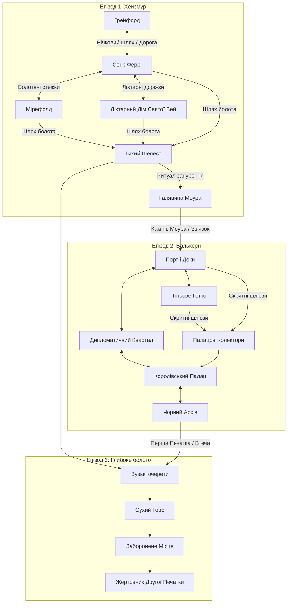

# Атлас Світу: Картографія та Локації

Цей документ є офіційним географічним та сюжетним атласом гри. Він об'єднує всі ключові локації, розділені за Епізодами, описує їхній візуальний тон, фракційну приналежність, ключових персонажів та події, які там відбуваються.

---

## 🗺️ Загальна структура світу

Географія гри побудована на принципі **компактної регіональної моделі** з високою наративною щільністю. Замість безкраїх порожніх просторів світ фокусується на трьох контрастних зонах, що відображають етапи розпаду стародавнього **Маршевого Пакту**:

---

## 🌲 ЕПІЗОД 1: ХЕЙЗМУР (THE HAZEMOOR) — ТОРФ'ЯНІ БОЛОТА

**Загальний тон регіону:** Імлиста flood-sick низина чорної води, торф'яних полів, гниючих хуторів, затоплених святинь і старих піднятих доріг. Дим від торф'яних печей висить низько над водою, роблячи відстань невизначеною, а подорож — гнітючою та небезпечною. Це прикордонна зона, де закон столиці практично не діє, а виживання залежить від дотримання неписаних правил болота.

---

### 1. Грейфорд (Greyford)
*   **Тип локації:** Стартове прикордонне містечко, річкова фортеця.
*   **Візуальний тон та атмосфера:** Сіра каменюка, вологе темне дерево, провислі дахи. Вулиці постійно брудні, колії від возів ніколи повністю не висихають. Річка тече сіро-коричнева від мулу. Запах мокрої вовни, коней, дьогтю та рибного розсолу. Смолоскипи на стінах палають навіть опівдні через вічну низьку хмарність.
*   **Що тут відбувається (Сюжет & Квести):**
    *   **Точка входу:** Тут починається гра. Протагоніст (**Мандруючий Вартовий**) прибуває з місією розшукати зниклого вісника Руфіна та розібратися, чому не прибув звіт про Порожній Сезон.
    *   **Розслідування (`greyford-01-adresat-vidsutniy`):** Герой обшукує кімнату Руфіна в постоялому дворі, розпитує Ервана та виходить на слід загадкового листа із печаткою у вигляді двох перехрещених кинджалів, що тримають коло з краплею в центрі.
    *   **Таємна магія:** Герой може знайти таємне помешкання **Чаклунки Алтеї (справжнє ім'я — Лілея)**, приховане за звичайними дверима за допомогою просторових чарів. Вона є останньою спадкоємицею стародавнього роду Ключників, яку таємно розшукував Орден Семи Кинджалів.
*   **Ключові персонажі та фракції:**
    *   *Лорд Стетсон* — королівський слідчий та представник столиці, який роками прикидався втомленим провінційним чиновником, щоб непомітно збирати інформацію про аномалії Хейзмуру.
    *   *Ерван* — практичний господар головного постоялого двору, який чує кожну плітку на кордоні.
    *   *Чаклунка Алтея (Лілея)* — могутня чарівниця, остання представниця роду Ключників. Вона ховається під вигаданим ім'ям від шукачів Ордену, захищаючи своє таємне помешкання просторовими чарами.
    *   *Сержант Гаррік* — чесний виконавець, що керує щоденними патрулями гарнізону.
    *   *Портові куртизанки* — незалежна інформаційна мережа, лояльна лише одна до одної.

---

### 2. Сонк-Феррі (Sunk Ferry)
*   **Тип локації:** Затонуле річкове поселення на палях, остання застава цивілізації перед глибоким болотом.
*   **Візуальний тон та атмосфера:** Хаотична мережа дерев'яних платформ і містків, що тримаються на гнилих стовпах над чорною водою. Постійний рух човнів, запах вогкої деревини, торф'яного диму, сушеної риби й людського розпачу. Вночі ліхтарі причалів створюють дзеркальні вогняні доріжки на нерухомій воді.
*   **Що тут відбувається (Сюжет & Квести):**
    *   **Соціальне напруження:** Початкова точка бенчмарк-квесту «Голод знизу» (`holod-znuzu`). Через зникнення зернового конвою в поселенні спалахують голодні бунти.
    *   **Кланова ворожнеча (`poromna-prysyaga`):** Конфлікт між поромними кланами Тована Ріда та Нери Вейл за контроль над водними шляхами.
    *   **Тіньовий обіг (`sil-u-knyzi`):** Розслідування саботажу постачання ліків через Солоні сараї, де стикаються інтереси контрабандистів та офіційної адміністрації.
    *   **Криза влади (`nizh-kvoty`):** Сюди прибуває суворий маршал Серіт Келм, щоб провести жорстку чистку та покарати тих, хто саботував постачання зерна до столиці.
*   **Ключові персонажі та фракції:**
    *   *Тован Рід* — речник старої гільдії поромників, прагматичний і жорсткий лідер.
    *   *Нера Вейл* — незалежний поромний майстер, яка знає таємні протоки, але зламана страхом після того, як її човен атакували Очеретяні.
    *   *Брін Осс* — безпринципний торговий посередник, готовий нажитися на голоді.
    *   *Гара Пайк* — авторитетна контрабандистка, яка контролює приховані Солоні сараї.

---

### 3. Мірефолд (Mirefold)
*   **Тип локації:** Занедбане напівзатоплене сільське поселення (хутір) на околиці Хейзмуру.
*   **Візуальний тон та атмосфера:** Гниючі халупи з солом'яними дахами, вкритими мохом. Земля під ногами нагадує губку — кожен крок витискає чорну болотну рідину. Постійний важкий туман, крізь який ледь пробиваються силуети покручених дерев. Пахне болотяним газом, торфом та сирістю.
*   **Що тут відбувається (Сюжет & Квести):**
    *   **Бенчмарк-розв'язка («Голод знизу»):** Епіцентр трагедії. Селяни виживають лише тому, що уклали таємну угоду з болотяними силами. Вони відводять зерно та приносять ритуальні жертви в затопленій каплиці, щоб тримати жахливих створінь — **Очеретяних** — подалі від своїх дітей.
    *   **Моральний вибір:** Вартовий має вирішити, чи викрити корупцію й приректи хутір на знищення, чи укласти «Місцеву угоду» (канонічний вибір C), дозволивши селянам вижити ціною брудного компромісу.
*   **Ключові персонажі та фракції:**
    *   *Стара Селла* — сільська старійшина, яка бере на себе гріх ритуальних жертв заради порятунку громади.

---

### 4. Ліхтарний Дім Святої Вей (Saint Vey's Lantern House)
*   **Тип локації:** Напівзатоплена монастирська каплиця-притулок.
*   **Візуальний тон та атмосфера:** Древня кам'яна кладка часів укладання Пакту, наполовину занурена у болото. Вікна засклені мутним зеленим склом. Головний ліхтар на вежі горить постійним білим вогнем, який прорізає туман. Всередині пахне воском, сушеними травами, ладаном та старим папером.
*   **Що тут відбувається (Сюжет & Квести):**
    *   **Доктринальний розкол (`popil-pid-kaplytseyu`):** Брат Карос виявляє, що селяни почали оскверняти старі поховання для імітації болотяних ритуалів. Вартовий розслідує спалення архівів та шукає компроміс між релігійною догмою Хранителів та суворою реальністю болісного виживання.
    *   **Дослідження аномалії:** Тут зберігаються стародавні записи про Прадавню війну та перші прояви Порожнього Сезону. Хранителі намагаються лікувати заражених болотяною гниллю.
*   **Ключові персонажі та фракції:**
    *   *Брат Карос* — молодий, але відданий ідеалам милосердя хранитель, який шукає істину між догмою та людяністю.
    *   *Матір Ісра Вейн* — сувора настоятелька Ліхтарного Дому, яка вимагає абсолютного підпорядкування церковному закону столиці.

---

### 5. Галявина Моура (Mour's Glade)
*   **Тип локації:** Джерело первинної болотяної аномалії, серце Хейзмуру.
*   **Візуальний тон та атмосфера:** Широка дзеркальна гладь чорної води серед болота, що ніколи не рухається від вітру і не відбиває хмар. Навколо стоїть непроникна стіна густого білого туману. Абсолютна, наповнена тиша — птахи та комахи мовчать. Вночі вода слабко світиться синім світлом з глибини.
*   **Що тут відбувається (Сюжет & Квести):**
    *   **Конфронтація з Аномалією (`hazemoor-02-halyna-dusha`):** Фінал Епізоду 1. Вартовий та Міа проходять крізь туман і здійснюють ритуальне занурення під воду, вчачись підкорятися течії болота.
    *   **Зустріч з Моуром:** З очерету та води піднімаються мільйони комах, утворюючи гігантський силует голови **Моура**. Сутність вступає в ментальний контакт із Міа, яка усвідомлює своє справжнє призначення та зв'язок з аномалією.
    *   **Доля Артефакту:** Гравець приймає рішення щодо Каменю Моура. Якщо відпустити його у воду — контакт буде повним і чистим; якщо утримати — артефакт залишиться в інвентарі як камінь-доказ, але зв'язок з Моуром буде скомпрометований.
    *   **Отримання Маунта:** Якщо ритуал проведено правильно, з глибини піднімається аномальне створіння — болотяний маунт, що приймає Вартового.
*   **Ключові персонажі та фракції:**
    *   *Міа* — провідниця Вартового, яка на галявині перетворюється з учениці на рівного партнера.
    *   *Моур* — древня екологічна сутність болота, що уособлює пам'ять про насильство Маршевого Пакту.

---

## 🏛️ ЕПІЗОД 2: ВАЛЬКОРН (VALKORN) — КОРОЛІВСЬКА ЦИТАДЕЛЬ

**Загальний тон регіону:** Величезне, стратифіковане портове місто з білого та сірого граніту на морському узбережжі. Тут пахне сіллю, рибою, великими грошима та політичною гниллю. Після задушливого туману Хейзмуру небо Валькорна здається болісно відкритим, а постійний штормовий вітер з моря пробирає до кісток. Тут панують закони інтриги, мармуру та церемоній.

---

### 1. Порт і Робочі Доки (Port & Docks)
*   **Тип локації:** Промисловий портовий район, морські ворота Валькорна.
*   **Візуальний тон та атмосфера:** Ліс щогл торгових кораблів та військових каравел, брудні причали, вкриті сіллю та смолою. Крики чайок змішуються з лайкою вантажників і шумом хвиль. Постійний рух товарів — від легального зерна до таємних вантажів.
*   **Що тут відбувається (Сюжет & Квести):**
    *   **Точка прибуття (`valkorn-01-lyudyna-z-bolota`):** Вартовий прибуває до столиці. Йому потрібно просунути свій вантаж повз митників та вийти на контакт із місцевим підпіллям.
    *   **Контрабанда та Гільдії (`valkorn-03-pravylna-tsina`):** Герой розслідує діяльність купця Дамара, який таємно відводить ресурси та приховує прибутки від корони за допомогою портової адміністрації.
    *   **Перша зустріч з Фіппом:** На причалі герой уперше помічає придворного **Блазня Фіппа**, який глузує з портових офіцерів, але таємно спостерігає за прибуттям людей із болота.
*   **Ключові персонажі та фракції:**
    *   *Капітан Варан* — грубий, обвітрений солоними вітрами начальник портового доку, який контролює нелегальний транзит і може допомогти герою непомітно спуститися в колектори.
    *   *Дамар* — впливовий складський магнат, пов'язаний із Торговою гільдією.

---

### 2. Тіньове Гетто (Shadow Ghetto)
*   **Тип локації:** Тісні, занедбані квартали бідняків та нелюдів.
*   **Візуальний тон та атмосфера:** Вузькі, слизькі провулки, побудовані з щербатого темного вапняку. Вода стікає по стінах, створюючи брудні калюжі. Маленькі вікна, завішені лахміттям. Пахне дешевим алкоголем, гнилою капустою та димом від спалювання сміття. Квартал ділиться на три частини: Старе гетто (ремісники-нелюди), Нове гетто (злиденні біженці з фронтиру) та Мовчазний квартал (занедбані руїни, де колись сталася аномальна трагедія).
*   **Що тут відбувається (Сюжет & Квести):**
    *   **Тіньова логістика:** Тут герой переховується від королівської варти. Вуличний провідник Брес допомагає йому орієнтуватися та дає наводки на крамницю Тесси.
    *   **Захист пригноблених:** Герой вирішує локальні конфлікти між збіднілими біженцями Хейзмуру та міською міліцією, які намагаються витіснити нелюдів із ремісничих цехів.
*   **Ключові персонажі та фракції:**
    *   *Брес* — спритний та кмітливий втікач із Сонк-Феррі, який знає кожен куток у міському підпіллі та виступає провідником Вартового.

---

### 3. Дипломатичний & Дворянський Квартал (Noble & Diplomatic Quarter)
*   **Тип локації:** Район розкішних маєтків, офісів гільдій та антикварних крамниць.
*   **Візуальний тон та атмосфера:** Парадні широкі вулиці, викладені білим полірованим гранітом. Високі мармурові портики, великі прозорі вікна, ковані залізні ворота маєтків. Затишно, чисто, пахне дорогим тютюном, парфумами та свіжою випічкою.
*   **Що тут відбувається (Сюжет & Квести):**
    *   **Слід Організації (`valkorn-02-dvi-versii-pravdy`):** Герой шукає таємного лідера Ордену Семи Кинджалів. Він виходить на крамницю Тесси — лікаря, торговця та архіваріуса.
    *   **Змова Еліт:** Вартовий дізнається про розкол всередині Ордену: частина прагне контролювати болота заради ресурсів, інша — хоче використати силу Моура як зброю у палацовому перевороті проти короля.
*   **Ключові персонажі та фракції:**
    *   *Тесса* — агент Ордену Семи Кинджалів, яка збирає стародавні архіви про Прадавню війну під комерційним прикриттям. Спокійна, холодна та неймовірно прониклива жінка.
    *   *Альбрехт* — верховний скарбник Торгової гільдії, який веде подвійну бухгалтерію з Орденом.

---

### 4. Королівський Палац & Бібліотека (Royal Palace & Archives)
*   **Тип локації:** Резиденція вищої королівської влади та державні архіви.
*   **Візуальний тон та атмосфера:** Грандіозні зали з високими зводами, полірований мармур під ногами, важкі оксамитові гобелени. Військова варта в блискучих обладунках стоїть біля кожних дверей. Королівська бібліотека заповнена тисячами фоліантів, пахне старим пергаментом, чорнилом і сухим теплом від камінів.
*   **Що тут відбувається (Сюжет & Квести):**
    *   **Палацова інтрига (`valkorn-04-lyudyna-shcho-poslala-rufina`):** Герой стикається з королівським слідчим Стетсоном, який вимагає повного звіту про ситуацію в Хейзмурі. Герой розуміє, що Стетсон використовував Грейфорд як спостережний пункт за аномалією.
    *   **Блазнювання на крові:** У тронній залі герой стає свідком виступу **Блазня Фіппа**. Фіпп говорить правду про Порожній Сезон під виглядом жартів, які король сприймає за дурість, тоді як герой завдяки Каменю Моура відчуває, що Фіпп — це і є той самий таємничий лідер, якого він шукав.
*   **Ключові персонажі та фракції:**
    *   *Король* — старіючий, параноїдальний правитель, який намагається утримати владу за допомогою інтриг.
    *   *Лорд Стетсон* — королівський слідчий, який веде власну гру проти Ордену.
    *   *Блазень Фіпп (Себастьян Марр)* — публічна маска лідера Ордену Семи Кинджалів, колишнього наставника Ілії Марр.

---

### 5. Чорний Архів (The Black Archive)
*   **Тип локації:** Таємна підземна зала Founders під фундаментом Королівського Палацу.
*   **Візуальний тон та атмосфера:** Циклопічна кам'яна кладка Compact-ери, покрита реліктовими рунами, що пульсують срібним світлом. Повна відсутність пилу, незважаючи на вік. Посеред зали стоїть древній кам'яний постамент, де зберігалася **Перша Печатка**. Повітря тремтить від метафізичного резонансу, а камінь у кишені героя нагрівається до опіків (**Резонанс Моура**).
*   **Що тут відбувається (Сюжет & Квести):**
    *   **Фінал Епізоду 2 (`valkorn-05-khranitel-pershoyi-pechatky`):** Герой проникає в архів через древні тунелі. Тут відбувається фінальна конфронтація епізоду з Себастьяном Марром (Блазнем Фіппом).
    *   **Розкриття зради:** Герой дізнається, що Себастьян Марр — це загиблий наставник Ілії Марр. Ілія, яка вважала його героєм і жертвою, переживає шок від особистої зради.
    *   **Доля Першої Печатки:** Печатка пульсує срібним світлом, амортизуючи шепоти Моура. Гравець приймає критичне рішення щодо її вилучення, що провокує тривогу по всьому палацу. Ілія розриває зв'язки з Себастьяном, а її голос починає з'являтися в голові протагоніста як захисний провідник.
*   **Ключові персонажі та фракції:**
    *   *Себастьян Марр (Блазень Фіпп)* — лідер Ордену, який викрав Першу Печатку, щоб використати її для контролю над Порожнім Сезоном.
    *   *Ілія Марр* — колишня учениця Себастьяна, яка остаточно розриває з ним зв'язки та переходить на бік протагоніста.

---

### 6. Палацові колектори (Palace Sewers)
*   **Тип локації:** Занедбані дренажні канали та шлюзи часів Прадавньої війни.
*   **Візуальний тон та атмосфера:** Темні, вологі зводи, вкриті слизом та болотним мохом, що проріс крізь міські стіни. Шум води, що стрімко тече до моря. Запах гнилизни, каналізації та іржавого заліза.
*   **Що тут відбувається (Сюжет & Квести):**
    *   **Шлях втечі (`valkorn-05`):** Після того як у Чорному Архіві спрацьовує магічна сигналізація, герой та Ілія змушені тікати крізь ці колектори, відбиваючись від гвардійців та аномальних створінь, що пробралися знизу. Брес допомагає їм вийти до порту, де Капітан Варан готує човен для втечі назад у болота.

---

## 🕳️ ЕПІЗОД 3: СЕРЦЕ ТРЯСОВИНИ (HEART OF THE MIRE) — ГЛИБОКЕ БОЛОТО

**Загальний тон регіону:** Первісний, дикий хаос глибоких маршів, куди не насмілюються заходити навіть найдосвідченіші мисливці Мурі. Тут закони фізики та розуму починають ламатися під тиском концентрованого Порожнього Сезону. Постійний шепіт у повітрі викликає галюцинації, туман має зеленувато-чорний відтінок, а вода здається живою і голодною.

---

### 1. Вузькі очерети (Vuzki Ocherety)
*   **Тип локації:** Аномальний водний лабіринт.
*   **Візуальний тон та атмосфера:** Гігантський очерет заввишки до чотирьох метрів повністю закриває небо, перетворюючи канали на напівтемні тунелі. Вода густа, чорна і практично не відбиває світла. Зелений туман висить щільною стіною, обмежуючи видимість до кількох кроків. Повітря вібрує від тисяч голосів, що шепочуть імена.
*   **Що тут відбувається (Сюжет & Квести):**
    *   **Ментальний тиск:** Зона надзвичайно високої ментальної напруги. Без захисту гравець швидко божеволіє та втрачає контроль над персонажем.
    *   **Голос у голові:** Метафізичний голос Ілії Марр, який чує лише головний герой, виступає як захисний щит. Вона амортизує шепоти болота своїм голосом, вказуючи правильний шлях крізь аномальні зони та ілюзії.
*   **Ключові персонажі та фракції:**
    *   *Голос Ілії Марр* — астральний провідник героя, яка коментує події та захищає його розум від руйнування.

---

### 2. Сухий Горб (Sukhyy Horb)
*   **Тип локації:** Невеликий природний острівець безпеки серед глибокого болота.
*   **Візуальний тон та атмосфера:** Єдина тверда земля на милі навколо. У центрі росте древній покручений дуб, чиє коріння стримує трясовину. Слабкий вогник багаття створює маленьке коло теплого світла, за межами якого вирує непроглядна темрява болота. Затишно, тихо, пахне сухими дровами та болотяною м'ятою.
*   **Що тут відбувається (Сюжет & Квести):**
    *   **Табірні розмови (Campfire Talks):** Місце для відпочинку та перепочинку між експедиціями в глибоке болото.
    *   **Розкриття персонажів:** Тут розгортаються глибокі діалоги з Міа. Вона ділиться своїми снами про Прадерево, розповідає про дитинство в Тихому Шелесті та розкриває складні стосунки зі своїм батьком Каеном, який знав про її зв'язок з Моуром, але намагався захистити її від цієї долі.
*   **Ключові персонажі та фракції:**
    *   *Міа* — розкриває свою вразливість та передісторію біля багаття.
    *   *Протагоніст* — виступає як Трагічний Моральний Якір для Міа.

---

### 3. Заборонене Місце (Zaboronene Mistse)
*   **Тип локації:** Руїни циклопічної цивілізації Прадавніх Провідників.
*   **Візуальний тон та атмосфера:** Величезні чорні базальтові блоки, що виростають із болота під неприродними кутами. Вони вкриті дивними рунами, які світяться тьмяним фіолетовим світлом. Гравітація тут нестабільна — деякі предмети та вода левітують у повітрі. Повна відсутність будь-яких звуків — мертва зона, куди не проникає навіть шепіт болота.
*   **Що тут відбувається (Сюжет & Квести):**
    *   **Відкриття Древнього Лору:** Герой досліджує руїни нелюдської культури, яка існувала задовго до появи перших королівств та укладання Маршевого Пакту.
    *   **Джерело Порожнього Сезону:** Тут герой дізнається справжню природу Порожнього Сезону — це не прокляття, а витік первісної енергії з розірваних печаток, які тримали збалансованим метафізичне насильство стародавніх епох.
*   **Ключові персонажі та фракції:**
    *   *Болотяні екологічні сутності* — стародавні охоронці руїн, з якими можна вступити в бій або обійти за допомогою Плетіння Моура.

---

### 4. Тихий Шелест (Tykhyy Shelest)
*   **Тип локації:** Приховане поселення Мурі (болотяного народу) на палях.
*   **Візуальний тон та атмосфера:** Система дерев'яних платформ, мостів і переходів, побудована високо на стовпах між гігантськими болотяними деревами. Вода тече під ногами, створюючи постійний тихий шум. Вночі сотні маленьких олійних ліхтариків підвішені до гілок, через що поселення здається зоряним небом, яке впало в болото. Пахне торфом, димом, гіркими лікарськими травами та вологою хвоєю.
*   **Що тут відбувається (Сюжет & Квести):**
    *   **Іспит довіри (`tykhy-shelist-quests`):** Вартовий прибуває сюди, здолавши Гнильного Ткача та довівши Мурі свою повагу до болота.
    *   **Таємниця походження:** В Лікарському домі шаман Каен розкриває героєві правду: Міа не є його рідною донькою. Він знайшов її немовлям на Галявині Моура після того, як її біологічних батьків було принесено в жертву під час укладання Маршевого Пакту.
    *   **Пошук Руфіна:** Герой знаходить сліди Руфіна, який проходив через поселення перед своєю загибеллю, та дізнається, що той намагався попередити Мурі про плани Ордену Семи Кинджалів викрасти Другу Печатку.
*   **Ключові персонажі та фракції:**
    *   *Каен* — мудрий і втомлений шаман-лікар громади, прийомний батько Міа, який зберігає найважчу таємницю регіону.
    *   *Дружина Каена (мати Міа)* — спокійна жінка, яка оберігає родинний спокій та з тривогою спостерігає за героєм.
    *   *Варрік* — суворий старший мисливець, який принципово не довіряє чужинцям, вважаючи, що вони приносять лише біди.
    *   *Сірра* — допитлива дівчина-підліток, яка таємно вивчила спільну мову від Міа і ділиться з героєм секретами, про які мовчать дорослі.

---

### 5. Жертовник Другої Печатки / Вівтар Чорного Архіву (Altar of the Second Seal)
*   **Тип локації:** Епіцентр аномалії Хейзмуру, місце укладання Маршевого Пакту.
*   **Візуальний тон та атмосфера:** Гігантське Прадерево, чиє коріння йде на невідому глибину в киплячу болотну рідину. В центрі коріння розташований стародавній кам'яний вівтар, затиснутий дерев'яними лещатами. Вівтар пульсує потужними хвилями темряви та срібного світла, що створюють кругові хвилі в тумані. Повітря густе, важке, кожен подих дається з зусиллям.
*   **Що тут відбувається (Сюжет & Квести):**
    *   **Фінал гри (Кульмінація Епізоду 3):** Вартовий досягає Жертовника разом із Міа та Ілією. Тут їх наздоганяють залишки сил Ордену Семи Кинджалів або королівської варти Стетсона.
    *   **Фінальний вибір:** Герой має вирішити долю Другої Печатки:
        1.  **Шлях Ліхтаря (Нова версія):** Використати Першу і Другу Печатки для повного перезапуску Маршевого Пакту. Це зупинить Порожній Сезон на наступні сто років, але вимагатиме нової трагічної жертви — життєвої сили Міа, яка добровільно готова піти на це.
        2.  **Шлях Розриву:** Зруйнувати Печатки повністю, звільнивши Моура. Порожній Сезон затопить прикордоння, перетворивши його на дику аномальну зону, але звільнить людей від тиранії столиці та врятує життя Міа, хоча Хейзмур буде назавжди втрачено для цивілізації.
        3.  **Шлях Плетіння (Секретний вибір):** Використати Плетіння Моура, щоб зв'язати силу Печаток із життєвою силою всього болотяного народу Мурі, створивши новий рівноважний баланс без людських жертв, але зробивши Хейзмур повністю ізольованим від зовнішнього світу королівства.
*   **Ключові персонажі та фракції:**
    *   *Міа* — готова пожертвувати собою заради порятунку Хейзмуру.
    *   *Ілія Марр* — допомагає героєві своїми знаннями, намагаючись не допустити тріумфу планів Себастьяна.
    *   *Себастьян Марр* — робить останню спробу захопити силу вівтаря, якщо вижив в Епізоді 2.
