# Hazemoor — Візуальний довідник сутностей → Meshy

> Джерело: `D:\vision art game.pdf` (23 стор., 51 концепт-арт).
> **Імена, HP і ролі** взяті з текстового шару PDF (канон). **Опис зовнішності**
> — з ілюстрацій; локальна MiniCPM-V 4.6 дала лише грубий тип, тож візуальні
> деталі вивірені вручну. Кожен запис має **референс-кадр** і **готовий Meshy-промпт**.

## Як користуватись

1. Знайди сутність у розділі за типом.
2. Для NPC/істот: промпт уже у форматі `full body, T-pose` — можна лити прямо в
   `meshy_text_to_3d` (`pose_mode="t-pose"`), або скормити референс-кадр у `image_to_3d`.
3. Дотримуйся кредитного бюджету: ~15–20 cr/модель (meshy-5), рігінг +5 cr.
4. Локації/сцени — це середовище й лейаут, **не** генеруй з них персонажів.

**Усього:** 51 концептів · Істота / монстр: 10 · Персонаж (NPC): 33 · Локація / об'єкт: 6 · Сцена / концепт: 2

---

## 🐾 Істота / монстр

### 01. Очеретяний повзун (30 HP) — засідка в очереті

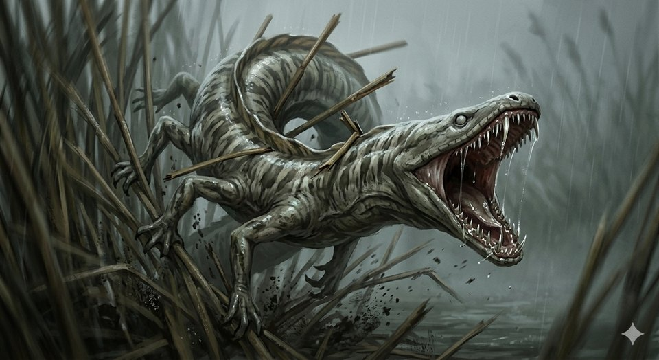

- **Тип:** 🐾 Істота / монстр
- **HP:** 30 HP
- **Референс:** стор. 1 PDF · `images/01-p01-ocheretianyi-povzun-zasidka-v-ochereti.jpg`
- **Маршрут Meshy:** `meshy_text_to_3d` (t-pose) → `_refine` (PBR) → `meshy_rig`  •  або `image_to_3d` з референсом нижче
- **Meshy prompt:**

  ```text
  reed crawler creature, low-slung quadruped ambush predator, elongated scaled lizard body, mottled swamp-green and brown camouflage hide, spiny reed-like dorsal frills, wide flat clawed feet, hungry eyes, dark fantasy bestiary, full body, T-pose, game-ready, PBR
  ```

### 02. Рій туманних кровососів (25 HP) — хмара в імлі

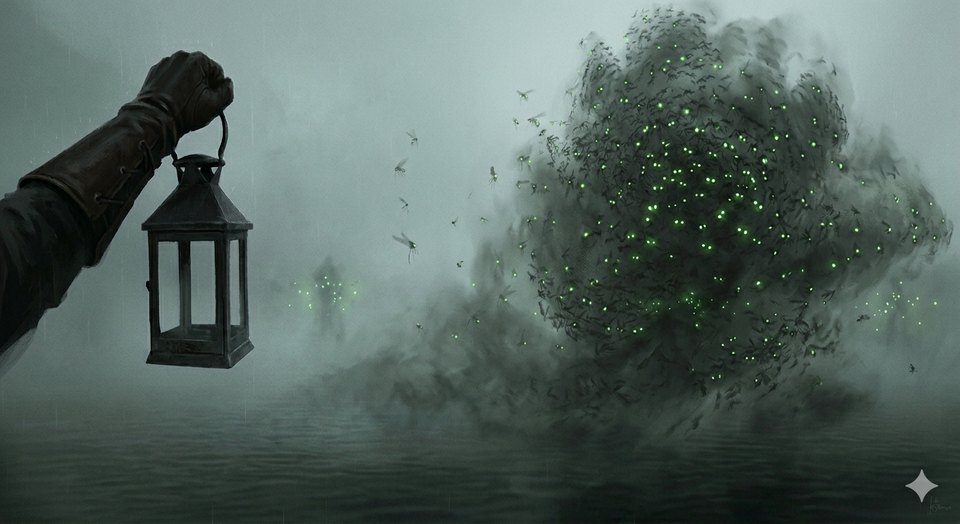

- **Тип:** 🐾 Істота / монстр
- **HP:** 25 HP
- **Референс:** стор. 1 PDF · `images/02-p01-rii-tumannykh-krovososiv-khmara-v-imli.jpg`
- **Маршрут Meshy:** `meshy_text_to_3d` (t-pose) → `_refine` (PBR) → `meshy_rig`  •  або `image_to_3d` з референсом нижче
- **Meshy prompt:**

  ```text
  swarm of mist bloodsucker insects forming a single cohesive cloud entity, dark fantasy, translucent grey mosquito-like creatures with faint red glow, wispy fog body, game-ready, PBR, floating
  ```

### 03. Гнилий потопельник (45 HP) — те, що болото не віддало

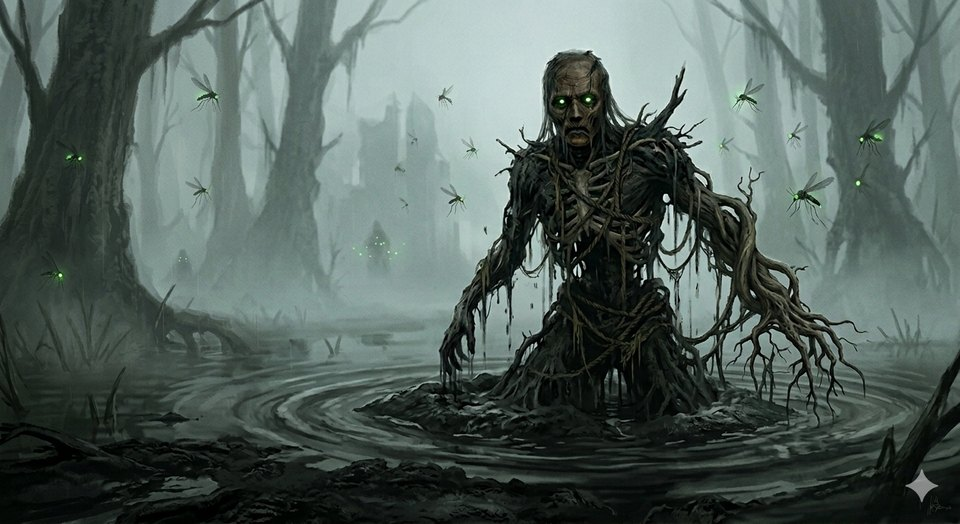

- **Тип:** 🐾 Істота / монстр
- **HP:** 45 HP
- **Референс:** стор. 2 PDF · `images/03-p02-hnylyi-potopelnyk-te-shcho-boloto-ne-viddalo.jpg`
- **Маршрут Meshy:** `meshy_text_to_3d` (t-pose) → `_refine` (PBR) → `meshy_rig`  •  або `image_to_3d` з референсом нижче
- **Meshy prompt:**

  ```text
  rotting drowned undead humanoid, bloated waterlogged corpse, tattered soaked rags, grey-green decayed flesh, dripping bog water and weeds, hollow eyes, dark fantasy, full body, T-pose, game-ready, PBR
  ```

### 04. Мурок-трясовик (50–55 HP) — водна засідка

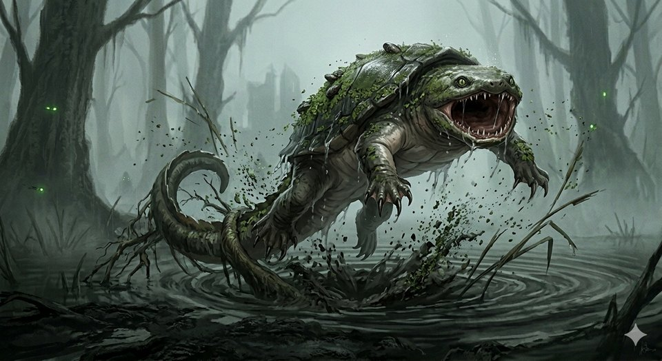

- **Тип:** 🐾 Істота / монстр
- **HP:** 50-55 HP
- **Референс:** стор. 2 PDF · `images/04-p02-murok-triasovyk-vodna-zasidka.jpg`
- **Маршрут Meshy:** `meshy_text_to_3d` (t-pose) → `_refine` (PBR) → `meshy_rig`  •  або `image_to_3d` з референсом нижче
- **Meshy prompt:**

  ```text
  murok bog-dweller amphibian humanoid, hunched aquatic ambusher, slick dark-green mottled skin, webbed clawed hands, gilled neck, sharp teeth, wet swamp sheen, dark fantasy, full body, T-pose, game-ready, PBR
  ```

### 05. Дорослий мурок (90 HP) — страж Жертовника

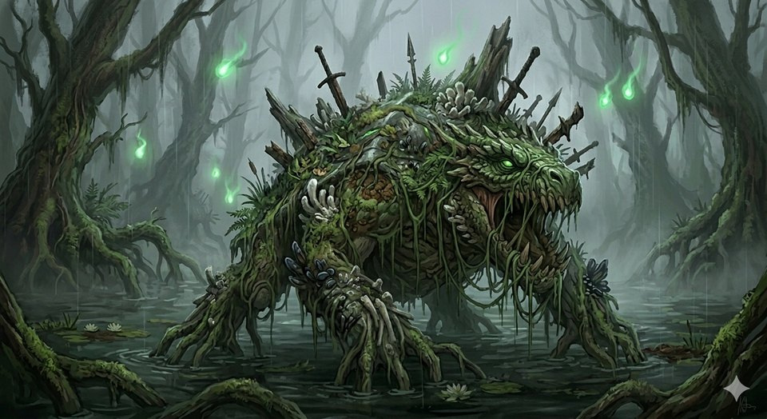

- **Тип:** 🐾 Істота / монстр
- **HP:** 90 HP
- **Референс:** стор. 2 PDF · `images/05-p02-doroslyi-murok-strazh-zhertovnyka.jpg`
- **Маршрут Meshy:** `meshy_text_to_3d` (t-pose) → `_refine` (PBR) → `meshy_rig`  •  або `image_to_3d` з референсом нижче
- **Meshy prompt:**

  ```text
  adult murok altar guardian, large powerful amphibian humanoid warrior, muscular dark-green scaled body, bony ridged crest, primitive bone armor, webbed clawed hands, imposing stance, dark fantasy boss, full body, T-pose, game-ready, PBR
  ```

### 16. (без підпису)

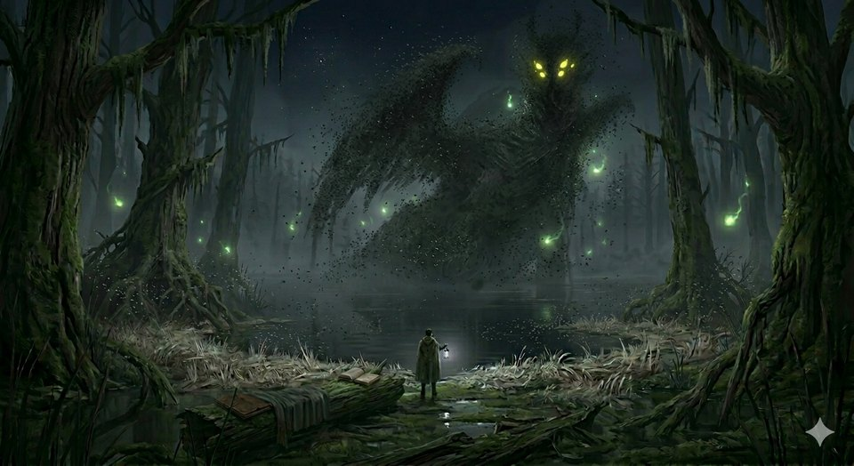

- **Тип:** 🐾 Істота / монстр
- **Референс:** стор. 7 PDF · `images/16-p07-untitled.jpg`
- **Маршрут Meshy:** `meshy_text_to_3d` (t-pose) → `_refine` (PBR) → `meshy_rig`  •  або `image_to_3d` з референсом нижче
- **Meshy prompt:**

  ```text
  Mour the swamp consciousness, teaser view, colossal eldritch bog entity of roots mud and vegetation with glowing green core, dark fantasy, full body, T-pose, game-ready, PBR
  ```

### 17. Моур — свідомість болота (фінал еп. 1, Галявина)

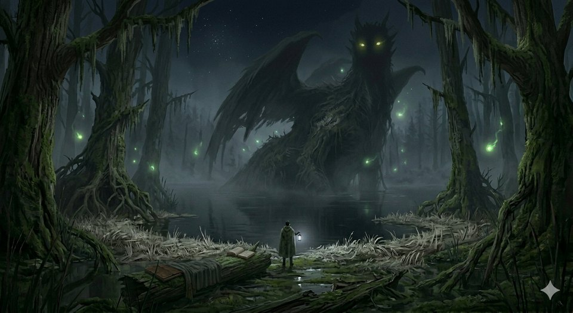

- **Тип:** 🐾 Істота / монстр
- **Референс:** стор. 8 PDF · `images/17-p08-mour-svidomist-bolota.jpg`
- **Маршрут Meshy:** `meshy_text_to_3d` (t-pose) → `_refine` (PBR) → `meshy_rig`  •  або `image_to_3d` з референсом нижче
- **Meshy prompt:**

  ```text
  Mour the swamp consciousness, colossal eldritch boss entity rising from the bog, dark mass of roots mud and vegetation, glowing green core and veins, towering amorphous form, dark fantasy raid boss, full body, T-pose, game-ready, PBR
  ```

### 40. Присутність — те, що відповідає

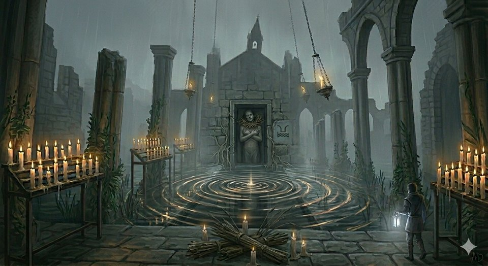

- **Тип:** 🐾 Істота / монстр
- **Референс:** стор. 19 PDF · `images/40-p19-prysutnist-te-shcho-vidpovidaie.jpg`
- **Маршрут Meshy:** `meshy_text_to_3d` (t-pose) → `_refine` (PBR) → `meshy_rig`  •  або `image_to_3d` з референсом нижче
- **Meshy prompt:**

  ```text
  The Presence that answers, spectral hooded entity, translucent shifting robe of shadow, faint glowing features, ominous stillness, dark fantasy apparition, full body, T-pose, game-ready, PBR
  ```

### 44. Тварюка Твані— сліпий хижак Шаленої Річки

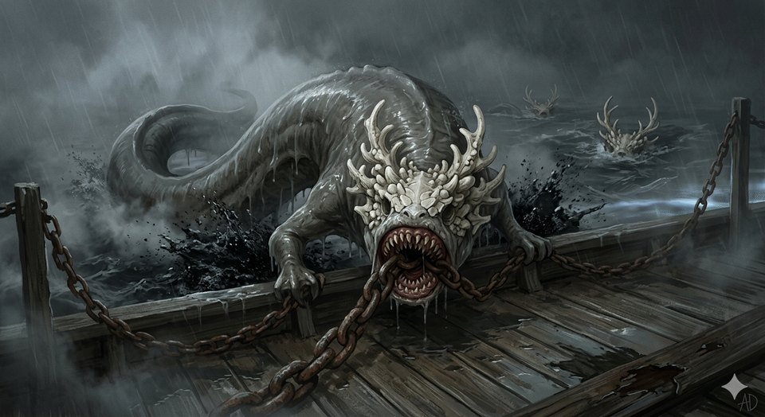

- **Тип:** 🐾 Істота / монстр
- **Референс:** стор. 20 PDF · `images/44-p20-tvariuka-tvani-slipyi-khyzhak-shalenoi-richky.jpg`
- **Маршрут Meshy:** `meshy_text_to_3d` (t-pose) → `_refine` (PBR) → `meshy_rig`  •  або `image_to_3d` з референсом нижче
- **Meshy prompt:**

  ```text
  Tvani beast, blind predator of the Raging River, large sightless amphibious hunter, sleek muscular grey hide, eyeless snarling head with sensory whiskers, jagged horns, webbed claws, dark fantasy, full body, T-pose, game-ready, PBR
  ```

### 45. Очеретяний Блукач

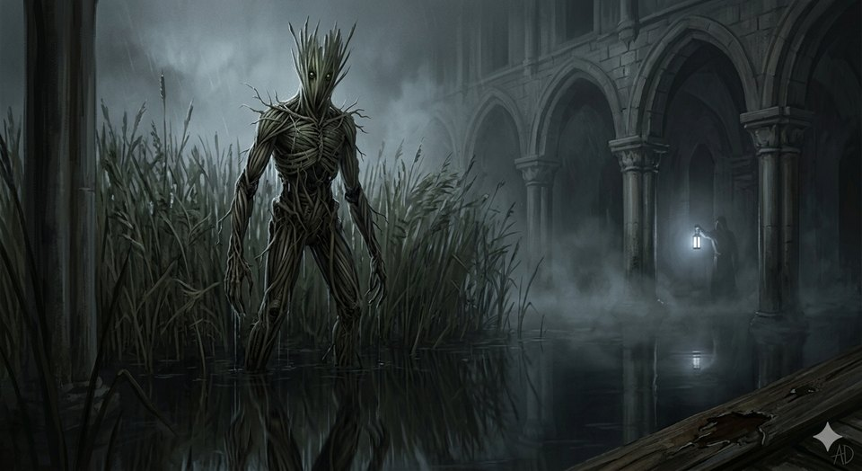

- **Тип:** 🐾 Істота / монстр
- **Референс:** стор. 21 PDF · `images/45-p21-ocheretianyi-blukach.jpg`
- **Маршрут Meshy:** `meshy_text_to_3d` (t-pose) → `_refine` (PBR) → `meshy_rig`  •  або `image_to_3d` з референсом нижче
- **Meshy prompt:**

  ```text
  Reed Wanderer, tall gaunt plant-creature, humanoid silhouette woven from reeds and swamp foliage, faint glowing motes, slow eerie posture, dark fantasy, full body, T-pose, game-ready, PBR
  ```

---

## 🧍 Персонаж (NPC)

### 06. Мати Міа — третій шар таємниці

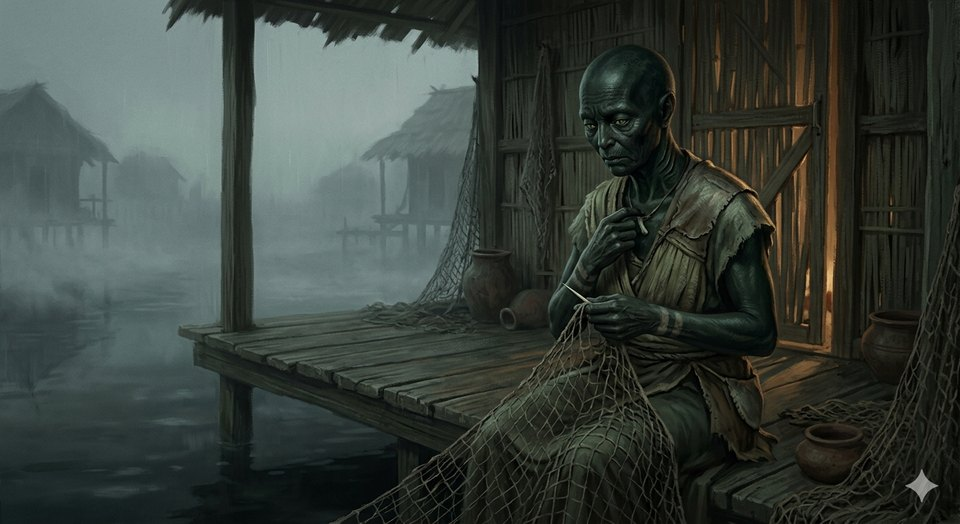

- **Тип:** 🧍 Персонаж (NPC)
- **Референс:** стор. 3 PDF · `images/06-p03-maty-mia-tretii-shar-taiemnytsi.jpg`
- **Маршрут Meshy:** `meshy_text_to_3d` (t-pose) → `_refine` (PBR) → `meshy_rig`  •  або `image_to_3d` з референсом нижче
- **Meshy prompt:**

  ```text
  middle-aged mysterious woman, guarded knowing expression, layered muted robes and shawl, weathered face, dark fantasy villager, full body, T-pose, game-ready, PBR
  ```

### 07. Ерван — хазяїн постоялого двору

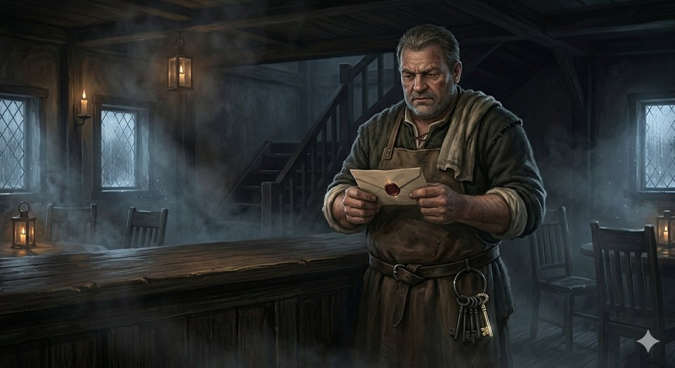

- **Тип:** 🧍 Персонаж (NPC)
- **Референс:** стор. 3 PDF · `images/07-p03-ervan-khaziain-postoialoho-dvoru.jpg`
- **Маршрут Meshy:** `meshy_text_to_3d` (t-pose) → `_refine` (PBR) → `meshy_rig`  •  або `image_to_3d` з референсом нижче
- **Meshy prompt:**

  ```text
  male tavern keeper, sturdy middle-aged innkeeper, apron over simple tunic, rolled sleeves, friendly weathered face, dark fantasy, full body, T-pose, game-ready, PBR
  ```

### 08. Сірра — молода мисливиця Мурі

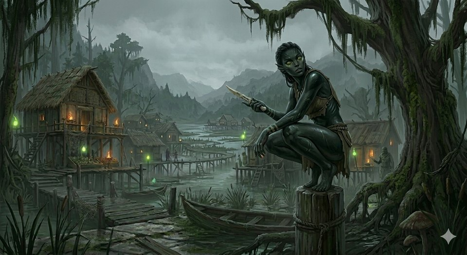

- **Тип:** 🧍 Персонаж (NPC)
- **Референс:** стор. 4 PDF · `images/08-p04-sirra-moloda-myslyvytsia-muri.jpg`
- **Маршрут Meshy:** `meshy_text_to_3d` (t-pose) → `_refine` (PBR) → `meshy_rig`  •  або `image_to_3d` з референсом нижче
- **Meshy prompt:**

  ```text
  young female hunter of the Muri, lean agile woman, leather hunting garb, hood, bow and quiver, alert youthful face, dark fantasy, full body, T-pose, game-ready, PBR
  ```

### 09. Варрік — старший мисливець Мурі

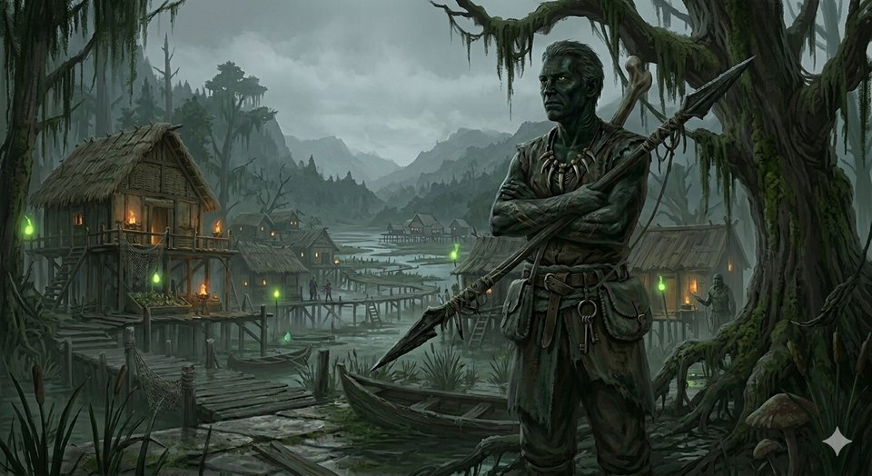

- **Тип:** 🧍 Персонаж (NPC)
- **Референс:** стор. 4 PDF · `images/09-p04-varrik-starshyi-myslyvets-muri.jpg`
- **Маршрут Meshy:** `meshy_text_to_3d` (t-pose) → `_refine` (PBR) → `meshy_rig`  •  або `image_to_3d` з референсом нижче
- **Meshy prompt:**

  ```text
  senior male hunter of the Muri, rugged veteran, layered leather and fur, scarred face, hunting spear, stern experienced look, dark fantasy, full body, T-pose, game-ready, PBR
  ```

### 10. Стетсон — королівський слідчий

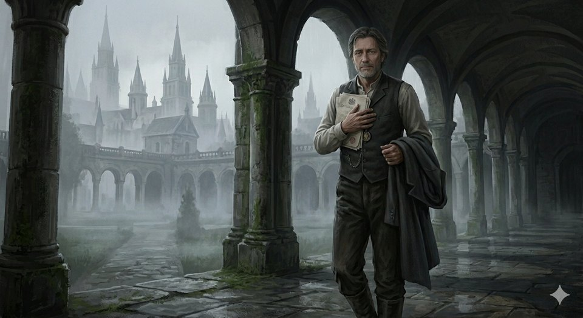

- **Тип:** 🧍 Персонаж (NPC)
- **Референс:** стор. 5 PDF · `images/10-p05-stetson-korolivskyi-slidchyi.jpg`
- **Маршрут Meshy:** `meshy_text_to_3d` (t-pose) → `_refine` (PBR) → `meshy_rig`  •  або `image_to_3d` з референсом нижче
- **Meshy prompt:**

  ```text
  royal investigator, sharp authoritative man in dark formal coat, badge of office, cold analytical face, gloved hands, dark fantasy, full body, T-pose, game-ready, PBR
  ```

### 11. Брес — провідник по гетто

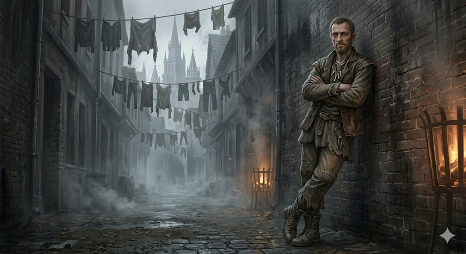

- **Тип:** 🧍 Персонаж (NPC)
- **Референс:** стор. 5 PDF · `images/11-p05-bres-providnyk-po-hetto.jpg`
- **Маршрут Meshy:** `meshy_text_to_3d` (t-pose) → `_refine` (PBR) → `meshy_rig`  •  або `image_to_3d` з референсом нижче
- **Meshy prompt:**

  ```text
  ghetto guide, wiry streetwise man, worn patched clothes, hood, cautious darting eyes, dark fantasy slum dweller, full body, T-pose, game-ready, PBR
  ```

### 12. Одрін — палацовий архіваріус

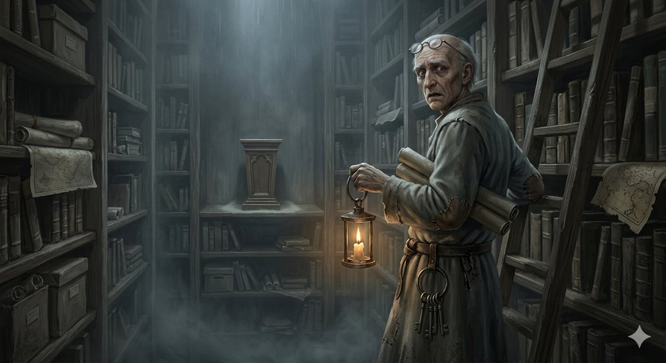

- **Тип:** 🧍 Персонаж (NPC)
- **Референс:** стор. 6 PDF · `images/12-p06-odrin-palatsovyi-arkhivarius.jpg`
- **Маршрут Meshy:** `meshy_text_to_3d` (t-pose) → `_refine` (PBR) → `meshy_rig`  •  або `image_to_3d` з референсом нижче
- **Meshy prompt:**

  ```text
  palace archivist, elderly scholarly man, long robe, spectacles, ink-stained fingers, stack of scrolls, refined face, dark fantasy, full body, T-pose, game-ready, PBR
  ```

### 13. Тесса — Торговий квартал Валькорна

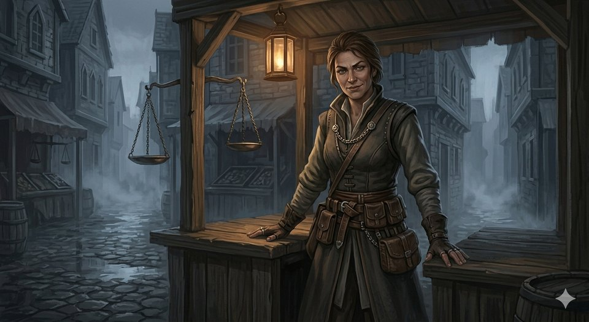

- **Тип:** 🧍 Персонаж (NPC)
- **Референс:** стор. 6 PDF · `images/13-p06-tessa-torhovyi-kvartal-valkorna.jpg`
- **Маршрут Meshy:** `meshy_text_to_3d` (t-pose) → `_refine` (PBR) → `meshy_rig`  •  або `image_to_3d` з референсом нижче
- **Meshy prompt:**

  ```text
  merchant quarter woman, well-dressed confident trader, fine layered merchant garb, jewelry, shrewd smile, dark fantasy, full body, T-pose, game-ready, PBR
  ```

### 14. Дамар — ділок, що вкрав не те

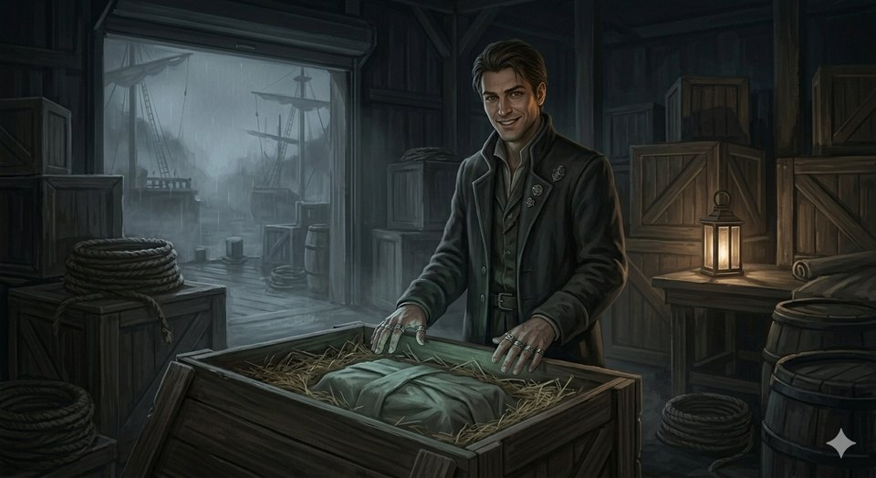

- **Тип:** 🧍 Персонаж (NPC)
- **Референс:** стор. 7 PDF · `images/14-p07-damar-dilok-shcho-vkrav-ne-te.jpg`
- **Маршрут Meshy:** `meshy_text_to_3d` (t-pose) → `_refine` (PBR) → `meshy_rig`  •  або `image_to_3d` з референсом нижче
- **Meshy prompt:**

  ```text
  shady dealer man, nervous well-dressed rogue, dark coat, cornered guilty expression, dockside crates behind, dark fantasy, full body, T-pose, game-ready, PBR
  ```

### 15. Лоен — посланець Ордену

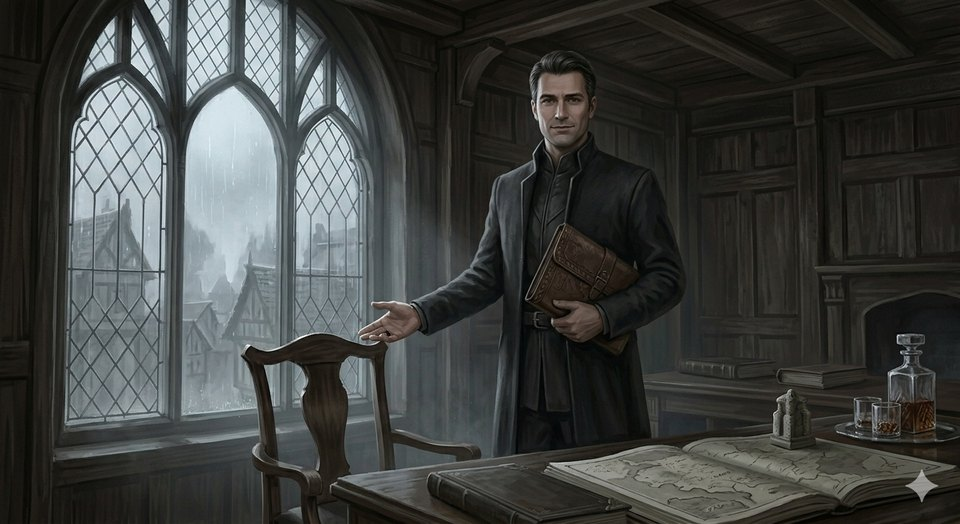

- **Тип:** 🧍 Персонаж (NPC)
- **Референс:** стор. 7 PDF · `images/15-p07-loen-poslanets-ordenu.jpg`
- **Маршрут Meshy:** `meshy_text_to_3d` (t-pose) → `_refine` (PBR) → `meshy_rig`  •  або `image_to_3d` з референсом нижче
- **Meshy prompt:**

  ```text
  messenger of the Order, formal courier in dark ceremonial garb, order insignia, scroll case, composed face, dark fantasy, full body, T-pose, game-ready, PBR
  ```

### 18. Руфін — той, хто повернувся порожнім

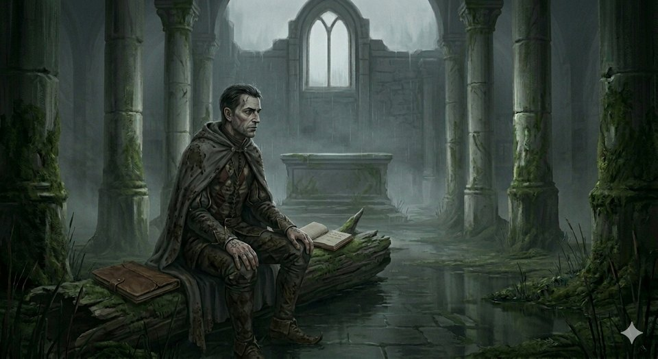

- **Тип:** 🧍 Персонаж (NPC)
- **Референс:** стор. 8 PDF · `images/18-p08-rufin-toi-khto-povernuvsia-porozhnim.jpg`
- **Маршрут Meshy:** `meshy_text_to_3d` (t-pose) → `_refine` (PBR) → `meshy_rig`  •  або `image_to_3d` з референсом нижче
- **Meshy prompt:**

  ```text
  man who returned empty, hollow-eyed haunted figure, plain muted clothing, vacant lost expression, pale gaunt face, dark fantasy, full body, T-pose, game-ready, PBR
  ```

### 19. Серіт Келм — адміністративний слідчий

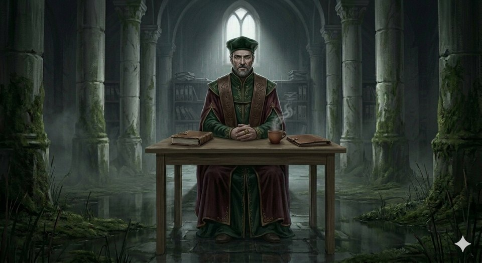

- **Тип:** 🧍 Персонаж (NPC)
- **Референс:** стор. 9 PDF · `images/19-p09-serit-kelm-administratyvnyi-slidchyi.jpg`
- **Маршрут Meshy:** `meshy_text_to_3d` (t-pose) → `_refine` (PBR) → `meshy_rig`  •  або `image_to_3d` з референсом нижче
- **Meshy prompt:**

  ```text
  administrative investigator, precise bureaucratic man, dark tailored uniform, ledger, humorless face, dark fantasy, full body, T-pose, game-ready, PBR
  ```

### 20. Себастьян Марр / Блазень Фіпп — очільник Ордену Семи Кинджалів

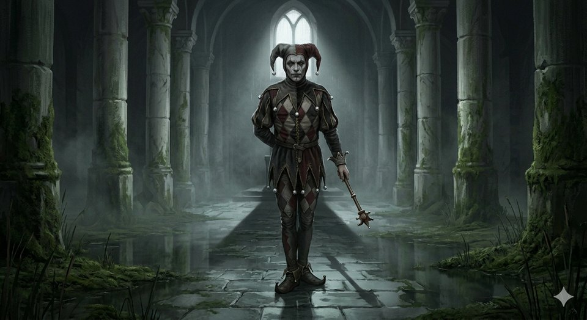

- **Тип:** 🧍 Персонаж (NPC)
- **Референс:** стор. 9 PDF · `images/20-p09-sebastian-marr-blazen-fipp-ochilnyk-ordenu-semy-kyndzhaliv.jpg`
- **Маршрут Meshy:** `meshy_text_to_3d` (t-pose) → `_refine` (PBR) → `meshy_rig`  •  або `image_to_3d` з референсом нижче
- **Meshy prompt:**

  ```text
  Order of Seven Daggers leader in jester disguise, sinister figure blending noble robes with tattered motley, pale painted face, hidden daggers, unsettling smile, dark fantasy, full body, T-pose, game-ready, PBR
  ```

### 21. Ілія Марр — Вартова-Курат

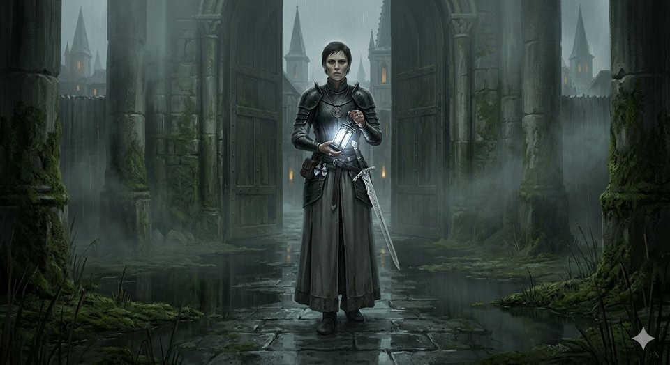

- **Тип:** 🧍 Персонаж (NPC)
- **Референс:** стор. 10 PDF · `images/21-p10-iliia-marr-vartova-kurat.jpg`
- **Маршрут Meshy:** `meshy_text_to_3d` (t-pose) → `_refine` (PBR) → `meshy_rig`  •  або `image_to_3d` з референсом нижче
- **Meshy prompt:**

  ```text
  female Watcher-Kurat, disciplined armored sentinel woman, dark plate and mail, order tabard, stern vigilant face, dark fantasy, full body, T-pose, game-ready, PBR
  ```

### 22. Лілея (Алтея) — остання з Ключників

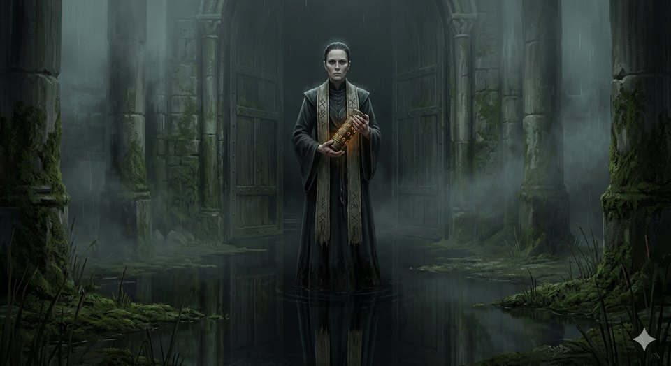

- **Тип:** 🧍 Персонаж (NPC)
- **Референс:** стор. 10 PDF · `images/22-p10-lileia-ostannia-z-kliuchnykiv.jpg`
- **Маршрут Meshy:** `meshy_text_to_3d` (t-pose) → `_refine` (PBR) → `meshy_rig`  •  або `image_to_3d` з референсом нижче
- **Meshy prompt:**

  ```text
  last of the Keepers, mystical woman, flowing ceremonial keeper robes, arcane key pendant, serene sorrowful face, dark fantasy, full body, T-pose, game-ready, PBR
  ```

### 23. Каен — шаман Тихого Шелесту

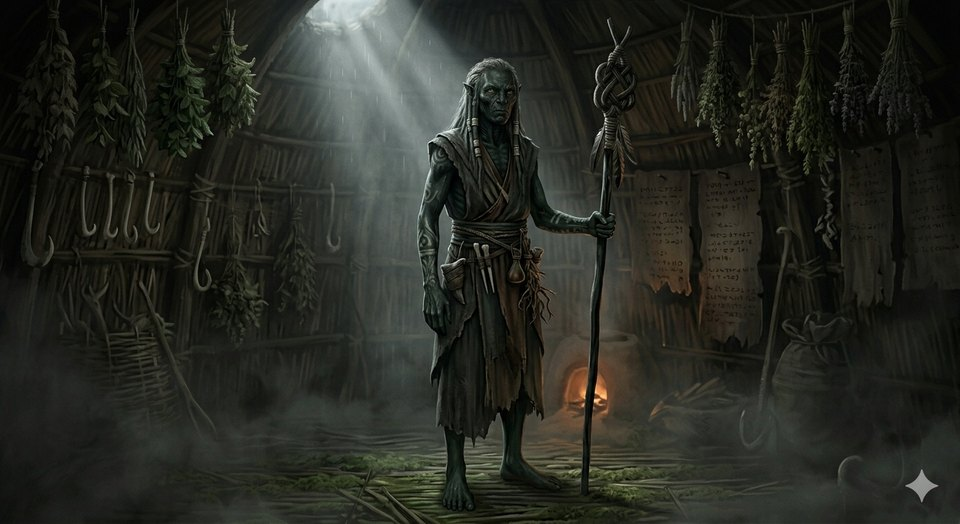

- **Тип:** 🧍 Персонаж (NPC)
- **Референс:** стор. 11 PDF · `images/23-p11-kaen-shaman-tykhoho-shelestu.jpg`
- **Маршрут Meshy:** `meshy_text_to_3d` (t-pose) → `_refine` (PBR) → `meshy_rig`  •  або `image_to_3d` з референсом нижче
- **Meshy prompt:**

  ```text
  shaman of the Silent Whisper village, tribal mystic, layered hides feathers and bone charms, painted face, staff, wise intense eyes, dark fantasy, full body, T-pose, game-ready, PBR
  ```

### 24. Гара Пайк — контрабандистська капітанка

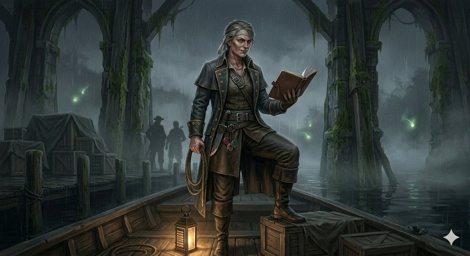

- **Тип:** 🧍 Персонаж (NPC)
- **Референс:** стор. 11 PDF · `images/24-p11-hara-paik-kontrabandystska-kapitanka.jpg`
- **Маршрут Meshy:** `meshy_text_to_3d` (t-pose) → `_refine` (PBR) → `meshy_rig`  •  або `image_to_3d` з референсом нижче
- **Meshy prompt:**

  ```text
  smuggler captain woman, bold seafaring rogue, weathered coat, tricorn hat, cutlass, confident smirk, dark fantasy, full body, T-pose, game-ready, PBR
  ```

### 25. Брат Карос — хранитель Святої Вей

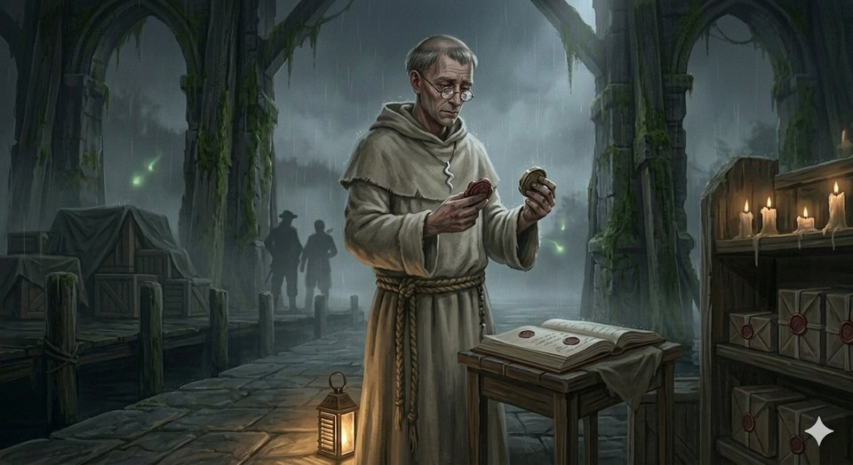

- **Тип:** 🧍 Персонаж (NPC)
- **Референс:** стор. 12 PDF · `images/25-p12-brat-karos-khranytel-sviatoi-vei.jpg`
- **Маршрут Meshy:** `meshy_text_to_3d` (t-pose) → `_refine` (PBR) → `meshy_rig`  •  або `image_to_3d` з референсом нижче
- **Meshy prompt:**

  ```text
  brother keeper of Holy Vey, devout monk, plain hooded habit, holy symbol, calm faithful face, dark fantasy, full body, T-pose, game-ready, PBR
  ```

### 26. Тован Рід — клановий речник

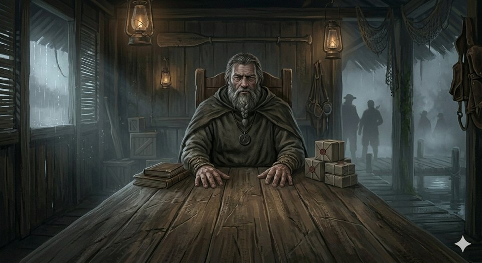

- **Тип:** 🧍 Персонаж (NPC)
- **Референс:** стор. 12 PDF · `images/26-p12-tovan-rid-klanovyi-rechnyk.jpg`
- **Маршрут Meshy:** `meshy_text_to_3d` (t-pose) → `_refine` (PBR) → `meshy_rig`  •  або `image_to_3d` з референсом нижче
- **Meshy prompt:**

  ```text
  clan speaker, dignified elder man, ceremonial clan garb, staff of office, proud measured face, dark fantasy, full body, T-pose, game-ready, PBR
  ```

### 27. Мара Денс — лікарка-самоучка

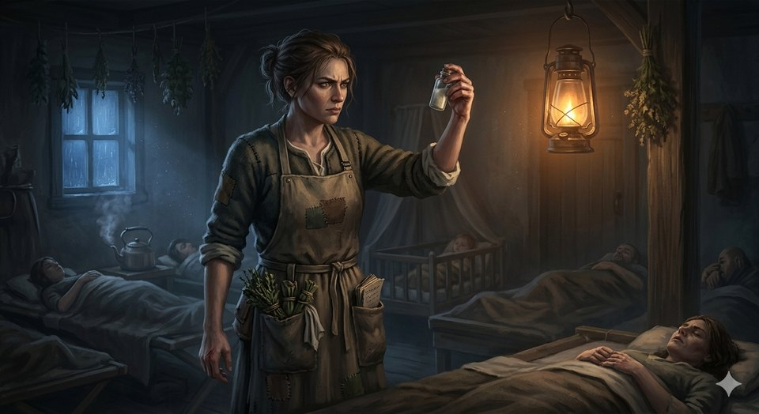

- **Тип:** 🧍 Персонаж (NPC)
- **Референс:** стор. 13 PDF · `images/27-p13-mara-dens-likarka-samouchka.jpg`
- **Маршрут Meshy:** `meshy_text_to_3d` (t-pose) → `_refine` (PBR) → `meshy_rig`  •  або `image_to_3d` з референсом нижче
- **Meshy prompt:**

  ```text
  self-taught healer woman, practical caring figure, apron with pouches of herbs, rolled sleeves, tired kind face, dark fantasy, full body, T-pose, game-ready, PBR
  ```

### 28. Брін Осс — логістичний брокер

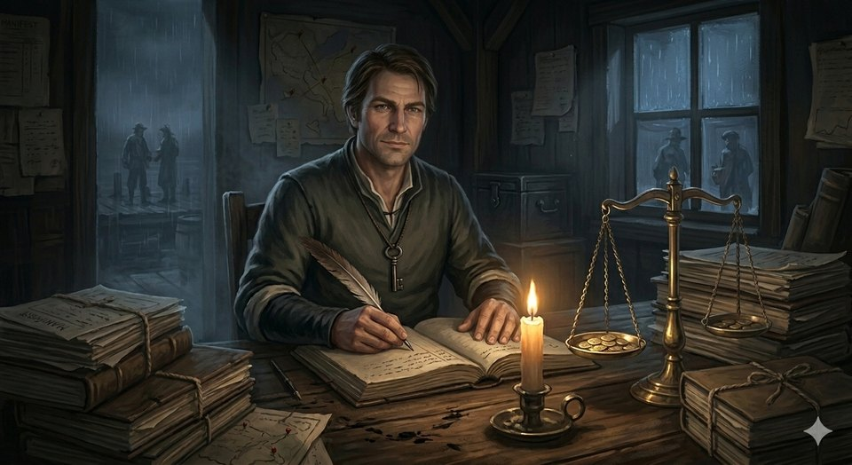

- **Тип:** 🧍 Персонаж (NPC)
- **Референс:** стор. 13 PDF · `images/28-p13-brin-oss-lohistychnyi-broker.jpg`
- **Маршрут Meshy:** `meshy_text_to_3d` (t-pose) → `_refine` (PBR) → `meshy_rig`  •  або `image_to_3d` з референсом нижче
- **Meshy prompt:**

  ```text
  logistics broker, calculating businessman, neat merchant coat, tally ledger, appraising expression, dark fantasy, full body, T-pose, game-ready, PBR
  ```

### 29. Квартирмейстер Восс — корумпований чиновник

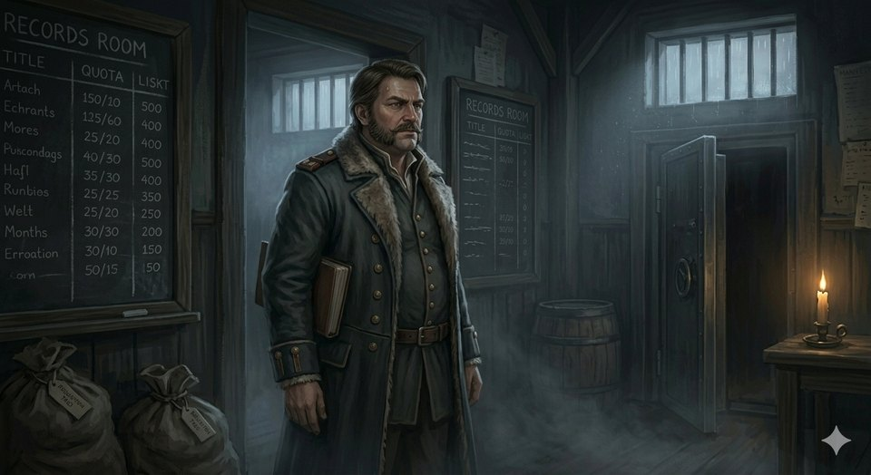

- **Тип:** 🧍 Персонаж (NPC)
- **Референс:** стор. 14 PDF · `images/29-p14-kvartyrmeister-voss-korumpovanyi-chynovnyk.jpg`
- **Маршрут Meshy:** `meshy_text_to_3d` (t-pose) → `_refine` (PBR) → `meshy_rig`  •  або `image_to_3d` з референсом нижче
- **Meshy prompt:**

  ```text
  corrupt quartermaster official, portly self-satisfied man, ornate uniform stretched over belly, coin purse, greedy smug face, dark fantasy, full body, T-pose, game-ready, PBR
  ```

### 30. Нера Вейл — молода свідка (бонус)

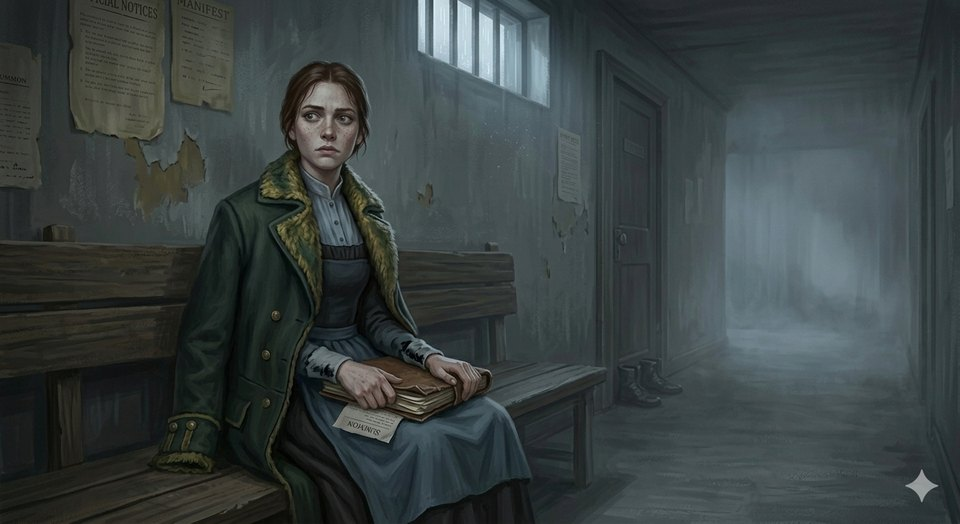

- **Тип:** 🧍 Персонаж (NPC)
- **Референс:** стор. 14 PDF · `images/30-p14-nera-veil-moloda-svidka.jpg`
- **Маршрут Meshy:** `meshy_text_to_3d` (t-pose) → `_refine` (PBR) → `meshy_rig`  •  або `image_to_3d` з референсом нижче
- **Meshy prompt:**

  ```text
  young female witness, frightened teenage girl, simple commoner dress, clutching shawl, wide anxious eyes, dark fantasy, full body, T-pose, game-ready, PBR
  ```

### 31. Різьбяр з кварталу ремісників

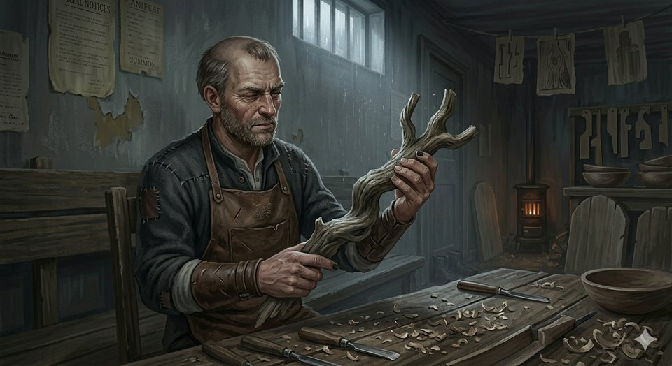

- **Тип:** 🧍 Персонаж (NPC)
- **Референс:** стор. 15 PDF · `images/31-p15-rizbiar-z-kvartalu-remisnykiv.jpg`
- **Маршрут Meshy:** `meshy_text_to_3d` (t-pose) → `_refine` (PBR) → `meshy_rig`  •  або `image_to_3d` з референсом нижче
- **Meshy prompt:**

  ```text
  woodcarver from the artisan quarter, focused craftsman, leather apron, wood shavings, carving tools, calloused hands, dark fantasy, full body, T-pose, game-ready, PBR
  ```

### 32. Кушнір — той, хто знає всіх

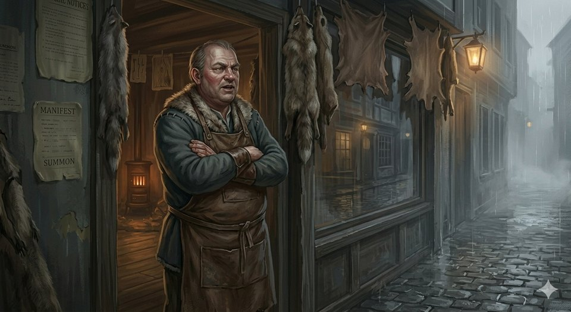

- **Тип:** 🧍 Персонаж (NPC)
- **Референс:** стор. 15 PDF · `images/32-p15-kushnir-toi-khto-znaie-vsikh.jpg`
- **Маршрут Meshy:** `meshy_text_to_3d` (t-pose) → `_refine` (PBR) → `meshy_rig`  •  або `image_to_3d` з референсом нижче
- **Meshy prompt:**

  ```text
  furrier who knows everyone, gossipy shopkeeper, fur-lined coat, warm sly face, dark fantasy, full body, T-pose, game-ready, PBR
  ```

### 33. Бармен портової таверни

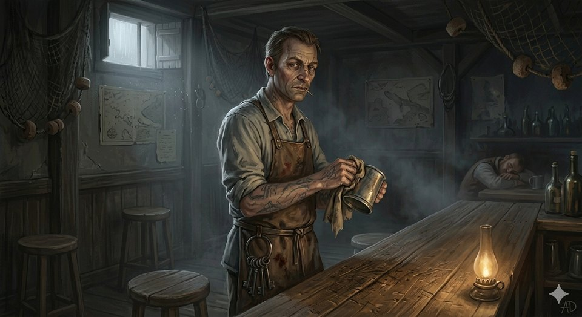

- **Тип:** 🧍 Персонаж (NPC)
- **Референс:** стор. 16 PDF · `images/33-p16-barmen-portovoi-taverny.jpg`
- **Маршрут Meshy:** `meshy_text_to_3d` (t-pose) → `_refine` (PBR) → `meshy_rig`  •  або `image_to_3d` з референсом нижче
- **Meshy prompt:**

  ```text
  port tavern bartender, burly rough man, stained apron, rolled sleeves, tankard, gruff face, dark fantasy, full body, T-pose, game-ready, PBR
  ```

### 34. Куртизанка — остання співрозмовниця Руфіна

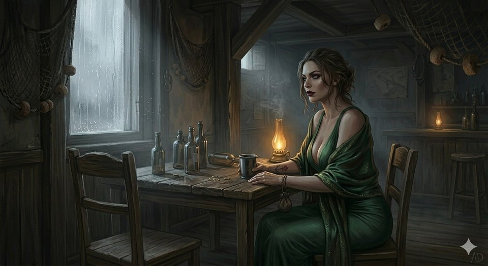

- **Тип:** 🧍 Персонаж (NPC)
- **Референс:** стор. 16 PDF · `images/34-p16-kurtyzanka-ostannia-spivrozmovnytsia-rufina.jpg`
- **Маршрут Meshy:** `meshy_text_to_3d` (t-pose) → `_refine` (PBR) → `meshy_rig`  •  або `image_to_3d` з референсом нижче
- **Meshy prompt:**

  ```text
  courtesan, elegant alluring woman, fine revealing period gown, jewelry, poised melancholy face, dark fantasy, full body, T-pose, game-ready, PBR
  ```

### 35. Сержант воріт

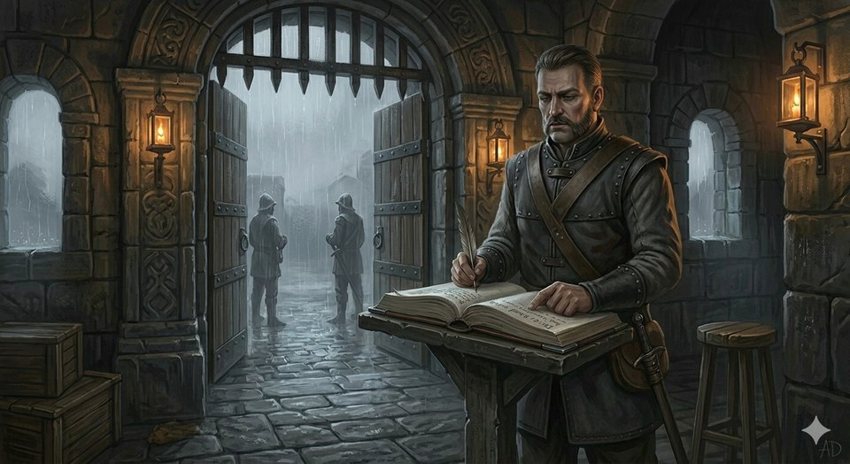

- **Тип:** 🧍 Персонаж (NPC)
- **Референс:** стор. 17 PDF · `images/35-p17-serzhant-vorit.jpg`
- **Маршрут Meshy:** `meshy_text_to_3d` (t-pose) → `_refine` (PBR) → `meshy_rig`  •  або `image_to_3d` з референсом нижче
- **Meshy prompt:**

  ```text
  gate sergeant, disciplined city guard, dark plate armor over uniform, helmet under arm, halberd, stern duty-bound face, dark fantasy, full body, T-pose, game-ready, PBR
  ```

### 36. Стара Селла з Мірефолда

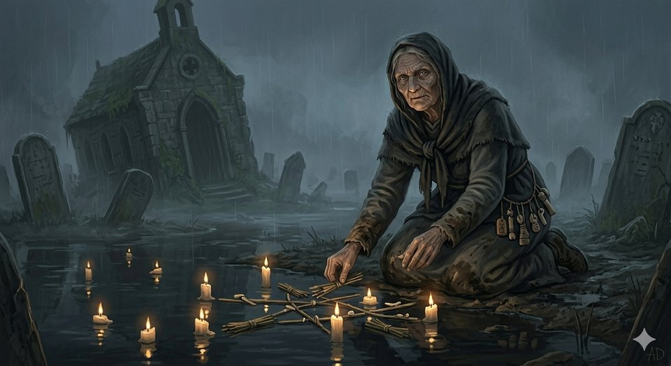

- **Тип:** 🧍 Персонаж (NPC)
- **Референс:** стор. 17 PDF · `images/36-p17-stara-sella-z-mirefolda.jpg`
- **Маршрут Meshy:** `meshy_text_to_3d` (t-pose) → `_refine` (PBR) → `meshy_rig`  •  або `image_to_3d` з референсом нижче
- **Meshy prompt:**

  ```text
  old woman from Mirefold, wizened village elder, worn shawl and layered peasant clothes, cane, deeply lined weathered face, dark fantasy, full body, T-pose, game-ready, PBR
  ```

### 37. Матір Ісра Вейн — старша настоятелька

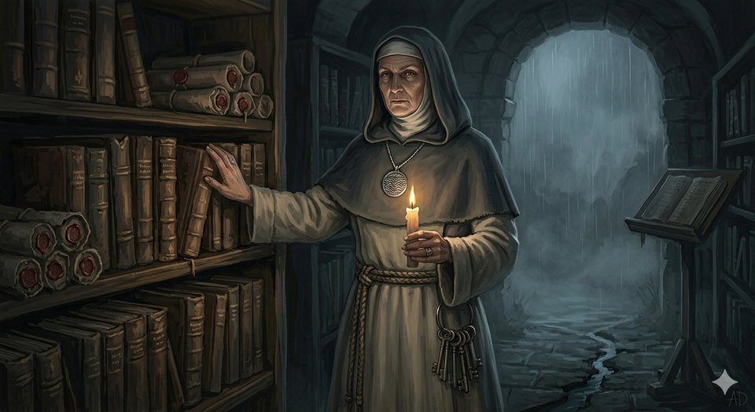

- **Тип:** 🧍 Персонаж (NPC)
- **Референс:** стор. 18 PDF · `images/37-p18-matir-isra-vein-starsha-nastoiatelka.jpg`
- **Маршрут Meshy:** `meshy_text_to_3d` (t-pose) → `_refine` (PBR) → `meshy_rig`  •  або `image_to_3d` з референсом нижче
- **Meshy prompt:**

  ```text
  mother superior, austere elderly abbess, full dark religious habit and veil, holy pendant, severe pious face, dark fantasy, full body, T-pose, game-ready, PBR
  ```

### 38. Скел Ганіс — дренажний робітник

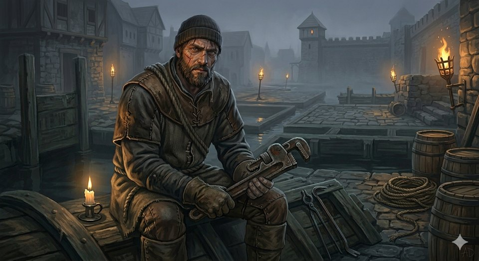

- **Тип:** 🧍 Персонаж (NPC)
- **Референс:** стор. 18 PDF · `images/38-p18-skel-hanis-drenazhnyi-robitnyk.jpg`
- **Маршрут Meshy:** `meshy_text_to_3d` (t-pose) → `_refine` (PBR) → `meshy_rig`  •  або `image_to_3d` з референсом нижче
- **Meshy prompt:**

  ```text
  drainage worker, grimy laborer, soaked patched work clothes, rubber-like waders, tools, exhausted dirty face, dark fantasy, full body, T-pose, game-ready, PBR
  ```

### 39. Диякон Рейн

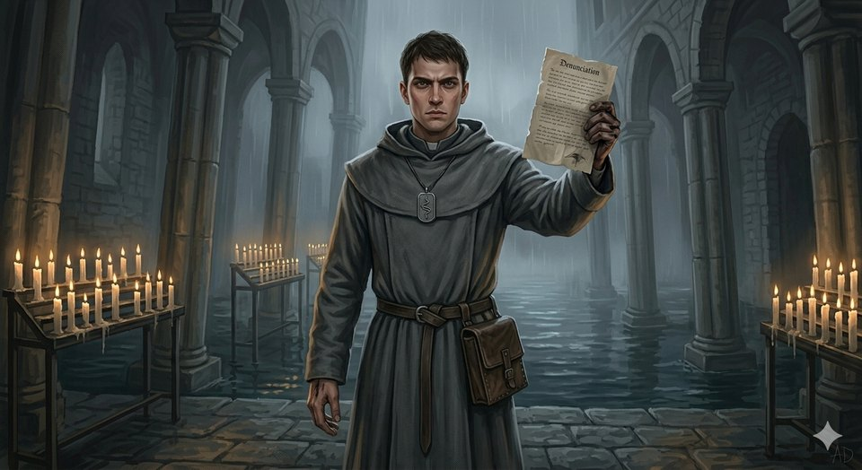

- **Тип:** 🧍 Персонаж (NPC)
- **Референс:** стор. 18 PDF · `images/39-p18-dyiakon-rein.jpg`
- **Маршрут Meshy:** `meshy_text_to_3d` (t-pose) → `_refine` (PBR) → `meshy_rig`  •  або `image_to_3d` з референсом нижче
- **Meshy prompt:**

  ```text
  deacon, mid-rank clergy man, dark cassock with trim, holy book, composed devout face, dark fantasy, full body, T-pose, game-ready, PBR
  ```

### 49. Портрет Руфіна

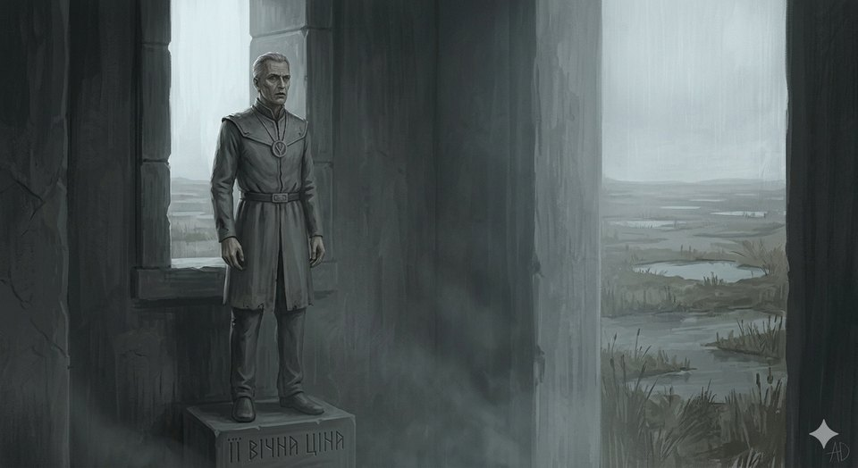

- **Тип:** 🧍 Персонаж (NPC)
- **Референс:** стор. 22 PDF · `images/49-p22-portret-rufina.jpg`
- **Маршрут Meshy:** `meshy_text_to_3d` (t-pose) → `_refine` (PBR) → `meshy_rig`  •  або `image_to_3d` з референсом нижче
- **Meshy prompt:**

  ```text
  portrait of the returned man, painted bust of a haunted pale figure in muted clothing, framed dark fantasy portrait, hollow eyes
  ```

---

## 🏛️ Локація / об'єкт

### 41. Затоплена каплиця ключників екстер'єр

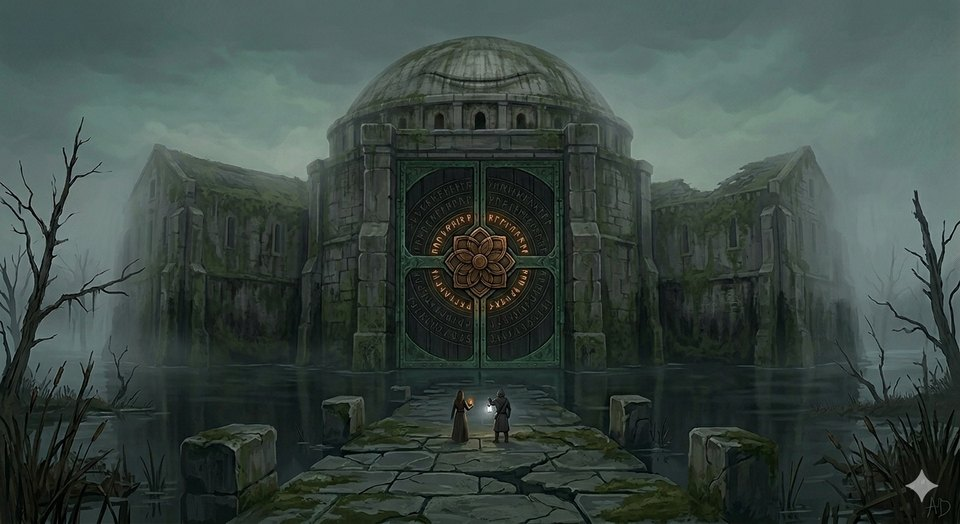

- **Тип:** 🏛️ Локація / об'єкт
- **Референс:** стор. 19 PDF · `images/41-p19-zatoplena-kaplytsia-kliuchnykiv-ekster-ier.jpg`
- **Маршрут Meshy:** Середовище/лейаут: `image_to_3d` (standard) як пропс-кіт, **не** для рігінгу. Персонажів звідси не діставати.
- **Meshy prompt:**

  ```text
  flooded chapel of the Keepers, exterior, half-submerged gothic stone chapel in a swamp, cracked arches, water reflections, mist, dark fantasy environment
  ```

### 42. Затоплена каплиця ключників інтер'єр

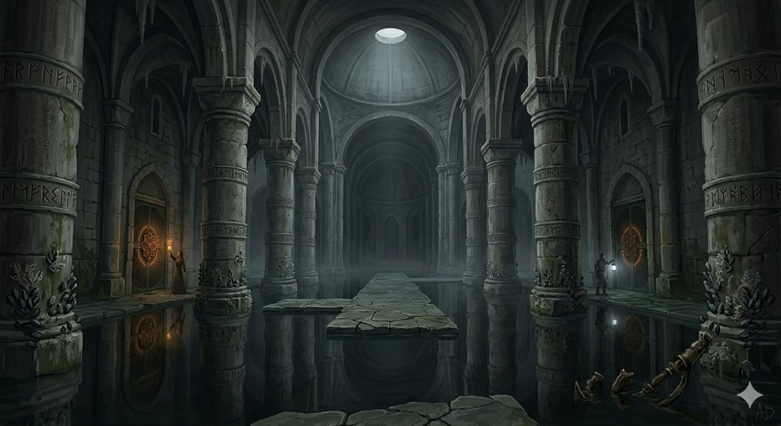

- **Тип:** 🏛️ Локація / об'єкт
- **Референс:** стор. 20 PDF · `images/42-p20-zatoplena-kaplytsia-kliuchnykiv-inter-ier.jpg`
- **Маршрут Meshy:** Середовище/лейаут: `image_to_3d` (standard) як пропс-кіт, **не** для рігінгу. Персонажів звідси не діставати.
- **Meshy prompt:**

  ```text
  flooded chapel of the Keepers, interior, waterlogged gothic hall, submerged pews, tall pillars, dim shafts of light, dark fantasy environment
  ```

### 43. Затоплена таблиця жертовник

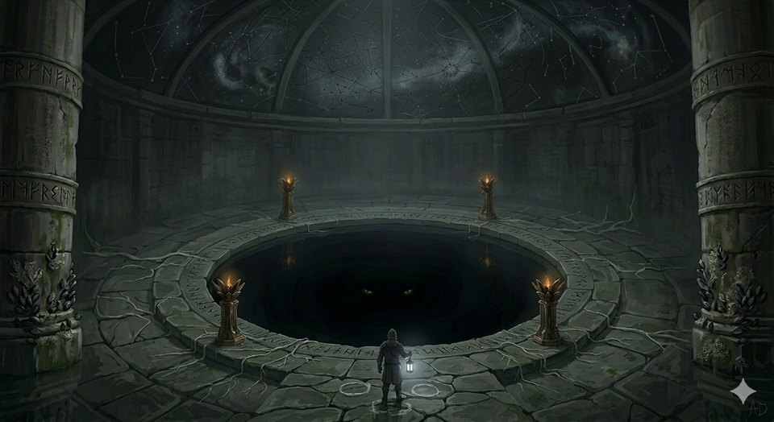

- **Тип:** 🏛️ Локація / об'єкт
- **Референс:** стор. 20 PDF · `images/43-p20-zatoplena-tablytsia-zhertovnyk.jpg`
- **Маршрут Meshy:** Середовище/лейаут: `image_to_3d` (standard) як пропс-кіт, **не** для рігінгу. Персонажів звідси не діставати.
- **Meshy prompt:**

  ```text
  flooded sacrificial altar, ancient stone altar table rising from dark water, brick columns, hanging lamps, arched tunnel, dark fantasy environment
  ```

### 46. Вівтар Стагнації

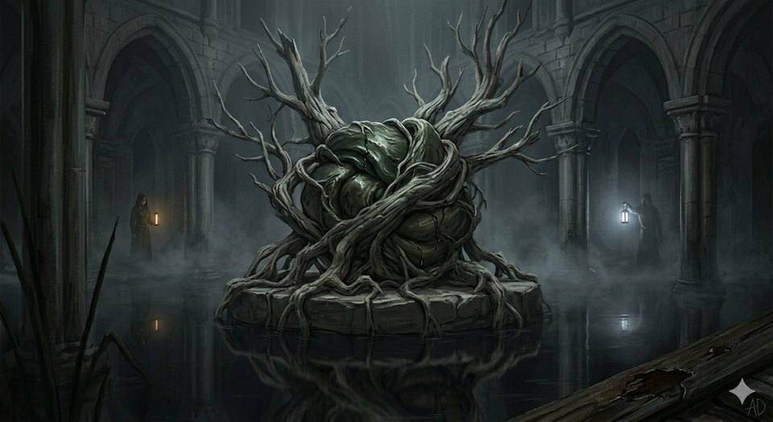

- **Тип:** 🏛️ Локація / об'єкт
- **Референс:** стор. 21 PDF · `images/46-p21-vivtar-stahnatsii.jpg`
- **Маршрут Meshy:** Середовище/лейаут: `image_to_3d` (standard) як пропс-кіт, **не** для рігінгу. Персонажів звідси не діставати.
- **Meshy prompt:**

  ```text
  Altar of Stagnation, corrupted swamp shrine, decayed stone altar overgrown with rot and reeds, sickly green glow, dark fantasy environment
  ```

### 48. Вівтар Стагнації в еп4

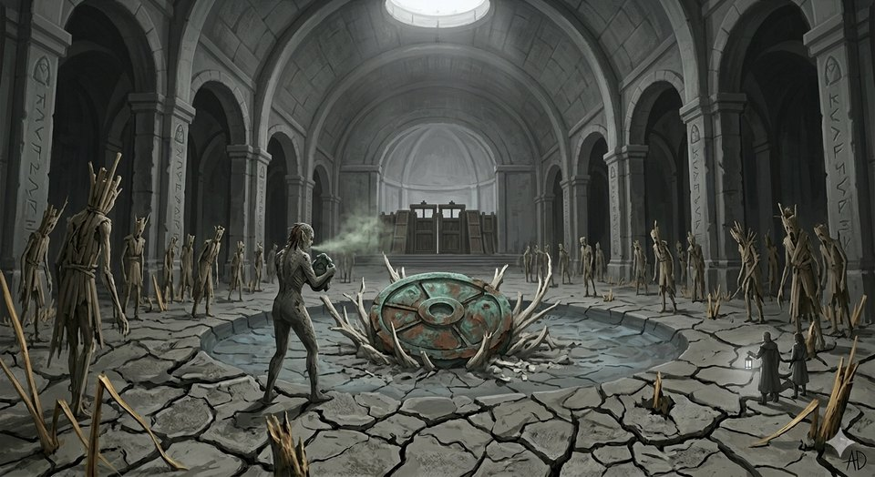

- **Тип:** 🏛️ Локація / об'єкт
- **Референс:** стор. 22 PDF · `images/48-p22-vivtar-stahnatsii-v-ep4.jpg`
- **Маршрут Meshy:** Середовище/лейаут: `image_to_3d` (standard) як пропс-кіт, **не** для рігінгу. Персонажів звідси не діставати.
- **Meshy prompt:**

  ```text
  Altar of Stagnation, episode 4 state, grand ruined architectural hall around the corrupted altar, arches and galleries, ominous atmosphere, dark fantasy environment
  ```

### 50. Чорний Архів Валькорна у еп4 (Тесса, реформований Орден)

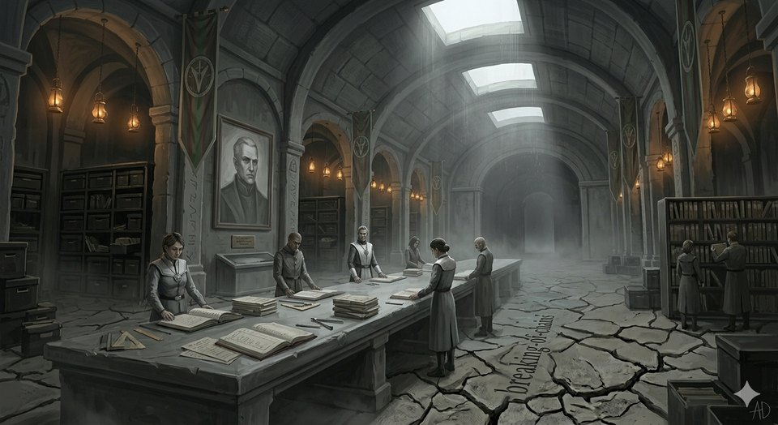

- **Тип:** 🏛️ Локація / об'єкт
- **Референс:** стор. 22 PDF · `images/50-p22-chornyi-arkhiv-valkorna-u-ep4.jpg`
- **Маршрут Meshy:** Середовище/лейаут: `image_to_3d` (standard) як пропс-кіт, **не** для рігінгу. Персонажів звідси не діставати.
- **Meshy prompt:**

  ```text
  Black Archive of Valkorn, episode 4, vast dark library hall, towering shelves, arches, lantern light, books and furniture, dark fantasy environment
  ```

---

## 🎬 Сцена / концепт

### 47. "Попільні стежки Хейзмуру".

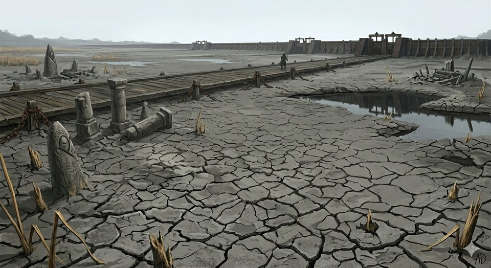

- **Тип:** 🎬 Сцена / концепт
- **Референс:** стор. 21 PDF · `images/47-p21-popilni-stezhky-kheizmuru.jpg`
- **Маршрут Meshy:** Середовище/лейаут: `image_to_3d` (standard) як пропс-кіт, **не** для рігінгу. Персонажів звідси не діставати.
- **Meshy prompt:**

  ```text
  Ashen Paths of Hazemoor, bleak ash-covered trails winding through a ruined blighted land, grey desolation, dark fantasy environment concept
  ```

### 51. Відхід Героя — Три Шляхи (Фінальна сцена)

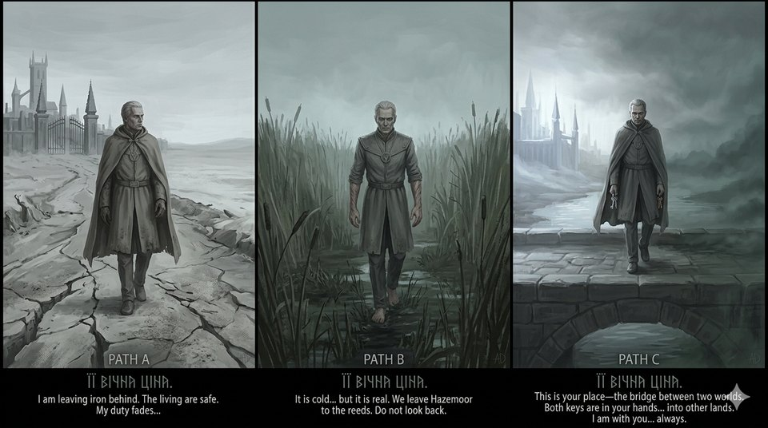

- **Тип:** 🎬 Сцена / концепт
- **Референс:** стор. 23 PDF · `images/51-p23-vidkhid-heroia-try-shliakhy.jpg`
- **Маршрут Meshy:** Середовище/лейаут: `image_to_3d` (standard) як пропс-кіт, **не** для рігінгу. Персонажів звідси не діставати.
- **Meshy prompt:**

  ```text
  Hero's Departure - Three Paths, final cinematic scene, a lone hooded figure at a fork of three diverging roads, city walls, meadow, and a bridge, dark fantasy epilogue concept
  ```

---

