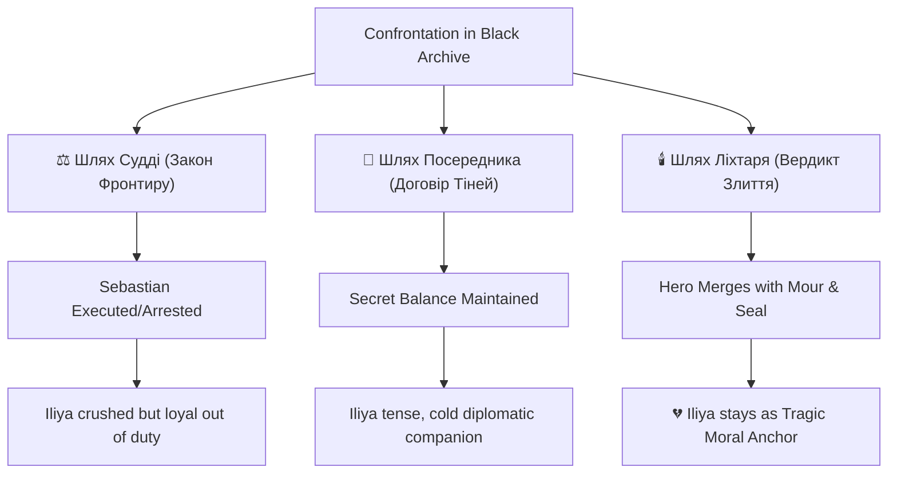

# Квест: Хранитель Першої Печатки
**Код:** valkorn-05
**Локація:** Королівський палац Валькорна — таємний Чорний Архів під королівською бібліотекою
**Попередній квест:** [valkorn-04-lyudyna-shcho-poslala-rufina](file:///C:/Users/38067/.gemini/antigravity/scratch/game-bible/quests/valkorn-04-lyudyna-shcho-poslala-rufina.md)
**Відкриває:** Епізод 3 (Шлях у Глибини)
**Роль:** Сюжетна кульмінація Епізоду 2

---

## Передумова

Після зустрічі з Лоеном та об'єднання всіх доказів (бубонці з Білого срібла, болотний запах гриму, натяк слідчого Стетсона) герой приходить до шокуючого висновку: таємничий Хранитель Першої Печатки, лідер ворожого Ордену Семи Кинджалів, весь цей час ховався на видноті. Це **Блазень Фіпп** — ексцентричний королівський блазень, що крутиться біля трону Валькорна.

Герой розуміє, що офіційна варта чи королівські закони тут не допоможуть: Фіпп занадто глибоко вріс у палацову систему. Потрібно таємно проникнути до королівського палацу вночі, знайти його приватні покої або таємне місце зустрічей Ордену й змусити скинути маску. 

Ілія Марр, дізнавшись про підозри щодо Фіппа, спершу сприймає це як безумство, але коли герой викладає зібрані докази, її обличчя кам'яніє. Вона наполягає на тому, щоб іти разом із героєм: *«Якщо цей блазень дійсно очолює Орден... якщо він осквернив пам'ять мого ордену... я хочу поглянути йому в очі»*.

---

## Проникнення до Палацу (Infiltration Paths)

Залежно від вибору фракційного шляху в попередніх квестах та характеристик героя, проникнення до палацу Валькорна відбувається одним із трьох способів:

### 1. Шлях Судді / Закон Корони (The Crown's Warrant)
*   **Умова:** Висока репутація зі слідчим Стетсоном, обрано відкрите протистояння з Лоеном.
*   **Геймплей:** Стетсон надає герою офіційні нічні перепустки для «особливого розслідування в королівських архівах». Герой та Ілія проходять через головні пости варти. Проте Стетсон попереджає: *«Я можу провести вас повз алебарди варти. Але якщо ви почнете різанину в покоях шута — закон не захистить навіть мене. Знайдіть докази мовчки»*.
*   **Перевага:** Немає ризику підняти тривогу в палаці, можливість легально досліджувати верхні яруси бібліотеки.

### 2. Шлях Посередника / Тіньовий договір (The Shadow Pass)
*   **Умова:** Обрано нейтралітет або співпрацю з Лоеном/Тессою.
*   **Геймплей:** Тесса організовує проникнення через господарський двір. Палац саме приймає гостей на нічний бенкет на честь прибуття посольства. Переодягнувшись у лівреї слуг, герой та Ілія проходять крізь галасливі кухні, коридори для прислуги та потаємні сходи.
*   **Перевага:** Можливість підслухати розмови дворян на бенкеті, які розкривають слабкість короля та страх перед болотом.

### 3. Шлях Слідопита / Болотяні колектори (The Tracker's Crawl)
*   **Умова:** Характеристика «Слідопит» >= 3, або мапа підземель Одріна.
*   **Геймплей:** Герой ігнорує будь-яку допомогу й використовує стару зливову систему міста, яка з'єднує портові доки з королівським садом. Прохід затоплений мулистими водами й вимагає подолання фізичних перешкод, але дозволяє вийти прямо до таємного входу в королівську бібліотеку.
*   **Перевага:** Повна скритність, виявлення стародавніх знаків провідників на стінах колекторів, які вказують, що цей шлях використовувався Вартовими століття тому.

---

## Сцена у Чорному Архіві

Яким би шляхом не пішов герой, сліди (запах болотяної м'яти, ледь помітне світіння срібла або тихий брязкіт бубонців) ведуть углиб королівської бібліотеки — до потаємних дверей за масивним стелажем із хроніками Прадавньої війни. За ними відкриваються круті гвинтові сходи, що ведуть глибоко під фундамент палацу — у **Чорний Архів**.

Повітря тут вологе, холодне й дивно знайоме. Воно пахне не пилом старих фоліантів, а торфом, річковим мулом і свіжою м'ятою — тим самим запахом, що ховав обличчя блазня Фіппа.

В центрі напівкруглої зали, оточеної стелажами з чорного дерева, стоїть великий кам'яний стіл. На ньому горить єдина свічка. Поруч лежить брязкаючий ковпак із яскравими латками, розсипані срібні дзвіночки та баночки з білим гримом. 

За столом сидить чоловік. Його постава бездоганно рівна, плечі розправлені. На ньому проста, але дорога темна роба. Він повільно змиває залишки білого гриму з обличчя мокрим рушником. Коли він піднімає голову, його погляд миттєво фіксується на героєві.

### Фізичний прояв зв'язку: Резонанс Моура
> [!IMPORTANT]
> Щойно погляди героя та Фіппа перетинаються, камінь Моура, прихований у кишені героя, раптово стає неймовірно гарячим, майже пропалюючи тканину. Це не просто тепло — це пульсуючий фізичний резонанс, який змушує камінь слабко світитися тьмяним болотяним світлом крізь одяг. Це прямий прояв того, що людина перед ними підпорядкована тій самій болотяній силі, що й артефакт героя.

### Перша Печатка як фізичний предмет
Чоловік робить спокійний жест рукою, запрошуючи підійти ближче. На кам'яну стільницю він повільно викладає циліндричний артефакт розміром із долоню.

Це **Перша Печатка**. Вона вилита зі сплаву священного Білого срібла та очищеного болотяного заліза, вкрита тонким гравіюванням прадавніх рун. 
*   Печатка повільно **пульсує м'яким, чистим срібним світлом**, яке на коротку мить розганяє темряву архіву.
*   Щойно світло спалахує, постійні болотяні шепоти Моура, які з моменту візиту в галявину безперервно гудуть у голові героя, раптово вщухають. Печатка **амортизує і повністю гасить ці шепоти**, створюючи в радіусі кількох метрів зону абсолютної, кришталевої ментальної тиші.

*«Тихіше, чи не так? — тихо, спокійним і неймовірно глибоким голосом каже чоловік. Його колишній блазнівський писк зник безслідно. — Болото вміє кричати навіть крізь милі каменю. Але срібло пам'ятає, як тримати тишу. Сідайте. Нам є про що поговорити, Мандруючий Вартовийу.»*

---

## Розкриття та Емоційна Кульмінація (Iliya's Shock)

Ілія Марр робить крок уперед з напівтемряви. Її рука лежить на руків'ї меча, але пальці тремтять. Вона дивиться на чоловіка, чиє обличчя без гриму виглядає старим, втомленим, але до болю знайомим.

*«Дядьку... Себастьяне?»* — її голос зривається на ледь чутний шепіт.

Чоловік дивиться на неї з глибоким сумом, але без подиву. 

*«Іліє. Маленька іскорка. Ти виросла. І твій ліхтар досі світить тим самим упертим, чистим світлом, яке я пам'ятаю.»*

### Спогад з дитинства
Ілія робить крок назад, наче від удару. В її очах стоять сльози. 
*«Ти... ти загинув у Бездонному Плесі. Я сама знайшла твій плащ. Я тримала твій розбитий ліхтар! Ти навчив мене першому кодексу... Ти подарував мені мій перший кварцовий кристал-фокус, коли мені було десять, і сказав, що Вартовий ніколи не зраджує тих, хто залишився в темряві! А тепер... ти лідер вбивць? Ти очолюєш Орден, який послав Руфіна на смерть і намагається розірвати кордон?»*

Себастьян Марр повільно зітхає і кладе долоню на пульсуючу Першу Печатку. Його обличчя залишається спокійним:

*«Я не зраджував кодекс, дитино. Я просто зрозумів його суть, коли старі дурні в Раді бачили лише літери. Наш орден будував дерев'яні стіни проти припливу. Ми запалювали ліхтарі й вдавали, що темрява відступає. Але болото не згасає. Воно росте. Порожній Сезон змиє Валькорн, якщо ми не навчимося скеровувати цю силу. Орден Семи Кинджалів — це не вбивці. Це залізні ворота, які мають стримати воду, коли гребля впаде. Нам потрібен був артефакт Руфіна, щоб замкнути систему. Нам потрібна була ця сила.»*

Він піднімається на повний зріст. Його постава велична, наче у давнього лицаря-курата:

*«Пам'ятаєш нашу присягу, Іліє? "Ми йдемо в туман, щоб інші бачили сонце". Я пішов у туман. Я став блазнем, щоб слухати королівську дурість. Я став чудовиськом у твоїх очах, щоб зберегти цей фронтир від повного знищення. Тепер твій супутник тримає камінь Моура. Він бачив глибину. Він розуміє. Вирішуйте, що ми будемо робити далі. Бо час Валькорна спливає.»*

---

## Три Доленосні Вибори (Fate-Defining Choices)

Гравець опиняється перед головним ідеологічним вибором Епізоду 2. Кожен варіант детально розписаний і має глибокі наслідки для сюжету, характеристик та стосунків з Ілією Марр.



---

### ⚖️ А. Шлях Судді / Закон Фронтиру (The Judge's Law)

*   **Суть вибору:** Герой відкидає філософію Себастьяна. Орден Семи Кинджалів — це небезпечні єретики й порушники закону, які використовують темні сили заради влади. Їх необхідно зупинити, а закон фронтиру має бути відновлений без жодних компромісів. Герой вимагає здати Першу Печатку й постати перед судом, або вирішує конфлікт силою.
*   **Діалог:**
    *   *Герой:* «Ти прикриваєшся високими словами, Себастьяне, але твій Орден сіє смерть. Руфін загинув через твої ігри. Межі Валькорна тримаються на залізі й честі, а не на болотяній брехні. Віддай Печатку. Ти постанеш перед судом Корони.»
    *   *Себастьян Марр:* *(Сумно посміхається, дивлячись на Печатку)* «Суд Корони? Суд параноїка на троні, який тремтить від кожного шелесту вітру? Що ж... ти обрав чесну смерть замість складного життя. Це вибір справжнього Вартового. Шкода, що він прирече нас усіх.»
*   **Драматична сутичка:** Себастьян не б'ється сам — він використовує ментальні ілюзії Моура та закликає двох елітних найманців Ордену з тіні. Після важкого бою Себастьян виявляється смертельно пораненим або заарештованим (залежно від дій гравця). Перша Печатка переходить до рук героя як чистий трофей для передачі слідчому Стетсону.
*   **Реакція Ілії Марр (Broken Duty):** 
    Ілія блідне, дивлячись на поваленого дядька. Вона опускається перед ним на коліна, заплющуючи його очі або тримаючи за руку. Вона глибоко зламана цією трагедією, але не зраджує героя, розуміючи справедливість його закону.
    *«Він був моїм усім, коли я була дитиною... — тихо каже вона, витираючи сльози. — Але той Себастьян Марр дійсно загинув двадцять років тому. Те, що сиділо тут — лише тінь, яка хотіла грати людськими життями. Ти вчинив правильно, Мандруючий Вартовийу. Закон має бути один для всіх. Навіть для моєї крові. Я залишаюся з тобою. Нам треба довести це до кінця.»*
*   **Наслідки:** 
    *   Репутація з Орденом падає до мінімуму (-100).
    *   Повна підтримка слідчого Стетсона та Корони. Герой отримує статус «Захисник Валькорна».
    *   Ілія залишається супутником, її ставлення — глибока повага, затьмарена особистою скорботою. Вона стає більш суворою та принциповою.

---

### 🤝 Б. Шлях Посередника / Договір Тіней (The Mediator's Treaty)

*   **Суть вибору:** Герой розуміє аргументи Себастьяна, але відмовляється ставати маріонеткою Ордену. Замість цього він пропонує таємну політичну угоду: Себастьян залишається при дворі як Фіпп та лідер Ордену, але зобов'язується використовувати свої ресурси для захисту прикордонних поселень від Порожнього Сезону. Герой та Ілія зберігають його таємницю, отримуючи доступ до Чорного Архіву та підтримку Ордену в майбутніх дослідженнях Моура.
*   **Діалог:**
    *   *Герой:* «Нам не потрібна війна у Валькорні, Себастьяне. Твої методи брудні, але твої знання — єдине, що може врятувати фронтир. Ми збережемо твою таємницю. Але відсьогодні Орден Семи Кинджалів працює на захист поселень, а не на руйнування. І ти віддаси нам карти Чорного Архіву.»
    *   *Себастьян Марр:* *(Повільно киває, його очі блищать задоволенням)* «Прагматизм — рідкісна риса серед тих, хто носить ліхтарі. Ми домовилися, Мандруючий Вартовийу. Тіні Валькорна тепер гратимуть на твоєму боці. Але пам'ятай: договори, написані в темряві, тримаються лише доти, доки тримається взаємний страх.»
*   **Реакція Ілії Марр (Tense Alliance):**
    Ілія стоїть осторонь, схрестивши руки. Вона відчуває глибоку огиду до цієї змови, але розуміє, що це єдиний спосіб уникнути кривавої війни в місті й зберегти життя її єдиному родичу.
    *«Це брудна політика, — холодно каже вона героєві, коли вони залишають архів. — Ми уклали угоду з чудовиськом, яке носить обличчя мого дядька. Я не кину тебе, бо ти єдиний, хто тримає цей баланс. Але не думай, що я забуду цей компроміс зі своєю совістю. Дивись під ноги, Мандруючий Вартовийу. У тінях легко посковзнутися й стати таким самим, як він.»*
*   **Наслідки:**
    *   Нейтрально-позитивні стосунки з Орденом (+40).
    *   Стетсон залишається в невіданні, але починає щось підозрювати, що створює напругу.
    *   Герой отримує «Ключ від Архіву» та підтримку шпигунської мережі Фіппа.
    *   Ілія залишається супутником, але її ставлення стає настороженим, холодним та суто діловим.

---

### 🕯️ В. Шлях Ліхтаря / Вердикт Злиття (The Lantern's Path / Merger)

*   **Суть вибору:** Герой усвідомлює, що ні закон короля, ні політичні інтриги Ордену не здатні зупинити Моур. Єдиний спосіб врятувати фронтир від божевілля — це добровільне самопожертвування. Герой вирішує взяти Першу Печатку і через свій камінь Моура провести ритуал **Злиття Свідомостей**. Він стає новим провідником, який бере на себе весь ментальний тиск болота, абсорбуючи його безумство у власний розум, щоб виступити живим щитом (світловим провідником) і стабілізувати фронтир. Себастьян добровільно віддає Печатку, бачачи в героєві істинного наступника духу Вартових.
*   **Діалог:**
    *   *Герой:* «Ти правий у тому, що болото неможливо просто закрити стіною, Себастьяне. Але твоя гра в тінях лише множить бруд. Я візьму цю силу. Не для Ордену, не для панування. Я проведу цей шепіт крізь свій ліхтар. Я стану тим, хто тримає удар. Дай мені Печатку. Я візьму цей тягар на себе.»
    *   *Себастьян Марр:* *(З благоговінням та трепетом дивиться на героя, передаючи Печатку)* «Це... це вище за все, на що я сподівався. Чисте самозречення. Справжній Шлях Ліхтаря, про який писали перші Засновники. Ти береш на себе безумство тисяч душ, хлопче. Нехай твоє світло не згасне в цьому мулі. Ти — мій істинний спадкоємець.»
*   **Драматичний ритуал:** 
    Герой стискає Першу Печатку в одній руці, а камінь Моура — в іншій. Срібне світло Печатки змішується з болотяним зеленим світінням каменю. Починається болісний процес злиття. Зала архіву здригається від візуальних ефектів: стіни наче розчиняються в болотяному тумані, чути колосальний, оглушливий хор шепотів Моура. Герой зазнає страшного ментального удару, його очі на мить спалахують срібно-зеленим вогнем.

```carousel

<!-- slide -->

<!-- slide -->

```

*   **Реакція Ілії Марр (The Tragic Moral Anchor):**
    Ілія кидається до героя під час ритуалу, намагаючись відтягнути його від артефактів, але спалах сили відкидає її назад. Бачачи, як герой кричить від ментального болю, а його розум балансує на межі повного божевілля, вона приймає доленосне рішення. 
    Вона підбігає знову, падає на коліна поруч, міцно обіймає його й притискає свій власний ліхтар Курата до його грудей. Її обличчя спотворене жахом, але очі палають непохитною рішучістю:
    *«Ні! Я не дозволю болоту забрати тебе! Ти не згаснеш так само, як він! — кричить вона крізь гуркіт аномалії. — Я не залишу тебе в цій темряві, чуєш?! Якщо твій ліхтар має згаснути, ми згаснемо разом! Але я триматиму твій розум, навіть коли болото спробує забрати останню людську думку! Я буду твоїм світловим якорем!»*
    Вона міцно стискає його руку, допомагаючи стабілізувати потік сили. Завдяки її присутності та силі волі, герой не втрачає людську подобу, хоча його сутність назавжди змінюється.
*   **Наслідки:**
    *   Герой відкриває унікальну геймплейну гілку навичок: **Bolo-Weaving (Плетіння Моура)** — можливість використовувати болотяні еманації для контролю та бою.
    *   Себастьян Марр добровільно передає Орден під непрямий нагляд героя й остаточно відходить від активних дій, розчиняючись у тінях палацу як простий спостерігач.
    *   **Ілія Марр залишається супутником як Трагічний Моральний Якір (Tragic Moral Anchor).** Стосунки стають надзвичайно глибокими, інтимними, але сповненими трагізму та болю. Вона постійно стежить за героєм, перевіряє його розум, розмовляє з ним, щоб переконатися, що він ще пам'ятає своє людське ім'я. Вона — єдине, що тримає його від остаточного падіння в безодню божевілля.

---

## Фінал на Балконі (Epilogue: The Morning Fog)

Незалежно від обраного шляху, квест завершується на світанку. Герой та Ілія стоять на високому відкритому балконі королівської бібліотеки, що виходить на східну сторону міста.

Під ними розстилається величний Валькорн. Його гострі шпилі, кам'яні мости та галасливі портові квартали повільно потопають у густому, молочно-білому ранковому тумані, що приповз із боку Хейзмуру. 

Сонце ледь піднімається над горизонтом, фарбуючи туман у блідо-рожеві та золотаві кольори, але холодне дихання болота відчувається навіть тут, на самій вершині королівської влади.

Ілія стоїть поруч, загорнувшись у свій дорожній плащ. Вітер тріпає її волосся. Вона дивиться на схід, де за лінією лісу лежить безкрає, таємниче Чорне Болото.

*   **Якщо обрано Шлях Судді:** Вона стоїть прямо, її обличчя спокійне, але очі сухі й холодні. Вона мовчки кладе руку на плече героя: *«Ми зробили те, що вимагав борг. Тепер наша дорога веде туди, звідки все почалося. Вглиб. До Другої Печатки.»*
*   **Якщо обрано Шлях Посередника:** Вона стоїть на відстані, не дивлячись на героя. Її голос тихий і рівний: *«Туман піднімається. Місто спить і не знає, яку ціну ми заплатили за їхній спокійний сон. Сподіваюся, твоя угода коштувала цього, Мандруючий Вартовийу. Ходімо. Нас чекає Чорний Архів.»*
*   **Якщо обрано Шлях Ліхтаря:** Вона стоїть впритул до героя, її рука міцно стискає його холодні, позначені срібними венами пальці. Вона заглядає в його очі, в яких час від часу спалахує тьмяне болотяне світло: *«Ти відчуваєш це? Болото кличе нас назад. Воно стало тихішим у твоїй голові, але я відчуваю, як важко тобі дихати цим міським повітрям. Я поруч. Я тримаю тебе. Ми підемо туди разом. І ми знайдемо спосіб зберегти твою душу.»*

Екрани повільно темніють, з'являється напис:
**ЕПІЗОД 2 ЗАВЕРШЕНО.**
*Попереду — Епізод 3: Серце трясовини.*
